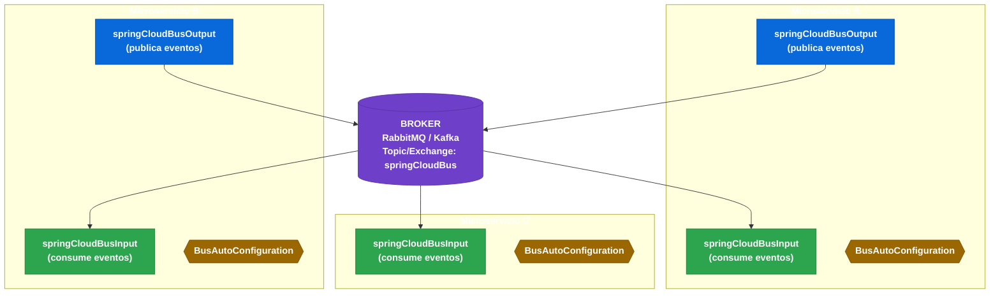

# 7.1 Spring Cloud Bus — Arquitectura y propósito

← [6.14 Spring Cloud Stream — Testing con TestChannelBinder](sc-stream-testing.md) | [Índice](README.md) | [7.2 Spring Cloud Bus — Setup y auto-configuración](sc-bus-setup.md) →

---

## Introducción

Spring Cloud Bus implementa un canal de mensajería distribuida que permite propagar eventos a todos los microservicios de un sistema sin configuración punto-a-punto. Actúa como un "bus de eventos" que cualquier nodo puede usar para publicar mensajes que serán recibidos por todos los demás suscriptores de forma automática.

> [CONCEPTO] Spring Cloud Bus no es un broker de mensajería propio: delega el transporte en Spring Cloud Stream, que a su vez usa RabbitMQ o Apache Kafka como broker subyacente.

## Arquitectura del Bus — Diagrama de flujo

Spring Cloud Bus define una arquitectura de publicación-suscripción donde cada microservicio actúa simultáneamente como publicador y suscriptor de eventos del Bus. La capa de transporte es abstraída completamente por Spring Cloud Stream, de modo que el mismo código funciona con RabbitMQ o Kafka sin cambios.


*Arquitectura pub-sub del Bus: cualquier nodo puede publicar eventos que llegan simultáneamente a todos los suscriptores a través del broker compartido.*

## Spring Cloud Stream como capa de transporte

Spring Cloud Bus no contiene lógica de transporte propia: delega completamente en Spring Cloud Stream. Al añadir la dependencia `spring-cloud-starter-bus-amqp` o `spring-cloud-starter-bus-kafka`, se incluye automáticamente el binder correspondiente de Spring Cloud Stream.

> [CONCEPTO] Los canales internos del Bus se llaman `springCloudBusInput` y `springCloudBusOutput`. Son bindings de Spring Cloud Stream configurados automáticamente por `BusAutoConfiguration`.

El Bus define dos bindings en Spring Cloud Stream:

| Binding | Dirección | Propósito |
|---------|-----------|-----------|
| `springCloudBusOutput` | SALIDA | Publicar eventos RemoteApplicationEvent al broker |
| `springCloudBusInput` | ENTRADA | Consumir eventos RemoteApplicationEvent del broker |

## Brokers soportados

Spring Cloud Bus soporta dos brokers de mensajería, cada uno con características de transporte distintas.

**RabbitMQ (AMQP)** utiliza un exchange de tipo `fanout` llamado `springCloudBus`. Cada instancia crea una cola anónima y única ligada a dicho exchange. Esto garantiza que cada instancia recibe todos los mensajes publicados en el exchange. El exchange fanout replica el mensaje a todas las colas suscritas.

**Apache Kafka** utiliza un topic llamado `springCloudBus`. Cada instancia del mismo servicio debe pertenecer a un consumer group diferente para recibir todos los mensajes. Si múltiples instancias del mismo servicio comparten el mismo consumer group en Kafka, solo una de ellas recibirá cada mensaje.

> [ADVERTENCIA] Con Kafka, si no se configura `spring.cloud.stream.bindings.springCloudBusInput.group` con un valor único por instancia, se producirán mensajes duplicados o mensajes perdidos dependiendo de la topología de consumer groups.

## Ejemplo central

El siguiente ejemplo muestra la configuración completa de un microservicio que usa Spring Cloud Bus con RabbitMQ. Incluye las dependencias Maven, la configuración YAML mínima y la clase principal habilitada para Bus.

```xml
<!-- pom.xml - dependencias -->
<dependency>
    <groupId>org.springframework.cloud</groupId>
    <artifactId>spring-cloud-starter-bus-amqp</artifactId>
</dependency>
<dependency>
    <groupId>org.springframework.boot</groupId>
    <artifactId>spring-boot-starter-actuator</artifactId>
</dependency>
```

```yaml
# application.yml
spring:
  application:
    name: order-service
  rabbitmq:
    host: localhost
    port: 5672
    username: guest
    password: guest
  cloud:
    bus:
      enabled: true
      destination: springCloudBus      # nombre del exchange fanout
      id: ${spring.application.name}:${spring.profiles.active:default}:${server.port:8080}

management:
  endpoints:
    web:
      exposure:
        include: bus-refresh, bus-env, health, info
  endpoint:
    bus-refresh:
      enabled: true
```

```java
// OrderServiceApplication.java
package com.example.orderservice;

import org.springframework.boot.SpringApplication;
import org.springframework.boot.autoconfigure.SpringBootApplication;

@SpringBootApplication
public class OrderServiceApplication {

    public static void main(String[] args) {
        SpringApplication.run(OrderServiceApplication.class, args);
    }
}
```

La auto-configuración `BusAutoConfiguration` detecta la presencia del starter en el classpath y configura automáticamente los canales de Stream, el listener de eventos y el publisher de eventos. No es necesaria ninguna anotación adicional.

## Tabla de elementos clave

Los elementos fundamentales de la arquitectura del Bus son los siguientes. Cada uno cumple un rol específico en el ciclo de publicación-recepción de eventos.

| Elemento | Tipo | Descripción |
|----------|------|-------------|
| `BusAutoConfiguration` | Auto-configuración | Activa el Bus al detectar la dependencia en classpath |
| `springCloudBusInput` | Binding Stream (entrada) | Canal por el que llegan eventos del broker al nodo actual |
| `springCloudBusOutput` | Binding Stream (salida) | Canal por el que el nodo actual publica eventos al broker |
| `RemoteApplicationEvent` | Clase base abstracta | Superclase de todos los eventos propagados por el Bus |
| `ServiceMatcher` | Componente | Evalúa si un evento entrante está destinado a esta instancia |
| `spring.cloud.bus.destination` | Propiedad | Nombre del topic/exchange del broker (default: `springCloudBus`) |

## Buenas y malas prácticas

**Buenas prácticas:**

- Usar Spring Cloud Bus únicamente para eventos de infraestructura (refresh, cambio de configuración) o eventos de dominio muy ligeros. No usarlo como sustituto de un sistema de mensajería de negocio completo.
- Configurar explícitamente `spring.cloud.bus.id` en entornos de contenedores para garantizar identificadores únicos y estables por instancia.
- Exponer solo los endpoints necesarios del Actuator (`bus-refresh`, `bus-env`) y protegerlos con autenticación en producción.

**Malas prácticas:**

- [LEGACY] Usar `@EnableBus` — esta anotación no existe en Spring Cloud 3.x. La activación es completamente automática mediante auto-configuración.
- Publicar mensajes de negocio de alta frecuencia por el Bus. El Bus está diseñado para eventos de control de baja frecuencia, no para flujos de datos.
- Compartir el mismo consumer group entre múltiples instancias del mismo servicio en Kafka sin entender las implicaciones de particionado.

## Comparación: Bus vs mensajería directa con Stream

Spring Cloud Bus y Spring Cloud Stream son complementarios, pero sirven propósitos distintos.

| Aspecto | Spring Cloud Bus | Spring Cloud Stream directo |
|---------|-----------------|----------------------------|
| Propósito | Eventos de control del sistema (refresh, config) | Mensajería de negocio entre servicios |
| Configuración | Auto-configurada con starter | Requiere definir Suppliers/Consumers/Functions |
| Tipo de mensaje | `RemoteApplicationEvent` (broadcast) | Cualquier tipo (punto-a-punto o pub-sub) |
| Frecuencia esperada | Baja (operaciones admin) | Alta (flujos de negocio) |
| Destino típico | Todos los nodos o un subset | Un servicio consumidor específico |

## Verificación y práctica

> [EXAMEN] **1.** ¿Qué componente de Spring Cloud actúa como capa de transporte del Bus y qué brokers soporta?

> [EXAMEN] **2.** ¿Cuáles son los nombres de los bindings de Spring Cloud Stream que usa el Bus internamente?

> [EXAMEN] **3.** ¿Por qué con Apache Kafka es necesario configurar un consumer group único por instancia para el Bus, y qué problema ocurre si no se hace?

> [EXAMEN] **4.** ¿Qué auto-configuración activa Spring Cloud Bus y qué condición debe cumplirse para que se active?

> [EXAMEN] **5.** ¿Cuál es la diferencia principal entre usar Spring Cloud Bus y usar Spring Cloud Stream directamente para comunicación entre microservicios?

---

← [6.14 Spring Cloud Stream — Testing con TestChannelBinder](sc-stream-testing.md) | [Índice](README.md) | [7.2 Spring Cloud Bus — Setup y auto-configuración](sc-bus-setup.md) →
