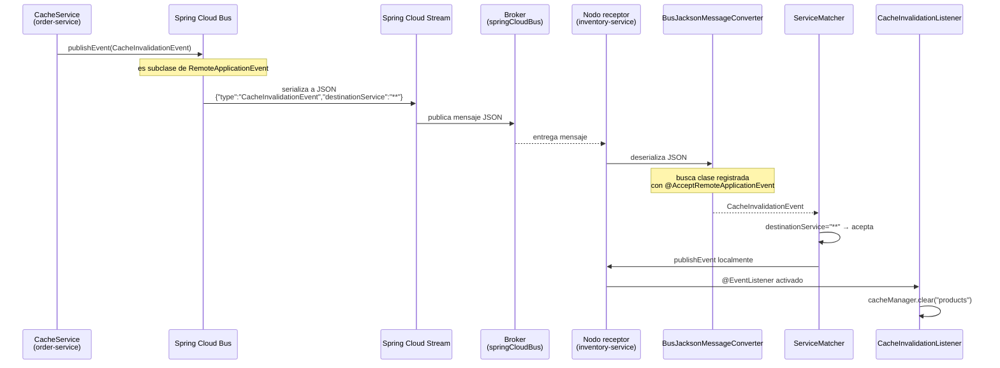

# 7.4 Spring Cloud Bus — Eventos personalizados con RemoteApplicationEvent

← [7.3 Spring Cloud Bus — Refresh distribuido de configuración](sc-bus-refresh-distribuido.md) | [Índice](README.md) | [7.5 Spring Cloud Bus — Configuración de brokers RabbitMQ y Kafka](sc-bus-broker-config.md) →

---

## Introducción

Spring Cloud Bus no se limita a los eventos predefinidos como `BusRefreshEvent`. Permite crear eventos personalizados que se propagan a todos los microservicios del Bus, o a un subconjunto de ellos, extendiendo la clase `RemoteApplicationEvent`. Este mecanismo habilita patrones de broadcast de eventos de dominio o infraestructura a través del sistema distribuido sin configuración de mensajería adicional.

> [CONCEPTO] `RemoteApplicationEvent` es la clase base abstracta de todos los eventos del Bus. Contiene dos campos clave: `originService` (el `spring.cloud.bus.id` del nodo que lo publicó) y `destinationService` (patrón de destino, por defecto `**` para broadcast total).

## Anatomía de RemoteApplicationEvent

Para crear un evento personalizado es necesario extender `RemoteApplicationEvent`. Esta clase abstracta serializable requiere un constructor sin argumentos para la deserialización Jackson, además del constructor de conveniencia.

Los campos heredados de `RemoteApplicationEvent` y sus roles son los siguientes:

| Campo | Tipo | Descripción |
|-------|------|-------------|
| `originService` | `String` | `spring.cloud.bus.id` del nodo publicador; se rellena automáticamente |
| `destinationService` | `String` | Patrón de destino; `**` = todos, o `appName:**:**` = servicio específico |
| `id` | `String` | UUID del evento para deduplicación |

> [EXAMEN] Sin el constructor sin argumentos (`protected NoArgsEvent() {}`), Jackson no puede deserializar el evento en los nodos receptores y el evento será ignorado silenciosamente.

## @AcceptRemoteApplicationEvent

La anotación `@AcceptRemoteApplicationEvent` se aplica a nivel de clase en el evento personalizado. Su propósito es registrar el tipo de evento en el `BusJacksonMessageConverter`, permitiendo que los nodos receptores deserialicen el JSON del mensaje en la clase Java correcta.

Sin esta anotación, el Bus desconoce el tipo Java correspondiente al evento recibido y lo descarta sin procesar. Es un mecanismo de seguridad que evita deserializar clases arbitrarias recibidas del broker.

> [ADVERTENCIA] `@AcceptRemoteApplicationEvent` debe estar presente en la clase del evento en **todos los servicios** que necesiten recibirlo y procesarlo. Si solo está en el publicador, los receptores ignorarán el evento.

## Ejemplo central — Evento personalizado completo

El siguiente ejemplo implementa un evento personalizado `CacheInvalidationEvent` que cuando se publica hace que todos los microservicios limpien su caché local. Incluye la clase del evento, el publicador y el receptor.

```java
// CacheInvalidationEvent.java — definición del evento personalizado
package com.example.shared.events;

import org.springframework.cloud.bus.event.RemoteApplicationEvent;
import org.springframework.cloud.bus.event.Accepted;

@Accepted  // equivalente a @AcceptRemoteApplicationEvent en Spring Cloud 4.x
public class CacheInvalidationEvent extends RemoteApplicationEvent {

    private String cacheName;
    private String reason;

    // Constructor sin argumentos requerido por Jackson para deserialización
    protected CacheInvalidationEvent() {
    }

    // Constructor completo para publicación
    public CacheInvalidationEvent(Object source, String originService,
                                   String destinationService,
                                   String cacheName, String reason) {
        super(source, originService, Destination.Factory.getDestination(destinationService));
        this.cacheName = cacheName;
        this.reason = reason;
    }

    public String getCacheName() {
        return cacheName;
    }

    public void setCacheName(String cacheName) {
        this.cacheName = cacheName;
    }

    public String getReason() {
        return reason;
    }

    public void setReason(String reason) {
        this.reason = reason;
    }
}
```

```java
// CacheService.java — publicador del evento personalizado
package com.example.orderservice.service;

import com.example.shared.events.CacheInvalidationEvent;
import org.springframework.beans.factory.annotation.Autowired;
import org.springframework.beans.factory.annotation.Value;
import org.springframework.context.ApplicationEventPublisher;
import org.springframework.stereotype.Service;

@Service
public class CacheService {

    private final ApplicationEventPublisher eventPublisher;

    @Value("${spring.cloud.bus.id}")
    private String busId;

    @Autowired
    public CacheService(ApplicationEventPublisher eventPublisher) {
        this.eventPublisher = eventPublisher;
    }

    /**
     * Invalida la caché en TODOS los microservicios del Bus.
     */
    public void invalidateCacheGlobally(String cacheName) {
        // "**" como destination = broadcast a todos los nodos
        CacheInvalidationEvent event = new CacheInvalidationEvent(
                this,
                busId,
                "**",
                cacheName,
                "Manual invalidation from order-service"
        );
        eventPublisher.publishEvent(event);
    }

    /**
     * Invalida la caché solo en las instancias del servicio 'inventory-service'.
     */
    public void invalidateCacheInInventory(String cacheName) {
        CacheInvalidationEvent event = new CacheInvalidationEvent(
                this,
                busId,
                "inventory-service:**:**",
                cacheName,
                "Inventory data changed"
        );
        eventPublisher.publishEvent(event);
    }
}
```

```java
// CacheInvalidationListener.java — receptor del evento en cualquier servicio
package com.example.inventoryservice.listener;

import com.example.shared.events.CacheInvalidationEvent;
import org.slf4j.Logger;
import org.slf4j.LoggerFactory;
import org.springframework.cache.CacheManager;
import org.springframework.context.event.EventListener;
import org.springframework.stereotype.Component;

@Component
public class CacheInvalidationListener {

    private static final Logger log = LoggerFactory.getLogger(CacheInvalidationListener.class);

    private final CacheManager cacheManager;

    public CacheInvalidationListener(CacheManager cacheManager) {
        this.cacheManager = cacheManager;
    }

    @EventListener
    public void handleCacheInvalidation(CacheInvalidationEvent event) {
        String cacheName = event.getCacheName();
        log.info("Received CacheInvalidationEvent for cache '{}' from '{}', reason: {}",
                cacheName, event.getOriginService(), event.getReason());

        if (cacheManager.getCache(cacheName) != null) {
            cacheManager.getCache(cacheName).clear();
            log.info("Cache '{}' cleared successfully", cacheName);
        }
    }
}
```

```yaml
# Configuración YAML para el servicio receptor
spring:
  application:
    name: inventory-service
  rabbitmq:
    host: localhost
    port: 5672
  cloud:
    bus:
      enabled: true
      id: ${spring.application.name}:${spring.profiles.active:default}:${server.port:8082}
```

## Ciclo de serialización de un RemoteApplicationEvent personalizado

El flujo de serialización y propagación de un evento personalizado sigue estos pasos precisos:


*Ciclo completo de propagación de un evento personalizado: publicación local → serialización JSON → broker → deserialización → evaluación de destino → listener.*

## Tabla de elementos clave

Los elementos necesarios para implementar eventos personalizados con Spring Cloud Bus son los siguientes:

| Elemento | Obligatorio | Descripción |
|----------|-------------|-------------|
| Extender `RemoteApplicationEvent` | Sí | El evento debe ser subclase de esta clase abstracta |
| Constructor sin argumentos `protected` | Sí | Requerido por Jackson para deserialización |
| `@AcceptRemoteApplicationEvent` | Sí (en receptores) | Registra el tipo para deserialización segura |
| `ApplicationEventPublisher` | Sí (en publicador) | Interfaz Spring para publicar eventos |
| `@EventListener` o `ApplicationListener` | Sí (en receptor) | Para consumir el evento en el nodo receptor |

## Buenas y malas prácticas

**Buenas prácticas:**

- Colocar la clase del evento en un módulo compartido (`shared-events`) incluido tanto en el publicador como en los receptores, garantizando la misma versión de la clase en todos los servicios.
- Usar `@EventListener` con el tipo específico del evento para evitar recibir eventos no deseados.
- Incluir información de contexto en el evento (razón, timestamp, actor) para facilitar el troubleshooting y la auditoría.

**Malas prácticas:**

- Incluir objetos complejos o colecciones grandes en el payload del evento. Los eventos del Bus deben ser ligeros para no saturar el broker.
- Omitir el constructor sin argumentos en la clase del evento. El error de deserialización no siempre produce una excepción visible; el evento puede simplemente ignorarse.
- Usar eventos personalizados del Bus para flujos de negocio de alta frecuencia. El Bus está diseñado para eventos de control de baja frecuencia.

## Verificación y práctica

> [EXAMEN] **1.** ¿Qué clase debe extenderse para crear un evento personalizado que se propague por Spring Cloud Bus?

> [EXAMEN] **2.** ¿Qué anotación deben tener los eventos personalizados y por qué es necesaria en los servicios receptores?

> [EXAMEN] **3.** ¿Qué interfaz de Spring se usa para publicar un `RemoteApplicationEvent` desde un servicio?

> [EXAMEN] **4.** ¿Por qué el constructor sin argumentos en la clase del evento es imprescindible?

> [EXAMEN] **5.** Si un evento personalizado tiene `destinationService = "inventory-service:**:**"`, ¿qué nodos lo procesarán?

---

← [7.3 Spring Cloud Bus — Refresh distribuido de configuración](sc-bus-refresh-distribuido.md) | [Índice](README.md) | [7.5 Spring Cloud Bus — Configuración de brokers RabbitMQ y Kafka](sc-bus-broker-config.md) →
