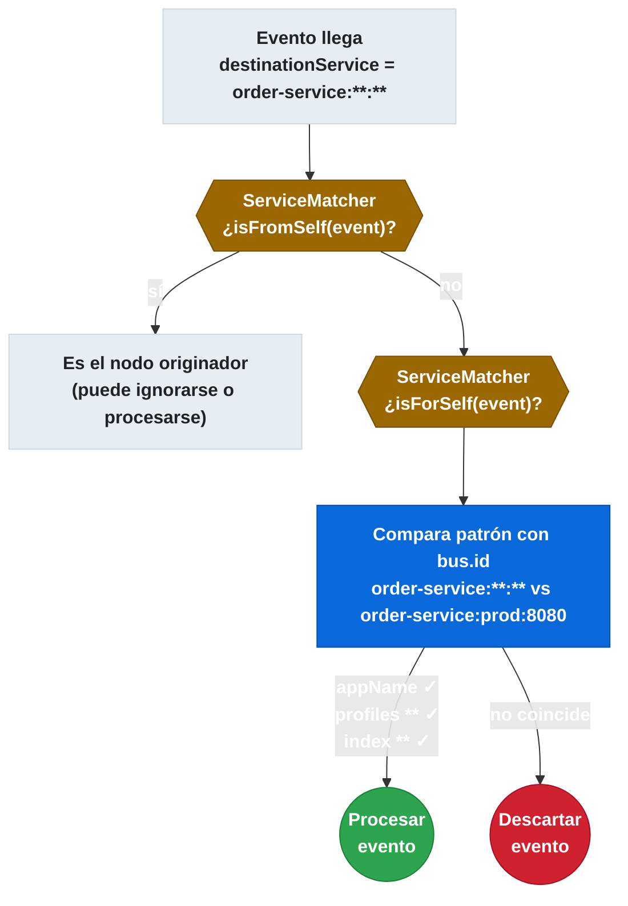
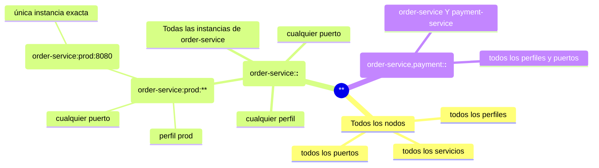

# 7.6 Spring Cloud Bus — Trazabilidad y destination pattern

← [7.5 Spring Cloud Bus — Configuración de brokers RabbitMQ y Kafka](sc-bus-broker-config.md) | [Índice](README.md) | [7.7 Spring Cloud Bus — Seguridad de endpoints del Bus](sc-bus-seguridad-endpoint.md) →

---

## Introducción

Spring Cloud Bus implementa un sistema de identificación de instancias y enrutamiento de eventos basado en el concepto de `destination`. Cada instancia tiene un identificador único definido por `spring.cloud.bus.id`, y el `ServiceMatcher` usa ese identificador para determinar si un evento entrante está dirigido a la instancia actual. Este sistema permite tanto el broadcast total como el envío dirigido a servicios o instancias específicas.

> [CONCEPTO] El `spring.cloud.bus.id` no es solo un identificador cosmético: es el mecanismo de enrutamiento fundamental del Bus. `ServiceMatcher` lo compara con el `destinationService` del evento usando pattern matching con wildcards para decidir si el evento debe procesarse localmente.

## El identificador de instancia: spring.cloud.bus.id

`spring.cloud.bus.id` define el identificador único de cada instancia del Bus. Su formato es `appName:profiles:index`, donde cada parte puede usarse como criterio de destino en el pattern.

Los tres componentes del identificador son:

| Componente | Fuente por defecto | Descripción |
|------------|-------------------|-------------|
| `appName` | `spring.application.name` | Nombre lógico del servicio |
| `profiles` | Perfiles activos (separados por coma) | Perfil(es) activo(s) de la instancia |
| `index` | Puerto del servidor | Diferencia instancias del mismo servicio en el mismo host |

Un ejemplo de `spring.cloud.bus.id` podría ser: `order-service:prod:8080`.

> [EXAMEN] Si `spring.cloud.bus.id` no se configura explícitamente, Spring Cloud Bus lo construye automáticamente desde `spring.application.name`, los perfiles activos y el puerto del servidor. En entornos de contenedores es recomendable configurarlo explícitamente para garantizar estabilidad e unicidad.

## ServiceMatcher — evaluación de destino

`ServiceMatcher` es el componente del Bus responsable de evaluar si un evento entrante debe ser procesado por la instancia actual. Implementa la lógica de pattern matching entre el `destinationService` del evento y el `spring.cloud.bus.id` de la instancia.

El algoritmo de evaluación funciona así:


*El `ServiceMatcher` evalúa primero si la instancia es el origen del evento y luego si el patrón `destinationService` hace match con su propio `bus.id` usando wildcards.*

## El destination pattern y sus wildcards

El destination pattern usa el separador `:` para delimitar los tres componentes del `bus.id`. El wildcard `**` puede aplicarse a uno o más componentes para ampliar el alcance del destino.

El siguiente diagrama muestra los diferentes patrones de destino y su alcance:


*Jerarquía de destination patterns: cada nivel de especificidad reduce el conjunto de nodos que recibirán el evento.*

Los ejemplos de llamadas al endpoint con destination son:

```bash
# Refresh a TODOS los nodos del Bus
curl -X POST http://localhost:8080/actuator/bus-refresh

# Refresh a todas las instancias de order-service
curl -X POST "http://localhost:8080/actuator/bus-refresh/order-service:**:**"

# Refresh solo a order-service en perfil prod
curl -X POST "http://localhost:8080/actuator/bus-refresh/order-service:prod:**"

# Refresh a una única instancia específica
curl -X POST "http://localhost:8080/actuator/bus-refresh/order-service:prod:8083"
```

## Ejemplo central — Configuración de bus.id y uso del destination pattern

El siguiente ejemplo muestra la configuración completa de `spring.cloud.bus.id` en distintos escenarios y una clase que publica un evento con un destination específico programáticamente.

```java
// BusEventPublisher.java — publicación con destination específico
package com.example.configserver.service;

import org.springframework.beans.factory.annotation.Value;
import org.springframework.cloud.bus.BusProperties;
import org.springframework.cloud.bus.event.RefreshRemoteApplicationEvent;
import org.springframework.context.ApplicationEventPublisher;
import org.springframework.stereotype.Service;

@Service
public class BusEventPublisher {

    private final ApplicationEventPublisher eventPublisher;
    private final BusProperties busProperties;

    @Value("${spring.cloud.bus.id}")
    private String busId;

    public BusEventPublisher(ApplicationEventPublisher eventPublisher,
                              BusProperties busProperties) {
        this.eventPublisher = eventPublisher;
        this.busProperties = busProperties;
    }

    /**
     * Refresca solo las instancias de un servicio específico.
     * Equivalente a POST /actuator/bus-refresh/{serviceName}:**:**
     */
    public void refreshService(String serviceName) {
        String destination = serviceName + ":**:**";
        RefreshRemoteApplicationEvent event = new RefreshRemoteApplicationEvent(
                this,
                busProperties.getId(),
                destination
        );
        eventPublisher.publishEvent(event);
    }

    /**
     * Refresca todos los nodos del Bus.
     * Equivalente a POST /actuator/bus-refresh
     */
    public void refreshAll() {
        RefreshRemoteApplicationEvent event = new RefreshRemoteApplicationEvent(
                this,
                busProperties.getId(),
                "**"
        );
        eventPublisher.publishEvent(event);
    }
}
```

```yaml
# application.yml — configuración de bus.id para distintos entornos

# Entorno de desarrollo (una sola instancia)
spring:
  application:
    name: order-service
  profiles:
    active: dev
  cloud:
    bus:
      id: ${spring.application.name}:${spring.profiles.active:default}:${server.port:8080}

# Entorno de Kubernetes (instancias múltiples con pod name único)
# spring:
#   cloud:
#     bus:
#       id: ${spring.application.name}:${spring.profiles.active:default}:${HOSTNAME:unknown}

# Entorno con múltiples instancias en la misma máquina
# spring:
#   cloud:
#     bus:
#       id: ${spring.application.name}:${spring.profiles.active:default}:${server.port}
```

```java
// BusIdVerificationController.java — endpoint para verificar el bus.id actual
package com.example.orderservice.controller;

import org.springframework.beans.factory.annotation.Value;
import org.springframework.web.bind.annotation.GetMapping;
import org.springframework.web.bind.annotation.RestController;

import java.util.Map;

@RestController
public class BusIdVerificationController {

    @Value("${spring.cloud.bus.id:not-configured}")
    private String busId;

    @GetMapping("/actuator/bus-id")
    public Map<String, String> getBusId() {
        return Map.of("busId", busId);
    }
}
```

## Tabla de elementos clave de trazabilidad

Los elementos de la arquitectura de enrutamiento del Bus y sus roles son los siguientes:

| Elemento | Tipo | Descripción |
|----------|------|-------------|
| `spring.cloud.bus.id` | Propiedad de configuración | Identificador único de la instancia en formato `appName:profiles:index` |
| `ServiceMatcher` | Bean de Spring | Evalúa si un evento entrante está dirigido a esta instancia |
| `destinationService` | Campo de `RemoteApplicationEvent` | Patrón de destino del evento; puede contener wildcards `**` |
| `originService` | Campo de `RemoteApplicationEvent` | `bus.id` del nodo que publicó el evento |
| `BusProperties` | Bean de configuración | Contiene todas las propiedades `spring.cloud.bus.*` incluyendo el `id` |

## Buenas y malas prácticas

**Buenas prácticas:**

- Configurar `spring.cloud.bus.id` explícitamente en entornos de contenedores usando el nombre del pod (Kubernetes) o el hostname único. Los valores auto-generados pueden repetirse si múltiples instancias se inician en el mismo puerto.
- Usar el destination pattern con el `appName` específico en lugar de `**` cuando solo un servicio necesita recibir el evento, reduciendo la carga de procesamiento en otros servicios.
- Verificar el `bus.id` de cada instancia al arrancar para confirmar que es único antes de llegar a producción.

**Malas prácticas:**

- Usar `**` en el destination cuando se sabe exactamente qué servicio debe recibir el evento. El broadcast innecesario genera procesamiento extra en todos los nodos.
- Configurar el mismo `spring.cloud.bus.id` en múltiples instancias. `ServiceMatcher` puede procesar el mismo evento múltiples veces o ignorarlo si el `isFromSelf` da falso positivo.
- Ignorar el campo `originService` en el procesamiento de eventos. Puede ser útil para evitar que el nodo publicador procese su propio evento si no es el comportamiento deseado.

## Verificación y práctica

> [EXAMEN] **1.** ¿Cuál es el formato del `spring.cloud.bus.id` y de qué fuentes obtiene sus tres componentes por defecto?

> [EXAMEN] **2.** ¿Qué componente del Bus evalúa si un evento entrante debe ser procesado por la instancia actual?

> [EXAMEN] **3.** ¿Qué destination pattern se debe usar para enviar un `bus-refresh` solo a las instancias de `inventory-service` en el perfil `prod`?

> [EXAMEN] **4.** ¿Qué ocurre cuando dos instancias del mismo servicio tienen el mismo `spring.cloud.bus.id`?

> [EXAMEN] **5.** ¿En qué campo de `RemoteApplicationEvent` se almacena el identificador del nodo que publicó el evento?

---

← [7.5 Spring Cloud Bus — Configuración de brokers RabbitMQ y Kafka](sc-bus-broker-config.md) | [Índice](README.md) | [7.7 Spring Cloud Bus — Seguridad de endpoints del Bus](sc-bus-seguridad-endpoint.md) →
