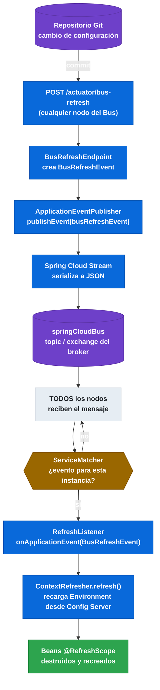

# 7.3 Spring Cloud Bus — Refresh distribuido de configuración

← [7.2 Spring Cloud Bus — Setup y auto-configuración](sc-bus-setup.md) | [Índice](README.md) | [7.4 Spring Cloud Bus — Eventos personalizados con RemoteApplicationEvent](sc-bus-eventos-personalizados.md) →

---

## Introducción

El refresh distribuido de configuración es el caso de uso principal de Spring Cloud Bus. Permite que un cambio en el repositorio de configuración (por ejemplo, un commit en Git) se propague automáticamente a todos los microservicios en ejecución con una sola llamada HTTP al endpoint `/actuator/bus-refresh`. Sin Bus, cada microservicio debería recibir individualmente un `POST /actuator/refresh` para actualizar sus propiedades.

> [CONCEPTO] El refresh distribuido requiere que los beans cuyas propiedades deben actualizarse estén anotados con `@RefreshScope`. Sin esta anotación, el bean no se recrea y las propiedades antiguas permanecen en memoria aunque el Environment se haya actualizado.

## Flujo completo del refresh distribuido

El mecanismo de refresh distribuido involucra múltiples componentes que actúan en cadena. Comprender este flujo es fundamental para diagnosticar problemas y para el examen de certificación.


*Cadena de 11 pasos desde el commit en Git hasta la recreación de los beans `@RefreshScope` en todos los nodos del Bus.*

## El endpoint /actuator/bus-refresh

El endpoint `POST /actuator/bus-refresh` es el disparador principal del refresh distribuido. Puede invocarse en cualquier nodo del Bus y el evento se propagará a todos los demás. No es necesario llamarlo en el Config Server; puede llamarse en cualquier microservicio cliente.

La variante con destination permite limitar el refresh a instancias o aplicaciones específicas:

| Endpoint | Alcance del refresh |
|----------|---------------------|
| `POST /actuator/bus-refresh` | Todos los nodos del Bus (`**`) |
| `POST /actuator/bus-refresh/{appName}` | Todas las instancias de la aplicación `appName` |
| `POST /actuator/bus-refresh/{appName}:{profiles}` | Instancias de `appName` con perfil específico |
| `POST /actuator/bus-refresh/{appName}:{profiles}:{index}` | Una única instancia específica |

```mermaid
timeline
    title Alcance del destination pattern en bus-refresh
    section Broadcast total
        POST /actuator/bus-refresh : Todos los nodos (**) reciben el evento
    section Por aplicación
        POST .../bus-refresh/order-service : Todas las instancias de order-service
    section Por perfil
        POST .../bus-refresh/order-service:prod : order-service en perfil prod
    section Instancia única
        POST .../bus-refresh/order-service:prod:8080 : Una sola instancia exacta
```
*Granularidad del destination pattern: de broadcast total a instancia única usando los separadores `:` del `bus.id`.*

> [EXAMEN] El destination pattern usa dos puntos (`:`) como separador entre `appName`, `profiles` e `index`. El doble asterisco (`**`) actúa como wildcard para cualquier valor. Por ejemplo: `order-service:**:**` refresca todas las instancias del servicio `order-service` independientemente de su perfil e índice.

## Ejemplo central — Refresh distribuido completo

El siguiente ejemplo muestra la implementación completa de un microservicio cliente de Config Server que usa Bus para refresh distribuido. Incluye la clase de configuración con `@RefreshScope`, el controller para demostrar el cambio de propiedades y la configuración YAML completa.

```java
// ConfigClientApplication.java
package com.example.configclient;

import org.springframework.boot.SpringApplication;
import org.springframework.boot.autoconfigure.SpringBootApplication;

@SpringBootApplication
public class ConfigClientApplication {

    public static void main(String[] args) {
        SpringApplication.run(ConfigClientApplication.class, args);
    }
}
```

```java
// AppConfig.java — bean con @RefreshScope para recarga de propiedades
package com.example.configclient.config;

import org.springframework.beans.factory.annotation.Value;
import org.springframework.cloud.context.config.annotation.RefreshScope;
import org.springframework.stereotype.Component;

@Component
@RefreshScope
public class AppConfig {

    @Value("${app.greeting:Hello}")
    private String greeting;

    @Value("${app.feature.enabled:false}")
    private boolean featureEnabled;

    public String getGreeting() {
        return greeting;
    }

    public boolean isFeatureEnabled() {
        return featureEnabled;
    }
}
```

```java
// GreetingController.java — expone los valores de configuración
package com.example.configclient.controller;

import com.example.configclient.config.AppConfig;
import org.springframework.web.bind.annotation.GetMapping;
import org.springframework.web.bind.annotation.RestController;

@RestController
public class GreetingController {

    private final AppConfig appConfig;

    public GreetingController(AppConfig appConfig) {
        this.appConfig = appConfig;
    }

    @GetMapping("/greeting")
    public String greeting() {
        return appConfig.getGreeting() + " (feature=" + appConfig.isFeatureEnabled() + ")";
    }
}
```

```yaml
# application.yml — cliente de Config con Bus RabbitMQ
spring:
  application:
    name: config-client
  config:
    import: "configserver:http://localhost:8888"
  rabbitmq:
    host: localhost
    port: 5672
  cloud:
    bus:
      enabled: true
      id: ${spring.application.name}:${spring.profiles.active:default}:${server.port:8080}
      refresh:
        enabled: true

management:
  endpoints:
    web:
      exposure:
        include: bus-refresh, health, info
```

Con este setup, el flujo de refresh se ejecuta así:

```bash
# 1. Ver el valor actual de la propiedad
curl http://localhost:8080/greeting
# → "Hello (feature=false)"

# 2. Cambiar la propiedad en el repositorio Git del Config Server
# (editar application.yml en el repositorio: app.greeting=Hola)

# 3. Disparar el refresh distribuido (en CUALQUIER nodo)
curl -X POST http://localhost:8080/actuator/bus-refresh

# 4. Verificar que la propiedad se actualizó en TODOS los nodos
curl http://localhost:8080/greeting
# → "Hola (feature=false)"
curl http://localhost:8081/greeting
# → "Hola (feature=false)"  ← también actualizado sin llamada directa
```

## BusRefreshEvent y ContextRefresher

`BusRefreshEvent` es una subclase concreta de `RemoteApplicationEvent`. Cuando cualquier nodo recibe este evento del broker, el `RefreshListener` lo intercepta y delega en `ContextRefresher.refresh()`.

`ContextRefresher` pertenece al módulo `spring-cloud-context` (no al Bus propiamente). Sus responsabilidades son:

1. Recargar el `Environment` consultando de nuevo al Config Server.
2. Publicar un `EnvironmentChangeEvent` con las propiedades que cambiaron.
3. Destruir todos los beans `@RefreshScope` en el `RefreshScope` cache.
4. Los beans `@RefreshScope` se recrean de forma lazy en la siguiente inyección.

> [ADVERTENCIA] `@RefreshScope` solo recrea el bean cuando se accede a él después del refresh. Si el bean tiene estado interno (variables de instancia calculadas en el constructor), ese estado se recalcula al recrear el bean. Propiedades inyectadas con `@Value` en campos se actualizan correctamente; propiedades en constructores también.

## Comparación: refresh local vs refresh distribuido

La diferencia entre el refresh local (`/actuator/refresh`) y el distribuido con Bus es fundamental para entender el valor de Spring Cloud Bus.

| Aspecto | `/actuator/refresh` (local) | `/actuator/bus-refresh` (Bus) |
|---------|-----------------------------|-------------------------------|
| Alcance | Solo el nodo donde se llama | Todos los nodos del Bus |
| Requiere broker | No | Sí (RabbitMQ o Kafka) |
| Número de llamadas necesarias | Una por cada instancia | Una sola |
| Componente | `ContextRefresher` directo | `BusRefreshEndpoint` → broker → `ContextRefresher` |
| Uso recomendado | Desarrollo local, instancia única | Producción con múltiples instancias |

## Buenas y malas prácticas

**Buenas prácticas:**

- Invocar `POST /actuator/bus-refresh` desde un webhook de Git (GitHub, GitLab, Bitbucket) para automatizar el refresh cuando hay cambios en el repositorio de configuración.
- Usar el destination pattern para refresh selectivo cuando solo un servicio necesita actualizar su configuración, evitando recargas innecesarias en otros servicios.
- Anotar con `@RefreshScope` únicamente los beans que realmente consumen propiedades del Config Server, no todos los beans de la aplicación.

**Malas prácticas:**

- Llamar a `/actuator/refresh` individualmente en cada instancia cuando se tiene Bus configurado. Esto es ineficiente y propenso a inconsistencias si alguna instancia no recibe la llamada.
- Anotar `@RefreshScope` en beans de infraestructura crítica (DataSource, TransactionManager) sin entender que serán destruidos y recreados. Puede causar transacciones activas en el momento del refresh.
- Exponer `/actuator/bus-refresh` sin protección en producción. Cualquier actor puede disparar un refresh masivo que impacte a todos los servicios.

## Verificación y práctica

> [EXAMEN] **1.** ¿Qué evento se propaga internamente cuando se invoca `POST /actuator/bus-refresh`, y qué componente lo consume en cada nodo para ejecutar el refresh?

> [EXAMEN] **2.** ¿Cuál es la sintaxis del destination pattern para refrescar solo todas las instancias de la aplicación `inventory-service`?

> [EXAMEN] **3.** ¿Qué anotación deben tener los beans para que sus propiedades se actualicen al recibir un `BusRefreshEvent`?

> [EXAMEN] **4.** ¿Es necesario invocar `/actuator/bus-refresh` en el Config Server específicamente, o puede invocarse en cualquier nodo?

> [EXAMEN] **5.** ¿Qué diferencia hay entre `ContextRefresher` y `BusRefreshEvent` en términos de qué módulo los define y cuál es el rol de cada uno?

---

← [7.2 Spring Cloud Bus — Setup y auto-configuración](sc-bus-setup.md) | [Índice](README.md) | [7.4 Spring Cloud Bus — Eventos personalizados con RemoteApplicationEvent](sc-bus-eventos-personalizados.md) →
