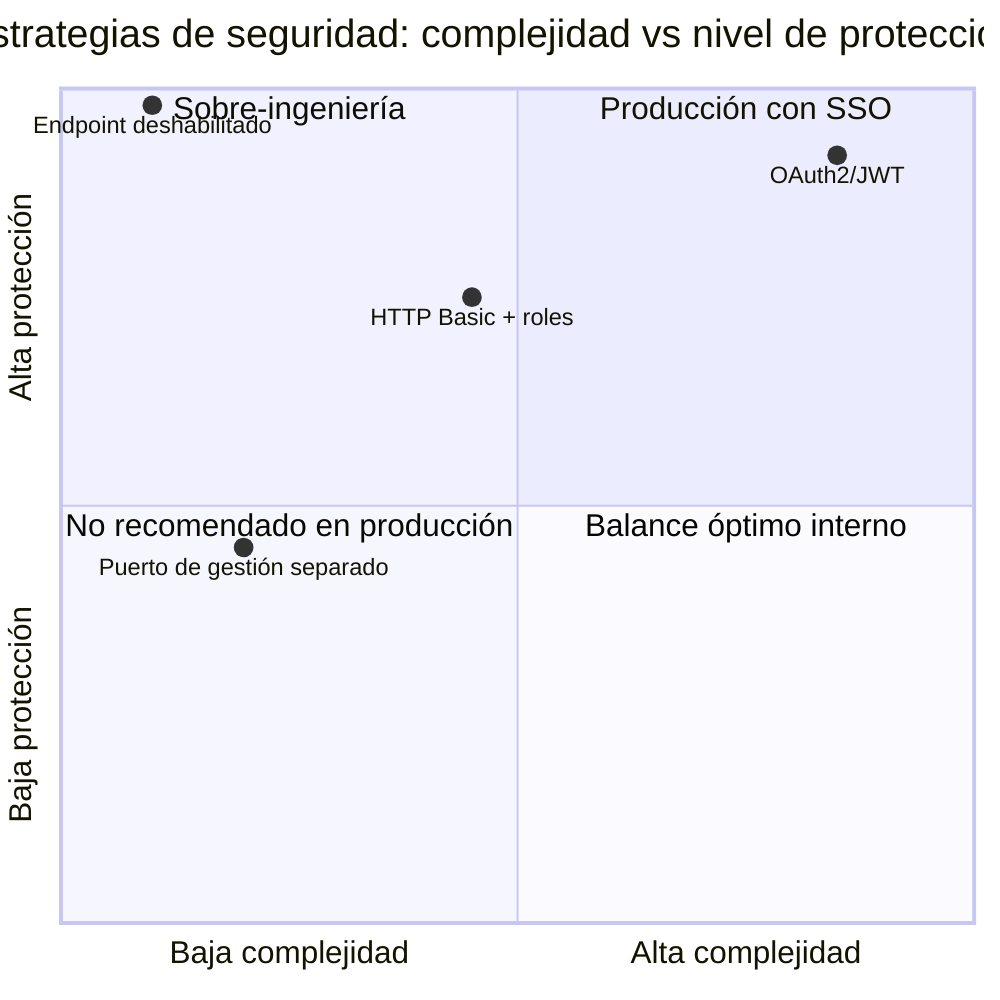

# 7.7 Spring Cloud Bus — Seguridad de endpoints del Bus

← [7.6 Spring Cloud Bus — Trazabilidad y destination pattern](sc-bus-observabilidad.md) | [Índice](README.md) | [7.8 Spring Cloud Bus — Endpoint busenv y cambio en caliente](sc-bus-busenv.md) →

---

## Introducción

Los endpoints `/actuator/bus-refresh` y `/actuator/bus-env` son extremadamente sensibles en producción: un actor no autorizado podría disparar un refresh masivo de configuración en todos los microservicios o modificar propiedades críticas del entorno en tiempo de ejecución. Spring Cloud Bus no incluye seguridad propia; delega en Spring Security y en el modelo de seguridad de Spring Boot Actuator para proteger estos endpoints.

> [ADVERTENCIA] Por defecto, Spring Boot Actuator expone los endpoints sin autenticación en el puerto de gestión si no se configura Spring Security. En producción, NUNCA se deben exponer `/actuator/bus-refresh` ni `/actuator/bus-env` sin autenticación y autorización.

## Modelo de seguridad de Spring Boot Actuator

Spring Boot Actuator 3.x integra la seguridad de endpoints mediante `SecurityFilterChain`. Los endpoints de Actuator están protegidos por el mismo mecanismo de Spring Security que el resto de la aplicación.

Las propiedades de control de exposición y habilitación de endpoints son:

| Propiedad | Descripción |
|-----------|-------------|
| `management.endpoints.web.exposure.include` | Lista de endpoints expuestos por HTTP; no exponer sin revisión |
| `management.endpoints.web.exposure.exclude` | Lista de endpoints explícitamente excluidos de la exposición |
| `management.endpoint.bus-refresh.enabled` | `true`/`false`; deshabilita el endpoint a nivel de funcionamiento |
| `management.endpoint.bus-env.enabled` | `true`/`false`; deshabilita el endpoint de bus-env |

> [CONCEPTO] Deshabilitar un endpoint con `management.endpoint.bus-refresh.enabled=false` es diferente de no exponerlo. Un endpoint deshabilitado no está disponible en absoluto (no puede invocarse ni siquiera internamente). Un endpoint no expuesto existe pero no es accesible por HTTP.

## Estrategias de protección con Spring Security

Existen tres estrategias principales para proteger los endpoints del Bus, ordenadas de menor a mayor seguridad:

**Estrategia 1: Puerto de gestión separado (más sencilla en entornos privados)**

Configurar los endpoints de Actuator en un puerto diferente al de la aplicación y restringir ese puerto a la red interna mediante firewall o políticas de red.

**Estrategia 2: Autenticación HTTP Basic (común en entornos internos)**

Requiere credenciales para acceder a los endpoints del Bus. Adecuada para entornos donde el Bus es accedido por otros servicios de infraestructura.

**Estrategia 3: Autenticación con roles específicos (recomendada en producción)**

Requiere que el usuario tenga un rol específico (`ACTUATOR`, `ADMIN` u otro definido) para acceder a los endpoints del Bus.

## Ejemplo central — Configuración completa de seguridad

El siguiente ejemplo muestra la configuración de seguridad recomendada para producción con Spring Security 6.x, protegiendo los endpoints del Bus con autenticación y autorización por roles.

```xml
<!-- pom.xml — dependencia de Spring Security -->
<dependency>
    <groupId>org.springframework.boot</groupId>
    <artifactId>spring-boot-starter-security</artifactId>
</dependency>
```

```java
// ActuatorSecurityConfig.java — configuración de seguridad para endpoints del Bus
package com.example.configclient.security;

import org.springframework.boot.actuate.autoconfigure.security.servlet.EndpointRequest;
import org.springframework.context.annotation.Bean;
import org.springframework.context.annotation.Configuration;
import org.springframework.security.config.annotation.web.builders.HttpSecurity;
import org.springframework.security.config.annotation.web.configuration.EnableWebSecurity;
import org.springframework.security.core.userdetails.User;
import org.springframework.security.core.userdetails.UserDetailsService;
import org.springframework.security.crypto.bcrypt.BCryptPasswordEncoder;
import org.springframework.security.crypto.password.PasswordEncoder;
import org.springframework.security.provisioning.InMemoryUserDetailsManager;
import org.springframework.security.web.SecurityFilterChain;

@Configuration
@EnableWebSecurity
public class ActuatorSecurityConfig {

    @Bean
    public SecurityFilterChain securityFilterChain(HttpSecurity http) throws Exception {
        http
            .authorizeHttpRequests(authorize -> authorize
                // Endpoints del Bus requieren rol ACTUATOR
                .requestMatchers(EndpointRequest.to("bus-refresh", "bus-env"))
                    .hasRole("ACTUATOR")
                // Health e info accesibles sin autenticación
                .requestMatchers(EndpointRequest.to("health", "info"))
                    .permitAll()
                // Cualquier otro endpoint de actuator requiere autenticación
                .requestMatchers(EndpointRequest.toAnyEndpoint())
                    .authenticated()
                // El resto de la aplicación: su propia lógica
                .anyRequest()
                    .permitAll()
            )
            .httpBasic(httpBasic -> httpBasic
                .realmName("Spring Cloud Bus Management")
            )
            .csrf(csrf -> csrf
                // Deshabilitar CSRF para los endpoints de Actuator
                // (son invocados por sistemas externos/webhooks, no por browsers)
                .ignoringRequestMatchers(EndpointRequest.toAnyEndpoint())
            );

        return http.build();
    }

    @Bean
    public UserDetailsService userDetailsService(PasswordEncoder passwordEncoder) {
        return new InMemoryUserDetailsManager(
            User.withUsername("bus-admin")
                .password(passwordEncoder.encode("${BUS_ADMIN_PASSWORD}"))
                .roles("ACTUATOR", "ADMIN")
                .build()
        );
    }

    @Bean
    public PasswordEncoder passwordEncoder() {
        return new BCryptPasswordEncoder();
    }
}
```

```yaml
# application.yml — propiedades de exposición y habilitación de endpoints del Bus
spring:
  application:
    name: config-client
  security:
    user:
      name: ${BUS_ADMIN_USER:bus-admin}
      password: ${BUS_ADMIN_PASSWORD:changeme}
      roles: ACTUATOR

management:
  endpoints:
    web:
      exposure:
        # Exponer SOLO los endpoints necesarios, nunca '*' en producción
        include: bus-refresh, bus-env, health, info
      base-path: /actuator
  endpoint:
    bus-refresh:
      enabled: true    # Cambiar a false para deshabilitar completamente
    bus-env:
      enabled: true
  # Puerto de gestión separado (opcional, más seguro en entornos con red interna)
  server:
    port: 9090         # Solo accesible en red interna/management network
```

Con esta configuración, una llamada al endpoint del Bus requiere autenticación:

```bash
# Llamada sin autenticación → 401 Unauthorized
curl -X POST http://localhost:8080/actuator/bus-refresh

# Llamada con autenticación correcta → 204 No Content (éxito)
curl -X POST http://localhost:8080/actuator/bus-refresh \
     -u bus-admin:changeme

# Llamada a puerto de gestión separado (si se configuró)
curl -X POST http://localhost:9090/actuator/bus-refresh \
     -u bus-admin:changeme
```

## Tabla de estrategias de seguridad

Las estrategias de protección de los endpoints del Bus se comparan según su adecuación a diferentes entornos:

| Estrategia | Seguridad | Complejidad | Recomendado para |
|------------|-----------|-------------|------------------|
| Puerto de gestión separado | Media | Baja | Entornos con red interna controlada |
| HTTP Basic + roles | Alta | Media | Entornos internos, CI/CD pipelines |
| OAuth2/JWT | Muy alta | Alta | Producción con SSO corporativo |
| Endpoint deshabilitado | Máxima | Mínima | Servicios que no necesitan bus-refresh externo |


*Comparación de estrategias según el balance entre complejidad de implementación y nivel de protección alcanzado.*

## Deshabilitar endpoints del Bus

Cuando un servicio no necesita recibir llamadas externas al endpoint de Bus (por ejemplo, si el refresh se dispara desde otro servicio interno), la opción más segura es deshabilitar el endpoint completamente:

```yaml
management:
  endpoint:
    bus-refresh:
      enabled: false   # El endpoint no existe; no es invocable
    bus-env:
      enabled: false   # El endpoint de bus-env tampoco
```

> [CONCEPTO] Deshabilitar el endpoint con `enabled=false` no impide que la instancia **reciba** eventos del Bus desde el broker. La instancia sigue siendo un consumidor del Bus; solo deja de exponer el disparador HTTP para generar nuevos eventos.

## Buenas y malas prácticas

**Buenas prácticas:**

- Usar siempre una lista explícita en `management.endpoints.web.exposure.include` en lugar de `*`. Exponer solo lo necesario.
- En entornos de producción con Kubernetes, restringir el puerto de gestión a la red del cluster usando NetworkPolicies.
- Deshabilitar `bus-env` si no se usa activamente el cambio de propiedades en caliente. Es un vector de ataque adicional sin beneficio si no se usa.

**Malas prácticas:**

- Usar `management.endpoints.web.exposure.include=*` en producción. Expone endpoints como `/actuator/env`, `/actuator/heapdump` y `/actuator/shutdown`.
- No configurar Spring Security y confiar solo en firewall para proteger los endpoints. La defensa en profundidad requiere múltiples capas de seguridad.
- Hardcodear contraseñas en `application.yml`. Siempre usar variables de entorno o un secrets manager.

## Verificación y práctica

> [EXAMEN] **1.** ¿Qué propiedad deshabilita completamente el endpoint `/actuator/bus-refresh`, impidiendo su invocación?

> [EXAMEN] **2.** ¿Cuál es la diferencia entre "endpoint deshabilitado" y "endpoint no expuesto" en Spring Boot Actuator?

> [EXAMEN] **3.** ¿Qué clase de Spring Security se usa para configurar reglas de autorización específicas para endpoints de Actuator?

> [EXAMEN] **4.** ¿Por qué se debe deshabilitar CSRF para los endpoints de Actuator cuando son invocados por webhooks externos?

> [EXAMEN] **5.** Si se configura `management.server.port=9090`, ¿en qué puerto estará disponible `/actuator/bus-refresh`?

---

← [7.6 Spring Cloud Bus — Trazabilidad y destination pattern](sc-bus-observabilidad.md) | [Índice](README.md) | [7.8 Spring Cloud Bus — Endpoint busenv y cambio en caliente](sc-bus-busenv.md) →
