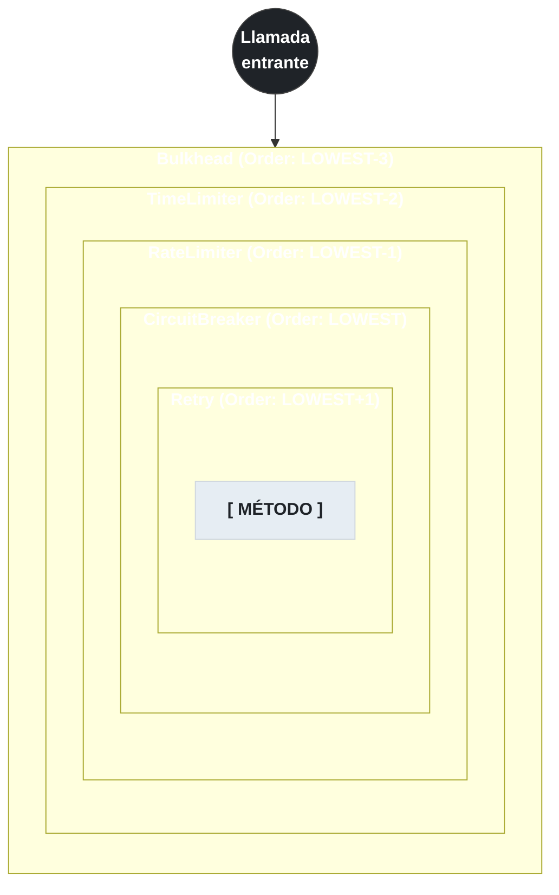

# 4.7 AOP — Orden de aspectos y fallbackMethod

← [4.6 RateLimiter y TimeLimiter](sc-circuitbreaker-ratelimiter.md) | [Índice](README.md) | [4.8 Spring Cloud Circuit Breaker — Abstraction Layer](sc-circuitbreaker-sc-abstraction.md) →

---

## Introducción

Las anotaciones de Resilience4j (`@CircuitBreaker`, `@Retry`, `@Bulkhead`, etc.) son procesadas por aspectos Spring AOP. Cuando se aplican múltiples anotaciones sobre el mismo método, el orden en que se aplican los aspectos determina completamente el comportamiento del sistema ante un fallo. Un orden incorrecto puede hacer que el Circuit Breaker abra demasiado rápido, que los reintentos se produzcan fuera del bulkhead, o que el fallback se invoque antes de lo esperado. Este fichero explica el orden fijo de Resilience4j, la firma del fallbackMethod, el problema de self-invocation y cómo superarlo.

> [EXAMEN] El orden de aspectos de Resilience4j Spring Boot es fijo y conocido: **Bulkhead > TimeLimiter > RateLimiter > CircuitBreaker > Retry** (de exterior a interior). Esta pregunta aparece frecuentemente en el examen VMware Spring Professional.

## Diagrama de la cadena de aspectos

La cadena de aspectos funciona como decoradores anidados: el aspecto más exterior envuelve a todos los demás. En caso de fallo, el control se propaga desde el interior hacia el exterior.


*Cadena de aspectos de exterior a interior: Bulkhead > TimeLimiter > RateLimiter > CircuitBreaker > Retry. Un fallo se propaga de adentro hacia afuera.*

Este orden significa que:
- Retry intenta el método `maxAttempts` veces antes de propagar el fallo al CircuitBreaker.
- CircuitBreaker cuenta UN fallo por cada agotamiento de Retry (no por cada intento).
- RateLimiter verifica el permiso antes de que CircuitBreaker compruebe el estado.
- Bulkhead limita la concurrencia total del conjunto completo.

## Ejemplo central

El ejemplo muestra la combinación correcta de tres anotaciones en el mismo método, el fallback unificado y el comportamiento de orden:

```java
package com.example.combined;

import io.github.resilience4j.bulkhead.annotation.Bulkhead;
import io.github.resilience4j.circuitbreaker.annotation.CircuitBreaker;
import io.github.resilience4j.retry.annotation.Retry;
import org.springframework.stereotype.Service;

@Service
public class ResilientOrderService {

    private final PaymentClient paymentClient;

    public ResilientOrderService(PaymentClient paymentClient) {
        this.paymentClient = paymentClient;
    }

    // Orden de aplicación (exterior → interior):
    // 1. Bulkhead: limita concurrencia a maxConcurrentCalls
    // 2. CircuitBreaker: evalúa estado del circuito
    // 3. Retry: reintenta hasta maxAttempts veces
    // El fallbackMethod es invocado por el aspecto más externo que lo declare
    @Bulkhead(name = "paymentService", fallbackMethod = "paymentFallback")
    @CircuitBreaker(name = "paymentService", fallbackMethod = "paymentFallback")
    @Retry(name = "paymentService", fallbackMethod = "paymentFallback")
    public PaymentResult processPayment(PaymentRequest request) {
        return paymentClient.process(request);
    }

    // Firma: mismos parámetros + Throwable
    // Se usa UN único fallback para las tres anotaciones (mismo nombre y firma)
    public PaymentResult paymentFallback(PaymentRequest request, Throwable ex) {
        return PaymentResult.failed(
            "Payment service unavailable: " + ex.getClass().getSimpleName());
    }
}
```

Demostración del problema de self-invocation:

```java
package com.example.selfinvoke;

import io.github.resilience4j.circuitbreaker.annotation.CircuitBreaker;
import org.springframework.stereotype.Service;

@Service
public class SelfInvocationDemo {

    // CORRECTO: llama al método desde fuera de la clase → el proxy intercepta
    public void entryPoint() {
        // Esta llamada SÍ pasa por el proxy AOP → @CircuitBreaker activo
        String result = this.protectedByProxy(); // "this" es el proxy
        // INCORRECTO si se hace desde dentro:
        // String result = protectedMethod(); // "this" es el objeto real, no el proxy
    }

    @CircuitBreaker(name = "demo", fallbackMethod = "demoFallback")
    public String protectedByProxy() {
        return externalCall();
    }

    // Este método llama a protectedMethod() via self-invocation
    // @CircuitBreaker NO se aplica porque el proxy no intercepta llamadas internas
    public void internalCaller() {
        // PELIGRO: esta llamada bypassa el proxy
        String result = protectedByProxy(); // equivale a super.protectedByProxy()
    }

    public String demoFallback(Throwable ex) {
        return "fallback";
    }

    private String externalCall() {
        return "ok";
    }
}
```

## Tabla de prioridades de aspectos

Los valores de `@Order` asignados por Resilience4j Spring Boot para cada aspecto (menor = mayor prioridad = más exterior):

| Aspecto | @Order | Posición en la cadena |
|---------|--------|----------------------|
| BulkheadAspect | `Ordered.LOWEST_PRECEDENCE - 3` | Más exterior |
| TimeLimiterAspect | `Ordered.LOWEST_PRECEDENCE - 2` | Segundo |
| RateLimiterAspect | `Ordered.LOWEST_PRECEDENCE - 1` | Tercero |
| CircuitBreakerAspect | `Ordered.LOWEST_PRECEDENCE` | Cuarto |
| RetryAspect | `Ordered.LOWEST_PRECEDENCE + 1` | Más interior |

> [CONCEPTO] `Ordered.LOWEST_PRECEDENCE` tiene el valor `Integer.MAX_VALUE`. Los aspectos con valores más bajos (más negativos relativo al LOWEST_PRECEDENCE) se aplican más al exterior. Esta numeración puede parecer contraintuitiva pero sigue la convención de Spring AOP.

## Firma del fallbackMethod — reglas completas

Un `fallbackMethod` incorrecto causa `NoSuchMethodException` en la primera invocación o en el arranque. Las reglas son:

1. Debe estar en la **misma clase** que el método protegido (no en una superclase).
2. Debe tener el **mismo tipo de retorno** (o compatible por polimorfismo).
3. Debe aceptar los **mismos parámetros** que el método protegido, seguidos de un parámetro `Throwable` (o subclase).
4. Si hay múltiples fallbacks con el mismo nombre y diferente tipo de excepción, Resilience4j selecciona el **más específico**.
5. Con `@TimeLimiter` y `CompletableFuture`, el fallback también debe devolver `CompletableFuture<T>`.

> [ADVERTENCIA] La self-invocation es el error más frecuente con Resilience4j. Cuando un método anotado es llamado desde otro método de la misma clase sin pasar por el proxy, ninguna de las anotaciones Resilience4j tiene efecto. La solución es inyectar la misma clase via `@Autowired` (Spring devuelve el proxy), o usar el modo AspectJ (weaving en tiempo de compilación/carga) que no depende de proxies.

## Modo AspectJ vs Spring Proxy

Spring AOP funciona mediante proxies CGLIB (por defecto) o JDK Dynamic Proxies. Solo intercepta llamadas que pasan por el proxy. AspectJ (weaving) modifica el bytecode directamente y puede interceptar cualquier llamada, incluyendo self-invocation, llamadas a constructores y campos.

Para activar el modo AspectJ en Spring Boot se añade la dependencia `spring-aspects` y se usa `@EnableAspectJAutoProxy(proxyTargetClass=false)` con weaving configurado en el build. Para la mayoría de proyectos, la solución más simple a la self-invocation es inyectar la propia clase:

```java
@Service
public class MyService {
    @Autowired
    private MyService self; // self es el proxy, no el objeto real

    public void internalCaller() {
        self.protectedMethod(); // pasa por el proxy → @CircuitBreaker activo
    }

    @CircuitBreaker(name = "demo", fallbackMethod = "fallback")
    public String protectedMethod() { return "ok"; }

    public String fallback(Throwable ex) { return "fallback"; }
}
```

## Buenas y malas prácticas

**Buenas prácticas:**
- Respetar el orden por defecto (Bulkhead > TimeLimiter > RateLimiter > CB > Retry) salvo razón documentada.
- Usar el mismo nombre de `fallbackMethod` para todas las anotaciones combinadas en el mismo método.
- Si se necesita personalizar el orden, usar `resilience4j.*.aspectOrder` en application.yml o la propiedad `spring.aop.proxy-target-class=true`.

**Malas prácticas:**
- Ignorar el efecto del orden: poner Retry más externo que CircuitBreaker hace que cada intento individual cuente como fallo en el CB.
- Definir el `fallbackMethod` en una clase diferente mediante `@see` o mediante herencia: no funciona con CGLIB proxy.

## Verificación y práctica

> [EXAMEN] 1. ¿Cuál es el orden correcto de los aspectos Resilience4j de exterior a interior?

> [EXAMEN] 2. Un método tiene `@Retry(maxAttempts=3)` y `@CircuitBreaker`. Con el orden por defecto, si el método falla las 3 veces del Retry, ¿cuántos fallos registra el CircuitBreaker?

> [EXAMEN] 3. ¿Por qué falla la self-invocation con Spring AOP y cuáles son las dos soluciones posibles?

> [EXAMEN] 4. ¿Puede un `fallbackMethod` definido en una clase padre ser utilizado por `@CircuitBreaker` en la clase hijo? Justifica.

> [EXAMEN] 5. Con `@Bulkhead` (exterior) y `@CircuitBreaker` (interior), si el Bulkhead rechaza la llamada, ¿se invoca el fallback del CircuitBreaker?

---

← [4.6 RateLimiter y TimeLimiter](sc-circuitbreaker-ratelimiter.md) | [Índice](README.md) | [4.8 Spring Cloud Circuit Breaker — Abstraction Layer](sc-circuitbreaker-sc-abstraction.md) →
