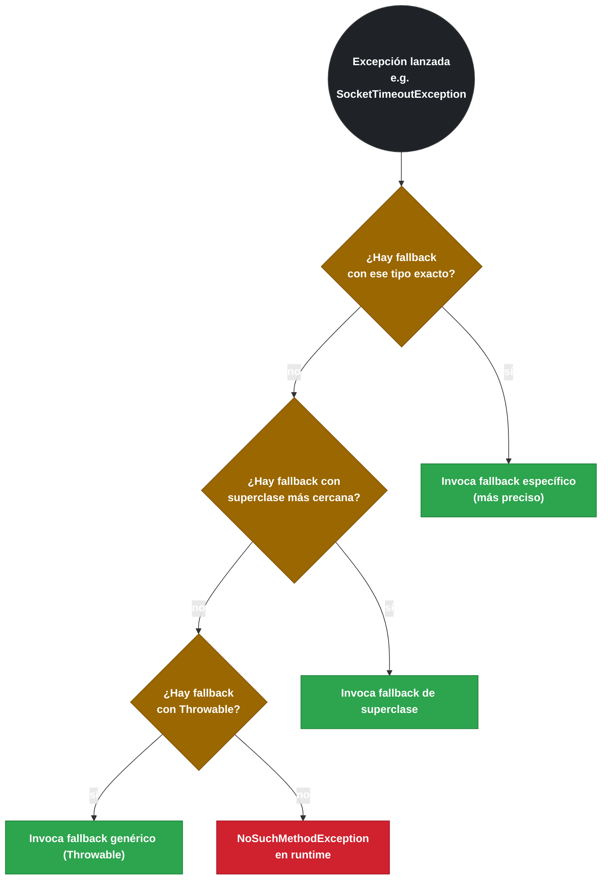

# 4.3 Circuit Breaker — Uso con anotaciones y API programática

← [4.2 Configuración completa](sc-circuitbreaker-configuracion.md) | [Índice](README.md) | [4.4 Retry — Configuración y uso](sc-circuitbreaker-retry.md) →

---

## Introducción

Conocer los estados y la configuración del Circuit Breaker es necesario, pero el uso cotidiano ocurre a través de dos vías: la anotación declarativa `@CircuitBreaker` para integración sencilla con Spring AOP, y la API programática con `CircuitBreakerRegistry` y `CircuitBreaker.executeSupplier()` para casos donde se necesita control fino o donde las anotaciones no son aplicables (lambdas, clases no gestionadas por Spring). Este fichero documenta ambas vías, las reglas de firma del `fallbackMethod` y la combinación de YAML con el builder programático.

> [PREREQUISITO] Requiere conocimiento de [4.2 Configuración completa](sc-circuitbreaker-configuracion.md) para entender los parámetros de configuración referenciados.

## La anotación @CircuitBreaker

La anotación `@CircuitBreaker` es el punto de entrada más común. Se aplica sobre métodos de beans Spring y activa un proxy AOP que intercepta la llamada, aplica el circuito con el nombre especificado y, si el circuito está abierto o la llamada falla, invoca el `fallbackMethod`. Las reglas de firma son estrictas y su violación produce errores en tiempo de inicio o en la primera invocación.

Las reglas de firma del `fallbackMethod`:

1. Debe estar en la misma clase que el método protegido.
2. Debe tener el mismo tipo de retorno o un supertipo compatible.
3. Debe aceptar exactamente los mismos parámetros que el método protegido, más un parámetro final de tipo `Throwable` o una subclase específica.
4. Puede haber múltiples métodos fallback con el mismo nombre pero diferente tipo de excepción (Resilience4j selecciona el más específico).

```java
package com.example.order;

import io.github.resilience4j.circuitbreaker.annotation.CircuitBreaker;
import org.springframework.stereotype.Service;

@Service
public class OrderService {

    // Fallback genérico: acepta cualquier Throwable
    @CircuitBreaker(name = "orderService", fallbackMethod = "createOrderFallback")
    public Order createOrder(OrderRequest request) {
        // llamada al servicio downstream
        return externalOrderClient.create(request);
    }

    // Fallback específico para IOException — seleccionado antes que el genérico
    public Order createOrderFallback(OrderRequest request, java.io.IOException ex) {
        return Order.degraded("Network error: " + ex.getMessage());
    }

    // Fallback genérico — seleccionado si no hay fallback más específico
    public Order createOrderFallback(OrderRequest request, Throwable ex) {
        return Order.degraded("Service unavailable");
    }
}
```

> [CONCEPTO] La selección del fallback es por especificidad de excepción: Resilience4j busca el fallback cuyo parámetro de excepción sea del tipo más específico que coincida con la excepción lanzada. Si hay empate, usa el primero encontrado por reflexión.


*Algoritmo de selección de fallbackMethod: Resilience4j elige el método cuyo tipo de excepción es el más específico en la jerarquía de clases.*

## Ejemplo central

El ejemplo muestra el uso completo de `CircuitBreakerRegistry` para acceso programático: crear una instancia con configuración específica, decorar una llamada con `executeSupplier`, y registrar un listener de estado:

```java
package com.example.product;

import io.github.resilience4j.circuitbreaker.CircuitBreaker;
import io.github.resilience4j.circuitbreaker.CircuitBreakerConfig;
import io.github.resilience4j.circuitbreaker.CircuitBreakerRegistry;
import io.github.resilience4j.circuitbreaker.CallNotPermittedException;
import org.springframework.stereotype.Service;
import java.time.Duration;
import java.util.function.Supplier;

@Service
public class ProductCatalogService {

    private final CircuitBreaker circuitBreaker;
    private final ExternalCatalogClient catalogClient;

    public ProductCatalogService(CircuitBreakerRegistry registry,
                                  ExternalCatalogClient catalogClient) {
        // Obtiene o crea la instancia "catalogService" usando config del registry
        this.circuitBreaker = registry.circuitBreaker("catalogService");
        this.catalogClient = catalogClient;

        // Registrar listener de transición de estado
        this.circuitBreaker.getEventPublisher()
            .onStateTransition(event ->
                System.out.printf("CB '%s' transitioned: %s -> %s%n",
                    event.getCircuitBreakerName(),
                    event.getStateTransition().getFromState(),
                    event.getStateTransition().getToState()));
    }

    public Product getProduct(Long id) {
        // executeSupplier aplica el CB sobre el Supplier y propaga excepciones
        Supplier<Product> decoratedSupplier = CircuitBreaker.decorateSupplier(
            circuitBreaker,
            () -> catalogClient.fetchProduct(id));

        try {
            return decoratedSupplier.get();
        } catch (CallNotPermittedException ex) {
            // CB está en estado OPEN
            return Product.unavailable(id, "Circuit open");
        } catch (Exception ex) {
            return Product.unavailable(id, ex.getMessage());
        }
    }

    // Configuración de una instancia adicional con config custom
    public static CircuitBreaker createCustomCB(CircuitBreakerRegistry registry) {
        CircuitBreakerConfig config = CircuitBreakerConfig.custom()
            .slidingWindowSize(10)
            .minimumNumberOfCalls(5)
            .failureRateThreshold(40f)
            .waitDurationInOpenState(Duration.ofSeconds(20))
            .build();
        // Si "customService" ya existe en el registry, devuelve la instancia existente
        return registry.circuitBreaker("customService", config);
    }
}
```

Configuración YAML correspondiente para el bean registry:

```yaml
resilience4j:
  circuitbreaker:
    instances:
      catalogService:
        sliding-window-size: 30
        minimum-number-of-calls: 5
        failure-rate-threshold: 50
        wait-duration-in-open-state: 20s
```

## Tabla de elementos clave

Los métodos de `CircuitBreaker` más utilizados para decorar código:

| Método | Uso | Tipo de retorno |
|--------|-----|-----------------|
| `CircuitBreaker.decorateSupplier(cb, supplier)` | Decora una llamada que devuelve un valor | `Supplier<T>` |
| `CircuitBreaker.decorateRunnable(cb, runnable)` | Decora una llamada sin valor de retorno | `Runnable` |
| `CircuitBreaker.decorateCallable(cb, callable)` | Decora una llamada que puede lanzar checked exceptions | `Callable<T>` |
| `CircuitBreaker.decorateCheckedSupplier(cb, supplier)` | Idem con checked exceptions | `CheckedSupplier<T>` |
| `circuitBreaker.executeSupplier(supplier)` | Decora y ejecuta en una llamada | `T` |
| `circuitBreaker.executeRunnable(runnable)` | Decora y ejecuta sin retorno | `void` |

> [CONCEPTO] `CircuitBreakerRegistry` actúa como un repositorio singleton de instancias. Si se llama a `registry.circuitBreaker("myService")` dos veces, se devuelve la misma instancia. Esto es esencial para que el estado del CB sea consistente entre múltiples clientes que llaman al mismo servicio.

## Buenas y malas prácticas

**Buenas prácticas:**
- Nombrar las instancias de CircuitBreaker según el servicio downstream que protegen, no según la clase consumidora.
- Usar `@CircuitBreaker` para la mayoría de casos; reservar la API programática para lambdas, streams y clases no gestionadas por Spring.
- Siempre capturar `CallNotPermittedException` en el código programático para manejar el estado OPEN explícitamente.
- Verificar que el `fallbackMethod` no lanza excepciones — si falla, la excepción se propaga sin captura.

**Malas prácticas:**
- Definir el `fallbackMethod` en una clase diferente a la del método protegido: el proxy AOP no lo encuentra.
- Omitir el parámetro `Throwable` en el `fallbackMethod`: Resilience4j no encontrará el método y lanzará `NoSuchMethodException` en runtime.
- Llamar a un método anotado con `@CircuitBreaker` desde dentro de la misma clase (self-invocation): el proxy AOP no intercepta la llamada. Ver [4.7 AOP](sc-circuitbreaker-aop.md).

## Verificación y práctica

> [EXAMEN] 1. ¿Cuál es la firma correcta del `fallbackMethod` para un método `String getData(Long id, String type)` anotado con `@CircuitBreaker`?

> [EXAMEN] 2. Si `CircuitBreakerRegistry` contiene la instancia "myService" con configuración A, y en otro bean se llama `registry.circuitBreaker("myService", configB)`, ¿qué instancia se devuelve?

> [EXAMEN] 3. ¿Qué excepción lanza `circuitBreaker.executeSupplier(...)` cuando el CB está en estado OPEN?

> [EXAMEN] 4. Hay dos fallbacks: `fallback(Long id, IOException ex)` y `fallback(Long id, Throwable ex)`. Si el método protegido lanza `SocketTimeoutException` (subclase de `IOException`), ¿cuál fallback se invoca?

> [EXAMEN] 5. ¿Por qué falla el siguiente código si `MyService.doWork()` llama internamente a `MyService.protectedMethod()` que está anotada con `@CircuitBreaker`?

---

← [4.2 Configuración completa](sc-circuitbreaker-configuracion.md) | [Índice](README.md) | [4.4 Retry — Configuración y uso](sc-circuitbreaker-retry.md) →
