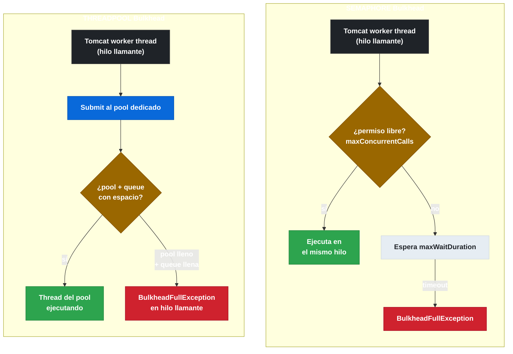

# 4.5 Bulkhead — Semaphore y ThreadPool

← [4.4 Retry — Configuración y uso](sc-circuitbreaker-retry.md) | [Índice](README.md) | [4.6 RateLimiter y TimeLimiter](sc-circuitbreaker-ratelimiter.md) →

---

## Introducción

El patrón Bulkhead toma su nombre de los compartimentos estancos de los barcos: si un compartimento se inunda, los demás permanecen intactos. En microservicios, Bulkhead resuelve el problema del consumo exhaustivo de recursos por un único servicio downstream lento: si el servicio A llama a B y B se vuelve lento, los threads que esperan respuesta de B se acumulan hasta agotar el thread pool de A, impidiendo que A atienda llamadas a C, D y otros servicios. Bulkhead limita cuántos threads o permisos de concurrencia puede usar cada llamada downstream, aislando el impacto.

> [CONCEPTO] Resilience4j ofrece dos implementaciones de Bulkhead: SEMAPHORE (mismo hilo, control por permisos) y THREADPOOL (hilo dedicado, control por pool). La elección entre ambas depende del modelo de concurrencia de la aplicación.

## Diagrama comparativo SEMAPHORE vs THREADPOOL

La diferencia fundamental entre ambos tipos es dónde se ejecuta el código protegido y cómo se gestiona la concurrencia:


*SEMAPHORE ejecuta en el hilo llamante y bloquea hasta maxWaitDuration; THREADPOOL delega a un pool aislado y rechaza inmediatamente si pool y queue están llenos.*

## Ejemplo central

El ejemplo muestra la configuración y uso de ambos tipos de Bulkhead, con sus respectivas configuraciones YAML:

```java
package com.example.catalog;

import io.github.resilience4j.bulkhead.annotation.Bulkhead;
import io.github.resilience4j.bulkhead.BulkheadFullException;
import io.github.resilience4j.bulkhead.BulkheadRegistry;
import org.springframework.stereotype.Service;
import java.util.concurrent.CompletableFuture;

@Service
public class CatalogService {

    private final BulkheadRegistry bulkheadRegistry;
    private final ExternalInventoryClient inventoryClient;

    public CatalogService(BulkheadRegistry bulkheadRegistry,
                           ExternalInventoryClient inventoryClient) {
        this.bulkheadRegistry = bulkheadRegistry;
        this.inventoryClient = inventoryClient;
    }

    // SEMAPHORE: bloquea en el mismo hilo hasta adquirir permiso
    // Adecuado para llamadas síncronas en aplicaciones tradicionales (Tomcat/Jetty)
    @Bulkhead(name = "inventorySemaphore",
              type = Bulkhead.Type.SEMAPHORE,
              fallbackMethod = "inventoryFallback")
    public InventoryStatus checkInventory(Long productId) {
        return inventoryClient.getStatus(productId);
    }

    // THREADPOOL: delega la ejecución a un pool dedicado
    // Adecuado para operaciones asíncronas; el tipo de retorno DEBE ser CompletableFuture
    @Bulkhead(name = "inventoryThreadPool",
              type = Bulkhead.Type.THREADPOOL,
              fallbackMethod = "inventoryAsyncFallback")
    public CompletableFuture<InventoryStatus> checkInventoryAsync(Long productId) {
        return CompletableFuture.supplyAsync(
            () -> inventoryClient.getStatus(productId));
    }

    // Fallback para SEMAPHORE — mismo hilo, retorno directo
    public InventoryStatus inventoryFallback(Long productId, BulkheadFullException ex) {
        return InventoryStatus.unknown(productId);
    }

    // Fallback para THREADPOOL — debe devolver CompletableFuture
    public CompletableFuture<InventoryStatus> inventoryAsyncFallback(
            Long productId, BulkheadFullException ex) {
        return CompletableFuture.completedFuture(InventoryStatus.unknown(productId));
    }
}
```

Configuración YAML para ambos tipos:

```yaml
resilience4j:
  bulkhead:
    instances:
      inventorySemaphore:
        max-concurrent-calls: 10        # máximo 10 llamadas concurrentes
        max-wait-duration: 100ms        # espera máxima para adquirir permiso

  thread-pool-bulkhead:
    instances:
      inventoryThreadPool:
        max-thread-pool-size: 4         # threads máximos en el pool
        core-thread-pool-size: 2        # threads mínimos siempre activos
        queue-capacity: 10              # cola de espera antes de rechazar
        keep-alive-duration: 20ms       # tiempo antes de reducir al core size
```

## Tabla comparativa SEMAPHORE vs THREADPOOL

| Aspecto | SEMAPHORE | THREADPOOL |
|---------|-----------|------------|
| Hilo de ejecución | Hilo del llamante | Hilo del pool dedicado |
| Tipo de retorno | Cualquiera | `CompletableFuture<T>` |
| Aislamiento de recursos | Parcial (usa Tomcat threads) | Total (pool independiente) |
| Overhead | Mínimo | Mayor (context switch) |
| Compatibilidad reactiva | No | Mejor (pool aislado) |
| Propiedad de tamaño | `maxConcurrentCalls` | `maxThreadPoolSize` + `queueCapacity` |
| Excepción al superar límite | `BulkheadFullException` | `BulkheadFullException` |
| Comportamiento de espera | Espera hasta `maxWaitDuration` | Envía a queue; si llena → rechaza |

> [EXAMEN] El tipo THREADPOOL requiere que el método anotado devuelva `CompletableFuture<T>`. Si el tipo de retorno no es `CompletableFuture`, Resilience4j lanzará un error de configuración en tiempo de inicio.

> [CONCEPTO] La `BulkheadFullException` se lanza en el hilo llamante en ambos tipos. En SEMAPHORE, se lanza después de que expire `maxWaitDuration` sin conseguir el permiso. En THREADPOOL, se lanza cuando tanto el pool como la queue están llenos.

## Cuándo elegir cada tipo

SEMAPHORE es la elección correcta cuando la aplicación usa un modelo de threads síncronos (Spring MVC sobre Tomcat/Jetty) y las operaciones protegidas son síncronas. Es más ligero y fácil de razonar.

THREADPOOL es la elección correcta cuando se necesita aislamiento total de recursos entre servicios downstream: un pool saturado no puede impactar el thread pool de Tomcat. Es imprescindible en aplicaciones que mezclan llamadas a servicios con tiempos de respuesta muy distintos.

## Buenas y malas prácticas

**Buenas prácticas:**
- Dimensionar `maxConcurrentCalls` del SEMAPHORE en función del throughput esperado y el tiempo medio de respuesta del downstream (ley de Little: N = λ × W).
- Usar THREADPOOL cuando diferentes servicios downstream tienen tiempos de respuesta muy diferentes para evitar que el más lento monopolice el pool de Tomcat.
- Monitorizar `resilience4j.bulkhead.available.concurrent.calls` en Micrometer para detectar saturación antes de que produzca rechazos.

**Malas prácticas:**
- Usar THREADPOOL con métodos de retorno síncrono: no funciona y lanza error en inicio.
- Configurar `max-wait-duration=0` en SEMAPHORE: rechaza inmediatamente si no hay permiso libre, lo que puede producir muchos errores en ráfagas breves de alta concurrencia.

## Verificación y práctica

> [EXAMEN] 1. ¿En qué hilo se ejecuta el código protegido con `@Bulkhead(type=SEMAPHORE)` y en qué hilo se ejecuta con `type=THREADPOOL`?

> [EXAMEN] 2. ¿Qué tipo de retorno debe tener un método anotado con `@Bulkhead(type=THREADPOOL)`?

> [EXAMEN] 3. Un Bulkhead SEMAPHORE tiene `maxConcurrentCalls=5` y `maxWaitDuration=0`. Llegan 6 llamadas simultáneas. ¿Qué ocurre con la sexta llamada?

> [EXAMEN] 4. ¿Cuál es la diferencia entre `maxThreadPoolSize` y `queueCapacity` en un THREADPOOL Bulkhead?

> [EXAMEN] 5. Un Bulkhead THREADPOOL tiene `maxThreadPoolSize=3`, `queueCapacity=2`. Hay 3 threads activos y 2 en cola. Llega una nueva llamada. ¿Qué sucede?

---

← [4.4 Retry — Configuración y uso](sc-circuitbreaker-retry.md) | [Índice](README.md) | [4.6 RateLimiter y TimeLimiter](sc-circuitbreaker-ratelimiter.md) →
