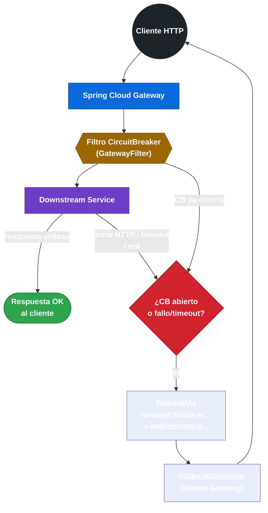

# 4.11 Integración con Spring Cloud Gateway

← [4.10 Integración con Feign](sc-circuitbreaker-feign.md) | [Índice](README.md) | [4.12 Métricas avanzadas y Health Indicators](sc-circuitbreaker-metricas.md) →

---

## Introducción

Spring Cloud Gateway puede proteger rutas completas con un CircuitBreaker de Resilience4j como filtro de ruta, aplicando el patrón a nivel de proxy antes de que las peticiones lleguen a los servicios downstream. Cuando el CircuitBreaker está abierto o el downstream falla, Gateway redirige la petición a una `fallbackUri` configurada, que puede ser otro controlador del mismo Gateway, un endpoint de otro servicio, o simplemente una respuesta de error. Esta integración protege al cliente externo de recibir errores crudos del downstream y centraliza la lógica de resiliencia en el punto de entrada.

> [PREREQUISITO] Requiere la dependencia reactiva de Resilience4j para Gateway (WebFlux): `spring-cloud-starter-circuitbreaker-reactor-resilience4j`.

## Arquitectura del filtro CircuitBreaker en Gateway

El filtro CircuitBreaker actúa como GatewayFilter en la cadena de filtros de la ruta. Envuelve la llamada al downstream en un CircuitBreaker reactivo. Si el downstream responde con un statusCode configurado como fallo, o lanza una excepción de red, el CB registra el fallo y eventualmente abre el circuito.


*El filtro CircuitBreaker intercepta tanto los fallos del downstream como el estado OPEN del CB, redirigiendo en ambos casos a la fallbackUri configurada.*

## Ejemplo central

El ejemplo muestra la configuración YAML completa de una ruta con filtro CircuitBreaker, fallbackUri y statusCodes que disparan la apertura:

```yaml
spring:
  cloud:
    gateway:
      routes:
        - id: product-route
          uri: lb://product-service   # Load Balancer con Eureka
          predicates:
            - Path=/products/**
          filters:
            # Filtro CircuitBreaker: nombre debe coincidir con instancia en resilience4j.*
            - name: CircuitBreaker
              args:
                name: productCircuit
                # fallbackUri: redirige cuando el CB está abierto o hay fallo
                # forward: enruta a un controlador del mismo Gateway
                fallbackUri: forward:/fallback/products
                # statusCodes: estos códigos HTTP del downstream cuentan como fallo
                # sin esta propiedad, solo cuentan las excepciones de red
                statusCodes:
                  - 500
                  - 503
                  - 504

        - id: payment-route
          uri: lb://payment-service
          predicates:
            - Path=/payments/**
          filters:
            - name: CircuitBreaker
              args:
                name: paymentCircuit
                fallbackUri: forward:/fallback/payments
                statusCodes:
                  - SERVICE_UNAVAILABLE   # nombre simbólico de HttpStatus también funciona

resilience4j:
  circuitbreaker:
    instances:
      productCircuit:
        sliding-window-size: 10
        minimum-number-of-calls: 5
        failure-rate-threshold: 50
        wait-duration-in-open-state: 30s
        permitted-number-of-calls-in-half-open-state: 3
      paymentCircuit:
        sliding-window-size: 5
        failure-rate-threshold: 60
        wait-duration-in-open-state: 60s

  timelimiter:
    instances:
      productCircuit:
        timeout-duration: 5s   # TimeLimiter se aplica automáticamente en Gateway
```

Controlador de fallback en el mismo Gateway:

```java
package com.example.gateway;

import org.springframework.http.HttpStatus;
import org.springframework.web.bind.annotation.RequestMapping;
import org.springframework.web.bind.annotation.RestController;
import org.springframework.web.server.ServerWebExchange;
import reactor.core.publisher.Mono;

@RestController
public class FallbackController {

    // Este endpoint se invoca cuando el CB del producto está abierto
    @RequestMapping("/fallback/products")
    public Mono<FallbackResponse> productFallback(ServerWebExchange exchange) {
        // Se puede acceder a la causa del fallo via atributos del exchange
        Throwable cause = exchange.getAttribute(
            "org.springframework.cloud.gateway.support.ServerWebExchangeUtils.CIRCUIT_BREAKER_EXCEPTION_ATTR");

        return Mono.just(FallbackResponse.builder()
            .message("Product service temporarily unavailable")
            .cause(cause != null ? cause.getMessage() : "Circuit open")
            .build());
    }

    @RequestMapping("/fallback/payments")
    public Mono<FallbackResponse> paymentFallback(ServerWebExchange exchange) {
        return Mono.just(FallbackResponse.builder()
            .message("Payment service temporarily unavailable")
            .build());
    }
}
```

## Tabla de configuración del filtro CircuitBreaker

| Parámetro | Descripción | Ejemplo |
|-----------|-------------|---------|
| `name` | Nombre de la instancia CB en `resilience4j.circuitbreaker.instances` | `productCircuit` |
| `fallbackUri` | URI de redirección cuando CB abierto o fallo | `forward:/fallback/products` |
| `statusCodes` | Códigos HTTP del downstream que cuentan como fallo | `[500, 503, 504]` |

> [CONCEPTO] Sin `statusCodes`, el filtro CircuitBreaker de Gateway solo cuenta como fallo las excepciones de conexión (timeout, connection refused). Para que errores 5xx también abran el CB, es obligatorio configurar `statusCodes`.

> [CONCEPTO] `fallbackUri` acepta dos formatos: `forward:/path` (reenvío interno al mismo Gateway) y `redirect:http://...` (redirección HTTP 302 al cliente). El reenvío interno es más común porque permite devolver una respuesta enriquecida sin exponer la URL del fallback.

## Dependencia requerida

```xml
<!-- Variante reactor obligatoria para Gateway (WebFlux) -->
<dependency>
    <groupId>org.springframework.cloud</groupId>
    <artifactId>spring-cloud-starter-circuitbreaker-reactor-resilience4j</artifactId>
</dependency>
```

No usar `spring-cloud-starter-circuitbreaker-resilience4j` (sin reactor): Gateway es reactivo y requiere la implementación `ReactiveResilience4JCircuitBreakerFactory`.

## TimeLimiter en Gateway

Cuando se usa el filtro CircuitBreaker en Gateway, el `TimeLimiter` asociado a la instancia CB se aplica automáticamente. Si el downstream no responde en `timeout-duration`, se dispara un `TimeoutException` que el CB registra como fallo y se redirige a `fallbackUri`.

## Buenas y malas prácticas

**Buenas prácticas:**
- Configurar siempre `statusCodes` con al menos `[500, 503, 504]` para que los errores del servidor downstream abran el CB.
- Usar `forward:/fallback/...` para que el fallback sea un endpoint del mismo Gateway con control total sobre la respuesta.
- Ajustar `timelimiter.instances.<name>.timeout-duration` para evitar que timeouts lentos bloqueen los event loops de Gateway.

**Malas prácticas:**
- Usar `spring-cloud-starter-circuitbreaker-resilience4j` (sin reactor) con Gateway: es incompatible con WebFlux.
- Omitir `statusCodes`: el CB solo abrirá por excepciones de red, no por errores HTTP del downstream.
- Implementar lógica de negocio compleja en el `FallbackController` del Gateway: este debe ser ligero y no debe llamar a otros servicios (lo que causaría llamadas durante el fallo).

## Verificación y práctica

> [EXAMEN] 1. ¿Qué dependencia se necesita para usar el filtro CircuitBreaker en Spring Cloud Gateway?

> [EXAMEN] 2. Si un downstream devuelve HTTP 503 y `statusCodes` no está configurado, ¿se registra ese fallo en el CircuitBreaker del Gateway?

> [EXAMEN] 3. ¿Cuál es la diferencia entre `fallbackUri: forward:/fallback` y `fallbackUri: redirect:http://fallback-service/default`?

> [EXAMEN] 4. ¿Cómo se accede a la excepción original del fallo en el controlador de fallback del Gateway?

> [EXAMEN] 5. ¿Qué ocurre si `timelimiter.instances.productCircuit.timeout-duration=2s` y el downstream tarda 3s en responder?

---

← [4.10 Integración con Feign](sc-circuitbreaker-feign.md) | [Índice](README.md) | [4.12 Métricas avanzadas y Health Indicators](sc-circuitbreaker-metricas.md) →
