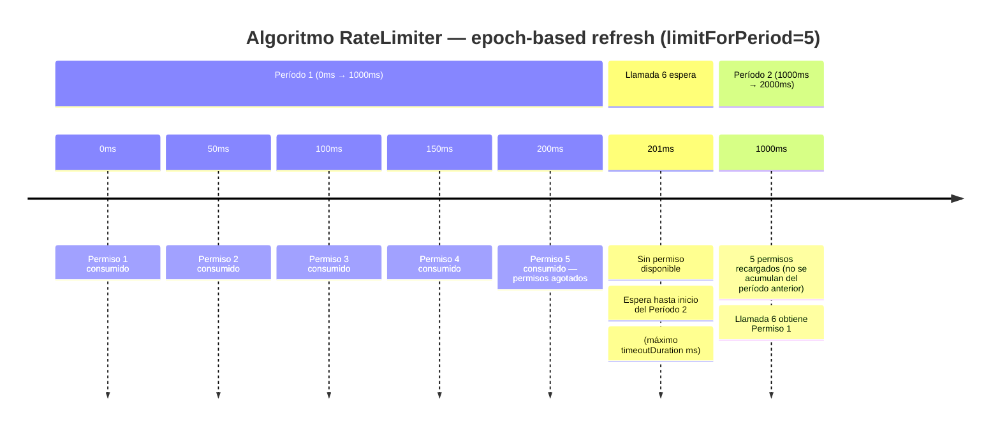

# 4.6 RateLimiter y TimeLimiter

← [4.5 Bulkhead — Semaphore y ThreadPool](sc-circuitbreaker-bulkhead.md) | [Índice](README.md) | [4.7 AOP — Orden de aspectos y fallbackMethod](sc-circuitbreaker-aop.md) →

---

## Introducción

RateLimiter y TimeLimiter son dos patrones de control temporal complementarios. RateLimiter resuelve el problema del consumo excesivo de recursos en el lado del llamante: limita cuántas llamadas por período puede hacer un servicio hacia un downstream, protegiendo así al downstream de ser saturado y asegurando que el servicio cumple con cuotas de API externas. TimeLimiter resuelve el problema opuesto: establece un techo de tiempo máximo que puede durar una llamada, evitando que threads se queden bloqueados indefinidamente esperando una respuesta que nunca llega.

> [CONCEPTO] RateLimiter protege al **downstream** limitando la frecuencia de llamadas salientes. Bulkhead protege al **llamante** limitando la concurrencia. Son complementarios y se aplican en contextos distintos.

## Algoritmo de RateLimiter

Resilience4j implementa RateLimiter con un algoritmo de **refresh por época** (epoch-based refresh), no un token bucket clásico. Al inicio de cada período (`limitRefreshPeriod`), los permisos se recargan a `limitForPeriod`. Las llamadas que llegan durante el período consumen permisos hasta agotarlos; las llamadas siguientes esperan hasta `timeoutDuration` para obtener un permiso del próximo período.


*El algoritmo no acumula permisos no usados entre períodos — cada época comienza siempre con limitForPeriod permisos frescos.*

La diferencia con token bucket: los permisos no se acumulan entre períodos. Si en el Período 1 solo se usaron 2 permisos, el Período 2 comienza con `limitForPeriod` completo (no 5+3).

## Ejemplo central

El ejemplo cubre RateLimiter y TimeLimiter con configuración YAML y programática, incluyendo el manejo de `RequestNotPermittedException` y `TimeoutException`:

```java
package com.example.external;

import io.github.resilience4j.ratelimiter.annotation.RateLimiter;
import io.github.resilience4j.ratelimiter.RequestNotPermittedException;
import io.github.resilience4j.timelimiter.annotation.TimeLimiter;
import org.springframework.stereotype.Service;
import java.util.concurrent.CompletableFuture;

@Service
public class ExternalApiService {

    private final ThirdPartyApiClient apiClient;

    public ExternalApiService(ThirdPartyApiClient apiClient) {
        this.apiClient = apiClient;
    }

    // RateLimiter: protege contra superar cuota de API externa (max 10 req/s)
    // Si no hay permiso disponible y expira timeoutDuration → RequestNotPermittedException
    @RateLimiter(name = "externalApi", fallbackMethod = "apiCallFallback")
    public ApiResponse callExternalApi(String endpoint, Object payload) {
        return apiClient.post(endpoint, payload);
    }

    public ApiResponse apiCallFallback(String endpoint, Object payload,
                                        RequestNotPermittedException ex) {
        return ApiResponse.rateLimited("Rate limit exceeded for " + endpoint);
    }

    // TimeLimiter con THREADPOOL Bulkhead: requiere CompletableFuture
    // Si la llamada tarda más de timeoutDuration → TimeoutException en el Future
    @TimeLimiter(name = "slowService", fallbackMethod = "slowServiceFallback")
    @Bulkhead(name = "slowService", type = Bulkhead.Type.THREADPOOL)
    public CompletableFuture<SlowServiceResponse> callSlowService(Long requestId) {
        return CompletableFuture.supplyAsync(
            () -> apiClient.callSlow(requestId));
    }

    public CompletableFuture<SlowServiceResponse> slowServiceFallback(
            Long requestId, Throwable ex) {
        return CompletableFuture.completedFuture(
            SlowServiceResponse.timeout(requestId));
    }
}
```

Configuración YAML:

```yaml
resilience4j:
  ratelimiter:
    instances:
      externalApi:
        limit-for-period: 10            # permisos por período
        limit-refresh-period: 1s        # duración del período de refresh
        timeout-duration: 500ms         # tiempo máximo esperando permiso

  timelimiter:
    instances:
      slowService:
        timeout-duration: 3s            # máximo tiempo de ejecución
        cancel-running-future: true     # cancela el Future si expira el timeout
```

Uso programático del RateLimiter para control granular:

```java
package com.example.external;

import io.github.resilience4j.ratelimiter.RateLimiter;
import io.github.resilience4j.ratelimiter.RateLimiterConfig;
import io.github.resilience4j.ratelimiter.RateLimiterRegistry;
import java.time.Duration;

public class RateLimiterExample {

    public static void main(String[] args) {
        RateLimiterConfig config = RateLimiterConfig.custom()
            .limitForPeriod(5)
            .limitRefreshPeriod(Duration.ofSeconds(1))
            .timeoutDuration(Duration.ofMillis(200))
            .build();

        RateLimiterRegistry registry = RateLimiterRegistry.of(config);
        RateLimiter rateLimiter = registry.rateLimiter("myService");

        // Decorar una función
        java.util.function.Supplier<String> decorated =
            RateLimiter.decorateSupplier(rateLimiter, () -> "response");

        // Registrar listener
        rateLimiter.getEventPublisher()
            .onFailure(event -> System.out.println("Rate limit exceeded!"));
    }
}
```

## Tabla comparativa RateLimiter vs TimeLimiter

| Aspecto | RateLimiter | TimeLimiter |
|---------|-------------|-------------|
| Qué controla | Frecuencia de llamadas (req/período) | Duración máxima de una llamada |
| Excepción al fallar | `RequestNotPermittedException` | `TimeoutException` (envuelto en `java.util.concurrent.TimeoutException`) |
| Cuándo se activa | Antes de ejecutar la llamada | Durante la ejecución de la llamada |
| Anotación | `@RateLimiter(name, fallbackMethod)` | `@TimeLimiter(name, fallbackMethod)` |
| Tipo de retorno compatible | Cualquiera | `CompletableFuture<T>` (recomendado) |
| `cancelRunningFuture` | No aplica | Si `true`, cancela el Future subyacente al expirar |

> [EXAMEN] `@TimeLimiter` por sí solo no ejecuta el código en un hilo separado. Para que el timeout funcione correctamente, el método debe devolver `CompletableFuture<T>` y generalmente se combina con `@Bulkhead(type=THREADPOOL)` o con un executor asíncrono.

> [ADVERTENCIA] `cancelRunningFuture=true` cancela el `Future` pero no interrumpe el hilo que ejecuta la tarea si este ignora las interrupciones. El código dentro del `CompletableFuture` debe ser sensible a `Thread.interrupted()` para que la cancelación sea efectiva.

## Propiedades completas

**RateLimiter:**

| Propiedad YAML | Default | Descripción |
|----------------|---------|-------------|
| `limit-for-period` | 50 | Permisos disponibles por período |
| `limit-refresh-period` | 500ns | Duración de cada período de refresh |
| `timeout-duration` | 5s | Tiempo máximo esperando permiso |

**TimeLimiter:**

| Propiedad YAML | Default | Descripción |
|----------------|---------|-------------|
| `timeout-duration` | 1s | Tiempo máximo de ejecución |
| `cancel-running-future` | true | Si cancela el Future al expirar |

## Buenas y malas prácticas

**Buenas prácticas:**
- Usar RateLimiter para respetar las cuotas de APIs externas (ej: 100 req/min de una API de pago).
- Combinar TimeLimiter con `@Bulkhead(type=THREADPOOL)` para que el timeout sea real y no aparente.
- Configurar `timeout-duration` del RateLimiter en función de la latencia esperada del período: si `limitRefreshPeriod=1s`, un `timeout-duration=100ms` significa que se esperará como máximo 100ms del próximo período.

**Malas prácticas:**
- Usar `@TimeLimiter` sin `CompletableFuture`: el timeout no funciona en llamadas síncronas en el mismo hilo.
- Configurar `limit-refresh-period` muy corto (< 10ms): el refresh frecuente consume CPU de forma innecesaria.

## Verificación y práctica

> [EXAMEN] 1. ¿Qué excepción lanza RateLimiter cuando se agota `timeoutDuration` esperando un permiso?

> [EXAMEN] 2. ¿Cuál es la diferencia semántica entre RateLimiter y Bulkhead? ¿Pueden coexistir en el mismo método?

> [EXAMEN] 3. Un RateLimiter tiene `limitForPeriod=10` y `limitRefreshPeriod=1s`. En el primer segundo se hacen 10 llamadas. ¿Cuántos permisos hay disponibles al comienzo del segundo período?

> [EXAMEN] 4. ¿Por qué `@TimeLimiter` sin `CompletableFuture` no produce un timeout real?

> [EXAMEN] 5. ¿Qué hace `cancelRunningFuture=true` en TimeLimiter y cuál es su limitación en código que no comprueba la interrupción del hilo?

---

← [4.5 Bulkhead — Semaphore y ThreadPool](sc-circuitbreaker-bulkhead.md) | [Índice](README.md) | [4.7 AOP — Orden de aspectos y fallbackMethod](sc-circuitbreaker-aop.md) →
