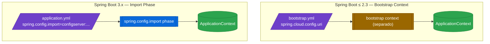

# 1.2 Config Client — bootstrap context y propiedades clave

← [1.1 Arquitectura Config Server](sc-config-arquitectura.md) | [Índice](README.md) | [1.3.1 Backend Git](sc-config-git-backend.md) →

---

## Introducción

El Config Client es cualquier microservicio Spring Boot que obtiene su configuración del Config Server en lugar de (o además de) sus ficheros locales. El problema que resuelve es la carga temprana: la configuración debe estar disponible antes de que el contexto de aplicación Spring se inicialice, porque beans como `DataSource` o clientes HTTP necesitan propiedades que pueden venir del servidor remoto. Spring Boot 3.x resolvió este problema con `spring.config.import`, sustituyendo el mecanismo anterior basado en bootstrap context.

> [CONCEPTO] En Spring Boot 3.x (Spring Cloud 2022+), la forma canónica de conectar un cliente al Config Server es `spring.config.import=configserver:http://localhost:8888`. Esta propiedad se puede declarar en `application.yml` y Spring la procesa en una fase de importación antes de que finalice la carga del contexto.

> [PREREQUISITO] El Config Server debe estar levantado y accesible antes de que el cliente arranque, a menos que se configure `spring.cloud.config.fail-fast=false` (no recomendado en producción).

## Evolución del mecanismo de conexión

Entender la evolución histórica es crítico para el examen porque preguntas de distintas versiones mezclan ambos mecanismos. Hasta Spring Boot 2.3, la conexión usaba un "bootstrap context" separado que cargaba `bootstrap.yml` antes que `application.yml`. Desde Spring Boot 2.4 y especialmente en 3.x, el mecanismo de importación (`spring.config.import`) hace innecesario el bootstrap context.


*Evolución del mecanismo de conexión: bootstrap context separado (legado) vs. import phase integrada (Spring Boot 3.x).*

[LEGACY] El mecanismo bootstrap (`bootstrap.yml` + `spring-cloud-starter-bootstrap`) sigue funcionando en Spring Boot 3.x si se añade el starter `spring-cloud-starter-bootstrap`, pero es un patrón legado. No usarlo en proyectos nuevos.

> [ADVERTENCIA] Usar `bootstrap.yml` en Spring Boot 3.x sin añadir `spring-cloud-starter-bootstrap` al classpath hace que el fichero sea ignorado completamente. El cliente arranca sin configuración remota y no emite ningún error obvio.

## Ejemplo central

El siguiente ejemplo muestra un microservicio Config Client completo con Spring Boot 3.x, incluyendo dependencias, configuración y un bean que usa una propiedad del Config Server.

**pom.xml (dependencias del cliente)**:

```xml
<dependencyManagement>
  <dependencies>
    <dependency>
      <groupId>org.springframework.cloud</groupId>
      <artifactId>spring-cloud-dependencies</artifactId>
      <version>2025.0.0</version>
      <type>pom</type>
      <scope>import</scope>
    </dependency>
  </dependencies>
</dependencyManagement>

<dependencies>
  <dependency>
    <groupId>org.springframework.cloud</groupId>
    <artifactId>spring-cloud-starter-config</artifactId>
  </dependency>
  <dependency>
    <groupId>org.springframework.boot</groupId>
    <artifactId>spring-boot-starter-web</artifactId>
  </dependency>
  <dependency>
    <groupId>org.springframework.boot</groupId>
    <artifactId>spring-boot-starter-actuator</artifactId>
  </dependency>
</dependencies>
```

**application.yml (Config Client)**:

```yaml
spring:
  application:
    name: order-service          # Determina qué ficheros pide al Config Server
  config:
    import: "configserver:http://localhost:8888"
  cloud:
    config:
      profile: ${spring.profiles.active:default}
      label: main                # Rama del repositorio Git
      fail-fast: true            # Falla el arranque si Config Server no responde
      retry:
        max-attempts: 6
        initial-interval: 1000
        max-interval: 2000
        multiplier: 1.1

management:
  endpoints:
    web:
      exposure:
        include: health,info,refresh
```

**OrderServiceApplication.java**:

```java
package com.example.orderservice;

import org.springframework.boot.SpringApplication;
import org.springframework.boot.autoconfigure.SpringBootApplication;

@SpringBootApplication
public class OrderServiceApplication {

    public static void main(String[] args) {
        SpringApplication.run(OrderServiceApplication.class, args);
    }
}
```

**AppConfig.java (bean que consume propiedad remota)**:

```java
package com.example.orderservice.config;

import org.springframework.beans.factory.annotation.Value;
import org.springframework.cloud.context.config.annotation.RefreshScope;
import org.springframework.stereotype.Component;

@Component
@RefreshScope
public class AppConfig {

    @Value("${order.max-items:100}")
    private int maxItems;

    @Value("${order.service.url:http://localhost:9090}")
    private String serviceUrl;

    public int getMaxItems() {
        return maxItems;
    }

    public String getServiceUrl() {
        return serviceUrl;
    }
}
```

Con esta configuración, al arrancar `order-service` con perfil `dev`, el cliente solicita `GET http://localhost:8888/order-service/dev/main` y recibe las propiedades fusionadas de todos los ficheros relevantes del repositorio.

## Tabla de propiedades clave del cliente

Todas las propiedades relevantes del cliente se configuran bajo los prefijos `spring.config.*` y `spring.cloud.config.*`.

| Propiedad | Tipo | Default | Descripción |
|-----------|------|---------|-------------|
| `spring.application.name` | String | `application` | Determina el `{application}` en la URL de resolución |
| `spring.config.import` | String | — | Fuente externa: `configserver:http://host:8888` |
| `spring.cloud.config.uri` | String | `http://localhost:8888` | URL del Config Server (alternativa a import) |
| `spring.cloud.config.label` | String | — | Rama/tag Git (si no se pone, usa el default-label del servidor) |
| `spring.cloud.config.fail-fast` | boolean | `false` | Si true, falla el arranque cuando el servidor no responde |
| `spring.cloud.config.retry.max-attempts` | int | `6` | Número máximo de reintentos de conexión al servidor |
| `spring.cloud.config.retry.initial-interval` | long | `1000` | Espera inicial entre reintentos (ms) |
| `spring.cloud.config.retry.max-interval` | long | `2000` | Espera máxima entre reintentos (ms) |
| `spring.cloud.config.retry.multiplier` | double | `1.1` | Factor de backoff exponencial entre reintentos |
| `spring.cloud.config.allow-override` | boolean | `true` | Permite que propiedades locales sobreescriban las del Config Server |

> [EXAMEN] `spring.application.name` es la propiedad más importante del cliente: determina qué ficheros pide al servidor. Si se llama `order-service`, el servidor buscará `order-service.yml`, `order-service-dev.yml`, etc. Un `spring.application.name` incorrecto significa que el cliente recibe solo la configuración global (`application.yml`).

## Buenas y malas prácticas

Hacer:
- Establecer `fail-fast: true` con retry configurado en producción; así un reinicio del cliente espera a que el Config Server esté disponible en lugar de arrancar con valores por defecto incorrectos.
- Usar valores por defecto con `${property:default}` en todas las anotaciones `@Value`; así la aplicación funciona aunque el Config Server no entregue esa propiedad.
- Siempre incluir `spring-boot-starter-actuator` y exponer el endpoint `refresh` en el cliente para poder actualizar configuración en caliente.
- Especificar `spring.config.import` con la URL completa en lugar de depender de variables de entorno no documentadas.

Evitar:
- Usar `bootstrap.yml` en Spring Boot 3.x sin añadir `spring-cloud-starter-bootstrap`; el fichero se ignora silenciosamente.
- Configurar `fail-fast: false` en producción; permite arranques con configuración incorrecta que generan errores difíciles de diagnosticar.
- Omitir `spring.application.name`; el cliente usará el nombre `application` por defecto y recibirá solo la configuración global, no la específica del servicio.
- Usar `spring.cloud.config.uri` y `spring.config.import` simultáneamente; generan precedencia ambigua.

## Verificación y práctica

La forma más directa de verificar que el cliente ha recibido configuración del servidor es el endpoint Actuator `env`:

```bash
# Ver todas las propiedades activas y sus fuentes
curl http://localhost:8080/actuator/env

# Buscar una propiedad específica
curl http://localhost:8080/actuator/env/order.max-items

# La respuesta mostrará la fuente: "configserver:..."
# {
#   "property": {
#     "source": "configserver:https://github.com/myorg/config-repo/order-service/order-service.yml",
#     "value": "50"
#   }
# }
```

**Preguntas estilo examen VMware Spring Professional:**

1. ¿Qué mecanismo reemplaza a `bootstrap.yml` en Spring Boot 3.x para conectar el cliente al Config Server?
2. ¿Qué propiedad del cliente determina el segmento `{application}` en la URL de resolución del Config Server?
3. Si `spring.cloud.config.fail-fast=true` y el Config Server no está disponible, ¿qué ocurre con el arranque del cliente?
4. ¿Por qué se recomienda usar valores por defecto (`${prop:default}`) en las anotaciones `@Value` del cliente?
5. ¿Qué hace `spring.cloud.config.allow-override=false`? ¿En qué escenario se usaría?

---

← [1.1 Arquitectura Config Server](sc-config-arquitectura.md) | [Índice](README.md) | [1.3.1 Backend Git](sc-config-git-backend.md) →

