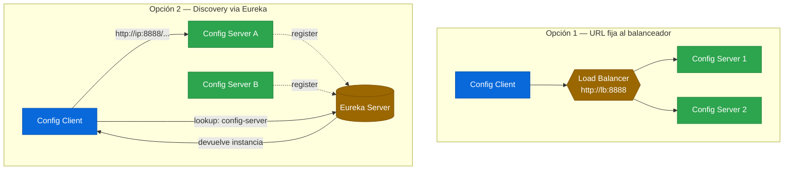

# 1.7 Operación y alta disponibilidad — fail-fast, retry y Eureka discovery

← [1.6 Seguridad Config Server](sc-config-security.md) | [Índice](README.md) | [1.8 Testing Config Server](sc-config-testing.md) →

---

## Introducción

Un Config Server en producción puede fallar, estar temporalmente inaccesible o estar escalado horizontalmente detrás de un balanceador. Los microservicios clientes necesitan estrategias para manejar estas situaciones: `fail-fast` controla si un cliente que no puede contactar al Config Server debe fallar inmediatamente al arrancar (en lugar de arrancar con valores por defecto potencialmente incorrectos); `retry` proporciona una estrategia de reintentos con backoff exponencial antes de declarar el fallo; y la integración con Eureka permite que los clientes descubran el Config Server dinámicamente por nombre de servicio, sin depender de una URL fija que cambia con el escalado horizontal.

> [CONCEPTO] `spring.cloud.config.fail-fast=true` convierte los errores de conexión al Config Server en un `BeanCreationException` durante el arranque de la aplicación. Esto garantiza que un servicio no arranque con configuración incorrecta (por defecto) en lugar de la configuración remota esperada.

> [PREREQUISITO] La integración con Eureka requiere tener el módulo Eureka configurado (módulo 2). Si no se ha completado el módulo Eureka, enfocarse en fail-fast y retry que son independientes.

## Arquitectura de alta disponibilidad

El Config Server puede ejecutarse en múltiples instancias detrás de un balanceador de carga. En este escenario, los clientes necesitan apuntar al balanceador (URL fija) o descubrir las instancias dinámicamente via Eureka.


*Dos estrategias de HA: URL fija al balanceador (sin dependencia de Eureka) vs. discovery dinámico (requiere Eureka antes que Config Server).*

## Ejemplo central — fail-fast con retry y discovery via Eureka

El siguiente ejemplo muestra la configuración completa de un cliente con fail-fast, retry exponencial, y discovery via Eureka.

**pom.xml — dependencias para discovery**:

```xml
<dependencies>
  <dependency>
    <groupId>org.springframework.cloud</groupId>
    <artifactId>spring-cloud-starter-config</artifactId>
  </dependency>
  <dependency>
    <groupId>org.springframework.cloud</groupId>
    <artifactId>spring-cloud-starter-netflix-eureka-client</artifactId>
  </dependency>
  <dependency>
    <groupId>org.springframework.boot</groupId>
    <artifactId>spring-boot-starter-actuator</artifactId>
  </dependency>
  <!-- Necesario para retry -->
  <dependency>
    <groupId>org.springframework.retry</groupId>
    <artifactId>spring-retry</artifactId>
  </dependency>
  <dependency>
    <groupId>org.springframework.boot</groupId>
    <artifactId>spring-boot-starter-aop</artifactId>
  </dependency>
</dependencies>
```

**application.yml — Config Client con fail-fast, retry y Eureka discovery**:

```yaml
spring:
  application:
    name: order-service
  cloud:
    config:
      # Opción A: URL fija con fail-fast y retry
      uri: http://config-server-lb:8888
      fail-fast: true
      retry:
        initial-interval: 1000     # Primer reintento a los 1s
        max-interval: 5000         # Máximo 5s entre reintentos
        multiplier: 1.5            # Backoff: 1s, 1.5s, 2.25s, 3.37s...
        max-attempts: 5            # Máximo 5 intentos antes de fallar

      # Opción B: Discovery via Eureka (comentar uri y descomentar esto)
      # discovery:
      #   enabled: true
      #   service-id: config-server   # Nombre con el que el Config Server se registra en Eureka

eureka:
  client:
    service-url:
      defaultZone: http://eureka-server:8761/eureka/
    registry-fetch-interval-seconds: 5
  instance:
    prefer-ip-address: true
```

**ConfigServerApplication.java (del servidor — registrado en Eureka)**:

```java
package com.example.configserver;

import org.springframework.boot.SpringApplication;
import org.springframework.boot.autoconfigure.SpringBootApplication;
import org.springframework.cloud.config.server.EnableConfigServer;
import org.springframework.cloud.netflix.eureka.EnableEurekaClient;

@SpringBootApplication
@EnableConfigServer
@EnableEurekaClient
public class ConfigServerApplication {

    public static void main(String[] args) {
        SpringApplication.run(ConfigServerApplication.class, args);
    }
}
```

**application.yml del Config Server — registrado en Eureka**:

```yaml
server:
  port: 8888

spring:
  application:
    name: config-server              # Este es el service-id en Eureka
  cloud:
    config:
      server:
        git:
          uri: https://github.com/myorg/config-repo
          default-label: main

eureka:
  client:
    service-url:
      defaultZone: http://eureka-server:8761/eureka/
  instance:
    prefer-ip-address: true
    lease-renewal-interval-in-seconds: 5
    lease-expiration-duration-in-seconds: 10
```

> [ADVERTENCIA] Cuando se usa discovery via Eureka (`spring.cloud.config.discovery.enabled=true`), el cliente necesita que Eureka esté disponible ANTES de intentar conectar al Config Server. Esto crea un orden de arranque: Eureka Server → Config Server → Clientes.

> [EXAMEN] `fail-fast: true` + `retry` es el patrón recomendado en producción. Sin retry, con `fail-fast: true`, un Config Server que tarda 2s en arrancar causa que todos los clientes fallen en su primer intento. Con retry, los clientes esperan con backoff hasta que el servidor esté disponible.

## Tabla de propiedades de operación

| Propiedad | Tipo | Default | Descripción |
|-----------|------|---------|-------------|
| `spring.cloud.config.fail-fast` | boolean | `false` | Si true, falla el arranque del cliente cuando el Config Server no responde |
| `spring.cloud.config.retry.max-attempts` | int | `6` | Número máximo de intentos de conexión |
| `spring.cloud.config.retry.initial-interval` | long | `1000` | Espera inicial en ms antes del primer reintento |
| `spring.cloud.config.retry.max-interval` | long | `2000` | Espera máxima en ms entre reintentos |
| `spring.cloud.config.retry.multiplier` | double | `1.1` | Factor multiplicador del backoff exponencial |
| `spring.cloud.config.discovery.enabled` | boolean | `false` | Activa el discovery del Config Server via Eureka |
| `spring.cloud.config.discovery.service-id` | String | `configserver` | Nombre del servicio Config Server en Eureka |

## Buenas y malas prácticas

Hacer:
- Usar `fail-fast: true` con retry configurado en producción; es el patrón de resiliencia estándar.
- Cuando se usa discovery, asegurarse de que el `spring.application.name` del Config Server coincide exactamente con el `service-id` configurado en los clientes.
- Configurar health checks en el Config Server y en el balanceador para que las instancias no sanas sean excluidas antes de recibir tráfico.
- Registrar el Config Server en Eureka con lease-renewal bajo (5s) para que las instancias caídas se detecten rápidamente.

Evitar:
- Usar `fail-fast: false` en producción; permite arranques silenciosos con configuración por defecto incorrecta que generan errores difíciles de diagnosticar en runtime.
- Omitir `spring-retry` y `spring-boot-starter-aop` del classpath cuando se usa retry; sin estas dependencias, la configuración de retry se ignora silenciosamente.
- Depender de una URL fija del Config Server sin fail-fast ni retry; si el servidor tarda en arrancar, los clientes fallan sin posibilidad de recuperación.
- Escalar el Config Server con estado local (por ejemplo, usando un git clone local sin `force-pull`); las distintas instancias pueden servir configuraciones diferentes.

## Verificación y práctica

Para simular el comportamiento de fail-fast y verificar la configuración de retry:

```bash
# Verificar que el Config Server está registrado en Eureka
curl http://eureka-server:8761/eureka/apps/config-server

# Verificar el estado del Config Server via Actuator
curl http://config-server:8888/actuator/health

# Simular fallo del Config Server (detener el servidor)
# Con fail-fast=true y retry configurado, el cliente intentará N veces
# antes de lanzar BeanCreationException y abortar el arranque.

# Ver los logs del cliente durante el fallo (búsqueda de patrón de retry):
# INFO - Fetching config from server at: http://config-server-lb:8888
# WARN - Could not locate PropertySource: ... retrying in 1000ms
# WARN - Could not locate PropertySource: ... retrying in 1500ms
# ERROR - Could not connect to config server after 5 retries
```

**Preguntas estilo examen VMware Spring Professional:**

1. ¿Qué ocurre exactamente cuando `spring.cloud.config.fail-fast=true` y el Config Server no está disponible durante el arranque del cliente?
2. ¿Qué dependencias adicionales son necesarias para que funcione el retry en el Config Client?
3. ¿Cómo se configura el Config Client para descubrir el Config Server via Eureka en lugar de usar una URL fija?
4. ¿Cuál es el valor por defecto del `service-id` del Config Server en Eureka cuando se usa discovery?
5. El Config Server está en alta disponibilidad con 3 instancias detrás de un balanceador. Un cliente tiene `spring.cloud.config.uri=http://lb:8888`. ¿Qué ocurre si una de las instancias falla?

---

← [1.6 Seguridad Config Server](sc-config-security.md) | [Índice](README.md) | [1.8 Testing Config Server](sc-config-testing.md) →
