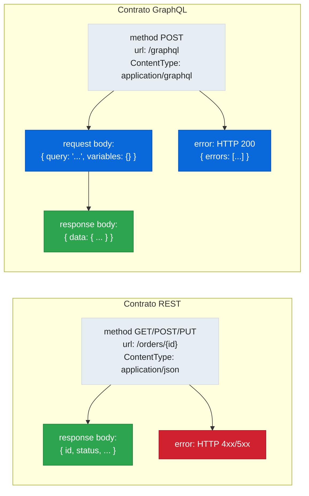

# 10.10 Spring Cloud Contract — Contratos GraphQL

← [10.9 Matchers Personalizados](sc-contract-matchers.md) | [Índice](README.md) | [10.11 Workflow CI/CD](sc-contract-workflow.md) →

---

## Introducción

Spring Cloud Contract añadió soporte nativo para GraphQL como una extensión de los contratos HTTP estándar. La diferencia principal respecto a un contrato REST es el uso de `ContentType.GRAPHQL` en la cabecera del request y la estructura específica del body: el request debe incluir el campo `query` (o `mutation`) y opcionalmente `variables`, mientras que el response envuelve los datos en el campo `data`. Conocer esta estructura y el contentType correcto es lo que diferencia un contrato GraphQL de un contrato HTTP genérico.

> [PREREQUISITO] Este nodo requiere conocimiento de los contratos HTTP de [10.3](sc-contract-http.md) y de los matchers de [10.9](sc-contract-matchers.md).

## Estructura de un contrato GraphQL

Un contrato GraphQL en Spring Cloud Contract usa el método `POST` sobre el endpoint de GraphQL (típicamente `/graphql`) y establece el `ContentType.GRAPHQL`. El body del request contiene el campo `query` con la operación GraphQL como cadena de texto.

```groovy
// src/test/resources/contracts/graphql/shouldGetProductByIdQuery.groovy
import org.springframework.cloud.contract.spec.Contract

Contract.make {
    description "should return product data for a valid product id via GraphQL query"

    request {
        method POST()
        url "/graphql"
        headers {
            // ContentType.GRAPHQL es la constante SCC para contratos GraphQL
            // Es obligatoria: sin este contentType, SCC no reconoce el contrato como GraphQL
            contentType(ContentType.GRAPHQL)
        }
        // El body del request GraphQL SIEMPRE tiene el campo 'query'
        // y opcionalmente 'variables' para parametrizar la operación
        body([
            query    : "{ product(id: 1) { id name price category } }",
            variables: [:]  // sin variables para esta query
        ])
    }

    response {
        status OK()
        headers {
            contentType(applicationJson())
        }
        // El response GraphQL envuelve los datos en el campo 'data'
        // Este es el wrapper estándar de la especificación GraphQL
        body([
            data: [
                product: [
                    id      : 1,
                    name    : "Laptop Pro",
                    price   : 999.99,
                    category: "ELECTRONICS"
                ]
            ]
        ])
        bodyMatchers {
            jsonPath('$.data.product.id', byRegex("[0-9]+"))
            jsonPath('$.data.product.price', byRegex("[0-9]+(\\.[0-9]{1,2})?"))
        }
    }
}
```

> [CONCEPTO] `ContentType.GRAPHQL` es una constante propia de Spring Cloud Contract que marca el contrato como GraphQL. El plugin generará el test del productor y el stub WireMock configurados para el endpoint `/graphql` con el content-type correcto. Sin este content type, el stub no responderá a las peticiones GraphQL del consumidor.

## Contrato GraphQL con mutation

Las mutations siguen la misma estructura que las queries: el campo `query` contiene la operación (aunque se llame mutation, GraphQL la envía siempre en el campo `query`), y `variables` puede parametrizar los datos.

```groovy
// src/test/resources/contracts/graphql/shouldCreateProductMutation.groovy
import org.springframework.cloud.contract.spec.Contract

Contract.make {
    description "should create a new product via GraphQL mutation and return the created product"

    request {
        method POST()
        url "/graphql"
        headers {
            contentType(ContentType.GRAPHQL)
        }
        body([
            // En GraphQL, tanto queries como mutations usan el campo 'query'
            // El keyword 'mutation' va dentro del string de la operación
            query    : """
                mutation CreateProduct(\$name: String!, \$price: Float!, \$category: String!) {
                    createProduct(name: \$name, price: \$price, category: \$category) {
                        id
                        name
                        price
                        status
                    }
                }
            """,
            variables: [
                name    : "Wireless Mouse",
                price   : 29.99,
                category: "PERIPHERALS"
            ]
        ])
    }

    response {
        status OK()
        headers {
            contentType(applicationJson())
        }
        body([
            data: [
                createProduct: [
                    id    : 1,
                    name  : "Wireless Mouse",
                    price : 29.99,
                    status: "ACTIVE"
                ]
            ]
        ])
        bodyMatchers {
            jsonPath('$.data.createProduct.id', byRegex("[0-9]+"))
            jsonPath('$.data.createProduct.status', byRegex("ACTIVE|INACTIVE"))
        }
    }
}
```

> [ADVERTENCIA] En GraphQL, el campo del body se llama siempre `query` independientemente de si la operación es una query o una mutation. Es un error frecuente usar `mutation` como clave del campo body. La palabra clave `mutation` aparece **dentro** del valor string de `query`.

## Equivalente YAML

El mismo contrato de query GraphQL en formato YAML. La estructura del body es la misma, pero el content type se expresa como cabecera HTTP.

```yaml
# src/test/resources/contracts/graphql/shouldGetProductByIdQuery.yml
description: "should return product data for a valid product id via GraphQL query"
request:
  method: POST
  url: /graphql
  headers:
    Content-Type: application/graphql
  body:
    query: "{ product(id: 1) { id name price category } }"
    variables: {}
response:
  status: 200
  headers:
    Content-Type: application/json
  body:
    data:
      product:
        id: 1
        name: Laptop Pro
        price: 999.99
        category: ELECTRONICS
  matchers:
    body:
      - path: $.data.product.id
        type: by_regex
        value: "[0-9]+"
      - path: $.data.product.price
        type: by_regex
        value: "[0-9]+(\\.[0-9]{1,2})?"
```

> [CONCEPTO] En YAML, `ContentType.GRAPHQL` se expresa como el valor de cabecera `Content-Type: application/graphql`. Spring Cloud Contract reconoce este valor y genera el test y el stub adecuados para GraphQL.

## Manejo de errores GraphQL en contratos

GraphQL no usa códigos de estado HTTP distintos de 200 para errores de dominio. Los errores se incluyen en el body junto al campo `errors`. Un contrato puede modelar este caso.

```groovy
// Contrato para un error de dominio GraphQL (producto no encontrado)
import org.springframework.cloud.contract.spec.Contract

Contract.make {
    description "should return GraphQL error when product is not found"

    request {
        method POST()
        url "/graphql"
        headers {
            contentType(ContentType.GRAPHQL)
        }
        body([
            query: "{ product(id: 999) { id name } }"
        ])
    }

    response {
        // GraphQL siempre devuelve 200 incluso en errores de dominio
        status OK()
        headers {
            contentType(applicationJson())
        }
        body([
            data  : [product: null],
            errors: [
                [message: "Product with id 999 not found", locations: [], path: ["product"]]
            ]
        ])
        bodyMatchers {
            jsonPath('$.errors[0].message', byRegex(".+"))
        }
    }
}
```

## Clase base para contratos GraphQL

Los contratos GraphQL en el productor necesitan una clase base que configure el contexto de Spring con soporte GraphQL. Para aplicaciones Spring for GraphQL, la clase base usa `WebTestClient` o `MockMvcWebTestClient`.

```java
// src/test/java/com/example/graphql/BaseGraphQLTest.java
import org.junit.jupiter.api.BeforeEach;
import org.springframework.beans.factory.annotation.Autowired;
import org.springframework.boot.test.autoconfigure.graphql.tester.AutoConfigureGraphQlTester;
import org.springframework.boot.test.context.SpringBootTest;
import org.springframework.test.web.reactive.server.WebTestClient;
import io.restassured.module.webtestclient.RestAssuredWebTestClient;

@SpringBootTest(webEnvironment = SpringBootTest.WebEnvironment.RANDOM_PORT)
public abstract class BaseGraphQLTest {

    @Autowired
    WebTestClient webTestClient;

    @BeforeEach
    public void setup() {
        // GraphQL en Spring usa WebTestClient como cliente de test
        RestAssuredWebTestClient.webTestClient(webTestClient);
    }
}
```

## Tabla: REST vs GraphQL en contratos SCC

| Aspecto | Contrato REST | Contrato GraphQL |
|---|---|---|
| Método HTTP | GET, POST, PUT, DELETE | Siempre POST |
| URL | Endpoint específico | `/graphql` (único endpoint) |
| ContentType request | `application/json` | `application/graphql` (`ContentType.GRAPHQL`) |
| Estructura del body request | Objeto de dominio | `{ query: "...", variables: {} }` |
| Estructura del body response | Objeto de dominio | `{ data: { ... } }` o `{ errors: [...] }` |
| Errores de dominio | HTTP 4xx/5xx | HTTP 200 con campo `errors` |



*Diferencias estructurales entre contratos REST y GraphQL: GraphQL siempre usa POST a /graphql y envuelve el body en `data` o `errors`.*

## Buenas y malas prácticas

**Buenas prácticas**:
- Usar `ContentType.GRAPHQL` siempre en contratos GraphQL — es la constante que activa el procesamiento específico de GraphQL en SCC.
- Incluir el wrapper `data` en el body del response — es la estructura estándar de GraphQL y el stub debe devolverla correctamente.
- Añadir `bodyMatchers` para los campos `id`, `status` y otros campos dinámicos dentro del wrapper `data`.
- Modelar contratos separados para el caso de éxito (con `data`) y el caso de error (con `errors`).

**Malas prácticas**:
- Usar `contentType(applicationJson())` en el request de un contrato GraphQL — el stub no reconocerá las peticiones del consumidor.
- Omitir el campo `data` en el body del response — el consumidor recibirá un stub sin el wrapper estándar de GraphQL.
- Poner la palabra clave `mutation` como clave del body en lugar de `query` — es un error de estructura frecuente.

## Verificación y práctica

> [EXAMEN] 1. ¿Qué `ContentType` se usa en un contrato Spring Cloud Contract para una operación GraphQL y cómo se expresa en YAML?

> [EXAMEN] 2. ¿Cómo se estructura el body del request en un contrato GraphQL? ¿Cuáles son los campos obligatorios?

> [EXAMEN] 3. ¿Por qué el response de un contrato GraphQL usa el campo `data` para envolver el resultado?

> [EXAMEN] 4. En un contrato GraphQL con mutation, ¿qué campo del body contiene la operación GraphQL y cuál es el error más frecuente al definirlo?

> [EXAMEN] 5. ¿Qué código de estado HTTP devuelve un endpoint GraphQL cuando ocurre un error de dominio (ej. recurso no encontrado)?

---

← [10.9 Matchers Personalizados](sc-contract-matchers.md) | [Índice](README.md) | [10.11 Workflow CI/CD](sc-contract-workflow.md) →
