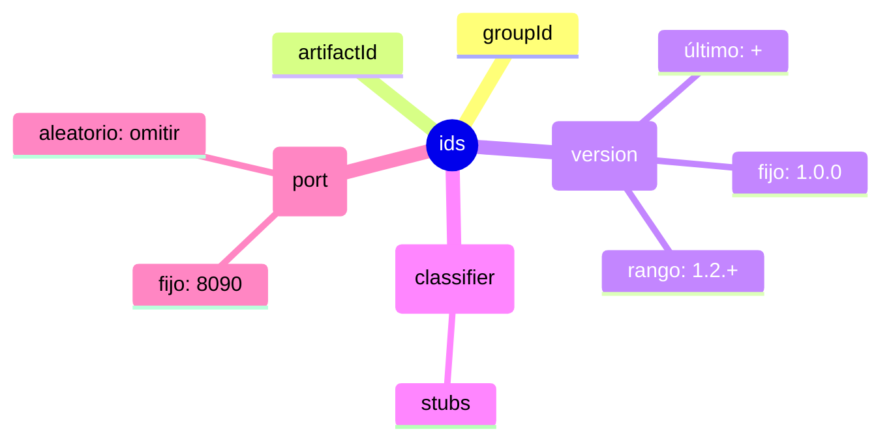
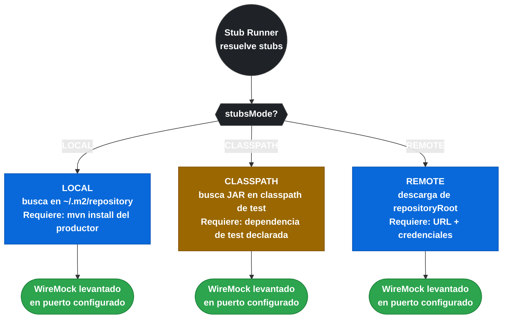

# 10.7 Spring Cloud Contract — Stub Runner

← [10.6 Clases Base Productor](sc-contract-base-class.md) | [Índice](README.md) | [10.8 Repositorio de Stubs](sc-contract-stubs-repo.md) →

---

## Introducción

Stub Runner es el componente del lado **consumidor** en Spring Cloud Contract. Su función es localizar el JAR de stubs del productor, extraer los stubs WireMock contenidos en él y levantar un servidor WireMock local que responde exactamente según los contratos acordados. Con `@AutoConfigureStubRunner`, el consumidor puede ejecutar sus tests de integración contra un servidor HTTP local sin necesidad de que el productor esté desplegado. Conocer la sintaxis del campo `ids`, los modos de `stubsMode` y las propiedades de configuración es contenido directo de examen.

> [PREREQUISITO] Este nodo requiere haber comprendido el flujo CDC de [10.1 Fundamentos CDC](sc-contract-fundamentos.md) y la generación de stubs del productor de [10.5 Plugin Maven y Gradle](sc-contract-plugin-config.md).

## @AutoConfigureStubRunner

`@AutoConfigureStubRunner` es la anotación de Spring Cloud Contract que activa Stub Runner en los tests del consumidor. Se añade a la clase de test junto con `@SpringBootTest`.

```java
// src/test/java/com/example/consumer/OrderConsumerTest.java
package com.example.consumer;

import org.junit.jupiter.api.Test;
import org.springframework.beans.factory.annotation.Autowired;
import org.springframework.boot.test.context.SpringBootTest;
import org.springframework.cloud.contract.stubrunner.StubRunnerProperties;
import org.springframework.cloud.contract.stubrunner.spring.AutoConfigureStubRunner;
import static org.assertj.core.api.Assertions.assertThat;

@SpringBootTest(webEnvironment = SpringBootTest.WebEnvironment.NONE)
@AutoConfigureStubRunner(
    // ids: coordenadas del stub JAR + puerto donde se levanta el servidor WireMock
    // Formato: groupId:artifactId:version:classifier:port
    // Si se omite version, se usa '+' (último disponible)
    // Si se omite classifier, se usa 'stubs' por defecto
    ids = "com.example:order-service:1.0.0:stubs:8090",

    // stubsMode: cómo se resuelven los stubs
    // LOCAL: busca en el repositorio Maven local (~/.m2)
    // CLASSPATH: busca el JAR en el classpath de test
    // REMOTE: descarga desde repositoryRoot (Nexus/Artifactory/Git)
    stubsMode = StubRunnerProperties.StubsMode.LOCAL
)
public class OrderConsumerTest {

    @Autowired
    OrderClient orderClient;  // cliente HTTP configurado para llamar a localhost:8090

    @Test
    void shouldGetConfirmedOrder() {
        Order order = orderClient.getOrder(1L);
        assertThat(order.getId()).isEqualTo(1L);
        assertThat(order.getStatus()).isEqualTo("CONFIRMED");
    }
}
```

> [CONCEPTO] El campo `ids` sigue el formato `groupId:artifactId:version:classifier:port`. El `classifier` es `stubs` por convención (es el clasificador del JAR generado por el plugin). El `port` es el puerto donde Stub Runner levanta el servidor WireMock. Si se especifican múltiples ids, Stub Runner levanta un servidor WireMock por cada uno.

## Sintaxis completa del campo ids

El campo `ids` acepta múltiples formatos según lo que se necesite especificar. Las partes opcionales pueden omitirse.



*Anatomía del campo ids: solo groupId y artifactId son obligatorios; classifier por defecto es `stubs` y port puede ser aleatorio.*

```
Formato completo:
groupId:artifactId:version:classifier:port
com.example:order-service:1.0.0:stubs:8090

Formatos válidos:
─────────────────────────────────────────────────────────────
com.example:order-service                        # usa LATEST y puerto random
com.example:order-service:+                      # '+' = versión más reciente disponible
com.example:order-service:1.0.0                  # versión fija, puerto random
com.example:order-service:1.0.0:stubs            # con classifier, puerto random
com.example:order-service:1.0.0:stubs:8090       # versión fija, puerto fijo
com.example:order-service:+:stubs:8090           # última versión, puerto fijo
─────────────────────────────────────────────────────────────

Múltiples stubs (array de Strings):
ids = {
    "com.example:order-service:+:stubs:8090",
    "com.example:payment-service:+:stubs:8091"
}
```

> [ADVERTENCIA] Cuando se usa `+` como versión, Stub Runner resuelve la versión más reciente disponible según el `stubsMode`. En modo `LOCAL`, busca en `~/.m2/repository`. En modo `CLASSPATH`, usa el JAR en el classpath. Usar `+` en modo `REMOTE` puede ser lento si hay muchas versiones publicadas.

## Los tres modos de StubsMode

`StubsMode` controla dónde busca Stub Runner los stubs. Cada modo tiene un caso de uso concreto.



*Los tres modos de StubsMode determinan de dónde Stub Runner carga los stubs WireMock antes de levantar el servidor local.*

```java
// StubsMode.LOCAL: busca en el repositorio Maven local (~/.m2)
// Requiere que el productor haya ejecutado mvn install previamente
@AutoConfigureStubRunner(
    ids = "com.example:order-service:1.0.0:stubs:8090",
    stubsMode = StubRunnerProperties.StubsMode.LOCAL
)

// StubsMode.CLASSPATH: busca el JAR de stubs en el classpath de test
// El JAR debe estar en las dependencias de test del consumidor
// Requiere spring.cloud.contract.stubrunner.generate-stubs=true para generación automática
@AutoConfigureStubRunner(
    ids = "com.example:order-service:+:stubs:8090",
    stubsMode = StubRunnerProperties.StubsMode.CLASSPATH
)

// StubsMode.REMOTE: descarga de un repositorio remoto (Nexus/Artifactory/Git)
// Requiere que repositoryRoot apunte al repositorio
@AutoConfigureStubRunner(
    ids = "com.example:order-service:1.0.0:stubs:8090",
    stubsMode = StubRunnerProperties.StubsMode.REMOTE,
    repositoryRoot = "https://nexus.example.com/repository/maven-releases"
)
```

| Modo | Fuente de stubs | Requiere | Cuándo usar |
|---|---|---|---|
| `LOCAL` | Repositorio Maven local `~/.m2` | `mvn install` del productor | Desarrollo local, test entre servicios del mismo equipo |
| `CLASSPATH` | JAR en el classpath de test | Dependencia de test declarada | CI con stubs embebidos en el classpath |
| `REMOTE` | Nexus/Artifactory/Git | `repositoryRoot` configurado | Pipeline CI/CD con repositorio compartido |

## Configuración via application.yml

Todos los atributos de `@AutoConfigureStubRunner` pueden configurarse como propiedades en `application.yml` o `application.properties` del módulo de test. Esto permite centralizar la configuración sin repetirla en cada clase de test.

```yaml
# src/test/resources/application.yml del CONSUMIDOR
spring:
  cloud:
    contract:
      stubrunner:
        # ids: uno o más stubs con sus coordenadas
        ids:
          - "com.example:order-service:+:stubs:8090"
          - "com.example:payment-service:+:stubs:8091"
        # stubsMode: LOCAL, CLASSPATH o REMOTE
        stubs-mode: LOCAL
        # repositoryRoot: URL del repositorio remoto (solo para REMOTE)
        # repository-root: https://nexus.example.com/repository/maven-releases
        # generate-stubs: habilita la generación de stubs en modo classpath
        # Cuando está activado, SCC genera los stubs WireMock automáticamente
        # en el classpath en lugar de requerir un JAR precompilado
        generate-stubs: false
```

> [CONCEPTO] La propiedad `spring.cloud.contract.stubrunner.generate-stubs=true` habilita la generación automática de stubs WireMock en modo CLASSPATH. Con esta propiedad activa, Stub Runner genera los stubs directamente desde los contratos en el classpath sin necesitar un JAR de stubs precompilado. Es útil en entornos donde el productor y consumidor se prueban en el mismo build.

## spring-cloud-contract-wiremock como módulo estándar

En Spring Cloud Contract 4.x (2025.x), `spring-cloud-contract-wiremock` es el módulo estándar que el Stub Runner usa como motor de ejecución de stubs. Este módulo incluye WireMock y provee la integración necesaria para que Stub Runner levante los servidores HTTP.

```xml
<!-- pom.xml del CONSUMIDOR -->
<dependency>
    <groupId>org.springframework.cloud</groupId>
    <artifactId>spring-cloud-starter-contract-stub-runner</artifactId>
    <scope>test</scope>
</dependency>
<!--
  spring-cloud-contract-wiremock se incluye transitivamente mediante
  spring-cloud-starter-contract-stub-runner en SC 4.x.
  Si se necesita @AutoConfigureWireMock directamente, declarar explícitamente:
-->
<dependency>
    <groupId>org.springframework.cloud</groupId>
    <artifactId>spring-cloud-contract-wiremock</artifactId>
    <scope>test</scope>
</dependency>
```

## Ejemplo completo con repositorio remoto

El siguiente ejemplo muestra la configuración del consumidor cuando los stubs se publican en un repositorio Nexus compartido en el pipeline CI.

```java
// Test del consumidor que descarga stubs de Nexus
@SpringBootTest(webEnvironment = SpringBootTest.WebEnvironment.NONE)
@AutoConfigureStubRunner(
    ids = "com.example:order-service:1.2.3:stubs:8090",
    stubsMode = StubRunnerProperties.StubsMode.REMOTE,
    repositoryRoot = "https://nexus.example.com/repository/maven-releases"
)
public class OrderConsumerIntegrationTest {

    // El servidor WireMock está disponible en localhost:8090
    // con los stubs del order-service versión 1.2.3

    @Value("${order.service.url:http://localhost:8090}")
    String orderServiceUrl;

    @Test
    void shouldGetOrderFromStub() {
        // El cliente HTTP real llama al servidor WireMock local en 8090
        RestTemplate restTemplate = new RestTemplate();
        ResponseEntity<Order> response = restTemplate.getForEntity(
            orderServiceUrl + "/orders/1", Order.class);
        assertThat(response.getStatusCode().value()).isEqualTo(200);
    }
}
```

## Buenas y malas prácticas

**Buenas prácticas**:
- Fijar la versión del stub (ej: `1.2.3`) en pipelines CI/CD para reproducibilidad; usar `+` solo en desarrollo local.
- Configurar los stubs via `application.yml` de test en lugar de repetir atributos en cada clase de test.
- Usar `stubsMode = LOCAL` en desarrollo local para ciclos rápidos sin depender de red.
- Verificar que el puerto del stub (`8090`) coincide con la URL configurada en el cliente HTTP del consumidor.

**Malas prácticas**:
- Usar `stubsMode = REMOTE` sin caché en CI — genera dependencia de red y tests lentos o inestables.
- Omitir el `port` en `ids` y confiar en puertos aleatorios sin inyectarlos en el cliente — el cliente llamará al puerto incorrecto.
- Confundir `stubsMode = LOCAL` (repositorio Maven local) con `CLASSPATH` (JAR en classpath de test).
- Usar la misma configuración de ids en todos los tests sin verificar que el stub del productor es compatible con la versión consumida.

## Verificación y práctica

> [EXAMEN] 1. ¿Cuál es el formato del campo `ids` en `@AutoConfigureStubRunner` y qué significa cada parte?

> [EXAMEN] 2. ¿Cuál es la diferencia entre `StubsMode.LOCAL` y `StubsMode.CLASSPATH`?

> [EXAMEN] 3. ¿Qué propiedad de `application.yml` habilita la generación automática de stubs WireMock en modo classpath?

> [EXAMEN] 4. ¿Qué módulo de Spring Cloud Contract 4.x provee WireMock como motor de ejecución de stubs?

> [EXAMEN] 5. ¿Cómo se configura `@AutoConfigureStubRunner` para descargar stubs desde un repositorio Nexus remoto?

---

← [10.6 Clases Base Productor](sc-contract-base-class.md) | [Índice](README.md) | [10.8 Repositorio de Stubs](sc-contract-stubs-repo.md) →
