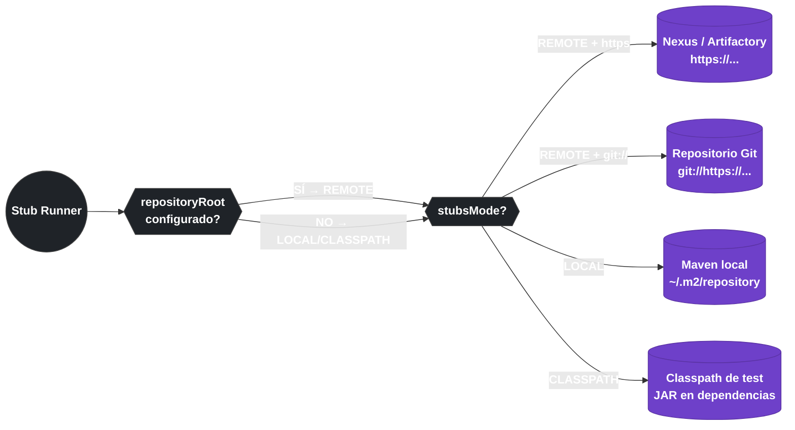

# 10.8 Spring Cloud Contract — Repositorio de Stubs

← [10.7 Stub Runner](sc-contract-stub-runner.md) | [Índice](README.md) | [10.9 Matchers Personalizados](sc-contract-matchers.md) →

---

## Introducción

El repositorio de stubs es el mecanismo de distribución que permite al consumidor acceder a los stubs WireMock generados por el productor. Spring Cloud Contract empaqueta los stubs en un JAR Maven con clasificador `stubs`, que puede publicarse en Nexus/Artifactory o almacenarse en un repositorio Git. Stub Runner usa la propiedad `repositoryRoot` para localizar y descargar ese JAR. Conocer la estructura del JAR de stubs, cómo se publica y cómo se configura `repositoryRoot` es contenido relevante para el examen.

> [PREREQUISITO] Este nodo requiere conocimiento del plugin de [10.5](sc-contract-plugin-config.md) y del Stub Runner de [10.7](sc-contract-stub-runner.md).

## El JAR clasificador stubs

El plugin de Spring Cloud Contract genera, además de los tests del productor, un JAR Maven con el clasificador `stubs` que contiene los stubs WireMock en formato JSON. Este JAR es el artefacto que el consumidor descarga y ejecuta mediante Stub Runner.

```mermaid
mindmap
  root[["order-service-1.2.3-stubs.jar"]]
    [META-INF]
      MANIFEST.MF
    [contracts]
      order
        shouldReturnOrder.groovy
        shouldCreateOrder.groovy
    [mappings]
      order
        shouldReturnOrder.json
        shouldCreateOrder.json
```

*Estructura interna del JAR clasificador stubs: /contracts contiene los contratos originales y /mappings los stubs WireMock en formato JSON listos para ser cargados por Stub Runner.*

Los ficheros en `/mappings/` son los stubs WireMock que Stub Runner carga cuando levanta el servidor WireMock local. Cada fichero JSON corresponde a un contrato y describe el mapping request → response.

```json
// Ejemplo de stub WireMock generado: mappings/order/shouldReturnOrder.json
{
  "id" : "f6c1ca6b-6a0c-4cc7-a86e-6b8e4d72c8c1",
  "request" : {
    "url" : "/orders/1",
    "method" : "GET",
    "headers" : {
      "Accept" : {
        "equalTo" : "application/json"
      }
    }
  },
  "response" : {
    "status" : 200,
    "headers" : {
      "Content-Type" : "application/json"
    },
    "body" : "{\"id\":1,\"status\":\"CONFIRMED\"}",
    "transformers" : [ "response-template" ]
  },
  "uuid" : "f6c1ca6b-6a0c-4cc7-a86e-6b8e4d72c8c1"
}
```

> [CONCEPTO] El JAR de stubs se identifica por las coordenadas Maven `groupId:artifactId:version:stubs`. El clasificador `stubs` distingue este JAR del JAR principal del productor. Stub Runner usa estas coordenadas en el campo `ids` de `@AutoConfigureStubRunner` para localizar y descargar el JAR correcto.

## Publicación en Nexus/Artifactory

El productor publica el JAR de stubs junto con el JAR principal usando `mvn deploy` o `gradle publish`. El repositorio destino se configura en el `pom.xml` o `build.gradle` del productor mediante la sección `<distributionManagement>`.

```xml
<!-- pom.xml del PRODUCTOR — distribución a Nexus -->
<distributionManagement>
    <repository>
        <id>nexus-releases</id>
        <url>https://nexus.example.com/repository/maven-releases</url>
    </repository>
    <snapshotRepository>
        <id>nexus-snapshots</id>
        <url>https://nexus.example.com/repository/maven-snapshots</url>
    </snapshotRepository>
</distributionManagement>
```

```bash
# Comando para publicar el productor y sus stubs en Nexus
# El plugin genera automáticamente el JAR de stubs durante el ciclo install/deploy
mvn deploy -DskipTests=false

# Resultado en Nexus:
# com/example/order-service/1.2.3/order-service-1.2.3.jar          ← JAR principal
# com/example/order-service/1.2.3/order-service-1.2.3-stubs.jar    ← JAR de stubs
# com/example/order-service/1.2.3/order-service-1.2.3.pom          ← POM
```

```java
// Consumidor que usa stubs del repositorio Nexus remoto
@AutoConfigureStubRunner(
    ids = "com.example:order-service:1.2.3:stubs:8090",
    stubsMode = StubRunnerProperties.StubsMode.REMOTE,
    repositoryRoot = "https://nexus.example.com/repository/maven-releases"
)
public class OrderConsumerTest { }
```

## Repositorio Git como alternativa a Nexus

Spring Cloud Contract soporta almacenar los stubs en un repositorio Git en lugar de Nexus/Artifactory. Stub Runner clona el repositorio Git y carga los stubs desde él. Es útil en proyectos donde no se tiene un servidor Nexus disponible.

```java
// Stub Runner apuntando a un repositorio Git
@AutoConfigureStubRunner(
    ids = "com.example:order-service:+:stubs:8090",
    stubsMode = StubRunnerProperties.StubsMode.REMOTE,
    // repositoryRoot acepta URL Git con prefijos git:// o https://
    repositoryRoot = "git://https://github.com/example/contract-stubs.git"
)
public class OrderConsumerGitTest { }
```

```yaml
# application.yml del consumidor con repositorio Git
spring:
  cloud:
    contract:
      stubrunner:
        ids: "com.example:order-service:+:stubs:8090"
        stubs-mode: REMOTE
        repository-root: "git://https://github.com/example/contract-stubs.git"
```

> [CONCEPTO] La URL `repositoryRoot` para repositorios Git usa el prefijo `git://` seguido de la URL HTTPS del repositorio. Stub Runner clona el repositorio, navega la estructura de directorios siguiendo las convenciones Maven y localiza el JAR o los ficheros de stubs correspondientes a las coordenadas especificadas en `ids`.

## repositoryRoot en application.yml

La propiedad `repositoryRoot` puede configurarse globalmente en `application.yml` de test para que todos los tests del consumidor usen el mismo repositorio sin repetir la configuración en cada anotación.

```yaml
# src/test/resources/application.yml del CONSUMIDOR
spring:
  cloud:
    contract:
      stubrunner:
        # Repositorio remoto único para todos los stubs
        repository-root: https://nexus.example.com/repository/maven-releases
        stubs-mode: REMOTE
        # Autenticación básica para repositorios privados
        # username: user
        # password: secret
```

## Tabla de opciones de repositoryRoot

| Tipo | Ejemplo de URL | Descripción |
|---|---|---|
| Nexus/Artifactory | `https://nexus.example.com/repository/maven-releases` | Repositorio Maven estándar |
| Maven Central | `https://repo1.maven.org/maven2` | Para stubs publicados públicamente |
| Repositorio Git | `git://https://github.com/org/stubs.git` | Git como almacén de stubs |
| Repo local (archivo) | `file:///path/to/local/repo` | Directorio local simulando repositorio Maven |
| Maven local | _(implícito en StubsMode.LOCAL)_ | `~/.m2/repository` |



*Opciones de repositoryRoot según el modo de resolución de stubs.*

## Stubs en modo CLASSPATH

Cuando los stubs se incluyen como dependencia directa en el `pom.xml` del consumidor (modo classpath), no se necesita `repositoryRoot` porque el JAR ya está en el classpath de test.

```xml
<!-- pom.xml del CONSUMIDOR — stubs como dependencia de test -->
<dependency>
    <groupId>com.example</groupId>
    <artifactId>order-service</artifactId>
    <version>1.2.3</version>
    <classifier>stubs</classifier>
    <scope>test</scope>
    <!-- exclude transitive deps para no contaminar el classpath -->
    <exclusions>
        <exclusion>
            <groupId>*</groupId>
            <artifactId>*</artifactId>
        </exclusion>
    </exclusions>
</dependency>
```

```java
// Con el JAR de stubs en el classpath, stubsMode = CLASSPATH
@AutoConfigureStubRunner(
    ids = "com.example:order-service:1.2.3:stubs:8090",
    stubsMode = StubRunnerProperties.StubsMode.CLASSPATH
)
public class OrderConsumerClasspathTest { }
```

## Buenas y malas prácticas

**Buenas prácticas**:
- Publicar el JAR de stubs con el mismo ciclo de vida que el JAR principal (`mvn deploy`) para que ambos versionen juntos.
- Usar `repositoryRoot` en `application.yml` de test para evitar repetición en cada clase de test del consumidor.
- Excluir dependencias transitivas del JAR de stubs cuando se usa modo CLASSPATH.
- Usar repositorios Git para proyectos pequeños o de aprendizaje sin servidor Nexus disponible.

**Malas prácticas**:
- Publicar stubs en un repositorio separado del JAR principal — complica la gestión de versiones.
- Confundir `outputDirectory` (donde el plugin deja los stubs localmente, `target/stubs`) con el repositorio remoto donde se publican.
- Usar `StubsMode.REMOTE` sin autenticación en repositorios privados — el consumidor no podrá descargar los stubs.

## Verificación y práctica

> [EXAMEN] 1. ¿Qué contiene el directorio `/mappings/` dentro del JAR clasificador `stubs` de Spring Cloud Contract?

> [EXAMEN] 2. ¿Cuál es el comando Maven para publicar el JAR de stubs junto con el JAR principal del productor en Nexus?

> [EXAMEN] 3. ¿Qué prefijo debe usar la URL de `repositoryRoot` cuando los stubs están almacenados en un repositorio Git?

> [EXAMEN] 4. ¿Cómo se declara el JAR de stubs como dependencia de test en el `pom.xml` del consumidor para usarlo en modo CLASSPATH?

> [EXAMEN] 5. ¿En qué directorio local coloca el plugin de Spring Cloud Contract los stubs WireMock generados antes de empaquetarlos en el JAR?

---

← [10.7 Stub Runner](sc-contract-stub-runner.md) | [Índice](README.md) | [10.9 Matchers Personalizados](sc-contract-matchers.md) →
