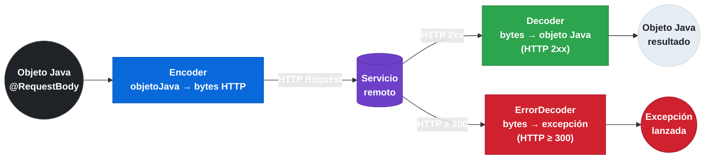

# 3.3 Codecs — Encoder y Decoder en Feign

← [3.2.2 Configuración por propiedades](sc-feign-configuracion-propiedades.md) | [Índice](README.md) | [3.4.1 Logger.Level y configuración dual de logging](sc-feign-logging.md) →

---

## Introducción

Los codecs de Feign son las piezas responsables de transformar objetos Java en cuerpos de petición HTTP (Encoder) y cuerpos de respuesta HTTP de vuelta en objetos Java (Decoder). Sin un Encoder apropiado, Feign no sabe cómo serializar un `@RequestBody`; sin un Decoder, no puede convertir la respuesta JSON en un record o POJO. Spring Cloud OpenFeign auto-configura `SpringEncoder` y `SpringDecoder` que delegan en los mismos `HttpMessageConverter` de Spring MVC, por lo que en la mayoría de los casos no se necesita configuración adicional. Sin embargo, existen escenarios específicos — formularios URL-encoded, acceso a headers de respuesta, respuestas binarias — que requieren codecs adicionales o personalizados.

## Flujo de codificación y decodificación

Cada petición Feign pasa por el Encoder antes de enviarse y cada respuesta pasa por el Decoder al recibirla. El proceso es sincrónico y se integra con el contrato de Spring MVC.


*Flujo de codificación y decodificación: Encoder serializa la petición, Decoder o ErrorDecoder procesan la respuesta según el código HTTP.*

## Ejemplo central

El siguiente ejemplo ilustra los casos de uso principales de cada codec. Muestra cómo registrar `FormEncoder` para formularios, `ResponseEntityDecoder` para acceder a headers, y `ByteArrayDecoder` para respuestas binarias, todos en la misma configuración Java de Feign.

```java
// build.gradle — dependencias necesarias
// implementation 'org.springframework.cloud:spring-cloud-starter-openfeign'
// Para FormEncoder (feign-form):
// implementation 'io.github.openfeign.form:feign-form-spring:4.0.0'

package com.example.demo.feign.config;

import feign.codec.Decoder;
import feign.codec.Encoder;
import feign.form.spring.SpringFormEncoder;
import org.springframework.beans.factory.ObjectFactory;
import org.springframework.beans.factory.annotation.Autowired;
import org.springframework.boot.autoconfigure.http.HttpMessageConverters;
import org.springframework.cloud.openfeign.support.ResponseEntityDecoder;
import org.springframework.cloud.openfeign.support.SpringDecoder;
import org.springframework.cloud.openfeign.support.SpringEncoder;
import org.springframework.context.annotation.Bean;

// Configuración para upload-service que necesita FormEncoder y ResponseEntityDecoder
// Sin @Configuration para evitar que sea detectada por component scan raíz
public class UploadFeignConfig {

    @Autowired
    private ObjectFactory<HttpMessageConverters> messageConverters;

    // FormEncoder: necesario para application/x-www-form-urlencoded y multipart/form-data
    // SpringEncoder por sí solo NO soporta envío de formularios
    @Bean
    public Encoder feignFormEncoder() {
        return new SpringFormEncoder(new SpringEncoder(messageConverters));
    }

    // ResponseEntityDecoder: envuelve SpringDecoder permitiendo acceder a headers de respuesta
    // El tipo de retorno del método Feign debe ser ResponseEntity<T>
    @Bean
    public Decoder feignDecoder() {
        return new ResponseEntityDecoder(new SpringDecoder(messageConverters));
    }
}
```

```java
// Cliente Feign que usa FormEncoder y ResponseEntityDecoder
package com.example.demo.clients;

import com.example.demo.feign.config.UploadFeignConfig;
import com.example.demo.dto.UploadResponse;
import com.example.demo.dto.UserFormRequest;
import org.springframework.cloud.openfeign.FeignClient;
import org.springframework.http.MediaType;
import org.springframework.http.ResponseEntity;
import org.springframework.web.bind.annotation.PostMapping;
import org.springframework.web.bind.annotation.RequestBody;
import org.springframework.web.bind.annotation.RequestPart;
import org.springframework.web.multipart.MultipartFile;

@FeignClient(
    name = "upload-service",
    configuration = UploadFeignConfig.class
)
public interface UploadClient {

    // Formulario URL-encoded — requiere SpringFormEncoder
    // @RequestBody con MediaType.APPLICATION_FORM_URLENCODED
    @PostMapping(
        value = "/users/register",
        consumes = MediaType.APPLICATION_FORM_URLENCODED_VALUE
    )
    ResponseEntity<UploadResponse> registerUser(@RequestBody UserFormRequest form);

    // Multipart file upload — requiere SpringFormEncoder
    @PostMapping(
        value = "/files/upload",
        consumes = MediaType.MULTIPART_FORM_DATA_VALUE
    )
    ResponseEntity<UploadResponse> uploadFile(
        @RequestPart("file") MultipartFile file,
        @RequestPart("description") String description
    );
}
```

```java
// DTO para formulario URL-encoded — los campos se mapean como parámetros de form
package com.example.demo.dto;

public record UserFormRequest(String username, String email, String password) {}
```

```java
// Ejemplo de acceso a headers desde ResponseEntity
package com.example.demo.service;

import com.example.demo.clients.UploadClient;
import com.example.demo.dto.UploadResponse;
import com.example.demo.dto.UserFormRequest;
import org.springframework.http.ResponseEntity;
import org.springframework.stereotype.Service;

@Service
public class RegistrationService {

    private final UploadClient uploadClient;

    public RegistrationService(UploadClient uploadClient) {
        this.uploadClient = uploadClient;
    }

    public String registerAndGetLocation(String username, String email, String pwd) {
        UserFormRequest form = new UserFormRequest(username, email, pwd);
        ResponseEntity<UploadResponse> response = uploadClient.registerUser(form);

        // Con ResponseEntityDecoder podemos acceder a headers de respuesta
        String location = response.getHeaders().getFirst("Location");
        int statusCode = response.getStatusCode().value();

        return "Registrado en: " + location + " [HTTP " + statusCode + "]";
    }
}
```

```java
// Configuración para acceso a recursos binarios con ByteArrayDecoder
package com.example.demo.feign.config;

import feign.codec.Decoder;
import org.springframework.context.annotation.Bean;

public class BinaryFeignConfig {

    // ByteArrayDecoder: devuelve byte[] directamente sin deserialización adicional
    // Útil para descargar archivos, imágenes, PDFs
    @Bean
    public Decoder binaryDecoder() {
        return (response, type) -> {
            if (type == byte[].class) {
                return response.body().asInputStream().readAllBytes();
            }
            // Fallback al decoder estándar para otros tipos
            return new feign.codec.StringDecoder().decode(response, type);
        };
    }
}
```

## Tabla de codecs disponibles

Spring Cloud OpenFeign incluye los siguientes codecs en su módulo `spring-cloud-openfeign-core`:

| Codec | Tipo | Cuándo usar |
|---|---|---|
| `SpringEncoder` | Encoder | Default; usa `HttpMessageConverter` de Spring MVC para JSON, XML, etc. |
| `SpringDecoder` | Decoder | Default; usa `HttpMessageConverter` para deserializar respuesta |
| `JacksonEncoder` | Encoder | Cuando se quiere Jackson directamente sin pasar por Spring MVC converters |
| `JacksonDecoder` | Decoder | Ídem para decodificación directa con Jackson |
| `SpringFormEncoder` | Encoder | **Obligatorio** para `application/x-www-form-urlencoded` y `multipart/form-data` |
| `ResponseEntityDecoder` | Decoder | Cuando el método Feign retorna `ResponseEntity<T>` y se necesitan los headers |
| `ByteArrayDecoder` | Decoder | Para respuestas binarias (`byte[]`, descargas de archivos) |
| `StringDecoder` | Decoder | Cuando el tipo de retorno es `String` y se quiere el cuerpo raw |

## Buenas y malas prácticas

**Buenas prácticas:**
- Usar los defaults (`SpringEncoder`/`SpringDecoder`) a menos que tengas un caso específico: evita configuración innecesaria.
- Cuando el método Feign deba retornar `ResponseEntity<T>` para acceder a headers, registrar `ResponseEntityDecoder`.
- Para formularios, añadir siempre `SpringFormEncoder`: sin él, Spring Cloud no enviará `Content-Type: application/x-www-form-urlencoded` aunque lo especifiques en `consumes`.

**Malas prácticas:**
- Registrar `JacksonEncoder`/`JacksonDecoder` directamente cuando ya tienes `SpringEncoder`/`SpringDecoder`: son redundantes y pueden causar conflictos de content-type.
- Asumir que `SpringEncoder` soporta formularios: no lo hace, necesitas `SpringFormEncoder`.

> [ADVERTENCIA] Si un método Feign declara `ResponseEntity<T>` como tipo de retorno pero no hay `ResponseEntityDecoder` configurado, Feign lanzará un error de decodificación en tiempo de ejecución porque el decoder estándar no sabe envolver la respuesta en `ResponseEntity`.

## Verificación y práctica

> [EXAMEN] **1.** ¿Qué codec es necesario añadir explícitamente para que Feign envíe un formulario con `Content-Type: application/x-www-form-urlencoded`? ¿Por qué `SpringEncoder` no es suficiente?

> [EXAMEN] **2.** ¿Qué ventaja aporta `ResponseEntityDecoder` frente al `SpringDecoder` estándar? ¿Qué debe cambiar en la firma del método Feign para aprovecharlo?

> [EXAMEN] **3.** ¿Cuál es la diferencia entre `JacksonEncoder` y `SpringEncoder`? ¿En qué escenario usarías el primero?

> [EXAMEN] **4.** Un método Feign retorna `byte[]` para descargar un archivo PDF. ¿Qué decoder deberías configurar y por qué el `SpringDecoder` no funciona para este caso?

> [EXAMEN] **5.** ¿Dónde se registran los codecs personalizados de Feign y cuál es la forma correcta de hacerlo para que solo afecten a un cliente específico?

---

← [3.2.2 Configuración por propiedades](sc-feign-configuracion-propiedades.md) | [Índice](README.md) | [3.4.1 Logger.Level y configuración dual de logging](sc-feign-logging.md) →
