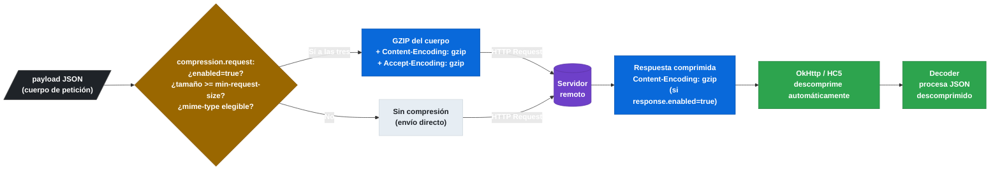

# 3.9.2 Compresión de peticiones y respuestas

← [3.9.1 Herencia de interfaces API compartida](sc-feign-herencia.md) | [Índice](README.md) | [3.10 Testing / Verificación de OpenFeign](sc-feign-testing.md) →

---

## Introducción

La compresión HTTP en Feign reduce el tamaño del payload transmitido entre microservicios. Spring Cloud OpenFeign soporta compresión GZIP tanto para peticiones salientes (el cliente comprime el cuerpo antes de enviarlo) como para respuestas entrantes (el cliente solicita al servidor que comprima la respuesta). Esta funcionalidad es relevante cuando los payloads son grandes — listas de objetos, documentos JSON extensos — y el ancho de banda o la latencia de red son factores de rendimiento. La compresión de peticiones se controla con `spring.cloud.openfeign.compression.request.*` y la de respuestas con `spring.cloud.openfeign.compression.response.*`. Existen restricciones importantes: la compresión de peticiones solo funciona con OkHttp3 o Apache HttpClient 5, no con el cliente default.

## Flujo de compresión

La compresión se aplica transparentemente en el cliente antes de enviar la petición y el servidor responde con las cabeceras de encoding apropiadas.


*Flujo de compresión GZIP: tres condiciones deben cumplirse para comprimir la petición; la descompresión de respuestas la gestiona automáticamente el cliente HTTP.*

## Ejemplo central

El siguiente ejemplo muestra la configuración completa de compresión request y response en `application.yml`, con explicación de cada propiedad. También incluye las restricciones de cliente HTTP que aplican.

```yaml
# application.yml — configuración completa de compresión en Feign
spring:
  cloud:
    openfeign:
      compression:
        # ── Compresión de PETICIONES (cuerpo enviado por Feign) ──────────────
        request:
          enabled: true
          # Tamaño mínimo del payload (bytes) para que se aplique la compresión.
          # Payloads más pequeños no se comprimen (el overhead de GZIP sería mayor).
          min-request-size: 2048         # 2 KB por defecto
          # Tipos MIME que pueden ser comprimidos.
          # Solo se comprimen payloads con estos Content-Type.
          mime-types:
            - application/json
            - application/xml
            - text/xml
            - text/plain

        # ── Compresión de RESPUESTAS (respuesta recibida del servidor) ────────
        response:
          enabled: true
          # Si enabled=true, Feign añade el header:
          # Accept-Encoding: gzip, deflate
          # al enviar cada petición, indicando que acepta respuesta comprimida.
          # El servidor puede ignorarlo si no soporta compresión.

      # La compresión de peticiones REQUIERE OkHttp o Apache HttpClient 5.
      # El cliente HTTP default (HttpURLConnection) no soporta compresión de peticiones.
      okhttp:
        enabled: true   # o httpclient.hc5.enabled=true

      client:
        config:
          default:
            connectTimeout: 2000
            readTimeout: 5000
```

```yaml
# Configuración del servidor que recibe las peticiones comprimidas
# El servidor Spring Boot puede configurarse para aceptar peticiones comprimidas
# y comprimir respuestas con el ContentEncodingFilter de Spring

server:
  compression:
    enabled: true
    mime-types:
      - application/json
      - application/xml
    min-response-size: 2048    # comprimir respuestas del servidor >= 2KB
```

```java
// Test de verificación de compresión — usando WireMock para verificar el header
package com.example.demo;

import com.example.demo.clients.ProductClient;
import com.github.tomakehurst.wiremock.client.WireMock;
import org.junit.jupiter.api.Test;
import org.springframework.beans.factory.annotation.Autowired;
import org.springframework.boot.test.context.SpringBootTest;
import org.springframework.cloud.contract.wiremock.AutoConfigureWireMock;

import static com.github.tomakehurst.wiremock.client.WireMock.*;

@SpringBootTest(webEnvironment = SpringBootTest.WebEnvironment.NONE,
    properties = {
        "spring.cloud.openfeign.compression.response.enabled=true",
        "spring.cloud.openfeign.compression.request.enabled=true",
        "spring.cloud.openfeign.okhttp.enabled=true",
        "spring.cloud.openfeign.client.config.product-service.url=http://localhost:${wiremock.server.port}"
    })
@AutoConfigureWireMock(port = 0)
class FeignCompressionTest {

    @Autowired
    private ProductClient productClient;

    @Test
    void shouldSendAcceptEncodingHeaderWhenResponseCompressionEnabled() {
        stubFor(get(urlEqualTo("/api/v1/products/1"))
            .withHeader("Accept-Encoding", containing("gzip"))   // Feign añade este header
            .willReturn(aResponse()
                .withStatus(200)
                .withHeader("Content-Type", "application/json")
                .withBody("{\"id\":1,\"name\":\"Widget\",\"price\":9.99,\"stock\":100}")));

        productClient.getProduct(1L);

        verify(getRequestedFor(urlEqualTo("/api/v1/products/1"))
            .withHeader("Accept-Encoding", containing("gzip")));
    }
}
```

## Tabla de propiedades de compresión

| Propiedad | Tipo | Defecto | Descripción |
|---|---|---|---|
| `compression.request.enabled` | boolean | `false` | Habilitar compresión del cuerpo de peticiones salientes |
| `compression.request.min-request-size` | int (bytes) | `2048` | Tamaño mínimo para comprimir una petición |
| `compression.request.mime-types` | List<String> | `application/json, application/xml, text/xml` | Content-Types elegibles para compresión |
| `compression.response.enabled` | boolean | `false` | Añadir `Accept-Encoding: gzip, deflate` a cada petición |

## Restricciones y consideraciones

La compresión en Feign no es plug-and-play: hay condiciones que deben cumplirse para que funcione correctamente.

La compresión de **peticiones** (`compression.request.enabled=true`) solo funciona con OkHttp3 o Apache HttpClient 5. El cliente HTTP default (HttpURLConnection) no soporta esta característica. Si se habilita con el cliente default, la configuración se ignora silenciosamente o lanza un error.

La compresión de **respuestas** (`compression.response.enabled=true`) solo envía el header `Accept-Encoding: gzip` al servidor. Si el servidor no está configurado para comprimir sus respuestas, simplemente las devuelve sin comprimir y Feign las procesa normalmente.

El header `Content-Encoding: gzip` es procesado automáticamente por OkHttp3 y Apache HC5, que descomprimen la respuesta antes de pasarla al `Decoder` de Feign. No es necesario implementar la descompresión manualmente.

## Buenas y malas prácticas

**Buenas prácticas:**
- Habilitar compresión solo cuando los payloads sean habitualmente > 2KB: para respuestas pequeñas, el overhead de GZIP puede superar el ahorro.
- Configurar `min-request-size` según el tamaño medio real de los payloads de la aplicación.
- Verificar que el servidor destino soporta peticiones comprimidas antes de habilitar `compression.request.enabled`.

**Malas prácticas:**
- Habilitar `compression.request.enabled=true` con el cliente HTTP default: no funcionará.
- Asumir que `compression.response.enabled=true` comprime automáticamente las respuestas del servidor: solo añade el header de negociación.

> [ADVERTENCIA] La compresión de peticiones Feign (`compression.request.enabled=true`) requiere que el servidor remoto soporte recibir peticiones con `Content-Encoding: gzip`. Si el servidor no soporta este encoding, rechazará la petición con un error HTTP (típicamente 415 Unsupported Media Type o 400 Bad Request).

## Verificación y práctica

> [EXAMEN] **1.** ¿Qué propiedad controla el tamaño mínimo de payload (en bytes) a partir del cual Feign comprime la petición saliente?

> [EXAMEN] **2.** ¿Qué cliente HTTP subyacente es necesario para que la compresión de peticiones funcione? ¿Por qué el cliente default no es suficiente?

> [EXAMEN] **3.** Si `spring.cloud.openfeign.compression.response.enabled=true`, ¿qué header HTTP añade Feign a sus peticiones y para qué sirve?

> [EXAMEN] **4.** ¿Es necesario implementar la descompresión de respuestas manualmente en el `Decoder` de Feign cuando se usa OkHttp3 con compresión habilitada?

> [EXAMEN] **5.** ¿Qué ocurre si se habilita `compression.request.enabled=true` pero el servidor remoto no soporta peticiones con `Content-Encoding: gzip`?

---

← [3.9.1 Herencia de interfaces API compartida](sc-feign-herencia.md) | [Índice](README.md) | [3.10 Testing / Verificación de OpenFeign](sc-feign-testing.md) →
