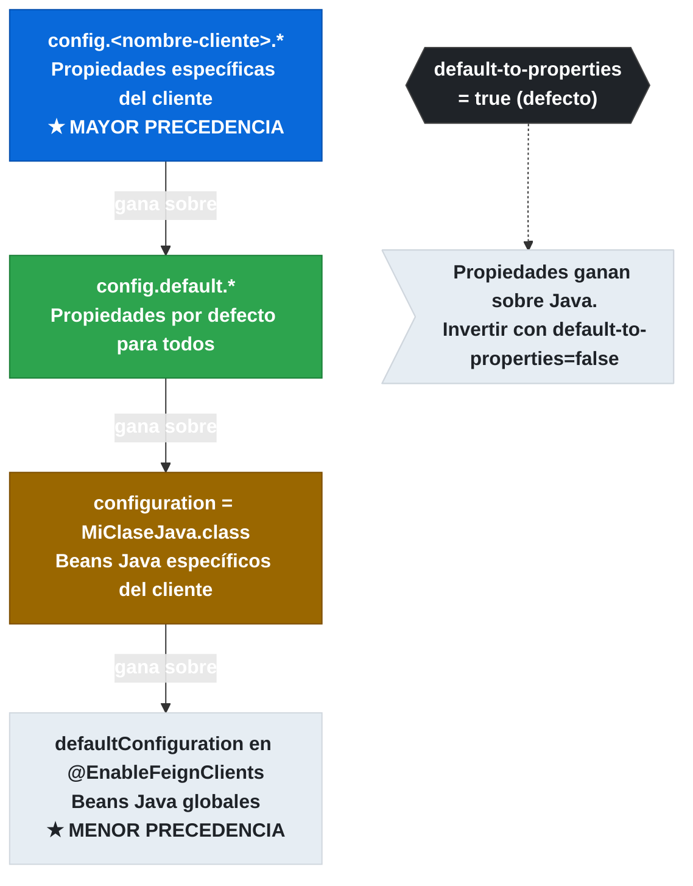

# 3.2.2 Configuración por propiedades (spring.cloud.openfeign.client.config.*)

← [3.2.1 Configuración por clase Java](sc-feign-configuracion-java.md) | [Índice](README.md) | [3.3 Codecs — Encoder y Decoder](sc-feign-codecs.md) →

---

## Introducción

Spring Cloud OpenFeign permite configurar cada cliente Feign directamente desde `application.yml` o `application.properties` sin necesidad de escribir clases Java. Este enfoque es especialmente valioso en entornos de operación porque los parámetros como timeouts, nivel de log y encoders se pueden cambiar por perfil de Spring o en el Config Server sin recompilar la aplicación. La configuración por propiedades coexiste con la configuración Java y, por defecto, tiene mayor precedencia que ella. El espacio de propiedades es `spring.cloud.openfeign.client.config.<nombre-cliente>` para configuración individual y `spring.cloud.openfeign.client.config.default` para todos los clientes.

> [PREREQUISITO] Comprender la configuración Java de Feign (sección 3.2.1) es recomendable para entender la jerarquía de precedencia entre ambos mecanismos.

## Jerarquía de precedencia

Cuando ambos mecanismos están activos, la configuración por propiedades prevalece sobre la Java. Este comportamiento se controla con la propiedad `spring.cloud.openfeign.client.config.default.default-to-properties` (true por defecto). Si se invierte a `false`, la configuración Java gana.


*Orden de precedencia de configuración Feign: propiedades específicas de cliente > default > Java por cliente > Java global.*

## Ejemplo central

El siguiente ejemplo muestra una configuración completa por propiedades para dos clientes Feign distintos, más una configuración `default` aplicada a todos. También muestra cómo invertir la precedencia para que la configuración Java gane.

```yaml
spring:
  cloud:
    openfeign:
      # Configuración global de Feign
      client:
        # default-to-properties controla la precedencia:
        # true (defecto) → propiedades > Java
        # false          → Java > propiedades
        default-to-properties: true

        config:
          # Configuración base para TODOS los clientes
          default:
            connectTimeout: 3000       # milisegundos — tiempo máximo para establecer conexión
            readTimeout: 5000          # milisegundos — tiempo máximo esperando respuesta
            loggerLevel: BASIC         # NONE | BASIC | HEADERS | FULL
            retryer: feign.Retryer.Default  # clase FQN del Retryer

          # Configuración específica para inventory-service
          inventory-service:
            connectTimeout: 1000       # sobreescribe el default
            readTimeout: 2000          # sobreescribe el default
            loggerLevel: FULL          # más verboso que el default
            errorDecoder: com.example.orders.feign.InventoryErrorDecoder

          # Configuración específica para payment-service
          payment-service:
            connectTimeout: 5000       # pago puede tardar más
            readTimeout: 10000
            loggerLevel: HEADERS
            requestInterceptors:
              - com.example.orders.feign.PaymentAuthInterceptor

      # Activar circuit breaker para todos los clientes (integración Resilience4j)
      circuitbreaker:
        enabled: true

      # Compresión de peticiones
      compression:
        request:
          enabled: true
          min-request-size: 2048       # bytes mínimos para comprimir
          mime-types: application/json,application/xml
        response:
          enabled: true

      # Cliente HTTP subyacente
      okhttp:
        enabled: false
      httpclient:
        hc5:
          enabled: true                # usar Apache HttpClient 5

      # Lazy loading — mejora tiempo de arranque
      lazy-attributes-resolution: true
```

```yaml
# Configuración de logging del framework — OBLIGATORIA para ver logs de Feign
# La propiedad loggerLevel de Feign no produce output si el logger del framework
# no está configurado al nivel DEBUG para el paquete del cliente Feign.
logging:
  level:
    com.example.orders.clients: DEBUG   # nivel DEBUG obligatorio para ver logs Feign
    feign: DEBUG                         # también útil para logs internos de Feign
```

```java
// El ErrorDecoder referenciado por FQCN en propiedades debe ser un @Component
// o estar disponible en el contexto Spring para que Feign lo inyecte
package com.example.orders.feign;

import feign.Response;
import feign.codec.ErrorDecoder;
import org.springframework.stereotype.Component;

@Component
public class InventoryErrorDecoder implements ErrorDecoder {

    private final ErrorDecoder defaultDecoder = new Default();

    @Override
    public Exception decode(String methodKey, Response response) {
        return switch (response.status()) {
            case 404 -> new InventoryItemNotFoundException(
                "Recurso no encontrado en inventory-service [" + methodKey + "]"
            );
            case 503 -> new InventoryUnavailableException(
                "inventory-service no disponible [" + methodKey + "]"
            );
            default -> defaultDecoder.decode(methodKey, response);
        };
    }
}
```

```java
// RequestInterceptor referenciado en propiedades — también debe ser @Component
package com.example.orders.feign;

import feign.RequestInterceptor;
import feign.RequestTemplate;
import org.springframework.beans.factory.annotation.Value;
import org.springframework.stereotype.Component;

@Component
public class PaymentAuthInterceptor implements RequestInterceptor {

    @Value("${services.payment.secret}")
    private String paymentSecret;

    @Override
    public void apply(RequestTemplate template) {
        template.header("Authorization", "Bearer " + paymentSecret);
        template.header("X-Source-Service", "orders-service");
    }
}
```

## Tabla de propiedades configurables por cliente

Las propiedades disponibles bajo `spring.cloud.openfeign.client.config.<nombre>` son:

| Propiedad | Tipo | Descripción |
|---|---|---|
| `connectTimeout` | int (ms) | Tiempo máximo para establecer la conexión TCP |
| `readTimeout` | int (ms) | Tiempo máximo esperando bytes del servidor |
| `loggerLevel` | `Logger.Level` | Verbosidad: NONE, BASIC, HEADERS, FULL |
| `errorDecoder` | Class FQN | Clase que implementa `ErrorDecoder` |
| `retryer` | Class FQN | Clase que implementa `feign.Retryer` |
| `requestInterceptors` | List<Class FQN> | Lista de `RequestInterceptor` a aplicar |
| `encoder` | Class FQN | Clase `Encoder` para serializar el cuerpo |
| `decoder` | Class FQN | Clase `Decoder` para deserializar la respuesta |
| `contract` | Class FQN | Clase `Contract` para reconocer anotaciones |
| `followRedirects` | boolean | Si Feign sigue redirecciones HTTP 3xx automáticamente |
| `defaultRequestHeaders` | Map | Headers añadidos a todas las peticiones del cliente |
| `defaultQueryParameters` | Map | Query params añadidos a todas las peticiones |

## Buenas y malas prácticas

**Buenas prácticas:**
- Definir timeouts siempre explícitamente. Los valores por defecto de Feign son generosos y pueden causar hilos bloqueados en producción.
- Usar `config.default` para los valores base y sobreescribir solo lo necesario en cada cliente específico.
- Combinar con Spring profiles: timeouts de desarrollo más generosos, producción más estrictos.
- Verificar que `logging.level.<paquete>: DEBUG` esté configurado en el mismo perfil donde `loggerLevel: FULL`, de lo contrario no habrá ningún output.

**Malas prácticas:**
- Referir FQNs de clases en propiedades que no son `@Component` ni están en el contexto Spring: causarán `NoSuchBeanDefinitionException` en arranque.
- Asumir que `loggerLevel: FULL` es suficiente para ver los logs sin configurar el nivel del logger del framework.
- Establecer `readTimeout` excesivamente largo (>30s) sin circuit breaker: un servicio lento bloqueará threads indefinidamente.

> [ADVERTENCIA] Los valores de `connectTimeout` y `readTimeout` se expresan **en milisegundos**. Un error común es especificarlos en segundos, lo que resulta en timeouts de 1-10 ms y fallos inmediatos de conexión.

## Comparación: propiedades vs Java

Ambos mecanismos pueden coexistir. La elección depende del caso de uso:

| Criterio | Propiedades | Clase Java |
|---|---|---|
| Cambio sin recompilar | Sí (con Config Server) | No |
| Lógica condicional compleja | No | Sí |
| Inyección de beans Spring | Limitada (por FQN) | Total |
| Visibilidad operacional | Alta | Baja |
| Precedencia por defecto | Mayor | Menor |

## Verificación y práctica

> [EXAMEN] **1.** ¿En qué unidad se expresan `connectTimeout` y `readTimeout` en `spring.cloud.openfeign.client.config.*`?

> [EXAMEN] **2.** ¿Qué propiedad controla si la configuración por propiedades tiene mayor precedencia que la configuración Java? ¿Cuál es su valor por defecto?

> [EXAMEN] **3.** Configuras `loggerLevel: FULL` para `inventory-service` pero no ves ningún log en consola. ¿Cuál es la causa más probable y cómo lo solucionas?

> [EXAMEN] **4.** ¿Cómo se define una lista de `RequestInterceptor` para un cliente específico usando solo propiedades en `application.yml`?

> [EXAMEN] **5.** Tienes `config.default.readTimeout: 5000` y `config.inventory-service.readTimeout: 2000`. ¿Cuál se aplica al cliente `inventory-service`?

---

← [3.2.1 Configuración por clase Java](sc-feign-configuracion-java.md) | [Índice](README.md) | [3.3 Codecs — Encoder y Decoder](sc-feign-codecs.md) →
