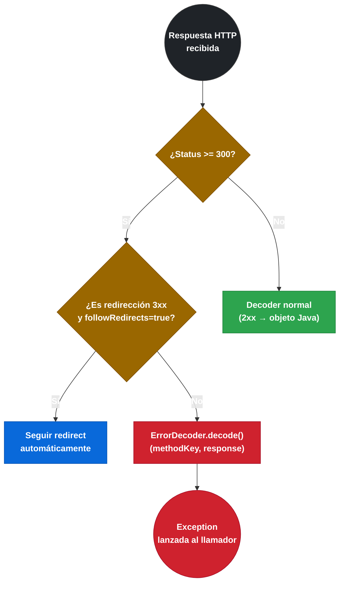

# 3.4.2 ErrorDecoder — manejo de errores HTTP

← [3.4.1 Logger.Level y configuración dual de logging](sc-feign-logging.md) | [Índice](README.md) | [3.5 Interceptores de petición — RequestInterceptor](sc-feign-interceptores.md) →

---

## Introducción

Por defecto, cuando un servicio remoto responde con un código HTTP de error (4xx o 5xx), Feign lanza una `FeignException` genérica que incluye el código de estado y el cuerpo de la respuesta como texto. Este comportamiento es insuficiente para una arquitectura de microservicios bien diseñada: el servicio consumidor necesita distinguir un `404 Not Found` (entidad no existe) de un `503 Service Unavailable` (reintentar) o un `400 Bad Request` (error del cliente). El `ErrorDecoder` es la interfaz que resuelve este problema: intercepta respuestas de error y permite transformarlas en excepciones de dominio significativas, con la lógica de mapeo que cada aplicación requiere.

> [PREREQUISITO] Feign solo invoca al `ErrorDecoder` para respuestas con status >= 300 cuando no es una redirección seguida automáticamente. Para respuestas 2xx el flujo sigue al `Decoder` normal.

## Ciclo de vida del ErrorDecoder

El `ErrorDecoder` se invoca después de que Feign recibe la respuesta HTTP. El flujo de decisión determina si es el decoder normal o el error decoder quien procesa la respuesta.


*El ErrorDecoder solo se invoca cuando el status es ≥ 300 y no es una redirección seguida automáticamente.*

## Ejemplo central

El siguiente ejemplo muestra un `ErrorDecoder` completo que mapea distintos códigos HTTP a excepciones de dominio específicas. También muestra el patrón para leer el cuerpo de la respuesta de error y extraer mensajes estructurados del JSON de error.

```java
// Excepciones de dominio del módulo de inventario
package com.example.orders.exception;

public class InventoryItemNotFoundException extends RuntimeException {
    private final Long itemId;

    public InventoryItemNotFoundException(Long itemId) {
        super("Ítem de inventario no encontrado: " + itemId);
        this.itemId = itemId;
    }

    public Long getItemId() { return itemId; }
}
```

```java
package com.example.orders.exception;

public class InventoryServiceException extends RuntimeException {
    private final int httpStatus;

    public InventoryServiceException(String message, int httpStatus) {
        super(message);
        this.httpStatus = httpStatus;
    }

    public int getHttpStatus() { return httpStatus; }
}
```

```java
package com.example.orders.exception;

public class InventoryBadRequestException extends RuntimeException {
    public InventoryBadRequestException(String message) {
        super(message);
    }
}
```

```java
// ErrorDecoder personalizado con mapeo completo por status
package com.example.orders.feign;

import com.example.orders.exception.InventoryBadRequestException;
import com.example.orders.exception.InventoryItemNotFoundException;
import com.example.orders.exception.InventoryServiceException;
import com.fasterxml.jackson.databind.JsonNode;
import com.fasterxml.jackson.databind.ObjectMapper;
import feign.Response;
import feign.Util;
import feign.codec.ErrorDecoder;
import org.slf4j.Logger;
import org.slf4j.LoggerFactory;
import org.springframework.stereotype.Component;

import java.io.IOException;
import java.nio.charset.StandardCharsets;

@Component  // Registrado como @Component para ser referenciable por propiedades (FQN)
public class InventoryErrorDecoder implements ErrorDecoder {

    private static final Logger log = LoggerFactory.getLogger(InventoryErrorDecoder.class);
    private final ErrorDecoder defaultDecoder = new Default();
    private final ObjectMapper objectMapper = new ObjectMapper();

    @Override
    public Exception decode(String methodKey, Response response) {
        // methodKey tiene el formato "InterfazCliente#nombreMetodo(TipoParam)"
        // Ejemplo: "InventoryClient#getItem(Long)"
        log.warn("Error en llamada Feign [{}]: HTTP {}", methodKey, response.status());

        String body = extractBody(response);

        return switch (response.status()) {
            case 400 -> new InventoryBadRequestException(
                "Petición inválida a inventory-service [" + methodKey + "]: " + body
            );
            case 404 -> {
                // Intentar extraer el ID del methodKey para construir excepción más informativa
                Long itemId = extractItemIdFromBody(body);
                yield new InventoryItemNotFoundException(itemId);
            }
            case 503 -> {
                // Para 503, RetryableException hace que Feign reintente si hay Retryer configurado
                yield new feign.RetryableException(
                    response.status(),
                    "inventory-service no disponible [" + methodKey + "]",
                    response.request().httpMethod(),
                    null,
                    response.request()
                );
            }
            default -> {
                if (response.status() >= 500) {
                    yield new InventoryServiceException(
                        "Error del servidor en inventory-service [" + methodKey + "]: " + body,
                        response.status()
                    );
                }
                // Para otros códigos no manejados, delegar al decoder por defecto
                yield defaultDecoder.decode(methodKey, response);
            }
        };
    }

    private String extractBody(Response response) {
        if (response.body() == null) return "(sin cuerpo)";
        try {
            return Util.toString(response.body().asReader(StandardCharsets.UTF_8));
        } catch (IOException e) {
            log.debug("No se pudo leer el cuerpo de la respuesta de error", e);
            return "(error leyendo cuerpo)";
        }
    }

    private Long extractItemIdFromBody(String body) {
        try {
            JsonNode node = objectMapper.readTree(body);
            JsonNode idNode = node.get("itemId");
            return idNode != null ? idNode.asLong() : -1L;
        } catch (Exception e) {
            return -1L;
        }
    }
}
```

```java
// Clase de configuración Feign que registra el ErrorDecoder personalizado
package com.example.orders.feign.config;

import com.example.orders.feign.InventoryErrorDecoder;
import feign.codec.ErrorDecoder;
import org.springframework.context.annotation.Bean;

// Sin @Configuration para evitar scope global
public class InventoryFeignConfig {

    private final InventoryErrorDecoder inventoryErrorDecoder;

    public InventoryFeignConfig(InventoryErrorDecoder inventoryErrorDecoder) {
        this.inventoryErrorDecoder = inventoryErrorDecoder;
    }

    @Bean
    public ErrorDecoder errorDecoder() {
        return inventoryErrorDecoder;
    }
}
```

```java
// Cliente Feign con la configuración que incluye el ErrorDecoder
package com.example.orders.clients;

import com.example.orders.dto.InventoryResponse;
import com.example.orders.feign.config.InventoryFeignConfig;
import org.springframework.cloud.openfeign.FeignClient;
import org.springframework.web.bind.annotation.GetMapping;
import org.springframework.web.bind.annotation.PathVariable;

@FeignClient(
    name = "inventory-service",
    path = "/api/v1",
    configuration = InventoryFeignConfig.class
)
public interface InventoryClient {

    @GetMapping("/items/{id}")
    InventoryResponse getItem(@PathVariable("id") Long id);
}
```

```java
// Servicio que consume el cliente y maneja las excepciones de dominio
package com.example.orders.service;

import com.example.orders.clients.InventoryClient;
import com.example.orders.dto.InventoryResponse;
import com.example.orders.exception.InventoryItemNotFoundException;
import com.example.orders.exception.InventoryServiceException;
import org.springframework.stereotype.Service;

@Service
public class OrderService {

    private final InventoryClient inventoryClient;

    public OrderService(InventoryClient inventoryClient) {
        this.inventoryClient = inventoryClient;
    }

    public InventoryResponse fetchItem(Long itemId) {
        try {
            return inventoryClient.getItem(itemId);
        } catch (InventoryItemNotFoundException e) {
            // Manejo específico: el ítem no existe
            throw new RuntimeException("No se puede crear el pedido: " + e.getMessage(), e);
        } catch (InventoryServiceException e) {
            // Error del servidor — el ítem podría existir pero el servicio falló
            throw new RuntimeException("Servicio de inventario no disponible", e);
        }
    }
}
```

## Tabla de comportamientos del ErrorDecoder

La firma del método `decode` y los códigos que activan su invocación son fundamentales:

| Aspecto | Valor |
|---|---|
| Firma del método | `Exception decode(String methodKey, Response response)` |
| Códigos que lo activan | Cualquier status >= 300 no gestionado como redirección |
| `methodKey` formato | `"NombreInterfaz#nombreMetodo(TipoParam1,TipoParam2)"` |
| `FeignException` (default) | Lanzada si no se configura `ErrorDecoder` personalizado |
| `RetryableException` | Si se lanza, Feign invoca al `Retryer` para reintentar |
| Cuerpo de respuesta | Accesible via `response.body().asReader(charset)` |

## FeignException vs excepción de dominio

El `ErrorDecoder.Default` lanza `FeignException` con subclases por cada código HTTP (`FeignException.NotFound`, `FeignException.ServiceUnavailable`, etc.). El problema de este enfoque es que el código consumidor queda acoplado a detalles de transporte HTTP. Al usar excepciones de dominio se separan las responsabilidades.

`FeignException` incluye el cuerpo de la respuesta como `byte[]` accesible con `feignException.content()`, lo que permite leerlo pero con acoplamiento al framework Feign.

## Buenas y malas prácticas

**Buenas prácticas:**
- Siempre leer y liberar el cuerpo de la respuesta en el `ErrorDecoder` para evitar conexiones bloqueadas (connection pool leak).
- Lanzar `RetryableException` para errores transitorios (503, 504) si hay un `Retryer` configurado, permitiendo reintentos automáticos.
- Mapear cada código HTTP relevante a una excepción de dominio en lugar de exponer `FeignException`.

**Malas prácticas:**
- Ignorar el cuerpo de la respuesta: se pierde el mensaje de error del servidor remoto.
- Lanzar `RuntimeException` genéricas: el servicio consumidor no puede manejar diferentes escenarios de error.
- Registrar el `ErrorDecoder` en una clase con `@Configuration` global: se convierte en el decoder de todos los clientes Feign.

> [ADVERTENCIA] Si el `ErrorDecoder` no lee el cuerpo de la respuesta (`response.body()`), la conexión HTTP puede no liberarse correctamente al connection pool, causando agotamiento del pool bajo carga. Siempre llama a `Util.toString(response.body().asReader(charset))` o cierra el body explícitamente.

## Verificación y práctica

> [EXAMEN] **1.** ¿Cuándo invoca Feign al `ErrorDecoder`? ¿Se invoca para una respuesta HTTP 200? ¿Y para una 201?

> [EXAMEN] **2.** ¿Qué excepción lanza el `ErrorDecoder.Default` cuando recibe un HTTP 404? ¿Cuál es su nombre de clase completo?

> [EXAMEN] **3.** ¿Para qué sirve lanzar `RetryableException` desde el `ErrorDecoder` y qué componente de Feign se activa cuando se hace esto?

> [EXAMEN] **4.** Describe el formato del parámetro `methodKey` en `ErrorDecoder.decode(String methodKey, Response response)`. Ejemplo: si la interfaz es `InventoryClient` y el método `getItem(Long id)`, ¿cuál sería el valor de `methodKey`?

> [EXAMEN] **5.** ¿Cómo se implementa un `ErrorDecoder` que lanza `InventoryNotFoundException` para 404 y `InventoryServerException` para cualquier status >= 500?

---

← [3.4.1 Logger.Level y configuración dual de logging](sc-feign-logging.md) | [Índice](README.md) | [3.5 Interceptores de petición — RequestInterceptor](sc-feign-interceptores.md) →
