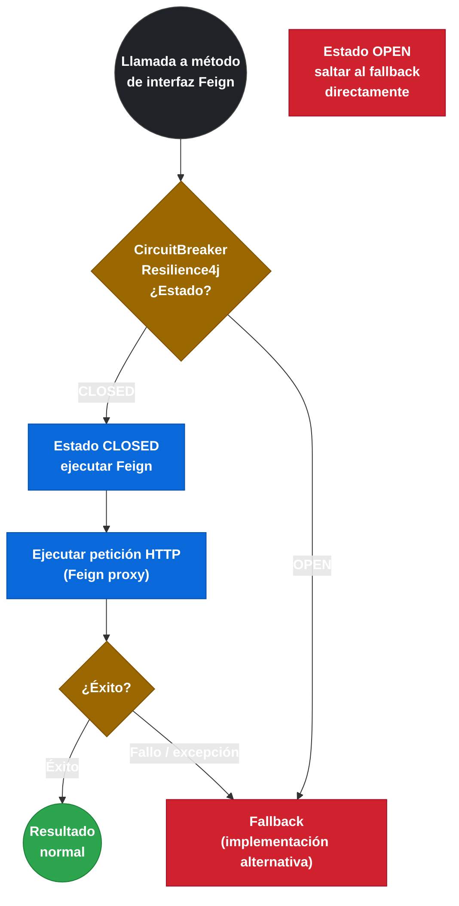
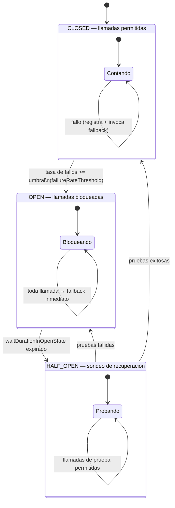

# 3.7 Integración con Resilience4j — Fallback y FallbackFactory

← [3.6 Integración con Eureka y Spring Cloud LoadBalancer](sc-feign-eureka-lb.md) | [Índice](README.md) | [3.8 Timeouts y cliente HTTP subyacente](sc-feign-http-client.md) →

---

## Introducción

La integración de Feign con Resilience4j permite añadir circuit breaker y fallback a los clientes HTTP declarativos sin código de infraestructura en el servicio consumidor. Cuando un servicio remoto falla de forma repetida, el circuit breaker abre y en lugar de propagar la excepción al código de negocio, invoca automáticamente una implementación alternativa (fallback) que devuelve una respuesta por defecto, un valor en caché, o un comportamiento degradado. Este mecanismo protege la disponibilidad del sistema completo ante fallos en cascada. La diferencia entre `fallback` y `FallbackFactory` es que el último permite conocer la causa exacta del fallo (el `Throwable`), lo que habilita distintos comportamientos según el tipo de error.

> [PREREQUISITO] Para activar esta integración se requiere `spring.cloud.openfeign.circuitbreaker.enabled=true` en `application.yml`. Sin esta propiedad, los atributos `fallback` y `fallbackFactory` de `@FeignClient` son ignorados aunque estén presentes.

## Flujo de integración con circuit breaker

El circuit breaker envuelve cada método del cliente Feign en un `CircuitBreaker` de Resilience4j. Si el método lanza una excepción o supera el timeout, el circuit breaker registra el fallo.


*El fallback se invoca tanto con el circuito OPEN como ante cualquier excepción con el circuito CLOSED.*

## Ejemplo central

El siguiente ejemplo muestra las dos estrategias de fallback: la simple (clase que implementa la interfaz) y la de fábrica con acceso al `Throwable`. Incluye la configuración necesaria en `application.yml`.

```yaml
# application.yml — habilitar integración Feign + Circuit Breaker
spring:
  cloud:
    openfeign:
      circuitbreaker:
        enabled: true            # OBLIGATORIO para que fallback/fallbackFactory funcionen
        # group: true            # agrupa todos los métodos del cliente en un único circuit breaker

resilience4j:
  circuitbreaker:
    instances:
      # El nombre del circuit breaker por defecto es: NombreCliente#nombreMetodo(TipoParam)
      # Con group=true el nombre es simplemente el nombre del cliente Feign
      InventoryClient#getItem(Long):
        slidingWindowSize: 10
        failureRateThreshold: 50
        waitDurationInOpenState: 10s
        permittedNumberOfCallsInHalfOpenState: 3
      InventoryClient#searchItems(String):
        slidingWindowSize: 5
        failureRateThreshold: 60
```

```java
// Interfaz del cliente Feign con fallback simple
package com.example.orders.clients;

import com.example.orders.dto.InventoryResponse;
import com.example.orders.feign.fallback.InventoryFallback;
import org.springframework.cloud.openfeign.FeignClient;
import org.springframework.web.bind.annotation.GetMapping;
import org.springframework.web.bind.annotation.PathVariable;
import org.springframework.web.bind.annotation.RequestParam;

import java.util.List;

@FeignClient(
    name = "inventory-service",
    path = "/api/v1",
    fallback = InventoryFallback.class   // clase que implementa esta interfaz
)
public interface InventoryClient {

    @GetMapping("/items/{id}")
    InventoryResponse getItem(@PathVariable("id") Long id);

    @GetMapping("/items")
    List<InventoryResponse> searchItems(@RequestParam("category") String category);
}
```

```java
// Fallback simple: implementa la interfaz del cliente
// Retorna valores por defecto sin conocer la causa del fallo
package com.example.orders.feign.fallback;

import com.example.orders.clients.InventoryClient;
import com.example.orders.dto.InventoryResponse;
import org.springframework.stereotype.Component;

import java.util.Collections;
import java.util.List;

@Component  // DEBE ser un bean de Spring para que Feign lo inyecte
public class InventoryFallback implements InventoryClient {

    @Override
    public InventoryResponse getItem(Long id) {
        // Respuesta degradada: ítem vacío con stock 0
        return new InventoryResponse(id, "UNAVAILABLE", 0);
    }

    @Override
    public List<InventoryResponse> searchItems(String category) {
        // Lista vacía como respuesta degradada
        return Collections.emptyList();
    }
}
```

```java
// Interfaz del cliente Feign con FallbackFactory (acceso al Throwable)
package com.example.orders.clients;

import com.example.orders.dto.PaymentRequest;
import com.example.orders.dto.PaymentResponse;
import com.example.orders.feign.fallback.PaymentFallbackFactory;
import org.springframework.cloud.openfeign.FeignClient;
import org.springframework.web.bind.annotation.PostMapping;
import org.springframework.web.bind.annotation.RequestBody;

@FeignClient(
    name = "payment-service",
    path = "/api/v1",
    fallbackFactory = PaymentFallbackFactory.class   // fábrica con acceso al Throwable
)
public interface PaymentClient {

    @PostMapping("/payments")
    PaymentResponse processPayment(@RequestBody PaymentRequest request);

    @PostMapping("/payments/refund")
    PaymentResponse refund(@RequestBody PaymentRequest request);
}
```

```java
// FallbackFactory: permite distintos fallbacks según el tipo de error
package com.example.orders.feign.fallback;

import com.example.orders.clients.PaymentClient;
import com.example.orders.dto.PaymentRequest;
import com.example.orders.dto.PaymentResponse;
import feign.FeignException;
import org.slf4j.Logger;
import org.slf4j.LoggerFactory;
import org.springframework.cloud.openfeign.FallbackFactory;
import org.springframework.stereotype.Component;

@Component  // DEBE ser un bean de Spring
public class PaymentFallbackFactory implements FallbackFactory<PaymentClient> {

    private static final Logger log = LoggerFactory.getLogger(PaymentFallbackFactory.class);

    @Override
    public PaymentClient create(Throwable cause) {
        // 'cause' es la excepción original que provocó el fallo
        log.warn("Creando fallback para payment-service. Causa: {}", cause.getMessage());

        return new PaymentClient() {

            @Override
            public PaymentResponse processPayment(PaymentRequest request) {
                if (cause instanceof FeignException.ServiceUnavailable) {
                    // 503: el servicio no está disponible temporalmente
                    log.error("payment-service no disponible. Redirigiendo a cola de reintentos.");
                    return PaymentResponse.pendingRetry(request.orderId());
                }

                if (cause instanceof FeignException.GatewayTimeout) {
                    // 504: timeout de gateway
                    log.error("Timeout en payment-service para orden: {}", request.orderId());
                    return PaymentResponse.timeout(request.orderId());
                }

                // Para cualquier otro error: rechazar el pago de forma segura
                log.error("Error inesperado en payment-service: {}", cause.getMessage(), cause);
                return PaymentResponse.failed(request.orderId(), "Servicio de pago no disponible");
            }

            @Override
            public PaymentResponse refund(PaymentRequest request) {
                // Refund fallback: encolar para procesamiento manual
                log.warn("Reembolso encolado para procesamiento manual: {}", request.orderId());
                return PaymentResponse.queued(request.orderId());
            }
        };
    }
}
```

```java
// DTOs necesarios para el ejemplo (simplificados)
package com.example.orders.dto;

public record InventoryResponse(Long id, String name, int stock) {}

public record PaymentRequest(String orderId, double amount) {}

public record PaymentResponse(
    String orderId,
    String status,
    String message
) {
    public static PaymentResponse pendingRetry(String orderId) {
        return new PaymentResponse(orderId, "PENDING_RETRY", null);
    }
    public static PaymentResponse timeout(String orderId) {
        return new PaymentResponse(orderId, "TIMEOUT", "Gateway timeout");
    }
    public static PaymentResponse failed(String orderId, String reason) {
        return new PaymentResponse(orderId, "FAILED", reason);
    }
    public static PaymentResponse queued(String orderId) {
        return new PaymentResponse(orderId, "QUEUED", "Procesamiento manual");
    }
}
```

## Estados del CircuitBreaker y activación del fallback

El fallback no solo actúa cuando el circuito está abierto. Conocer los estados ayuda a entender cuándo se invoca.


*Ciclo de vida del CircuitBreaker de Resilience4j integrado con Feign — el fallback actúa en OPEN y también en CLOSED cuando hay excepciones.*

## Tabla comparativa: fallback vs FallbackFactory

| Característica | `fallback` | `fallbackFactory` |
|---|---|---|
| Atributo en `@FeignClient` | `fallback = Clase.class` | `fallbackFactory = Fabrica.class` |
| Acceso al `Throwable` | No | Sí — método `create(Throwable)` |
| Lógica diferenciada por error | No (misma respuesta siempre) | Sí (distinto comportamiento por tipo de error) |
| Complejidad de implementación | Baja | Media |
| Casos de uso | Respuestas de caché/default simples | Logging contextual, circuit abierto vs timeout vs 503 |
| Requerimiento de registro | `@Component` | `@Component` |

## Buenas y malas prácticas

**Buenas prácticas:**
- Usar `FallbackFactory` siempre que se necesite diferenciar el comportamiento según el tipo de error (timeout vs 503 vs error de red).
- Siempre registrar los fallbacks como `@Component`: sin registro en el contexto Spring, Feign lanzará `NoSuchBeanDefinitionException` en arranque.
- Loguear el `cause` en el fallback para mantener visibilidad del error original.

**Malas prácticas:**
- Hacer en el fallback operaciones que también pueden fallar (llamadas a base de datos, otras llamadas HTTP) sin protección adicional.
- Asumir que el fallback solo se invoca cuando el circuit está abierto: también se invoca ante cualquier excepción del cliente Feign mientras el circuit está cerrado.
- Usar `fallback` (simple) cuando se necesita distinguir entre un fallo de red y un 503: la información del `Throwable` se pierde.

> [ADVERTENCIA] El fallback se invoca tanto cuando el circuito está `OPEN` como cuando se produce cualquier excepción durante la ejecución del método Feign (incluyendo cuando el circuito está `CLOSED`). No asumir que el fallback solo actúa con el circuit breaker abierto.

## Verificación y práctica

> [EXAMEN] **1.** ¿Qué propiedad debe estar habilitada en `application.yml` para que los atributos `fallback` y `fallbackFactory` de `@FeignClient` surtan efecto?

> [EXAMEN] **2.** ¿Qué debe implementar la clase especificada en el atributo `fallback` de `@FeignClient`?

> [EXAMEN] **3.** ¿Cuándo es preferible usar `FallbackFactory` en lugar de `fallback` directo? Describe un escenario concreto.

> [EXAMEN] **4.** Si el fallback o la clase que implementa `FallbackFactory` no está registrada como bean Spring (`@Component`), ¿qué error ocurre y cuándo?

> [EXAMEN] **5.** ¿Se invoca el fallback únicamente cuando el circuit breaker está en estado OPEN, o también en otras situaciones? Explica la diferencia.

---

← [3.6 Integración con Eureka y Spring Cloud LoadBalancer](sc-feign-eureka-lb.md) | [Índice](README.md) | [3.8 Timeouts y cliente HTTP subyacente](sc-feign-http-client.md) →
