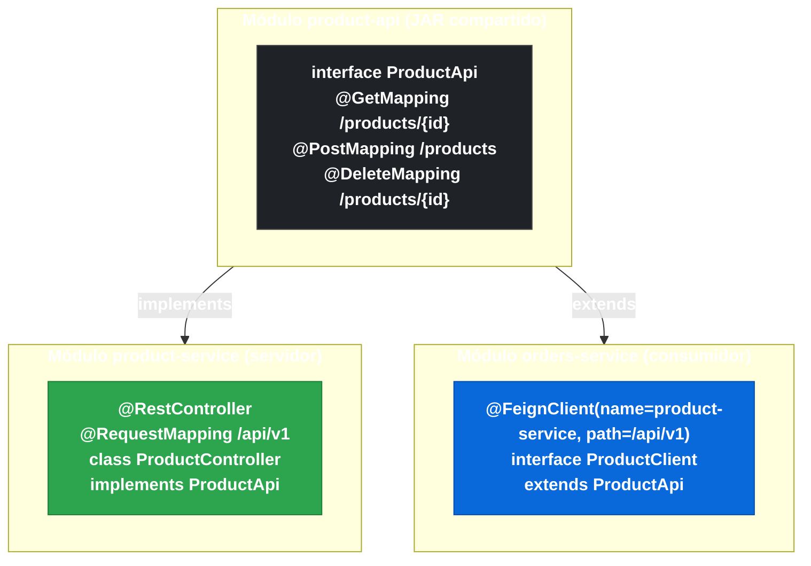

# 3.9.1 Herencia de interfaces API compartida

← [3.8 Timeouts y cliente HTTP subyacente](sc-feign-http-client.md) | [Índice](README.md) | [3.9.2 Compresión de peticiones y respuestas](sc-feign-compresion.md) →

---

## Introducción

El patrón de herencia de interfaces en Feign permite que el contrato HTTP de un servicio se defina una sola vez en una interfaz base compartida entre el productor (implementada por `@RestController`) y el consumidor (referenciada por `@FeignClient`). Este enfoque reduce la duplicación del contrato y garantiza que el cliente Feign y el servidor estén siempre sincronizados. Sin embargo, introduce un riesgo concreto: si la interfaz base contiene `@RequestMapping` a nivel de clase, Spring MVC puede interpretar esa anotación también en el `@RestController` que la implementa, causando ambigüedad de mapeo o rutas duplicadas en el contexto del servidor. Por eso, la documentación oficial de Spring Cloud OpenFeign advierte sobre este patrón con una recomendación explícita.

## Diagrama del patrón de herencia

El patrón conecta tres artefactos: la interfaz API (normalmente en un módulo compartido), el servidor que la implementa, y el cliente Feign que la referencia.


*Patrón de herencia: la interfaz base en el JAR compartido une al servidor (implements) y al cliente Feign (extends) en un único contrato.*

## Ejemplo central

El siguiente ejemplo muestra el patrón completo: interfaz base, implementación servidor, y cliente Feign. Incluye el problema del `@RequestMapping` en interfaz y cómo evitarlo correctamente.

```java
// product-api/src/main/java/com/example/api/ProductApi.java
// Interfaz base compartida — SIN @RequestMapping a nivel de clase
// (el prefijo de ruta se define en el @RequestMapping del @RestController
// o en el atributo 'path' del @FeignClient, no aquí)
package com.example.api;

import com.example.api.dto.ProductResponse;
import com.example.api.dto.CreateProductRequest;
import org.springframework.web.bind.annotation.DeleteMapping;
import org.springframework.web.bind.annotation.GetMapping;
import org.springframework.web.bind.annotation.PathVariable;
import org.springframework.web.bind.annotation.PostMapping;
import org.springframework.web.bind.annotation.RequestBody;

// CORRECTO: sin @RequestMapping a nivel de clase en la interfaz base
// Cada método define su propia ruta relativa
public interface ProductApi {

    @GetMapping("/products/{id}")
    ProductResponse getProduct(@PathVariable("id") Long id);

    @PostMapping("/products")
    ProductResponse createProduct(@RequestBody CreateProductRequest request);

    @DeleteMapping("/products/{id}")
    void deleteProduct(@PathVariable("id") Long id);
}
```

```java
// product-service/src/main/java/com/example/product/controller/ProductController.java
// Servidor: implementa la interfaz base
package com.example.product.controller;

import com.example.api.ProductApi;
import com.example.api.dto.CreateProductRequest;
import com.example.api.dto.ProductResponse;
import com.example.product.service.ProductService;
import org.springframework.web.bind.annotation.RequestMapping;
import org.springframework.web.bind.annotation.RestController;

@RestController
@RequestMapping("/api/v1")   // prefijo de ruta definido SOLO en el controller, no en la interfaz
public class ProductController implements ProductApi {

    private final ProductService productService;

    public ProductController(ProductService productService) {
        this.productService = productService;
    }

    @Override
    public ProductResponse getProduct(Long id) {
        return productService.findById(id);
    }

    @Override
    public ProductResponse createProduct(CreateProductRequest request) {
        return productService.create(request);
    }

    @Override
    public void deleteProduct(Long id) {
        productService.delete(id);
    }
}
```

```java
// orders-service/src/main/java/com/example/orders/clients/ProductClient.java
// Cliente Feign: extiende la interfaz base
package com.example.orders.clients;

import com.example.api.ProductApi;
import org.springframework.cloud.openfeign.FeignClient;

@FeignClient(
    name = "product-service",
    path = "/api/v1"          // prefijo definido aquí en el cliente, no en la interfaz base
)
public interface ProductClient extends ProductApi {
    // Hereda todos los métodos de ProductApi con sus anotaciones @GetMapping, @PostMapping, etc.
    // Puede añadir métodos adicionales si el cliente necesita endpoints extras
}
```

```java
// DTOs en el módulo compartido
package com.example.api.dto;

public record ProductResponse(Long id, String name, double price, int stock) {}

public record CreateProductRequest(String name, double price, int initialStock) {}
```

```java
// Ejemplo problemático — INCORRECTO: @RequestMapping en la interfaz base
// NO HACER ESTO en producción
package com.example.api;

import org.springframework.web.bind.annotation.GetMapping;
import org.springframework.web.bind.annotation.PathVariable;
import org.springframework.web.bind.annotation.RequestMapping;

// PROBLEMÁTICO: @RequestMapping a nivel de clase en la interfaz
@RequestMapping("/api/v1/products")  // ← RIESGO: Spring MVC lo detecta en el @RestController
public interface ProductApiWithMapping {

    @GetMapping("/{id}")   // resultado: GET /api/v1/products/{id}
    Object getProduct(@PathVariable Long id);

    // PROBLEMA: el @RestController que implementa esta interfaz hereda
    // el @RequestMapping("/api/v1/products"), lo que puede causar que
    // Spring Boot registre la ruta DOS veces si el controller también
    // tiene su propio @RequestMapping, generando ambigüedad.
}
```

## Cuándo usar y cuándo no usar el patrón

El patrón de herencia tiene ventajas claras en proyectos con API bien definidas, pero también tiene restricciones importantes:

| Aspecto | Valor |
|---|---|
| Ventaja principal | Un solo contrato: cambios en la interfaz base se propagan automáticamente al servidor y al cliente |
| Riesgo principal | `@RequestMapping` en la interfaz base puede causar ambigüedad en Spring MVC del servidor |
| Recomendación oficial | Definir rutas relativas en los métodos, no `@RequestMapping` a nivel de clase en la interfaz |
| Prefijo de ruta | Definirlo en `@RequestMapping` del `@RestController` y en `path` del `@FeignClient` |
| Módulo de la interfaz | Idealmente en un JAR API separado para evitar acoplamiento de classpath |

## Buenas y malas prácticas

**Buenas prácticas:**
- Colocar la interfaz API compartida en un módulo Maven/Gradle separado (`product-api`) para que tanto el servidor como los consumidores puedan depender de él.
- Definir el prefijo de ruta (`/api/v1`) en el `@RestController` del servidor y en `path` del `@FeignClient`, nunca en la interfaz base.
- Añadir solo los métodos que realmente deben compartirse: no todos los endpoints del servidor tienen que estar en la API compartida.

**Malas prácticas:**
- Añadir `@RequestMapping` a nivel de clase en la interfaz base: Spring MVC hereda esa anotación en el controller implementador, causando duplicación de rutas.
- Compartir DTOs con lógica de negocio en el módulo API: el módulo compartido debe contener solo contratos (interfaces y DTOs simples).

> [ADVERTENCIA] La documentación oficial de Spring Cloud OpenFeign advierte explícitamente: no se recomienda compartir interfaces entre servidor y cliente Feign si la interfaz contiene `@RequestMapping` a nivel de clase. Esto puede causar comportamientos inesperados en el servidor que implementa la interfaz. La práctica aceptada es poner solo las anotaciones de método en la interfaz.

## Verificación y práctica

> [EXAMEN] **1.** ¿Cuál es el principal riesgo de colocar `@RequestMapping` a nivel de clase en la interfaz base compartida por servidor y cliente Feign?

> [EXAMEN] **2.** Si la interfaz base no tiene `@RequestMapping` a nivel de clase, ¿dónde se define el prefijo de ruta para el servidor? ¿Y para el cliente Feign?

> [EXAMEN] **3.** ¿Qué ventaja ofrece el patrón de herencia de interfaces frente a definir la interfaz Feign y el controller por separado?

> [EXAMEN] **4.** ¿Por qué es recomendable colocar la interfaz API compartida en un módulo Maven separado?

> [EXAMEN] **5.** Si `ProductClient extends ProductApi` y `ProductApi` tiene un método `@GetMapping("/products/{id}")`, ¿qué URL completa se llamará si el `@FeignClient` tiene `path = "/api/v1"`?

---

← [3.8 Timeouts y cliente HTTP subyacente](sc-feign-http-client.md) | [Índice](README.md) | [3.9.2 Compresión de peticiones y respuestas](sc-feign-compresion.md) →
