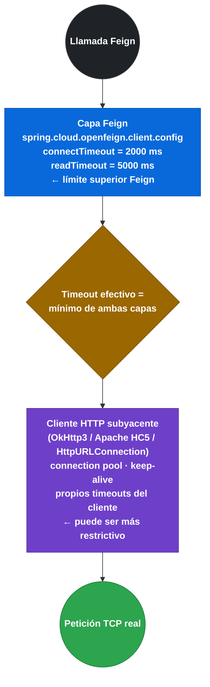

# 3.8 Timeouts y cliente HTTP subyacente

← [3.7 Integración con Resilience4j — Fallback y FallbackFactory](sc-feign-fallback.md) | [Índice](README.md) | [3.9.1 Herencia de interfaces API compartida](sc-feign-herencia.md) →

---

## Introducción

Feign es un cliente HTTP declarativo pero no implementa el transporte HTTP por sí mismo: delega la ejecución real de la petición a un cliente HTTP subyacente. Por defecto usa `java.net.HttpURLConnection`, que no tiene connection pool y crea una conexión TCP nueva por petición. Para producción este comportamiento es insuficiente. Spring Cloud OpenFeign soporta OkHttp3 y Apache HttpClient 5 como alternativas con connection pooling, keep-alive, y gestión avanzada de timeouts. La elección del cliente subyacente tiene implicaciones directas sobre la relación entre los timeouts configurados en Feign (`connectTimeout`/`readTimeout`) y los del cliente HTTP: si el cliente HTTP tiene un timeout más corto, este prevalece.

## Arquitectura de timeouts en capas

Hay dos capas donde se pueden configurar timeouts: la capa de Feign y la capa del cliente HTTP subyacente. Ambas deben estar alineadas para un comportamiento predecible.


*El timeout efectivo es el más corto de las dos capas — configurar solo Feign no es suficiente si el cliente HTTP tiene un límite más restrictivo.*

## Ejemplo central

El siguiente ejemplo muestra la configuración completa para los tres clientes HTTP disponibles: el default, OkHttp3 y Apache HttpClient 5. Incluye las propiedades de habilitación y la configuración del pool de conexiones.

```xml
<!-- pom.xml — añadir dependencias del cliente HTTP deseado -->

<!-- OkHttp3 -->
<dependency>
    <groupId>io.github.openfeign</groupId>
    <artifactId>feign-okhttp</artifactId>
    <!-- versión gestionada por spring-cloud-dependencies BOM -->
</dependency>
<dependency>
    <groupId>com.squareup.okhttp3</groupId>
    <artifactId>okhttp</artifactId>
</dependency>

<!-- Apache HttpClient 5 (HC5) -->
<dependency>
    <groupId>io.github.openfeign</groupId>
    <artifactId>feign-hc5</artifactId>
</dependency>
<dependency>
    <groupId>org.apache.httpcomponents.client5</groupId>
    <artifactId>httpclient5</artifactId>
</dependency>
```

```yaml
# application.yml — selección y configuración del cliente HTTP subyacente

spring:
  cloud:
    openfeign:
      # ── OPCIÓN A: OkHttp3 ─────────────────────────────────────────────────
      okhttp:
        enabled: true            # activa OkHttpClient como cliente HTTP de Feign

      # ── OPCIÓN B: Apache HttpClient 5 ─────────────────────────────────────
      # (mutuamente excluyentes: solo uno puede estar enabled=true)
      httpclient:
        hc5:
          enabled: true          # activa Apache HttpClient 5
          connection-timeout: 2000              # ms para establecer conexión
          connection-request-timeout: 3000      # ms esperando conexión del pool
          socket-timeout: 5000                  # ms esperando datos (read timeout)
          max-connections: 200                  # máximo de conexiones globales
          max-connections-per-route: 50         # máximo por host:puerto

      # Timeouts a nivel Feign (capa por encima del cliente HTTP)
      client:
        config:
          default:
            connectTimeout: 2000   # ms — tiempo máximo TCP connect
            readTimeout: 5000      # ms — tiempo máximo para leer respuesta
          payment-service:
            connectTimeout: 5000   # pagos pueden tardar más en conectar
            readTimeout: 15000     # y más en responder
```

```java
// Configuración programática de OkHttpClient con pool personalizado
// Registrar como @Bean para que Feign lo use en lugar de la auto-configuración
package com.example.demo.feign.config;

import okhttp3.ConnectionPool;
import okhttp3.OkHttpClient;
import org.springframework.context.annotation.Bean;
import org.springframework.context.annotation.Configuration;

import java.util.concurrent.TimeUnit;

@Configuration
public class OkHttpFeignConfig {

    @Bean
    public OkHttpClient okHttpClient() {
        return new OkHttpClient.Builder()
            // Connection pool: máx 50 conexiones idle, TTL 5 minutos
            .connectionPool(new ConnectionPool(50, 5, TimeUnit.MINUTES))
            // Timeouts del cliente HTTP (capa inferior a Feign)
            .connectTimeout(2, TimeUnit.SECONDS)
            .readTimeout(5, TimeUnit.SECONDS)
            .writeTimeout(5, TimeUnit.SECONDS)
            // Reintentos automáticos ante fallos de conexión (no de respuesta)
            .retryOnConnectionFailure(true)
            .build();
    }
}
```

```java
// Configuración programática de Apache HttpClient 5 con pool personalizado
package com.example.demo.feign.config;

import org.apache.hc.client5.http.impl.classic.CloseableHttpClient;
import org.apache.hc.client5.http.impl.classic.HttpClients;
import org.apache.hc.client5.http.impl.io.PoolingHttpClientConnectionManager;
import org.apache.hc.core5.util.TimeValue;
import org.apache.hc.core5.util.Timeout;
import org.springframework.context.annotation.Bean;
import org.springframework.context.annotation.Configuration;

@Configuration
public class HttpClient5FeignConfig {

    @Bean
    public CloseableHttpClient httpClient5() {
        PoolingHttpClientConnectionManager connectionManager =
            new PoolingHttpClientConnectionManager();
        connectionManager.setMaxTotal(200);
        connectionManager.setDefaultMaxPerRoute(50);
        // Validar conexión antes de reutilizarla (evita stale connections)
        connectionManager.setValidateAfterInactivity(TimeValue.ofSeconds(10));

        return HttpClients.custom()
            .setConnectionManager(connectionManager)
            .evictExpiredConnections()
            .evictIdleConnections(TimeValue.ofMinutes(3))
            .build();
    }
}
```

```java
// Test de configuración de timeout — verificación funcional
package com.example.demo;

import com.example.demo.clients.InventoryClient;
import com.github.tomakehurst.wiremock.client.WireMock;
import org.junit.jupiter.api.Test;
import org.springframework.beans.factory.annotation.Autowired;
import org.springframework.boot.test.context.SpringBootTest;
import org.springframework.cloud.contract.wiremock.AutoConfigureWireMock;

import static com.github.tomakehurst.wiremock.client.WireMock.*;
import static org.assertj.core.api.Assertions.assertThatThrownBy;

@SpringBootTest(webEnvironment = SpringBootTest.WebEnvironment.NONE,
    properties = {
        "spring.cloud.openfeign.client.config.inventory-service.readTimeout=500",
        "spring.cloud.openfeign.client.config.inventory-service.url=http://localhost:${wiremock.server.port}"
    })
@AutoConfigureWireMock(port = 0)
class FeignTimeoutTest {

    @Autowired
    private InventoryClient inventoryClient;

    @Test
    void shouldTimeoutAfterReadTimeout() {
        // Simular una respuesta lenta (2 segundos) con readTimeout de 500ms
        stubFor(get(urlEqualTo("/api/v1/items/1"))
            .willReturn(aResponse()
                .withFixedDelay(2000)     // delay de 2s > readTimeout de 500ms
                .withStatus(200)
                .withBody("{\"id\":1,\"name\":\"Item\",\"stock\":10}")));

        assertThatThrownBy(() -> inventoryClient.getItem(1L))
            .isInstanceOf(Exception.class);  // feign.RetryableException o SocketTimeoutException
    }
}
```

## Tabla comparativa de clientes HTTP

| Característica | Default (HttpURLConnection) | OkHttp3 | Apache HttpClient 5 |
|---|---|---|---|
| Connection Pool | No | Sí | Sí |
| Keep-Alive | No | Sí | Sí |
| HTTP/2 | No | Sí | Limitado |
| Reintentos de conexión | No | Configurable | Configurable |
| Configuración en YAML | Solo Feign | `okhttp.enabled=true` | `httpclient.hc5.enabled=true` |
| Uso recomendado | Tests / desarrollo | Producción (ligero) | Producción (avanzado) |

```mermaid
quadrantChart
    title Clientes HTTP de Feign: capacidad de producción vs simplicidad de configuración
    x-axis "Configuración simple" --> "Configuración avanzada"
    y-axis "Sin connection pool" --> "Pool + keep-alive + HTTP2"
    quadrant-1 Producción avanzada
    quadrant-2 Capacidad sin complejidad
    quadrant-3 Solo desarrollo/tests
    quadrant-4 Complejo pero limitado
    HttpURLConnection (default): [0.1, 0.05]
    OkHttp3: [0.45, 0.85]
    Apache HttpClient 5: [0.85, 0.80]
```
*Posicionamiento de los tres clientes HTTP de Feign: el cliente default queda fuera de producción por falta de connection pool.*

## Buenas y malas prácticas

**Buenas prácticas:**
- Usar siempre OkHttp3 o Apache HC5 en producción: el cliente default sin pool puede agotar conexiones bajo carga.
- Configurar `maxConnections` y `maxConnectionsPerRoute` según la carga esperada por servicio.
- Alinear los timeouts del cliente HTTP con los de Feign: el timeout efectivo es el mínimo de ambas capas.
- Habilitar `evictExpiredConnections()` en Apache HC5 para evitar uso de conexiones stale.

**Malas prácticas:**
- Configurar `readTimeout: 30000` en Feign pero olvidar que OkHttp tiene su propio `readTimeout(5, SECONDS)` más corto.
- Usar el cliente default en producción y no entender por qué hay latencias altas (sin keep-alive, cada petición abre nueva TCP).

> [ADVERTENCIA] Si tanto Feign como el cliente HTTP subyacente tienen timeouts configurados, el timeout efectivo es el **más corto** de los dos. Un `readTimeout: 10000` en Feign no ayuda si OkHttp tiene `readTimeout(2, SECONDS)`.

## Verificación y práctica

> [EXAMEN] **1.** ¿Cuál es el cliente HTTP subyacente que usa Feign por defecto y cuál es su principal limitación para producción?

> [EXAMEN] **2.** ¿Qué propiedad activa OkHttp3 como cliente HTTP subyacente de Feign? ¿Y Apache HttpClient 5?

> [EXAMEN] **3.** Tienes `spring.cloud.openfeign.client.config.default.readTimeout=10000` (10s) pero OkHttp está configurado con `readTimeout(2, SECONDS)`. ¿Cuál es el timeout efectivo?

> [EXAMEN] **4.** ¿Por qué el cliente HTTP default (HttpURLConnection) no es adecuado para producción en un entorno de microservicios de alta concurrencia?

> [EXAMEN] **5.** ¿Cómo se configura un `ConnectionPool` personalizado de OkHttp3 para Feign mediante un `@Bean`?

---

← [3.7 Integración con Resilience4j — Fallback y FallbackFactory](sc-feign-fallback.md) | [Índice](README.md) | [3.9.1 Herencia de interfaces API compartida](sc-feign-herencia.md) →
