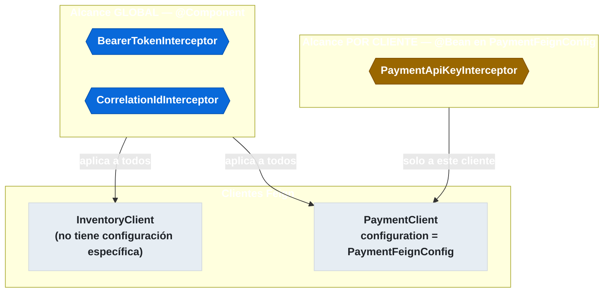

# 3.5 Interceptores de petición — RequestInterceptor

← [3.4.2 ErrorDecoder — manejo de errores HTTP](sc-feign-errores.md) | [Índice](README.md) | [3.6 Integración con Eureka y Spring Cloud LoadBalancer](sc-feign-eureka-lb.md) →

---

## Introducción

El `RequestInterceptor` de Feign es el mecanismo para enriquecer o modificar cualquier petición HTTP antes de que sea enviada al servicio remoto. Su caso de uso principal es la propagación de headers transversales que no forman parte del contrato de la interfaz del cliente: tokens de autorización (Bearer, API Key), identificadores de correlación para trazabilidad distribuida (`X-Correlation-Id`, `traceparent`), o cualquier header de contexto que todos los métodos del cliente deben incluir. Sin `RequestInterceptor`, cada método de la interfaz necesitaría un parámetro `@RequestHeader` adicional, lo que contamina el contrato y duplica lógica.

> [PREREQUISITO] Es importante distinguir el alcance del `RequestInterceptor`: cuando se registra como `@Bean` global afecta a todos los clientes Feign; cuando se registra en la clase de configuración específica de un cliente, solo afecta a ese cliente.

## Ciclo de vida del interceptor

El `RequestInterceptor` se ejecuta después de que Feign construye el `RequestTemplate` con los parámetros del método (path, query params, body) y antes de que el cliente HTTP subyacente envíe la petición.

```mermaid
flowchart LR
    CALL(("Método Feign\ninvocado"))
    TMPL["Feign construye\nRequestTemplate\n(path, headers, body)"]
    INT1{{"interceptor1.apply(template)\nañade headers, params…"}}
    INT2{{"interceptor2.apply(template)\nañade headers, params…"}}
    INTN{{"interceptorN.apply(template)\n(en orden de registro)"}}
    HTTP["HTTP Client envía\nla petición\n(OkHttp / HC5 / default)"]

    CALL --> TMPL
    TMPL --> INT1
    INT1 --> INT2
    INT2 --> INTN
    INTN --> HTTP

    classDef root      fill:#1f2328,color:#fff,stroke:#444,font-weight:bold
    classDef primary   fill:#0969da,color:#fff,stroke:#0550ae
    classDef secondary fill:#2da44e,color:#fff,stroke:#1a7f37
    classDef danger    fill:#cf222e,color:#fff,stroke:#a40e26
    classDef neutral   fill:#e6edf3,color:#1f2328,stroke:#d0d7de
    classDef warning   fill:#9a6700,color:#fff,stroke:#7d4e00
    classDef storage   fill:#6e40c9,color:#fff,stroke:#5a32a3

    class CALL root
    class TMPL primary
    class INT1,INT2,INTN warning
    class HTTP storage
```


*El RequestInterceptor actúa después de construir el RequestTemplate y antes de enviar la petición — los interceptores se aplican en cadena.*

## Ejemplo central

El siguiente ejemplo muestra tres interceptores con casos de uso diferentes: propagación de JWT Bearer token, propagación de correlation ID desde el contexto de la petición entrante, y añadido de un header de versión de API. También muestra cómo controlar el alcance (global vs por cliente).

```java
// Interceptor 1: propagar Authorization header con JWT
// Alcance: global (aplica a todos los clientes Feign)
package com.example.orders.feign;

import feign.RequestInterceptor;
import feign.RequestTemplate;
import org.springframework.security.core.Authentication;
import org.springframework.security.core.context.SecurityContextHolder;
import org.springframework.security.oauth2.server.resource.authentication.JwtAuthenticationToken;
import org.springframework.stereotype.Component;

@Component  // @Component lo registra como bean global → aplica a TODOS los clientes Feign
public class BearerTokenInterceptor implements RequestInterceptor {

    @Override
    public void apply(RequestTemplate template) {
        Authentication authentication = SecurityContextHolder.getContext().getAuthentication();

        if (authentication instanceof JwtAuthenticationToken jwtAuth) {
            String token = jwtAuth.getToken().getTokenValue();
            template.header("Authorization", "Bearer " + token);
        }
        // Si no hay autenticación activa, no se añade el header
        // (evita NullPointerException en tests o llamadas internas sin contexto)
    }
}
```

```java
// Interceptor 2: propagar Correlation ID para trazabilidad distribuida
// Alcance: global (añade el header a todos los servicios)
package com.example.orders.feign;

import feign.RequestInterceptor;
import feign.RequestTemplate;
import org.slf4j.MDC;
import org.springframework.stereotype.Component;

import java.util.UUID;

@Component
public class CorrelationIdInterceptor implements RequestInterceptor {

    private static final String CORRELATION_HEADER = "X-Correlation-Id";

    @Override
    public void apply(RequestTemplate template) {
        // Intentar obtener el correlation ID del MDC de Logback (propagado desde la petición entrante)
        String correlationId = MDC.get("correlationId");

        if (correlationId == null || correlationId.isBlank()) {
            // Si no existe, generar uno nuevo (llamada iniciada internamente)
            correlationId = UUID.randomUUID().toString();
        }

        template.header(CORRELATION_HEADER, correlationId);
        template.header("X-Source-Service", "orders-service");
    }
}
```

```java
// Interceptor 3: header de API Key para servicio externo de pagos
// Alcance: SOLO para payment-client (NO debe ser global)
package com.example.orders.feign;

import feign.RequestInterceptor;
import feign.RequestTemplate;
import org.springframework.beans.factory.annotation.Value;

// SIN @Component — se instancia solo desde la configuración del cliente específico
public class PaymentApiKeyInterceptor implements RequestInterceptor {

    private final String apiKey;

    // Constructor inyectado desde la configuración Feign del cliente
    public PaymentApiKeyInterceptor(String apiKey) {
        this.apiKey = apiKey;
    }

    @Override
    public void apply(RequestTemplate template) {
        template.header("X-API-Key", apiKey);
        template.header("X-API-Version", "v2");
    }
}
```

```java
// Configuración del cliente payment-service que registra el interceptor específico
package com.example.orders.feign.config;

import com.example.orders.feign.PaymentApiKeyInterceptor;
import feign.RequestInterceptor;
import org.springframework.beans.factory.annotation.Value;
import org.springframework.context.annotation.Bean;

// SIN @Configuration para evitar scope global
public class PaymentFeignConfig {

    @Value("${services.payment.api-key}")
    private String paymentApiKey;

    @Bean
    public RequestInterceptor paymentApiKeyInterceptor() {
        // Se instancia con el valor inyectado en esta configuración
        return new PaymentApiKeyInterceptor(paymentApiKey);
    }
}
```

```java
// Clientes Feign con distinto alcance de interceptores
package com.example.orders.clients;

import com.example.orders.dto.InventoryResponse;
import com.example.orders.dto.PaymentRequest;
import com.example.orders.dto.PaymentResponse;
import com.example.orders.feign.config.PaymentFeignConfig;
import org.springframework.cloud.openfeign.FeignClient;
import org.springframework.web.bind.annotation.GetMapping;
import org.springframework.web.bind.annotation.PathVariable;
import org.springframework.web.bind.annotation.PostMapping;
import org.springframework.web.bind.annotation.RequestBody;

// inventory-service: recibe BearerTokenInterceptor y CorrelationIdInterceptor (globales)
@FeignClient(name = "inventory-service", path = "/api/v1")
public interface InventoryClient {

    @GetMapping("/items/{id}")
    InventoryResponse getItem(@PathVariable("id") Long id);
}

// payment-service: recibe los globales + PaymentApiKeyInterceptor (específico)
@FeignClient(
    name = "payment-service",
    path = "/api/v1",
    configuration = PaymentFeignConfig.class
)
public interface PaymentClient {

    @PostMapping("/payments")
    PaymentResponse processPayment(@RequestBody PaymentRequest request);
}
```

## Tabla de métodos de RequestTemplate

El `RequestTemplate` que recibe el interceptor expone los siguientes métodos relevantes:

| Método | Efecto |
|---|---|
| `template.header(name, values)` | Añade o sobreescribe un header HTTP |
| `template.headers()` | Devuelve todos los headers actuales (solo lectura) |
| `template.query(name, values)` | Añade o sobreescribe un query parameter |
| `template.queries()` | Devuelve todos los query params actuales |
| `template.url()` | Devuelve la URL de la petición |
| `template.method()` | Devuelve el método HTTP (GET, POST, etc.) |
| `template.body(body, charset)` | Sobreescribe el cuerpo de la petición |

## Alcance global vs por cliente

La diferencia de alcance es uno de los conceptos más evaluados en el examen:

- **Global**: el interceptor es un `@Component` o un `@Bean` en una clase con `@Configuration` dentro del scan. Se aplica a **todos** los clientes Feign del contexto.
- **Por cliente**: el interceptor es un `@Bean` registrado en la clase de configuración específica del cliente (referenciada en `configuration = MiConfig.class`). Se aplica **solo** a ese cliente.


*Interceptores globales llegan a todos los clientes; los interceptores por cliente solo afectan al cliente que referencia su configuración.*

Un interceptor global que lee el `SecurityContext` puede causar problemas en threads que no tienen autenticación (calls asíncronas, scheduled tasks). Hay que manejar los nulos con cuidado.

## Buenas y malas prácticas

**Buenas prácticas:**
- Usar interceptores globales para headers de infraestructura transversales (correlation ID, tracing).
- Usar interceptores por cliente para credenciales específicas del servicio destino (API keys, tokens de sistema).
- Verificar null-safety en el interceptor cuando lee del `SecurityContextHolder`: en tests y llamadas asíncronas puede estar vacío.

**Malas prácticas:**
- Registrar un interceptor de API key como `@Component` global: todos los clientes Feign enviarán esa API key a todos los servicios.
- Modificar el cuerpo de la petición en un `RequestInterceptor` sin coordinación con el `Encoder`: puede corromper el payload.

> [ADVERTENCIA] Si un `RequestInterceptor` lanza una excepción (por ejemplo, al leer el `SecurityContext` en un contexto sin autenticación), Feign propagará la excepción al llamador sin enviar la petición. Siempre protege el interceptor con comprobaciones null-safe.

## Verificación y práctica

> [EXAMEN] **1.** ¿En qué momento del ciclo de vida de la petición Feign se ejecuta el `RequestInterceptor`: antes o después de construir el `RequestTemplate`?

> [EXAMEN] **2.** Tienes un `RequestInterceptor` anotado con `@Component` para añadir un header de API Key específico de `payment-service`. ¿Qué problema causa este diseño?

> [EXAMEN] **3.** ¿Cómo se limita un `RequestInterceptor` para que solo aplique a un cliente Feign específico y no a todos los demás?

> [EXAMEN] **4.** Un `RequestInterceptor` lee el token JWT del `SecurityContextHolder`. Si el interceptor se invoca desde un thread `@Async` que no hereda el contexto de seguridad, ¿qué ocurre? ¿Cómo lo evitarías?

> [EXAMEN] **5.** ¿Es posible registrar múltiples `RequestInterceptor` para un mismo cliente Feign? ¿En qué orden se aplican?

---

← [3.4.2 ErrorDecoder — manejo de errores HTTP](sc-feign-errores.md) | [Índice](README.md) | [3.6 Integración con Eureka y Spring Cloud LoadBalancer](sc-feign-eureka-lb.md) →
