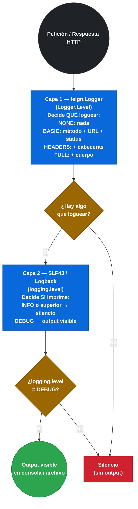
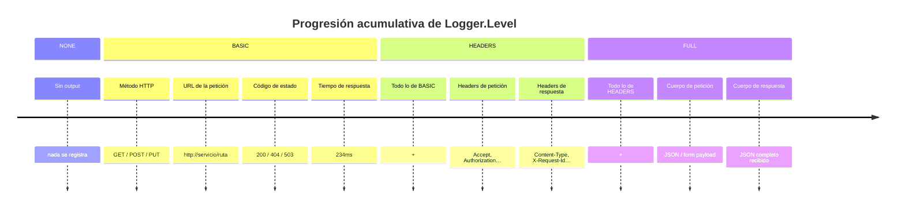

# 3.4.1 Logger.Level y configuración dual de logging

← [3.3 Codecs — Encoder y Decoder en Feign](sc-feign-codecs.md) | [Índice](README.md) | [3.4.2 ErrorDecoder — manejo de errores HTTP](sc-feign-errores.md) →

---

## Introducción

El logging de Feign responde a una necesidad concreta en el desarrollo y diagnóstico de clientes HTTP declarativos: ver exactamente qué petición se está enviando y qué respuesta se está recibiendo, sin necesidad de capturar tráfico de red. Feign tiene su propio sistema de logging con cuatro niveles de verbosidad (`Logger.Level`), pero existe una trampa crítica: configurar `Logger.Level` en Feign no produce ningún output si el logger del framework (SLF4J/Logback) no está configurado a nivel `DEBUG` para el paquete del cliente. Este requisito de **configuración dual** es uno de los conceptos más frecuentes en el examen de certificación Spring Professional.

## Arquitectura del logging en Feign

Feign delega la emisión de logs en el logger del framework (SLF4J/Logback), pero primero aplica su propio filtro de verbosidad. Son dos capas independientes que deben estar alineadas.


*Doble capa de logging: Feign filtra el contenido y SLF4J decide si llega a la salida — ambas deben estar alineadas.*

## Ejemplo central

El siguiente ejemplo muestra la configuración completa del logging de Feign: registro del `Logger.Level` mediante clase Java, registro equivalente por propiedades, y la configuración de SLF4J obligatoria para ver el output.

```java
// Opción A: configuración por clase Java
package com.example.demo.feign.config;

import feign.Logger;
import org.springframework.context.annotation.Bean;

// Sin @Configuration para que no contamine el scan global
public class DebugFeignConfig {

    @Bean
    public Logger.Level feignLoggerLevel() {
        // FULL: registra método, URL, headers de petición y respuesta, cuerpo de ambos
        // Usar solo en desarrollo — en producción puede exponer datos sensibles
        return Logger.Level.FULL;
    }
}
```

```java
// Cliente que usa la configuración de logging de debug
package com.example.demo.clients;

import com.example.demo.dto.ProductResponse;
import com.example.demo.feign.config.DebugFeignConfig;
import org.springframework.cloud.openfeign.FeignClient;
import org.springframework.web.bind.annotation.GetMapping;
import org.springframework.web.bind.annotation.PathVariable;

@FeignClient(
    name = "product-service",
    configuration = DebugFeignConfig.class
)
public interface ProductClient {

    @GetMapping("/products/{id}")
    ProductResponse getProduct(@PathVariable("id") Long id);
}
```

```yaml
# application.yml — Opción B: Logger.Level por propiedades (equivalente a la clase Java)
spring:
  cloud:
    openfeign:
      client:
        config:
          product-service:
            loggerLevel: FULL        # NONE | BASIC | HEADERS | FULL

          # Para todos los clientes:
          default:
            loggerLevel: BASIC

# OBLIGATORIO: configuración del nivel del logger del framework
# Sin esto, Logger.Level=FULL no produce NINGÚN output
logging:
  level:
    # Opción 1: nivel por paquete donde viven los clientes Feign
    com.example.demo.clients: DEBUG

    # Opción 2: nivel por FQN del cliente específico
    # com.example.demo.clients.ProductClient: DEBUG

    # Opción 3: todos los loggers de Feign (más verboso, incluye internos)
    # feign: DEBUG
```

```yaml
# Configuración por perfil: diferente verbosidad en dev vs prod
---
spring:
  config:
    activate:
      on-profile: dev
logging:
  level:
    com.example.demo.clients: DEBUG

---
spring:
  config:
    activate:
      on-profile: prod
spring:
  cloud:
    openfeign:
      client:
        config:
          default:
            loggerLevel: NONE      # sin logging en producción
logging:
  level:
    com.example.demo.clients: INFO  # incluso si loggerLevel cambia, INFO silencia todo
```

```
# Ejemplo de output de cada nivel Logger.Level

# NONE (defecto): sin output

# BASIC:
[ProductClient#getProduct] ---> GET http://product-service/products/42 HTTP/1.1
[ProductClient#getProduct] <--- HTTP/1.1 200 OK (234ms)

# HEADERS:
[ProductClient#getProduct] ---> GET http://product-service/products/42 HTTP/1.1
[ProductClient#getProduct] Accept: application/json
[ProductClient#getProduct] Content-Type: application/json
[ProductClient#getProduct] ---> END HTTP (0-byte body)
[ProductClient#getProduct] <--- HTTP/1.1 200 OK (234ms)
[ProductClient#getProduct] Content-Type: application/json;charset=UTF-8
[ProductClient#getProduct] <--- END HTTP (156-byte body)

# FULL (incluye cuerpos):
[ProductClient#getProduct] ---> GET http://product-service/products/42 HTTP/1.1
[ProductClient#getProduct] Accept: application/json
[ProductClient#getProduct] ---> END HTTP (0-byte body)
[ProductClient#getProduct] <--- HTTP/1.1 200 OK (234ms)
[ProductClient#getProduct] Content-Type: application/json;charset=UTF-8
[ProductClient#getProduct] {"id":42,"name":"Widget Pro","price":29.99}
[ProductClient#getProduct] <--- END HTTP (42-byte body)
```

## Tabla de niveles Logger.Level

La elección del nivel afecta tanto a la visibilidad como al rendimiento, porque la serialización del cuerpo tiene un coste adicional:

| Nivel | Registra | Rendimiento | Uso recomendado |
|---|---|---|---|
| `NONE` | Nada | Sin impacto | Producción por defecto |
| `BASIC` | Método HTTP, URL, código de estado, tiempo de respuesta | Mínimo | Producción (monitorización) |
| `HEADERS` | Todo lo de BASIC + headers de petición y respuesta | Bajo | Pre-producción, debugging de autenticación |
| `FULL` | Todo lo de HEADERS + cuerpo de petición y respuesta | Moderado | Desarrollo, debugging local |


*Cada nivel incluye acumulativamente lo del anterior — FULL expone el mayor detalle pero también el mayor riesgo en producción.*

## Buenas y malas prácticas

**Buenas prácticas:**
- Usar `Logger.Level.NONE` (defecto) en producción para evitar exposición de datos sensibles y reducir I/O de logging.
- Configurar `Logger.Level.BASIC` en producción si se quiere medir latencias de llamadas Feign sin exponer payloads.
- Verificar siempre que `logging.level.<paquete>: DEBUG` esté activo en el perfil donde se activa `HEADERS` o `FULL`.
- Activar `FULL` solo para el cliente específico bajo diagnóstico, no globalmente.

**Malas prácticas:**
- Activar `Logger.Level.FULL` en producción: puede loguear tokens de autorización, datos de usuario, etc.
- Configurar `loggerLevel: FULL` sin `logging.level: DEBUG` y no entender por qué no aparece nada.
- Usar `feign: DEBUG` en producción como nivel global: genera volumen masivo de logs internos de Feign.

> [ADVERTENCIA] `Logger.Level.FULL` loguea el cuerpo completo de petición y respuesta. Si los payloads contienen contraseñas, tokens JWT, datos personales (PII) o información sensible, este nivel puede provocar una brecha de seguridad en los logs. Nunca activar `FULL` en producción sin redacción de datos sensibles.

## Verificación y práctica

> [EXAMEN] **1.** Configuras `loggerLevel: FULL` para el cliente `product-service` pero no aparece ningún log de Feign en la consola. ¿Cuál es la causa y qué configuración adicional es necesaria?

> [EXAMEN] **2.** ¿Qué nivel `Logger.Level` registra el tiempo que tarda la respuesta HTTP? ¿Y qué nivel incluye el cuerpo de la respuesta?

> [EXAMEN] **3.** ¿Cuál es el valor por defecto de `Logger.Level` si no se configura explícitamente?

> [EXAMEN] **4.** ¿Es posible tener `Logger.Level.FULL` para `inventory-service` y `Logger.Level.NONE` para `payment-service` simultáneamente? Explica cómo.

> [EXAMEN] **5.** ¿Por qué activar `Logger.Level.FULL` en producción es un riesgo de seguridad?

---

← [3.3 Codecs — Encoder y Decoder en Feign](sc-feign-codecs.md) | [Índice](README.md) | [3.4.2 ErrorDecoder — manejo de errores HTTP](sc-feign-errores.md) →
