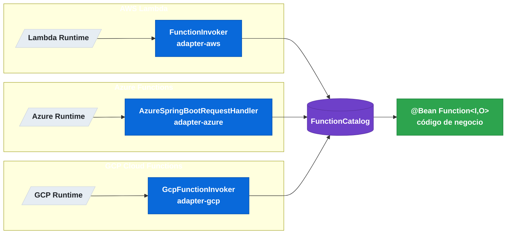

# 12.4 Spring Cloud Function — Adaptadores cloud (AWS / Azure / GCP)

← [12.3 Adaptador HTTP](sc-function-adaptador-http.md) | [Índice](README.md) | [12.5 Composición de funciones →](sc-function-composicion.md)

---

## Introducción

Spring Cloud Function proporciona adaptadores específicos para los tres principales proveedores de funciones serverless: AWS Lambda, Azure Functions y GCP Cloud Functions. Cada adaptador actúa como puente entre el runtime nativo del proveedor y el contexto Spring, permitiendo que el mismo bean `Function` se despliegue en cualquier plataforma cloud con cambios mínimos de configuración.

> [CONCEPTO] Un adaptador cloud es una capa de integración que implementa la interfaz handler nativa del proveedor (por ejemplo, `RequestHandler` de AWS) y delega la invocación al bean funcional registrado en `FunctionCatalog`. El código de negocio no cambia entre plataformas.

> [PREREQUISITO] Cada adaptador es una dependencia separada que NO se incluye con los starters de función web. Se añade específicamente para el proveedor target.

## Diagrama de adaptadores cloud

El siguiente diagrama muestra cómo cada plataforma invoca el handler de SCF, que delega al bean funcional del contexto Spring.


*Cada adaptador cloud implementa la interfaz handler nativa del proveedor y delega al mismo FunctionCatalog compartido.*

## Ejemplo central

El siguiente ejemplo muestra la configuración completa del adaptador AWS Lambda con `FunctionInvoker`, incluyendo la dependencia Maven, el handler a declarar y el empaquetado shaded JAR.

```xml
<!-- pom.xml — Adaptador AWS Lambda -->
<dependency>
    <groupId>org.springframework.cloud</groupId>
    <artifactId>spring-cloud-function-adapter-aws</artifactId>
</dependency>

<!-- Plugin para generar el shaded JAR requerido por AWS Lambda -->
<plugin>
    <groupId>org.apache.maven.plugins</groupId>
    <artifactId>maven-shade-plugin</artifactId>
    <configuration>
        <createDependencyReducedPom>false</createDependencyReducedPom>
        <shadedArtifactAttached>true</shadedArtifactAttached>
        <shadedClassifierName>aws</shadedClassifierName>
    </configuration>
    <executions>
        <execution>
            <phase>package</phase>
            <goals><goal>shade</goal></goals>
        </execution>
    </executions>
</plugin>
```

```java
package com.example.lambda;

import org.springframework.boot.SpringApplication;
import org.springframework.boot.autoconfigure.SpringBootApplication;
import org.springframework.context.annotation.Bean;

import java.util.function.Function;

@SpringBootApplication
public class LambdaApplication {

    public static void main(String[] args) {
        SpringApplication.run(LambdaApplication.class, args);
    }

    @Bean
    public Function<String, String> uppercase() {
        return value -> value.toUpperCase();
    }
}
```

Configuración `application.yml` para Lambda:

```yaml
spring:
  cloud:
    function:
      definition: uppercase   # función a exponer en Lambda
```

En la consola de AWS Lambda, configurar el handler como:

```
org.springframework.cloud.function.adapter.aws.FunctionInvoker::handleRequest
```

Ejemplo de configuración para **Azure Functions**:

```xml
<!-- pom.xml — Adaptador Azure Functions -->
<dependency>
    <groupId>org.springframework.cloud</groupId>
    <artifactId>spring-cloud-function-adapter-azure</artifactId>
</dependency>
```

```java
package com.example.azure;

import com.microsoft.azure.functions.ExecutionContext;
import com.microsoft.azure.functions.HttpMethod;
import com.microsoft.azure.functions.HttpRequestMessage;
import com.microsoft.azure.functions.HttpResponseMessage;
import com.microsoft.azure.functions.annotation.AuthorizationLevel;
import com.microsoft.azure.functions.annotation.FunctionName;
import com.microsoft.azure.functions.annotation.HttpTrigger;
import org.springframework.cloud.function.adapter.azure.AzureSpringBootRequestHandler;

import java.util.Optional;

public class AzureUppercaseHandler
        extends AzureSpringBootRequestHandler<String, String> {

    @FunctionName("uppercase")
    public HttpResponseMessage execute(
            @HttpTrigger(
                name = "req",
                methods = {HttpMethod.POST},
                authLevel = AuthorizationLevel.ANONYMOUS)
            HttpRequestMessage<Optional<String>> request,
            ExecutionContext context) {
        return handleRequest(request.getBody().orElse(""), context);
    }
}
```

> [ADVERTENCIA] Para AWS Lambda, el JAR desplegable debe ser el **shaded JAR** (con todas las dependencias embebidas), no el JAR estándar de Spring Boot. El fat JAR de Spring Boot tiene un formato de classpath incompatible con el runtime de Lambda.

> [ADVERTENCIA] El cold start de AWS Lambda con Spring Boot puede superar 5 segundos en el primer invocation. Para mitigarlo: usar GraalVM native image, Spring AOT o provisioned concurrency.

## Tabla de elementos clave

La siguiente tabla compara los tres adaptadores cloud.

| Adaptador | Artefacto Maven | Handler a configurar | Formato JAR |
|---|---|---|---|
| AWS Lambda | `spring-cloud-function-adapter-aws` | `FunctionInvoker::handleRequest` | Shaded JAR |
| Azure Functions | `spring-cloud-function-adapter-azure` | Extender `AzureSpringBootRequestHandler` | JAR estándar |
| GCP Cloud Functions | `spring-cloud-function-adapter-gcp` | Extender `GcpFunctionInvoker` | JAR estándar |

## Buenas y malas prácticas

**Buenas prácticas:**
- Declarar siempre `spring.cloud.function.definition` en `application.yml` para que el adaptador sepa qué función invocar.
- Usar el **shaded JAR** con el plugin `maven-shade-plugin` para AWS Lambda.
- Minimizar las dependencias del classpath para reducir el cold start time.
- Probar localmente con el adaptador HTTP antes de desplegar en cloud — el mismo bean funciona en ambos contextos.

**Malas prácticas:**
- Usar el fat JAR de `spring-boot-maven-plugin` para AWS Lambda — el classloader de Lambda no lo soporta.
- Omitir `spring.cloud.function.definition` cuando hay múltiples beans funcionales — el adaptador no sabrá cuál invocar.
- Mezclar código específico del proveedor cloud (AWS SDK, Azure SDK) directamente en el bean funcional.

## Verificación y práctica

> [EXAMEN] ¿Qué clase de Spring Cloud Function se configura como handler en AWS Lambda para delegar la invocación a un bean `Function`?

> [EXAMEN] ¿Por qué el fat JAR generado por `spring-boot-maven-plugin` no es compatible con AWS Lambda, y qué alternativa se usa?

> [EXAMEN] ¿Qué propiedad de configuración debe declararse en `application.yml` para que el adaptador cloud sepa qué función exponer?

> [EXAMEN] ¿Cuál es la principal causa del cold start elevado en AWS Lambda con Spring Boot y qué estrategias permiten mitigarlo?

---

← [12.3 Adaptador HTTP](sc-function-adaptador-http.md) | [Índice](README.md) | [12.5 Composición de funciones →](sc-function-composicion.md)
