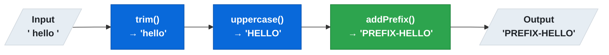
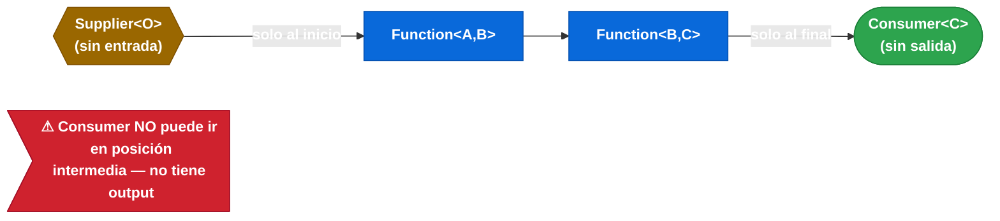

# 12.5 Spring Cloud Function — Composición de funciones

← [12.4 Adaptadores cloud](sc-function-adaptadores-cloud.md) | [Índice](README.md) | [12.6 Message y MessageHeaders →](sc-function-message-headers.md)

---

## Introducción

La composición de funciones en Spring Cloud Function permite encadenar múltiples beans funcionales en un pipeline de transformación. SCF soporta dos mecanismos: composición declarativa mediante el operador `|` en la propiedad `spring.cloud.function.definition`, y composición programática usando los métodos `andThen()` y `compose()` sobre funciones obtenidas desde `FunctionCatalog`. Ambos mecanismos producen una función compuesta que puede invocarse como unidad.

> [CONCEPTO] La composición con `|` en `spring.cloud.function.definition` crea un pipeline donde el output de la función izquierda es el input de la función derecha. El nombre resultante de la composición es `"f1|f2"` y se usa como URL en el adaptador HTTP.

> [CONCEPTO] La composición programática usa `Function.andThen(after)` — equivalente a `f1.andThen(f2)` que ejecuta `f1` primero — o `Function.compose(before)` que ejecuta el argumento primero.

## Diagrama de composición

El siguiente diagrama muestra los dos mecanismos de composición y el pipeline resultante.


*Pipeline declarativo `trim|uppercase|addPrefix`: cada función transforma el valor y lo pasa al siguiente nodo.*

## Ejemplo central

El siguiente ejemplo muestra ambos mecanismos de composición con la definición de los beans funcionales y la configuración correspondiente.

```java
package com.example.demo;

import org.springframework.boot.SpringApplication;
import org.springframework.boot.autoconfigure.SpringBootApplication;
import org.springframework.cloud.function.context.FunctionCatalog;
import org.springframework.context.annotation.Bean;
import org.springframework.stereotype.Service;

import java.util.function.Function;

@SpringBootApplication
public class CompositionApplication {

    public static void main(String[] args) {
        SpringApplication.run(CompositionApplication.class, args);
    }

    @Bean
    public Function<String, String> trim() {
        return String::trim;
    }

    @Bean
    public Function<String, String> uppercase() {
        return String::toUpperCase;
    }

    @Bean
    public Function<String, String> addPrefix() {
        return value -> "PREFIX-" + value;
    }
}
```

```yaml
# application.yml — Composición declarativa
spring:
  cloud:
    function:
      # Pipeline: trim → uppercase → addPrefix
      # URL resultante: POST /trim|uppercase|addPrefix
      definition: trim|uppercase|addPrefix
```

Composición programática desde un servicio:

```java
package com.example.demo.service;

import org.springframework.cloud.function.context.FunctionCatalog;
import org.springframework.stereotype.Service;

import java.util.function.Function;

@Service
public class CompositionService {

    private final FunctionCatalog catalog;

    public CompositionService(FunctionCatalog catalog) {
        this.catalog = catalog;
    }

    /**
     * Composición con andThen: trim se ejecuta primero, uppercase después.
     * f1.andThen(f2) == f2(f1(x))
     */
    public String trimThenUppercase(String input) {
        Function<String, String> trim = catalog.lookup("trim");
        Function<String, String> uppercase = catalog.lookup("uppercase");
        return trim.andThen(uppercase).apply(input);
    }

    /**
     * Composición con compose: uppercase.compose(trim) ejecuta trim primero.
     * f2.compose(f1) == f2(f1(x)) — mismo resultado que andThen pero orden invertido
     */
    public String composeUppercaseAfterTrim(String input) {
        Function<String, String> trim = catalog.lookup("trim");
        Function<String, String> uppercase = catalog.lookup("uppercase");
        return uppercase.compose(trim).apply(input);
    }

    /**
     * Lookup de composición ya materializada en el catálogo.
     * SCF registra "trim|uppercase" como función compuesta si está en definition.
     */
    public String applyRegisteredComposition(String input) {
        Function<String, String> pipeline = catalog.lookup("trim|uppercase");
        return pipeline.apply(input);
    }
}
```

> [ADVERTENCIA] La composición con `|` solo funciona cuando los tipos genéricos son compatibles: el tipo de salida de `f1` debe ser asignable al tipo de entrada de `f2`. SCF valida esto en tiempo de arranque y lanza una excepción si hay incompatibilidad de tipos.

## Tabla de elementos clave

La siguiente tabla resume las dos formas de composición y sus características.

| Mecanismo | Sintaxis | Cuándo usar | URL generada |
|---|---|---|---|
| Declarativa con `\|` | `definition: f1\|f2` | Composición fija conocida en deploy | `POST /f1\|f2` |
| `andThen()` | `f1.andThen(f2)` | Composición dinámica en código | No genera URL |
| `compose()` | `f2.compose(f1)` | Composición inversa dinámica | No genera URL |
| Lookup compuesto | `catalog.lookup("f1\|f2")` | Reusar composición registrada | Usa la ya registrada |

## Comparación: composición con Consumer y Supplier

La composición con `|` puede involucrar `Supplier` al inicio y `Consumer` al final de la cadena. `Supplier` no tiene input, por lo que solo puede aparecer como primer elemento. `Consumer` no tiene output, por lo que solo puede aparecer como último elemento.

```yaml
# Válido: Supplier → Function → Consumer
spring.cloud.function.definition: eventSource|uppercase|logMessage

# NO válido: Consumer en posición intermedia — no tiene output
# spring.cloud.function.definition: logMessage|uppercase  (ERROR)
```


*Posiciones válidas de Supplier y Consumer en una cadena `|`: Supplier solo al inicio, Consumer solo al final.*

## Buenas y malas prácticas

**Buenas prácticas:**
- Usar composición declarativa (`|`) para pipelines estáticos conocidos en tiempo de configuración.
- Usar composición programática para pipelines dinámicos que dependen de condiciones en runtime.
- Mantener cada función con una única responsabilidad para facilitar la reutilización en distintas composiciones.

**Malas prácticas:**
- Crear una función "monolítica" que hace todo el trabajo en lugar de componer funciones especializadas.
- Mezclar tipos incompatibles en una cadena `|` sin verificar la compatibilidad genérica.
- Usar `compose()` cuando se intenta `andThen()` — producen el mismo resultado pero confunden la intención del código.

## Verificación y práctica

> [EXAMEN] ¿Cómo se declaran dos funciones `trim` y `uppercase` en `spring.cloud.function.definition` para que se ejecuten en pipeline y cuál es la URL resultante?

> [EXAMEN] ¿Cuál es la diferencia entre `f1.andThen(f2)` y `f2.compose(f1)` en términos del orden de ejecución?

> [EXAMEN] ¿En qué posición de una cadena `|` puede aparecer un `Supplier` y un `Consumer`, y por qué?

> [EXAMEN] ¿Qué ocurre en tiempo de arranque si los tipos genéricos de dos funciones encadenadas con `|` son incompatibles?

---

← [12.4 Adaptadores cloud](sc-function-adaptadores-cloud.md) | [Índice](README.md) | [12.6 Message y MessageHeaders →](sc-function-message-headers.md)
