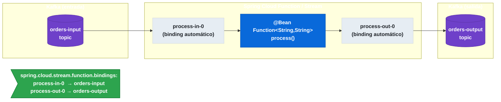

# 12.8 Spring Cloud Function — Integración con Spring Cloud Stream

← [12.7 Routing dinámico](sc-function-routing.md) | [Índice](README.md) | [12.9 Tipos reactivos →](sc-function-tipos-reactivos.md)

---

## Introducción

Desde Spring Cloud Stream 3.x, los beans `Function`, `Consumer` y `Supplier` declarados en el contexto Spring son el mecanismo nativo para definir handlers de mensajería. Spring Cloud Stream detecta automáticamente estos beans y los vincula a canales de Kafka, RabbitMQ u otros brokers siguiendo una convención de nombres. Spring Cloud Function es, por tanto, el modelo de programación subyacente de Spring Cloud Stream moderno.

> [CONCEPTO] La convención de nombres de binding automático es: `{functionName}-in-{index}` para canales de entrada y `{functionName}-out-{index}` para canales de salida. Por ejemplo, un bean `Function<String,String>` llamado `process` genera automáticamente los bindings `process-in-0` y `process-out-0`.

> [CONCEPTO] La propiedad `spring.cloud.stream.function.bindings` permite mapear explícitamente el nombre de binding convencional a un nombre de destino personalizado (topic de Kafka, exchange de RabbitMQ, etc.).

> [PREREQUISITO] Para la integración SCF + Stream se necesita un starter de binder: `spring-cloud-starter-stream-kafka` o `spring-cloud-starter-stream-rabbit`. Ver [6.4 Spring Cloud Stream — Binder abstraction](sc-stream-binder-abstraction.md).

## Diagrama de integración SCF + Stream

El siguiente diagrama muestra cómo los beans funcionales se conectan a los topics del broker mediante el sistema de binding.


*Convención de nombres `{functionName}-in-{index}` / `{functionName}-out-{index}` y mapeo explícito al nombre del topic Kafka.*

## Ejemplo central

El siguiente ejemplo muestra la configuración completa de tres tipos funcionales con Spring Cloud Stream y Kafka, incluyendo el mapeo explícito de bindings.

```java
package com.example.demo;

import org.springframework.boot.SpringApplication;
import org.springframework.boot.autoconfigure.SpringBootApplication;
import org.springframework.context.annotation.Bean;

import java.util.function.Consumer;
import java.util.function.Function;
import java.util.function.Supplier;

@SpringBootApplication
public class StreamFunctionApplication {

    public static void main(String[] args) {
        SpringApplication.run(StreamFunctionApplication.class, args);
    }

    /**
     * Function: transforma mensajes de entrada y produce mensajes de salida.
     * Bindings automáticos: processOrder-in-0 y processOrder-out-0
     */
    @Bean
    public Function<String, String> processOrder() {
        return order -> "PROCESSED: " + order.toUpperCase();
    }

    /**
     * Consumer: consume mensajes sin producir salida.
     * Binding automático: auditLog-in-0 (solo entrada)
     */
    @Bean
    public Consumer<String> auditLog() {
        return message -> System.out.println("AUDIT: " + message);
    }

    /**
     * Supplier: genera mensajes periódicamente sin input.
     * Binding automático: heartbeat-out-0 (solo salida)
     * Spring Cloud Stream invoca Supplier cada segundo por defecto.
     */
    @Bean
    public Supplier<String> heartbeat() {
        return () -> "PING-" + System.currentTimeMillis();
    }
}
```

Configuración `application.yml` con Kafka:

```yaml
spring:
  cloud:
    function:
      # Declarar qué funciones expone Stream
      definition: processOrder;auditLog;heartbeat

    stream:
      function:
        bindings:
          # Mapear nombre de binding convencional a nombre de destino real
          processOrder-in-0: orders-input     # topic Kafka de entrada
          processOrder-out-0: orders-output   # topic Kafka de salida
          auditLog-in-0: audit-events         # topic Kafka para auditoría
          heartbeat-out-0: heartbeats         # topic Kafka para heartbeats

      bindings:
        orders-input:
          group: order-processors             # consumer group Kafka
          consumer:
            max-attempts: 3
        orders-output:
          destination: orders-output

      kafka:
        binder:
          brokers: localhost:9092

  # Frecuencia de invocación del Supplier (en milisegundos)
  integration:
    poller:
      fixed-delay: 5000
```

> [ADVERTENCIA] El separador en `spring.cloud.function.definition` para múltiples funciones con Spring Cloud Stream es el punto y coma `;`, no la coma `,`. La coma es válida en otros contextos pero puede causar comportamiento inesperado con Stream.

> [ADVERTENCIA] Un `Supplier` en integración con Spring Cloud Stream se invoca automáticamente en un poller. Si el `Supplier` realiza operaciones costosas, ajustar la frecuencia con `spring.integration.poller.fixed-delay`.

## Tabla de elementos clave

La siguiente tabla resume la convención de nombres de binding para cada tipo funcional.

| Tipo de bean | Binding de entrada | Binding de salida | Ejemplo |
|---|---|---|---|
| `Function<I,O>` | `name-in-0` | `name-out-0` | `process-in-0`, `process-out-0` |
| `Consumer<I>` | `name-in-0` | (ninguno) | `auditLog-in-0` |
| `Supplier<O>` | (ninguno) | `name-out-0` | `heartbeat-out-0` |
| Función con múltiples inputs | `name-in-0`, `name-in-1` | `name-out-0` | Reactiva con `Tuple2` |

## Buenas y malas prácticas

**Buenas prácticas:**
- Usar `spring.cloud.stream.function.bindings` para desacoplar el nombre del bean funcional del nombre del topic del broker.
- Declarar siempre `spring.cloud.function.definition` con `;` cuando hay múltiples funciones con Stream.
- Configurar `consumer.group` en los bindings de entrada para habilitar la semántica de competing consumers.
- Mantener los beans funcionales como POJOs puros — la infraestructura de mensajería la gestiona Stream.

**Malas prácticas:**
- Inyectar dependencias de Kafka o RabbitMQ directamente en el bean funcional — rompe la portabilidad del modelo.
- Omitir el consumer group en bindings de entrada en entornos con múltiples instancias — causará procesamiento duplicado.
- Usar el mismo nombre de binding para entrada y salida de beans distintos.

## Verificación y práctica

> [EXAMEN] ¿Cuál es el nombre del binding de entrada generado automáticamente para un bean `Consumer<String>` llamado `auditLog`?

> [EXAMEN] ¿Cómo se mapea explícitamente el binding `processOrder-in-0` al topic Kafka `orders-input` mediante configuración?

> [EXAMEN] ¿Con qué separador se declaran múltiples funciones en `spring.cloud.function.definition` cuando se usa con Spring Cloud Stream?

> [EXAMEN] ¿Con qué frecuencia invoca Spring Cloud Stream a un bean `Supplier` y cómo se puede ajustar esa frecuencia?

> [EXAMEN] ¿Por qué se recomienda no inyectar dependencias del broker (Kafka SDK, etc.) directamente en el bean funcional cuando se usa la integración SCF + Stream?

---

← [12.7 Routing dinámico](sc-function-routing.md) | [Índice](README.md) | [12.9 Tipos reactivos →](sc-function-tipos-reactivos.md)
