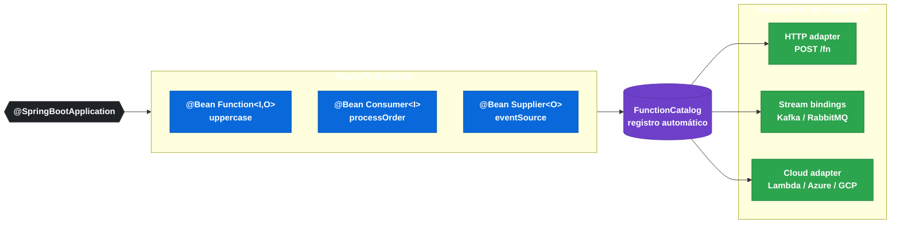

# 12.1 Spring Cloud Function — Modelo de programación funcional

← [11.10 Spring Cloud Task — Troubleshooting](sc-task-troubleshooting.md) | [Índice](README.md) | [12.2 FunctionCatalog →](sc-function-catalog.md)

---

## Introducción

Spring Cloud Function convierte los tres tipos funcionales del JDK — `Function<I,O>`, `Consumer<I>` y `Supplier<O>` — en ciudadanos de primer orden del contexto Spring. Basta con declarar un bean de cualquiera de esos tipos para que SCF lo registre automáticamente en el `FunctionCatalog` y lo exponga vía HTTP, mensajería o adaptadores cloud sin código de infraestructura adicional.

> [CONCEPTO] `Function<I,O>` modela una transformación con entrada y salida. `Consumer<I>` modela un destino (sink) sin retorno. `Supplier<O>` modela una fuente sin entrada. Los tres son interfaces funcionales del JDK (`java.util.function`).

## Diagrama del modelo de programación

El siguiente diagrama muestra cómo los beans funcionales se registran y exponen a través de los distintos adaptadores.


*Beans funcionales registrados en FunctionCatalog y expuestos sin código de infraestructura adicional.*

## Ejemplo central

El siguiente ejemplo muestra la declaración mínima de los tres tipos funcionales junto con la propiedad de selección y las anotaciones de descubrimiento en sub-paquetes.

```java
package com.example.demo;

import org.springframework.boot.SpringApplication;
import org.springframework.boot.autoconfigure.SpringBootApplication;
import org.springframework.cloud.function.context.FunctionScan;
import org.springframework.context.annotation.Bean;

import java.util.function.Consumer;
import java.util.function.Function;
import java.util.function.Supplier;

@SpringBootApplication
@FunctionScan(basePackages = "com.example.functions")  // descubre funciones en sub-paquete
public class DemoApplication {

    public static void main(String[] args) {
        SpringApplication.run(DemoApplication.class, args);
    }

    @Bean
    public Function<String, String> uppercase() {
        return value -> value.toUpperCase();
    }

    @Bean
    public Consumer<String> logMessage() {
        return message -> System.out.println("Received: " + message);
    }

    @Bean
    public Supplier<String> greeting() {
        return () -> "Hello from SCF!";
    }
}
```

Configuración en `application.yml`:

```yaml
spring:
  cloud:
    function:
      definition: uppercase        # expone solo esta función vía HTTP
      # definition: uppercase|trim # composición: las encadena
      # definition: uppercase,trim # múltiples funciones independientes
      configuration:
        uppercase:
          copy-headers: true       # FunctionProperties por función
```

```mermaid
mindmap
  root((spring.cloud\n.function))
    (definition)
      uppercase
      uppercase|trim
      uppercase,trim
    (configuration)
      [&lt;functionName&gt;]
        copy-headers
    (routing-expression
      headers['X-Function-Name'])
    [web]
      [export]
        debug
```
*Jerarquía de propiedades de configuración de Spring Cloud Function.*

> [ADVERTENCIA] Si hay más de un bean funcional en el contexto y no se declara `spring.cloud.function.definition`, el adaptador HTTP lanza una excepción de ambigüedad. Siempre declarar la propiedad en proyectos con múltiples funciones.

## Tabla de elementos clave

La siguiente tabla resume las anotaciones y propiedades del modelo de programación funcional.

| Elemento | Descripción | Cuándo usar |
|---|---|---|
| `@Bean Function<I,O>` | Transformación con entrada y salida | Procesamiento, enriquecimiento |
| `@Bean Consumer<I>` | Sink sin retorno | Persistencia, notificaciones |
| `@Bean Supplier<O>` | Source sin entrada | Polling, generación de eventos |
| `spring.cloud.function.definition` | Selecciona qué función(es) exponer | Siempre que haya ≥1 función |
| `@FunctionScan` | Descubre funciones en paquetes externos | Módulos multi-módulo |
| `@FunctionComponentScan` | Variante para escanear componentes funcionales | Alternativa a `@FunctionScan` |
| `FunctionProperties` | Config por función vía `spring.cloud.function.configuration.<name>.*` | Sobreescribir comportamiento individual |

## Buenas y malas prácticas

**Buenas prácticas:**
- Declarar siempre `spring.cloud.function.definition` cuando el contexto tenga más de una función.
- Usar `@FunctionScan` para funciones en paquetes separados (proyectos multi-módulo).
- Mantener los beans funcionales como POJOs puros sin dependencias de infraestructura: facilita el testing unitario.
- Usar `FunctionProperties` para configuración por función en lugar de propiedades ad hoc.

**Malas prácticas:**
- Inyectar `ApplicationContext` o `Environment` directamente en la lambda del bean funcional — rompe la portabilidad.
- Usar nombres de bean ambiguos (`function1`, `function2`) sin definición explícita.
- Mezclar lógica de routing con lógica de negocio en el mismo bean funcional.

## Comparación: `spring.cloud.function.definition` con `|` vs `,`

Ambas sintaxis permiten declarar múltiples funciones pero con semánticas opuestas. El carácter `|` **compone** las funciones en un pipeline único (el output de la primera es el input de la segunda), mientras que la coma `,` declara **funciones independientes** que se registran por separado en el catálogo.

| Sintaxis | Resultado | URL resultante |
|---|---|---|
| `uppercase\|trim` | Una sola función compuesta | `POST /uppercase\|trim` |
| `uppercase,trim` | Dos funciones separadas | `POST /uppercase` y `POST /trim` |

## Verificación y práctica

> [EXAMEN] ¿Qué propiedad de configuración selecciona qué bean funcional expone Spring Cloud Function vía HTTP cuando hay múltiples beans en el contexto?

> [EXAMEN] ¿Cuál es la diferencia entre `spring.cloud.function.definition: uppercase|trim` y `spring.cloud.function.definition: uppercase,trim`?

> [EXAMEN] ¿Qué anotación permite que SCF descubra beans funcionales declarados en un sub-paquete fuera del paquete principal de `@SpringBootApplication`?

> [EXAMEN] ¿Qué clase de configuración expone las propiedades `spring.cloud.function.configuration.<functionName>.*` y para qué sirve?

> [EXAMEN] ¿Por qué se recomienda que los beans funcionales de Spring Cloud Function sean POJOs puros sin dependencias de infraestructura?

---

← [11.10 Spring Cloud Task — Troubleshooting](sc-task-troubleshooting.md) | [Índice](README.md) | [12.2 FunctionCatalog →](sc-function-catalog.md)
