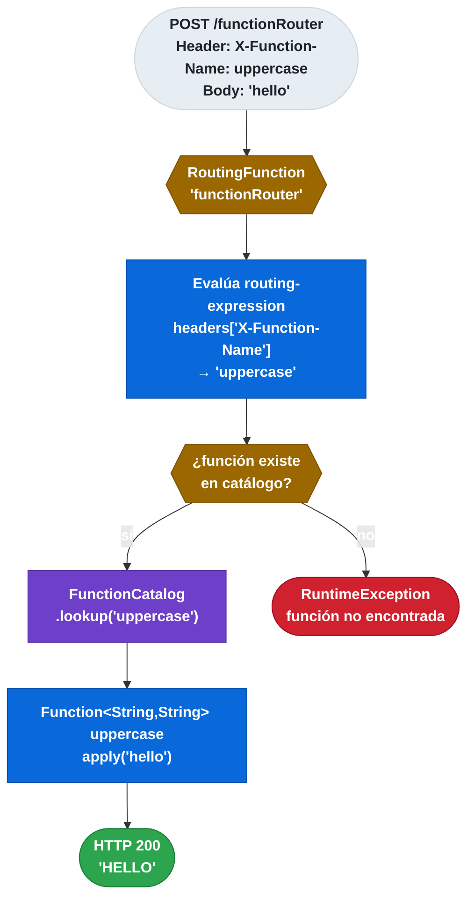
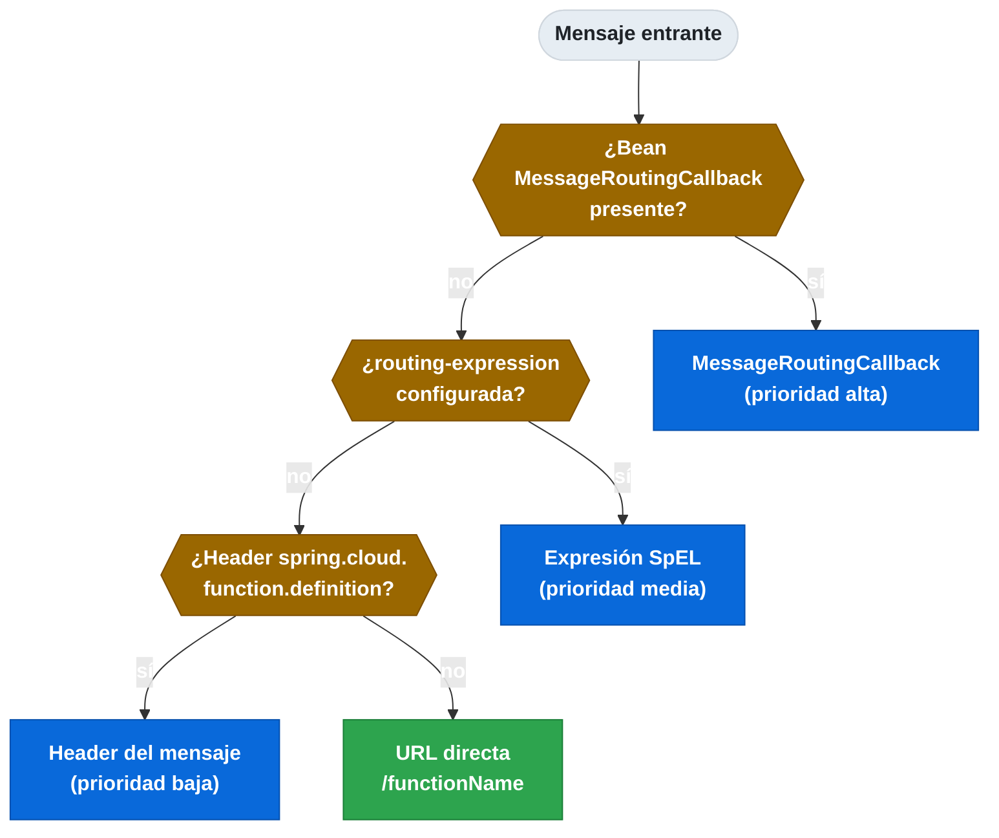

# 12.7 Spring Cloud Function — Routing dinámico

← [12.6 Message y MessageHeaders](sc-function-message-headers.md) | [Índice](README.md) | [12.8 Integración con Spring Cloud Stream →](sc-function-integracion-stream.md)

---

## Introducción

`RoutingFunction` es una función especial de Spring Cloud Function que actúa como dispatcher dinámico: recibe un mensaje y decide, en tiempo de ejecución, a qué función del catálogo delegarlo. El routing puede configurarse de forma declarativa mediante una expresión SpEL en `spring.cloud.function.routing-expression`, o de forma programática implementando la interfaz `MessageRoutingCallback`. Cuando se activa el routing, el nombre reservado `functionRouter` queda disponible como función en el catálogo.

> [CONCEPTO] `RoutingFunction` tiene el nombre reservado `functionRouter` en el `FunctionCatalog`. No es un bean que se declara manualmente — SCF lo registra automáticamente cuando detecta la propiedad `routing-expression` o un bean `MessageRoutingCallback`.

> [CONCEPTO] `spring.cloud.function.routing-expression` es una expresión SpEL que se evalúa contra el `Message<?>` entrante. Debe devolver el nombre de la función a invocar (String).

> [PREREQUISITO] Para usar `RoutingFunction` con el adaptador HTTP, la URL del endpoint es `POST /functionRouter`.

## Diagrama de RoutingFunction

El siguiente diagrama muestra el flujo de despacho dinámico según el valor de un header.


*Flujo de despacho dinámico de RoutingFunction: la expresión SpEL evalúa el header y resuelve la función destino en el catálogo.*

## Ejemplo central

El siguiente ejemplo muestra las dos formas de configurar el routing: mediante expresión SpEL y mediante `MessageRoutingCallback` programático.

```java
package com.example.demo;

import org.springframework.boot.SpringApplication;
import org.springframework.boot.autoconfigure.SpringBootApplication;
import org.springframework.cloud.function.context.MessageRoutingCallback;
import org.springframework.context.annotation.Bean;
import org.springframework.messaging.Message;

import java.util.function.Function;

@SpringBootApplication
public class RoutingApplication {

    public static void main(String[] args) {
        SpringApplication.run(RoutingApplication.class, args);
    }

    @Bean
    public Function<String, String> uppercase() {
        return String::toUpperCase;
    }

    @Bean
    public Function<String, String> lowercase() {
        return String::toLowerCase;
    }

    @Bean
    public Function<String, String> reverse() {
        return value -> new StringBuilder(value).reverse().toString();
    }

    /**
     * MessageRoutingCallback: lógica de routing programática en Java.
     * Se evalúa antes que routing-expression si ambos están presentes.
     */
    @Bean
    public MessageRoutingCallback customRoutingCallback() {
        return message -> {
            // Leer el header de operación
            String operation = (String) message.getHeaders().get("X-Operation");
            if (operation == null) {
                return "uppercase"; // función por defecto
            }
            return switch (operation.toLowerCase()) {
                case "upper" -> "uppercase";
                case "lower" -> "lowercase";
                case "reverse" -> "reverse";
                default -> "uppercase";
            };
        };
    }
}
```

Configuración SpEL en `application.yml`:

```yaml
spring:
  cloud:
    function:
      # Routing por header HTTP: el valor del header determina la función
      routing-expression: "headers['X-Function-Name']"
      # Alternativa: routing por campo del payload (requiere parsing)
      # routing-expression: "payload.startsWith('{') ? 'jsonProcessor' : 'textProcessor'"
```

Ejemplo de invocación con routing por header:

```bash
# Invocar uppercase via routing
curl -X POST http://localhost:8080/functionRouter \
  -H "Content-Type: text/plain" \
  -H "X-Function-Name: uppercase" \
  -d "hello world"
# Respuesta: "HELLO WORLD"

# Invocar reverse via routing
curl -X POST http://localhost:8080/functionRouter \
  -H "Content-Type: text/plain" \
  -H "X-Function-Name: reverse" \
  -d "hello"
# Respuesta: "olleh"
```

> [ADVERTENCIA] Si la expresión SpEL devuelve un nombre de función que no existe en `FunctionCatalog`, SCF lanza una excepción en tiempo de ejecución. Se recomienda validar el nombre o configurar una función de fallback.

> [ADVERTENCIA] `MessageRoutingCallback` tiene precedencia sobre `routing-expression`. Si ambos están configurados, el callback se evalúa primero.

## Tabla de elementos clave

La siguiente tabla resume los mecanismos de routing disponibles.

| Mecanismo | Configuración | Prioridad | Cuándo usar |
|---|---|---|---|
| `MessageRoutingCallback` | Bean `@Bean MessageRoutingCallback` | Alta (primero) | Lógica compleja en Java |
| SpEL `routing-expression` | `spring.cloud.function.routing-expression` | Media | Routing simple por headers/payload |
| Header `spring.cloud.function.definition` | Header en el mensaje | Baja | Routing explícito por mensaje |
| URL directa | `POST /functionName` | N/A | Sin routing dinámico |


*Orden de prioridad de los mecanismos de routing: MessageRoutingCallback evalúa primero, URL directa no usa routing dinámico.*

## Buenas y malas prácticas

**Buenas prácticas:**
- Usar `routing-expression` con SpEL para casos simples de routing por header.
- Implementar `MessageRoutingCallback` para lógica de routing con múltiples condiciones o validaciones.
- Definir siempre una función por defecto en `MessageRoutingCallback` para el caso en que el header no exista.
- Documentar los valores de header válidos para el routing como contrato de la API.

**Malas prácticas:**
- Usar routing dinámico cuando el caso de uso es siempre la misma función — añade complejidad innecesaria.
- Omitir el caso por defecto en `MessageRoutingCallback` — puede causar excepciones en runtime.
- Configurar tanto `routing-expression` como `MessageRoutingCallback` sin entender el orden de prioridad.

## Verificación y práctica

> [EXAMEN] ¿Cuál es el nombre reservado bajo el que `RoutingFunction` queda registrada en el `FunctionCatalog` y cuál es la URL del endpoint HTTP correspondiente?

> [EXAMEN] ¿Cómo se configura `RoutingFunction` para seleccionar la función a invocar según el valor de un header `X-Function-Name`?

> [EXAMEN] ¿Qué interfaz permite implementar la lógica de routing dinámico programáticamente en Java, y cuál es su prioridad respecto a la expresión SpEL?

> [EXAMEN] ¿Qué ocurre en tiempo de ejecución si la expresión de routing devuelve el nombre de una función que no existe en el catálogo?

> [EXAMEN] ¿En qué casos conviene usar `RoutingFunction` en lugar de definir directamente la función en la URL del adaptador HTTP?

---

← [12.6 Message y MessageHeaders](sc-function-message-headers.md) | [Índice](README.md) | [12.8 Integración con Spring Cloud Stream →](sc-function-integracion-stream.md)
