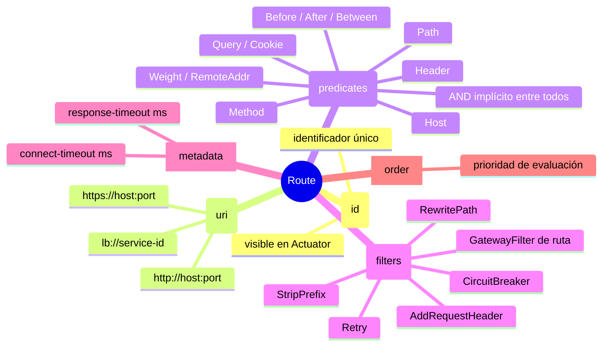

# 5.2 Configuración de rutas: YAML, Java DSL y Timeouts

← [5.1 Arquitectura y ciclo de vida](sc-gateway-arquitectura.md) | [Índice](README.md) | [5.3 Predicate Factories built-in](sc-gateway-predicate-factories.md) →

---

## Introducción

Definir rutas es la tarea central de un API Gateway. Spring Cloud Gateway permite declarar rutas de dos formas equivalentes: mediante propiedades YAML bajo `spring.cloud.gateway.routes[]` o mediante el Java DSL con `RouteLocatorBuilder`. Ambas formas producen el mismo resultado en tiempo de ejecución; la elección es una preferencia de estilo o necesidad de lógica dinámica. Se cubre también en este nodo la configuración de timeouts —tanto globales como por ruta— porque forman parte directa de la configuración de cada ruta.

> [PREREQUISITO] Este nodo asume que conoces los conceptos Route, Predicate y Filter explicados en 5.1. Para el funcionamiento de `lb://` necesitas Spring Cloud LoadBalancer y un registro de servicios (Eureka) en el classpath.

## Estructura de una Route

Una Route en Spring Cloud Gateway es la unidad atómica de enrutamiento. Contiene cuatro elementos obligatorios/opcionales que juntos determinan cuándo se activa y cómo transforma la petición antes de enviarla al destino.

> [CONCEPTO] Una Route se compone de: **id** (identificador único), **uri** (destino: `http://`, `https://` o `lb://service-id`), **predicates** (lista de condiciones AND implícito) y **filters** (transformaciones aplicadas a la petición/respuesta).


*Composición de una Route: los cuatro elementos que determinan cuándo se activa y cómo transforma la petición.*

## Ejemplo central

El siguiente ejemplo muestra la ruta completa en sus dos formas: YAML y Java DSL. Ambas son funcionalmente equivalentes e incluyen predicates, filters, metadata y timeout por ruta.

```yaml
# application.yml — Configuración declarativa completa
spring:
  cloud:
    gateway:
      # Timeouts globales para todas las rutas
      httpclient:
        connect-timeout: 2000          # milisegundos
        response-timeout: 10s          # Duration format

      # Filtros por defecto aplicados a TODAS las rutas
      default-filters:
        - AddResponseHeader=X-Gateway, SpringCloudGateway
        - DedupeResponseHeader=Access-Control-Allow-Credentials Access-Control-Allow-Origin

      routes:
        # Ruta 1: servicio de pedidos con load balancing
        - id: order-service
          uri: lb://order-service
          predicates:
            - Path=/api/orders/**
            - Method=GET,POST,PUT,DELETE
          filters:
            - StripPrefix=1
            - AddRequestHeader=X-Request-Source, gateway
          metadata:
            response-timeout: 5000     # timeout específico para esta ruta (ms)
            connect-timeout: 1000

        # Ruta 2: servicio de productos con URI directa
        - id: product-service-direct
          uri: http://localhost:8082
          predicates:
            - Path=/products/**
          filters:
            - RewritePath=/products/(?<segment>.*), /api/v1/products/${segment}

        # Ruta 3: servicio de usuarios con autenticación
        - id: user-service
          uri: lb://user-service
          predicates:
            - Path=/users/**
            - Header=Authorization, Bearer .+
          filters:
            - StripPrefix=1
```

```java
package com.example.gateway.config;

import org.springframework.cloud.gateway.route.RouteLocator;
import org.springframework.cloud.gateway.route.builder.RouteLocatorBuilder;
import org.springframework.context.annotation.Bean;
import org.springframework.context.annotation.Configuration;

import java.time.Duration;

@Configuration
public class GatewayRoutesConfig {

    @Bean
    public RouteLocator gatewayRoutes(RouteLocatorBuilder builder) {
        return builder.routes()
            // Ruta 1: equivalente Java DSL a la ruta YAML de order-service
            .route("order-service", r -> r
                .path("/api/orders/**")
                .and()
                .method("GET", "POST", "PUT", "DELETE")
                .filters(f -> f
                    .stripPrefix(1)
                    .addRequestHeader("X-Request-Source", "gateway"))
                .metadata("response-timeout", 5000)
                .metadata("connect-timeout", 1000)
                .uri("lb://order-service"))

            // Ruta 2: rewrite de path con URI directa
            .route("product-service-direct", r -> r
                .path("/products/**")
                .filters(f -> f
                    .rewritePath("/products/(?<segment>.*)", "/api/v1/products/${segment}"))
                .uri("http://localhost:8082"))

            // Ruta 3: filtro condicional con header
            .route("user-service", r -> r
                .path("/users/**")
                .and()
                .header("Authorization", "Bearer .+")
                .filters(f -> f.stripPrefix(1))
                .uri("lb://user-service"))
            .build();
    }
}
```

## Tabla de elementos clave

Los siguientes conceptos son esenciales para entender la configuración de rutas y aparecen frecuentemente en preguntas de certificación:

| Elemento | YAML | Java DSL | Descripción |
|---|---|---|---|
| URI load-balanced | `uri: lb://service-id` | `.uri("lb://service-id")` | Resuelve via Spring Cloud LoadBalancer |
| URI directa | `uri: http://host:port` | `.uri("http://host:port")` | Sin balanceo; útil para tests |
| Default filters | `default-filters:` | No equiv. directo | Aplican a todas las rutas |
| Metadata de ruta | `metadata: response-timeout: 5000` | `.metadata("response-timeout", 5000)` | Timeout específico de ruta en ms |
| Timeout global connect | `httpclient.connect-timeout: 2000` | — (propiedad) | Milisegundos |
| Timeout global response | `httpclient.response-timeout: 10s` | — (propiedad) | Duration string (`10s`, `PT10S`) |

## Timeouts: global vs por ruta

Los timeouts en Spring Cloud Gateway tienen dos niveles de configuración que se complementan. El timeout global aplica a todas las rutas cuando no hay override específico. El timeout por ruta se define en la sección `metadata` de la ruta y sobreescribe el global únicamente para esa ruta.

> [EXAMEN] `metadata.response-timeout` se expresa en **milisegundos** (entero), mientras que `spring.cloud.gateway.httpclient.response-timeout` acepta formato **Duration** (`10s`, `PT30S`). Esta asimetría es fuente de confusión frecuente.

Cuando se supera el `response-timeout`, el Gateway retorna un `503 Service Unavailable` al cliente. El timeout de conexión (`connect-timeout`) aplica únicamente a la fase de establecimiento del TCP connection con el upstream, no al tiempo total de respuesta.

> [ADVERTENCIA] Si defines `response-timeout` en `metadata` de la ruta, debes expresarlo como número entero de milisegundos. Usar el formato `"5s"` en metadata no funciona y el timeout global prevalecerá silenciosamente.

## Comparación: YAML vs Java DSL

YAML es la opción recomendada para la mayoría de casos porque las rutas son legibles como configuración externalizable, pueden actualizarse via Config Server sin recompilar, y soportan refresh en caliente via `POST /actuator/gateway/refresh`. El Java DSL es necesario cuando la lógica de construcción de rutas requiere condicionales dinámicos, acceso a beans Spring, o predicates/filters no disponibles mediante shortcut YAML.

Ambas formas pueden coexistir en la misma aplicación: las rutas Java DSL se registran como beans `RouteLocator`, las YAML como `RouteDefinitionLocator`. El gateway combina ambas al arrancar.

> [ADVERTENCIA] Mezclar rutas con el mismo `id` en YAML y Java DSL provoca que solo una de ellas sea efectiva (la cargada en último lugar). Usa IDs únicos en todo momento.

## Buenas y malas prácticas

**Buenas prácticas:**
- Dar IDs descriptivos a las rutas (e.g., `order-service-v2`) para identificarlas en `/actuator/gateway/routes`.
- Usar `default-filters` para headers transversales como correlation ID o X-Gateway.
- Definir `response-timeout` por ruta en servicios con SLA diferenciado (p. ej. servicios lentos de reporting).
- Externalizar `spring.cloud.gateway.routes` al Config Server para cambios sin redespliegue.

**Malas prácticas:**
- Usar `uri: lb://` sin tener Spring Cloud LoadBalancer (`spring-cloud-starter-loadbalancer`) en el classpath: produce `503` en todas las peticiones.
- Colocar una ruta con `Path=/**` antes que rutas más específicas: captura todo el tráfico y las rutas posteriores son inalcanzables.
- Definir timeouts muy cortos (< 1s) para servicios que realizan operaciones costosas como generación de reportes.

## Verificación y práctica

1. ¿Cuál es la diferencia entre `uri: lb://order-service` y `uri: http://localhost:8081`? ¿Qué componente Spring Cloud es necesario para que `lb://` funcione?

2. ¿Cómo defines en YAML un timeout de 5 segundos específico para una ruta sin modificar el timeout global? ¿En qué unidad se expresa ese valor?

3. Tienes una ruta con `Path=/api/**` definida antes que otra con `Path=/api/orders/**`. ¿Cuál se activará para `GET /api/orders/123` y por qué?

4. ¿Qué ventaja tiene la definición YAML respecto al Java DSL en términos de operación en producción?

5. ¿Cómo coexisten rutas definidas en YAML y rutas definidas en Java DSL con `RouteLocatorBuilder`? ¿Pueden tener el mismo ID?

---

← [5.1 Arquitectura y ciclo de vida](sc-gateway-arquitectura.md) | [Índice](README.md) | [5.3 Predicate Factories built-in](sc-gateway-predicate-factories.md) →
