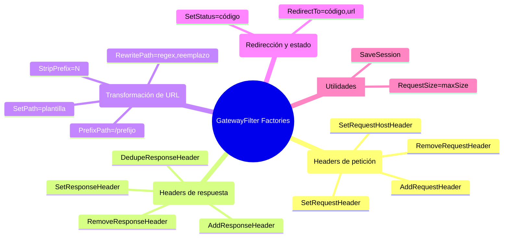

# 5.4 GatewayFilter Factories built-in

← [5.3 Predicate Factories built-in](sc-gateway-predicate-factories.md) | [Índice](README.md) | [5.5 GatewayFilter Factories de resiliencia](sc-gateway-filter-factories-resiliencia.md) →

---

## Introducción

Las GatewayFilter Factories built-in son el mecanismo principal para transformar peticiones y respuestas en Spring Cloud Gateway a nivel de ruta individual. A diferencia de los GlobalFilters (que aplican a todas las rutas), estas factories se configuran por ruta en la sección `filters:` y permiten modificar headers, reescribir paths, redirigir, limitar tamaño de petición o gestionar sesiones. Dominar estas factories es esencial tanto para el uso cotidiano del gateway como para la certificación, donde aparecen frecuentemente en preguntas sobre transformación de URL y manipulación de headers.

> [CONCEPTO] Una **GatewayFilter Factory** es un bean Spring que produce instancias de `GatewayFilter` a partir de una configuración. El shortcut YAML `StripPrefix=1` equivale a invocar `StripPrefixGatewayFilterFactory` con el parámetro `parts=1`.

## Mapa de GatewayFilter Factories built-in

Las factories built-in se agrupan por su propósito: manipulación de headers de petición, manipulación de headers de respuesta, transformación de URL, control de flujo y utilidades.


*GatewayFilter Factories built-in agrupadas por propósito — se configuran en la sección filters de cada ruta.*

## Ejemplo central

El siguiente ejemplo incluye todas las factories built-in más relevantes, con sus parámetros completos y comentarios explicativos:

```yaml
# application.yml — GatewayFilter Factories built-in completas
spring:
  cloud:
    gateway:
      routes:
        # ===== MANIPULACIÓN DE HEADERS DE PETICIÓN =====
        - id: request-headers-demo
          uri: lb://backend-service
          predicates:
            - Path=/demo/**
          filters:
            # Añade un header a la petición enviada al upstream
            - AddRequestHeader=X-Source, spring-cloud-gateway
            # Añade header con valor dinámico (variable del predicate {segment})
            # - AddRequestHeader=X-Path-Segment, {segment}
            # Elimina header sensible antes de enviar al upstream
            - RemoveRequestHeader=Cookie
            # Reemplaza el valor de un header existente (o lo crea si no existe)
            - SetRequestHeader=X-Request-Version, v2
            # Modifica el header Host enviado al upstream
            - SetRequestHostHeader=internal.backend.local

        # ===== MANIPULACIÓN DE HEADERS DE RESPUESTA =====
        - id: response-headers-demo
          uri: lb://backend-service
          predicates:
            - Path=/response-demo/**
          filters:
            # Añade header a la respuesta enviada al cliente
            - AddResponseHeader=X-Response-Source, gateway
            # Elimina headers sensibles del backend antes de enviar al cliente
            - RemoveResponseHeader=X-Internal-Id
            - RemoveResponseHeader=Server
            # Reemplaza valor de header en respuesta
            - SetResponseHeader=Cache-Control, no-store
            # Elimina duplicados del header (frecuente con CORS)
            - DedupeResponseHeader=Access-Control-Allow-Credentials Access-Control-Allow-Origin

        # ===== TRANSFORMACIÓN DE PATH =====
        - id: strip-prefix-demo
          uri: lb://product-service
          predicates:
            - Path=/api/v1/products/**
          filters:
            # StripPrefix=1 elimina /api del path: /api/v1/products/123 → /v1/products/123
            # StripPrefix=2 elimina /api/v1 → /products/123
            - StripPrefix=2

        - id: rewrite-path-demo
          uri: lb://legacy-service
          predicates:
            - Path=/new-api/**
          filters:
            # RewritePath: regex con grupos nombrados capturados como ${nombre}
            # /new-api/orders/123 → /api/v2/orders/123
            - RewritePath=/new-api/(?<segment>.*), /api/v2/${segment}

        - id: set-path-demo
          uri: lb://static-service
          predicates:
            - Path=/static/**
          filters:
            # SetPath reemplaza el path completo con una plantilla
            # Cualquier petición a /static/** → /fixed/path
            - SetPath=/fixed/path

        - id: prefix-path-demo
          uri: lb://versioned-service
          predicates:
            - Path=/orders/**
          filters:
            # PrefixPath añade un prefijo al path existente
            # /orders/123 → /api/v3/orders/123
            - PrefixPath=/api/v3

        # ===== REDIRECCIÓN Y CONTROL DE ESTADO =====
        - id: redirect-demo
          uri: no://op
          predicates:
            - Path=/old-endpoint/**
          filters:
            # Redirección permanente (301) o temporal (302)
            - RedirectTo=301, https://api.example.com/new-endpoint

        - id: set-status-demo
          uri: lb://maintenance-service
          predicates:
            - Path=/maintenance/**
          filters:
            # Fuerza un código de estado HTTP específico en la respuesta
            - SetStatus=503

        # ===== UTILIDADES =====
        - id: request-size-demo
          uri: lb://upload-service
          predicates:
            - Path=/upload/**
          filters:
            # Rechaza peticiones que superen el tamaño indicado
            # Formatos aceptados: 5000000 (bytes), 5MB, 5KB
            - RequestSize=5MB

        - id: save-session-demo
          uri: lb://session-service
          predicates:
            - Path=/session-app/**
          filters:
            # Fuerza guardado de WebSession antes de hacer forwarding
            # Necesario cuando el backend depende de la sesión Spring
            - SaveSession
```

```java
package com.example.gateway.config;

import org.springframework.cloud.gateway.route.RouteLocator;
import org.springframework.cloud.gateway.route.builder.RouteLocatorBuilder;
import org.springframework.context.annotation.Bean;
import org.springframework.context.annotation.Configuration;

@Configuration
public class BuiltinFiltersConfig {

    @Bean
    public RouteLocator builtinFilterRoutes(RouteLocatorBuilder builder) {
        return builder.routes()
            // StripPrefix + AddRequestHeader
            .route("product-service", r -> r
                .path("/api/v1/products/**")
                .filters(f -> f
                    .stripPrefix(2)
                    .addRequestHeader("X-Source", "spring-cloud-gateway")
                    .removeRequestHeader("Cookie"))
                .uri("lb://product-service"))

            // RewritePath con regex y grupo nombrado
            .route("legacy-rewrite", r -> r
                .path("/new-api/**")
                .filters(f -> f
                    .rewritePath("/new-api/(?<segment>.*)", "/api/v2/${segment}"))
                .uri("lb://legacy-service"))

            // RedirectTo para rutas eliminadas
            .route("old-redirect", r -> r
                .path("/old-endpoint/**")
                .filters(f -> f.redirectTo(301, "https://api.example.com/new-endpoint"))
                .uri("no://op"))

            // RequestSize para endpoints de upload
            .route("upload-limited", r -> r
                .path("/upload/**")
                .filters(f -> f.requestSize(5 * 1024 * 1024L)) // 5MB en bytes
                .uri("lb://upload-service"))
            .build();
    }
}
```

## Tabla de GatewayFilter Factories built-in

| Factory | Shortcut YAML | Parámetros clave | Descripción |
|---|---|---|---|
| `AddRequestHeaderGatewayFilterFactory` | `AddRequestHeader=` | nombre, valor | Añade header a petición upstream |
| `RemoveRequestHeaderGatewayFilterFactory` | `RemoveRequestHeader=` | nombre | Elimina header de petición |
| `SetRequestHeaderGatewayFilterFactory` | `SetRequestHeader=` | nombre, valor | Reemplaza valor de header en petición |
| `SetRequestHostHeaderGatewayFilterFactory` | `SetRequestHostHeader=` | host | Modifica header Host |
| `AddResponseHeaderGatewayFilterFactory` | `AddResponseHeader=` | nombre, valor | Añade header a respuesta |
| `RemoveResponseHeaderGatewayFilterFactory` | `RemoveResponseHeader=` | nombre | Elimina header de respuesta |
| `SetResponseHeaderGatewayFilterFactory` | `SetResponseHeader=` | nombre, valor | Reemplaza header en respuesta |
| `DedupeResponseHeaderGatewayFilterFactory` | `DedupeResponseHeader=` | nombres [estrategia] | Elimina duplicados de headers |
| `StripPrefixGatewayFilterFactory` | `StripPrefix=` | partes (entero) | Elimina N segmentos iniciales del path |
| `RewritePathGatewayFilterFactory` | `RewritePath=` | regex, reemplazo | Reescribe path con regex Java |
| `SetPathGatewayFilterFactory` | `SetPath=` | plantilla | Reemplaza path completo |
| `PrefixPathGatewayFilterFactory` | `PrefixPath=` | prefijo | Añade prefijo al path |
| `RedirectToGatewayFilterFactory` | `RedirectTo=` | código, url | Redirección HTTP |
| `SetStatusGatewayFilterFactory` | `SetStatus=` | código HTTP | Fuerza código de estado |
| `RequestSizeGatewayFilterFactory` | `RequestSize=` | tamaño (bytes/KB/MB) | Rechaza peticiones grandes |
| `SaveSessionGatewayFilterFactory` | `SaveSession` | (sin params) | Guarda WebSession antes de forward |

## StripPrefix vs RewritePath: comparación clave

`StripPrefix` y `RewritePath` son las factories más frecuentes en preguntas de certificación. Ambas transforman el path de la petición enviada al upstream, pero de forma diferente.

`StripPrefix=N` elimina exactamente N segmentos del inicio del path. Es simple y predecible: `/api/v1/products/123` con `StripPrefix=2` produce `/products/123`. No permite lógica condicional ni captura de grupos.

`RewritePath` aplica una expresión regular Java completa con soporte de grupos nombrados. Es más potente pero más verbosa. `/new-api/orders/123` con `RewritePath=/new-api/(?<segment>.*), /api/v2/${segment}` produce `/api/v2/orders/123`. Permite transformaciones complejas que `StripPrefix` no puede expresar.

> [EXAMEN] `StripPrefix` elimina segmentos contando desde el inicio: `StripPrefix=1` sobre `/a/b/c` produce `/b/c`. `RewritePath` usa regex Java; el reemplazo usa `${}` no `$1` para los grupos nombrados.

> [ADVERTENCIA] En `RewritePath`, el carácter `$` en YAML debe escaparse como `$\` porque YAML interpreta `${}` como una variable de entorno. La sintaxis correcta es `RewritePath=/foo/(?<seg>.*), /$\{seg}` en YAML literal.

## Buenas y malas prácticas

**Buenas prácticas:**
- Usar `RemoveRequestHeader=Cookie` cuando el upstream no debe ver cookies del cliente (microservicios stateless).
- Usar `DedupeResponseHeader` para CORS cuando el Gateway y el backend ambos añaden headers CORS, evitando duplicados que rompen el navegador.
- Preferir `StripPrefix` para transformaciones simples de prefijo por su legibilidad; reservar `RewritePath` para casos complejos.
- Combinar `RequestSize` con límites en el upstream para defensa en profundidad contra uploads masivos.

**Malas prácticas:**
- Usar `SetPath` cuando el path destino necesita información del path origen: usa `RewritePath` con grupos capturados.
- Olvidar que `RedirectTo` con `uri: no://op` no llega al upstream; el Gateway devuelve la redirección directamente.
- Usar `SaveSession` en rutas de alta frecuencia sin necesidad real: añade overhead de I/O de sesión.

## Verificación y práctica

1. ¿Cuál es la diferencia entre `StripPrefix=1` y `RewritePath` en términos de qué parte de la URL modifican? ¿Cuándo usarías cada uno?

2. Dada la ruta con `Path=/api/v1/products/**` y `StripPrefix=2`, ¿qué path recibe el upstream para la petición `GET /api/v1/products/123/details`?

3. ¿Por qué `DedupeResponseHeader` es especialmente útil cuando el Gateway tiene configuración CORS global y el backend también envía headers CORS?

4. ¿Qué ocurre si `RequestSize=1KB` rechaza una petición? ¿Qué código HTTP devuelve el gateway?

5. En YAML, ¿por qué `RewritePath=/foo/(?<seg>.*), /${seg}` puede fallar y cuál es la sintaxis correcta?

---

← [5.3 Predicate Factories built-in](sc-gateway-predicate-factories.md) | [Índice](README.md) | [5.5 GatewayFilter Factories de resiliencia](sc-gateway-filter-factories-resiliencia.md) →
