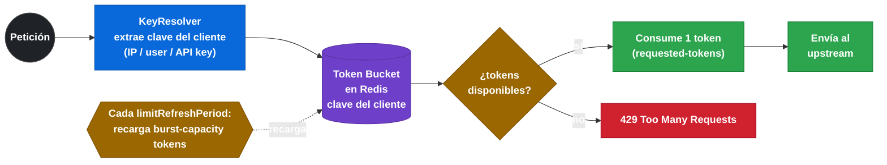

# 5.5 GatewayFilter Factories de resiliencia: CircuitBreaker, Retry y RequestRateLimiter

← [5.4 GatewayFilter Factories built-in](sc-gateway-filter-factories-builtin.md) | [Índice](README.md) | [5.6 GlobalFilter: interfaz, orden y filtros built-in](sc-gateway-global-filters.md) →

---

## Introducción

Las GatewayFilter Factories de resiliencia añaden comportamiento de tolerancia a fallos directamente en el nivel de enrutamiento del Gateway. `CircuitBreaker` protege rutas individuales contra fallos en cascada integrando Resilience4j, `Retry` reintenta automáticamente peticiones fallidas con backoff configurable, y `RequestRateLimiter` limita la tasa de peticiones usando Redis como backend de contadores distribuidos. Configurar estas factories es responsabilidad del Gateway (G1); la API interna de Resilience4j y la infraestructura Redis son detalles de implementación (G2) que se referencian pero no se desarrollan aquí.

> [PREREQUISITO] Para `CircuitBreaker` necesitas `spring-cloud-starter-circuitbreaker-reactor-resilience4j`. Para `RequestRateLimiter` necesitas `spring-boot-starter-data-redis-reactive` y una instancia Redis disponible.

## CircuitBreaker Gateway Filter

El filtro `CircuitBreaker` envuelve la llamada al upstream en un circuit breaker Resilience4j. Cuando el circuito se abre (supera el umbral de fallos configurado), las peticiones se redirigen al `fallbackUri` en lugar de llegar al upstream, evitando sobrecargarlo mientras se recupera.

> [CONCEPTO] El filtro `CircuitBreaker` en Gateway actúa en la **capa de enrutamiento**: si el circuit breaker está OPEN, el Gateway redirige al `fallbackUri` antes de intentar la conexión con el upstream. El nombre del circuit breaker (`name`) debe coincidir con el bean `CircuitBreakerConfig` registrado en Resilience4j (G2).

La propiedad `fallbackUri` puede ser una URI interna del propio Gateway (`forward:/fallback-endpoint`) o una URI externa. La opción más común y recomendada es el forward interno, que permite tener un controller de fallback en el mismo proceso del Gateway.

> [ADVERTENCIA] El `fallbackUri` con `forward:/` hace un forward interno: llama a un endpoint del **propio Gateway**, no del upstream. Si necesitas que el fallback llegue a otro microservicio, usa `lb://fallback-service/path`.

## Retry Gateway Filter

El filtro `Retry` reintenta automáticamente peticiones al upstream cuando se producen errores de red o respuestas con códigos de error configurados. Es especialmente útil para transient failures en entornos cloud donde un servicio puede estar temporalmente no disponible.

> [CONCEPTO] `Retry` aplica reintentos **antes** de que el error llegue al cliente. Cada reintento genera una nueva petición al upstream (con load balancing fresh si `uri: lb://`). El backoff exponencial reduce la presión sobre un upstream degradado.

El parámetro `methods` limita los reintentos a métodos HTTP seguros. Nunca se debe reintentar un `POST` sin garantías de idempotencia, ya que podría crear recursos duplicados.

> [ADVERTENCIA] Por defecto, `Retry` solo reintenta peticiones `GET`. Si añades `POST` a la lista de métodos sin verificar idempotencia del upstream, puedes crear registros duplicados. Usa `POST` en `methods` solo con endpoints idempotentes o con mecanismos de deduplicación.

## RequestRateLimiter Gateway Filter

El filtro `RequestRateLimiter` implementa el algoritmo de **token bucket** usando Redis para almacenar los contadores. Cada cliente (identificado por `KeyResolver`) tiene un bucket con capacidad `burst-capacity` y recarga a razón de `replenish-rate` tokens por segundo. Si el bucket está vacío, la petición recibe un `429 Too Many Requests`.

> [CONCEPTO] El **KeyResolver** es un bean Spring `KeyResolver` que extrae del `ServerWebExchange` la clave de identificación del cliente (IP, usuario autenticado, API key, etc.). Es el único bean custom obligatorio para usar `RequestRateLimiter`.


*Algoritmo token bucket del RequestRateLimiter: Redis almacena el bucket por clave de cliente; el replenish recarga tokens a tasa constante independientemente del consumo.*

## Ejemplo central

El siguiente ejemplo configura las tres factories de resiliencia con todos sus parámetros relevantes:

```yaml
# application.yml — GatewayFilter Factories de resiliencia
spring:
  cloud:
    gateway:
      routes:
        # ===== CIRCUIT BREAKER =====
        - id: order-service-with-cb
          uri: lb://order-service
          predicates:
            - Path=/api/orders/**
          filters:
            - StripPrefix=1
            # CircuitBreaker: nombre del CB (debe existir en Resilience4j config)
            # fallbackUri: forward interno al endpoint /fallback del gateway
            - name: CircuitBreaker
              args:
                name: orderServiceCB
                fallbackUri: forward:/fallback/orders
            # Alternativa shortcut (solo nombre):
            # - CircuitBreaker=orderServiceCB

        # ===== RETRY =====
        - id: payment-service-with-retry
          uri: lb://payment-service
          predicates:
            - Path=/api/payments/**
          filters:
            - StripPrefix=1
            - name: Retry
              args:
                retries: 3                    # número máximo de reintentos
                statuses: SERVICE_UNAVAILABLE, GATEWAY_TIMEOUT  # HTTP status que activan retry
                methods: GET                  # métodos elegibles (solo seguros por defecto)
                backoff:
                  firstBackoff: 100ms         # espera inicial
                  maxBackoff: 1000ms          # espera máxima
                  factor: 2                   # factor multiplicador (exponential backoff)
                  basedOnPreviousValue: false

        # ===== REQUEST RATE LIMITER =====
        - id: public-api-rate-limited
          uri: lb://public-api-service
          predicates:
            - Path=/public/**
          filters:
            - StripPrefix=1
            - name: RequestRateLimiter
              args:
                # Referencia al bean KeyResolver por nombre
                key-resolver: "#{@ipKeyResolver}"
                # Tokens repuestos por segundo (rate sostenida)
                redis-rate-limiter.replenish-rate: 10
                # Capacidad máxima del bucket (ráfaga permitida)
                redis-rate-limiter.burst-capacity: 20
                # Tokens consumidos por cada petición (por defecto 1)
                redis-rate-limiter.requested-tokens: 1

# Conexión Redis para RequestRateLimiter
  data:
    redis:
      host: localhost
      port: 6379
```

```java
package com.example.gateway.config;

import org.springframework.cloud.gateway.filter.ratelimit.KeyResolver;
import org.springframework.cloud.gateway.route.RouteLocator;
import org.springframework.cloud.gateway.route.builder.RouteLocatorBuilder;
import org.springframework.context.annotation.Bean;
import org.springframework.context.annotation.Configuration;
import reactor.core.publisher.Mono;

@Configuration
public class ResilienceFiltersConfig {

    // ===== KeyResolver beans para RequestRateLimiter =====

    /**
     * Rate limiting por IP del cliente (X-Forwarded-For si existe, sino remoteAddress)
     */
    @Bean
    public KeyResolver ipKeyResolver() {
        return exchange -> {
            String xForwardedFor = exchange.getRequest()
                .getHeaders()
                .getFirst("X-Forwarded-For");
            if (xForwardedFor != null && !xForwardedFor.isBlank()) {
                // Tomar la primera IP de la cadena X-Forwarded-For
                return Mono.just(xForwardedFor.split(",")[0].trim());
            }
            return Mono.just(
                exchange.getRequest()
                    .getRemoteAddress()
                    .getAddress()
                    .getHostAddress()
            );
        };
    }

    /**
     * Rate limiting por usuario autenticado (JWT sub claim o "anonymous")
     */
    @Bean
    public KeyResolver userKeyResolver() {
        return exchange -> exchange.getPrincipal()
            .map(java.security.Principal::getName)
            .defaultIfEmpty("anonymous");
    }

    /**
     * Rate limiting por API key extraída de header
     */
    @Bean
    public KeyResolver apiKeyResolver() {
        return exchange -> {
            String apiKey = exchange.getRequest()
                .getHeaders()
                .getFirst("X-API-Key");
            return Mono.just(apiKey != null ? apiKey : "no-key");
        };
    }

    // ===== Rutas con filtros de resiliencia via Java DSL =====
    @Bean
    public RouteLocator resilienceRoutes(RouteLocatorBuilder builder) {
        return builder.routes()
            // CircuitBreaker con fallback
            .route("order-service-cb", r -> r
                .path("/api/orders/**")
                .filters(f -> f
                    .stripPrefix(1)
                    .circuitBreaker(config -> config
                        .setName("orderServiceCB")
                        .setFallbackUri("forward:/fallback/orders")))
                .uri("lb://order-service"))

            // Retry con backoff exponencial
            .route("payment-retry", r -> r
                .path("/api/payments/**")
                .filters(f -> f
                    .stripPrefix(1)
                    .retry(config -> config
                        .setRetries(3)
                        .setStatuses(
                            org.springframework.http.HttpStatus.SERVICE_UNAVAILABLE,
                            org.springframework.http.HttpStatus.GATEWAY_TIMEOUT)
                        .setMethods(org.springframework.http.HttpMethod.GET)))
                .uri("lb://payment-service"))
            .build();
    }
}
```

```java
package com.example.gateway.controller;

import org.springframework.http.HttpStatus;
import org.springframework.web.bind.annotation.GetMapping;
import org.springframework.web.bind.annotation.RequestMapping;
import org.springframework.web.bind.annotation.ResponseStatus;
import org.springframework.web.bind.annotation.RestController;
import reactor.core.publisher.Mono;

import java.util.Map;

/**
 * Controlador de fallback en el propio proceso del Gateway.
 * Responde a los forward: de CircuitBreaker cuando el circuito está abierto.
 */
@RestController
@RequestMapping("/fallback")
public class FallbackController {

    @GetMapping("/orders")
    @ResponseStatus(HttpStatus.SERVICE_UNAVAILABLE)
    public Mono<Map<String, String>> ordersFallback() {
        return Mono.just(Map.of(
            "status", "error",
            "message", "Order service temporarily unavailable. Please try again later.",
            "code", "CIRCUIT_OPEN"
        ));
    }
}
```

## Tabla de parámetros clave

La siguiente tabla resume los parámetros de configuración más importantes de las tres factories de resiliencia:

| Factory | Parámetro | Descripción | Valor por defecto |
|---|---|---|---|
| `CircuitBreaker` | `name` | Nombre del CB Resilience4j | (obligatorio) |
| `CircuitBreaker` | `fallbackUri` | URI de fallback (`forward:/...` o `lb://...`) | (sin fallback si omitido) |
| `Retry` | `retries` | Número máximo de reintentos | 3 |
| `Retry` | `statuses` | Códigos HTTP que activan retry | (vacío = solo excepciones) |
| `Retry` | `methods` | Métodos HTTP elegibles para retry | GET |
| `Retry` | `backoff.firstBackoff` | Espera inicial entre reintentos | 5ms |
| `Retry` | `backoff.maxBackoff` | Espera máxima entre reintentos | (sin límite) |
| `Retry` | `backoff.factor` | Factor multiplicador del backoff | 2 |
| `RequestRateLimiter` | `key-resolver` | Bean KeyResolver (expresión SpEL) | (obligatorio) |
| `RequestRateLimiter` | `redis-rate-limiter.replenish-rate` | Tokens/segundo reabastecidos | (obligatorio) |
| `RequestRateLimiter` | `redis-rate-limiter.burst-capacity` | Capacidad máxima del bucket | (obligatorio) |
| `RequestRateLimiter` | `redis-rate-limiter.requested-tokens` | Tokens consumidos por petición | 1 |

## Frontera G1/G2

La configuración del filtro en la ruta (nombre del CB, `fallbackUri`, propiedades `redis-rate-limiter.*`, bean `KeyResolver`) es responsabilidad del Gateway y se cubre aquí. La configuración interna de Resilience4j (umbral de fallos, ventana deslizante, tiempos de espera en estado OPEN) y la infraestructura Redis (cluster, autenticación, scripts Lua internos) son G2 cubiertos en sus respectivos módulos (sc-circuitbreaker).

> [EXAMEN] Para que `RequestRateLimiter` funcione necesitas: (1) dependencia `spring-boot-starter-data-redis-reactive`, (2) Redis accesible, (3) un bean `KeyResolver` en el contexto Spring. Si falta cualquiera de estos tres elementos, el filtro falla al arrancar.

## Buenas y malas prácticas

**Buenas prácticas:**
- Definir siempre un `fallbackUri` en el filtro `CircuitBreaker` para dar una respuesta controlada al cliente en lugar de un error 500.
- Usar `Retry` solo en métodos idempotentes (`GET`, `HEAD`). Para `POST`, requerir idempotencia en el upstream.
- Ajustar `replenish-rate` y `burst-capacity` según el SLA del servicio protegido, no valores genéricos.
- Nombrar los `KeyResolver` beans descriptivamente para facilitar la referencia SpEL en YAML.

**Malas prácticas:**
- Usar `Retry` con métodos `POST` sin garantías de idempotencia en el upstream.
- Olvidar que `fallbackUri: forward:/fallback` apunta al propio Gateway, no al upstream: el endpoint de fallback debe existir en el Gateway.
- Configurar `burst-capacity` igual a `replenish-rate`: no permite ninguna ráfaga y degradará la UX ante picos legítimos.
- Confiar en el `CircuitBreaker` del Gateway sin configurar el `CircuitBreakerConfig` correspondiente en Resilience4j: usará valores por defecto que pueden no ajustarse al SLA.

## Verificación y práctica

1. ¿Cómo configuras un `CircuitBreaker` en una ruta Gateway con fallback al endpoint `/fallback/orders` del propio gateway? ¿Qué propiedad y qué valor usa `fallbackUri`?

2. ¿Qué es un `KeyResolver` y por qué es obligatorio para usar `RequestRateLimiter`? ¿Cómo se referencia el bean en YAML?

3. ¿Cuál es la diferencia entre `redis-rate-limiter.replenish-rate` y `redis-rate-limiter.burst-capacity`? ¿Qué ocurre cuando el bucket se vacía?

4. ¿Por qué `Retry` no debería configurarse con `methods: POST` por defecto? ¿Qué condición debe cumplir el endpoint upstream para que sea seguro reintentar `POST`?

5. Un desarrollador configura `CircuitBreaker=myService` sin `fallbackUri`. ¿Qué respuesta recibe el cliente cuando el circuito se abre?

---

← [5.4 GatewayFilter Factories built-in](sc-gateway-filter-factories-builtin.md) | [Índice](README.md) | [5.6 GlobalFilter: interfaz, orden y filtros built-in](sc-gateway-global-filters.md) →
