# 5.9 Seguridad y OAuth2: SecurityWebFilterChain y TokenRelay

← [5.8 CORS en Spring Cloud Gateway](sc-gateway-cors.md) | [Índice](README.md) | [5.10 Actuator y observabilidad del Gateway](sc-gateway-actuator-observabilidad.md) →

---

## Introducción

Asegurar un API Gateway significa dos cosas: proteger las rutas del Gateway para que solo usuarios autenticados accedan a los microservicios downstream, y propagar el token de autenticación hacia los servicios downstream para que estos puedan tomar decisiones de autorización propias. Spring Cloud Gateway integra Spring Security WebFlux mediante `SecurityWebFilterChain` para el primer objetivo, y el filtro `TokenRelay` para el segundo. Esta separación de responsabilidades es importante: Spring Security gestiona la autenticación (G2), Gateway gestiona la propagación del token y la configuración de rutas protegidas (G1).

> [PREREQUISITO] Para seguridad OAuth2 en Gateway necesitas `spring-boot-starter-oauth2-client` en el classpath. Para validación de JWT en los microservicios downstream necesitas `spring-boot-starter-oauth2-resource-server` en cada servicio.

## SecurityWebFilterChain en contexto reactivo

En una aplicación WebFlux (como el Gateway), Spring Security usa `SecurityWebFilterChain` en lugar de la `SecurityFilterChain` tradicional del mundo servlet. La configuración es funcional y reactiva, usando `ServerHttpSecurity` en lugar de `HttpSecurity`.

> [CONCEPTO] `SecurityWebFilterChain` define la política de seguridad del Gateway: qué paths requieren autenticación, qué método de autenticación se usa (OAuth2 login, JWT, basic auth) y qué rutas son públicas. Es el equivalente reactivo de `SecurityFilterChain` para aplicaciones servlet.

El Gateway actúa como **OAuth2 Client**: redirige al usuario al Authorization Server para autenticación, recibe el token de acceso, y lo almacena en la sesión. Los microservicios downstream actúan como **Resource Servers**: validan el JWT recibido en el header `Authorization: Bearer`.

## TokenRelay: propagación del token

El filtro `TokenRelay` es el componente G1 más importante de esta integración. Su única función es extraer el access token del `OAuth2AuthorizedClient` almacenado en la sesión del Gateway y añadirlo como header `Authorization: Bearer <token>` en cada petición que se envía al upstream.

> [CONCEPTO] El filtro **TokenRelay** propaga automáticamente el access token OAuth2 del usuario autenticado en el Gateway hacia los microservicios downstream. Sin este filtro, las peticiones al upstream llegan sin token y los Resource Servers devuelven 401.

Sin `TokenRelay`, el flujo sería: usuario autenticado en Gateway → Gateway envía petición al upstream SIN token → upstream devuelve 401. Con `TokenRelay`: usuario autenticado en Gateway → Gateway añade `Authorization: Bearer <token>` → upstream valida JWT → respuesta exitosa.

## Headers X-Forwarded-*

El Gateway, al actuar como proxy, puede añadir automáticamente headers `X-Forwarded-*` que informan al upstream sobre el cliente original: `X-Forwarded-For` (IP del cliente), `X-Forwarded-Host` (host original), `X-Forwarded-Port` y `X-Forwarded-Proto`. Estos headers son gestionados por `ForwardedHeadersFilter` (GlobalFilter built-in) y son esenciales para que los microservicios construyan URLs correctas en sus respuestas.

> [ADVERTENCIA] En producción, solo el Gateway de entrada debe confiar en los headers `X-Forwarded-*`. Los microservicios internos no deben confiar en estos headers de peticiones que no vienen del Gateway, ya que pueden ser falsificados. Configura `spring.cloud.gateway.x-forwarded.enabled=true` solo en el Gateway exterior.

## Ejemplo central

El siguiente ejemplo configura un Gateway como OAuth2 Client con `SecurityWebFilterChain`, `TokenRelay` y protección de rutas:

```java
package com.example.gateway.config;

import org.springframework.context.annotation.Bean;
import org.springframework.context.annotation.Configuration;
import org.springframework.security.config.annotation.web.reactive.EnableWebFluxSecurity;
import org.springframework.security.config.web.server.ServerHttpSecurity;
import org.springframework.security.web.server.SecurityWebFilterChain;

@Configuration
@EnableWebFluxSecurity
public class GatewaySecurityConfig {

    @Bean
    public SecurityWebFilterChain springSecurityFilterChain(ServerHttpSecurity http) {
        return http
            // Deshabilitar CSRF (API Gateway stateless o con sesión OAuth2)
            .csrf(ServerHttpSecurity.CsrfSpec::disable)

            // Configuración de autorización por paths
            .authorizeExchange(exchanges -> exchanges
                // Paths públicos: no requieren autenticación
                .pathMatchers("/public/**").permitAll()
                .pathMatchers("/actuator/health", "/actuator/info").permitAll()
                // Paths de admin: requieren rol ADMIN
                .pathMatchers("/admin/**").hasRole("ADMIN")
                // Todo lo demás: requiere estar autenticado
                .anyExchange().authenticated()
            )

            // Configurar OAuth2 Login (redirección al Authorization Server)
            .oauth2Login(loginSpec -> loginSpec
                // URL de redirección tras login exitoso
                .defaultSuccessUrl("/", true)
            )

            // Soporte para Token Relay (el filtro TokenRelay necesita esto)
            .oauth2Client(clientSpec -> {})

            .build();
    }
}
```

```yaml
# application.yml — Configuración OAuth2 Client para el Gateway
spring:
  cloud:
    gateway:
      routes:
        # Ruta protegida con TokenRelay
        - id: order-service
          uri: lb://order-service
          predicates:
            - Path=/api/orders/**
          filters:
            - StripPrefix=1
            # TokenRelay: propaga el access token del usuario autenticado al upstream
            - TokenRelay=

        # Ruta pública sin TokenRelay
        - id: public-products
          uri: lb://product-service
          predicates:
            - Path=/public/products/**
          filters:
            - StripPrefix=2

      # X-Forwarded headers
      x-forwarded:
        enabled: true
        for-enabled: true
        host-enabled: true
        port-enabled: true
        proto-enabled: true
        prefix-enabled: true

  # OAuth2 Client configuration
  security:
    oauth2:
      client:
        registration:
          # Nombre del cliente (usado en el flujo de autorización)
          my-gateway:
            provider: spring-auth-server
            client-id: gateway-client
            client-secret: gateway-secret
            authorization-grant-type: authorization_code
            redirect-uri: "{baseUrl}/login/oauth2/code/{registrationId}"
            scope:
              - openid
              - profile
              - read:orders
              - write:orders

        provider:
          spring-auth-server:
            issuer-uri: http://auth-server:9000
            # O endpoints individuales:
            # authorization-uri: http://auth-server:9000/oauth2/authorize
            # token-uri: http://auth-server:9000/oauth2/token
            # jwk-set-uri: http://auth-server:9000/oauth2/jwks
```

```xml
<!-- pom.xml — Dependencias necesarias -->
<dependency>
    <groupId>org.springframework.boot</groupId>
    <artifactId>spring-boot-starter-oauth2-client</artifactId>
</dependency>
<!-- spring-cloud-starter-gateway ya incluye WebFlux / Netty -->
<dependency>
    <groupId>org.springframework.cloud</groupId>
    <artifactId>spring-cloud-starter-gateway</artifactId>
</dependency>
```

## Tabla de elementos de seguridad Gateway

| Elemento | Scope | Descripción |
|---|---|---|
| `SecurityWebFilterChain` | G1 (configuración) | Define política de autorización del Gateway |
| `TokenRelay=` filter | G1 | Propaga access token al upstream |
| `spring.security.oauth2.client.registration.*` | G1 | Config del cliente OAuth2 del Gateway |
| `spring.cloud.gateway.x-forwarded.*` | G1 | Habilita headers X-Forwarded-* |
| `OAuth2AuthorizedClientManager` | G2 | Gestión interna de tokens (Spring Security) |
| `ReactiveJwtDecoder` | G2 | Validación JWT (en Resource Servers, no Gateway) |
| Authorization Code flow | G2 | Protocolo OAuth2 (Spring Security) |

## Flujo completo OAuth2 con TokenRelay

El flujo de una petición autenticada a través del Gateway con TokenRelay funciona en los siguientes pasos:

```mermaid
sequenceDiagram
    actor User as Usuario / Navegador
    participant GW as Gateway\n(OAuth2 Client)
    participant AS as Authorization Server
    participant MS as Microservicio\n(Resource Server)

    rect rgb(30, 60, 100)
        Note over User,AS: Primera petición — sin sesión activa
        User->>GW: GET /api/orders (sin sesión)
        GW-->>User: 302 Redirect → /oauth2/authorize
        User->>AS: GET /oauth2/authorize
        AS-->>User: Login form
        User->>AS: POST credentials
        AS-->>User: 302 Redirect → /login/oauth2/code/my-gateway?code=ABC
    end

    rect rgb(20, 80, 40)
        Note over GW,AS: Intercambio del authorization code
        User->>GW: GET /login/oauth2/code/my-gateway?code=ABC
        GW->>AS: POST /oauth2/token (code=ABC, client_id, client_secret)
        AS-->>GW: access_token + refresh_token
        GW->>GW: Almacena OAuth2AuthorizedClient en sesión
        GW-->>User: 302 → /api/orders (con sesión activa)
    end

    rect rgb(80, 40, 20)
        Note over User,MS: Peticiones posteriores con TokenRelay
        User->>GW: GET /api/orders (con cookie de sesión)
        GW->>GW: TokenRelay extrae access_token de sesión
        GW->>MS: GET /orders Authorization: Bearer <token>
        MS->>MS: Valida JWT (ReactiveJwtDecoder)
        MS-->>GW: 200 OK + datos
        GW-->>User: 200 OK + datos
    end
```

El usuario accede a una ruta protegida del Gateway sin sesión activa. Spring Security redirige al Authorization Server para login. Tras autenticarse, el Authorization Server emite un authorization code y redirige al Gateway. El Gateway intercambia el code por un access token (y opcionalmente refresh token) y almacena el `OAuth2AuthorizedClient` en la sesión. En peticiones posteriores, el filtro `TokenRelay` extrae el access token del `OAuth2AuthorizedClient` en la sesión y añade `Authorization: Bearer <token>` a la petición enviada al upstream.


*Flujo Authorization Code con TokenRelay: el Gateway actúa como OAuth2 Client y propaga el token al microservicio Resource Server en cada petición.*

> [EXAMEN] El filtro `TokenRelay` requiere dos condiciones: (1) `spring-boot-starter-oauth2-client` en el classpath, y (2) configuración `oauth2Client` en `ServerHttpSecurity`. Sin la configuración `oauth2Client`, el filtro arranca pero no puede acceder al `OAuth2AuthorizedClient` y el header no se propaga.

## Buenas y malas prácticas

**Buenas prácticas:**
- Usar `TokenRelay` solo en rutas que realmente necesitan propagación de token; las rutas públicas no deberían incluirlo.
- Configurar timeouts de sesión apropiados para evitar que tokens expirados queden almacenados en sesión.
- Usar `pathMatchers` explícitos en `SecurityWebFilterChain` para cada nivel de autorización.
- Deshabilitar CSRF para APIs puras (sin formularios HTML); habilitarlo si el Gateway sirve aplicaciones web.

**Malas prácticas:**
- Incluir `TokenRelay` en rutas públicas: si no hay usuario autenticado, el filtro falla con 401.
- Confiar en que `TokenRelay` refreshea tokens automáticamente sin configurar el `oauth2Client` con refresh token support.
- Duplicar la validación JWT tanto en el Gateway como en los downstream: si el Gateway valida el token, los downstream pueden confiar en los headers del Gateway.
- Exponer endpoints de actuator (`/actuator/**`) sin autenticación en producción.

## Verificación y práctica

1. ¿Qué hace el filtro `TokenRelay` en una ruta Gateway? ¿Qué dependencia necesitas y qué bean debes configurar en `ServerHttpSecurity` para que funcione?

2. ¿Cuál es la diferencia entre `SecurityWebFilterChain` en Gateway y en un microservicio Resource Server?

3. ¿Por qué un Gateway que actúa como OAuth2 Client usa `authorization_code` grant type mientras que la comunicación entre microservicios usa `client_credentials`?

4. ¿Qué ocurre si incluyes el filtro `TokenRelay` en una ruta accedida por un usuario no autenticado?

5. ¿Qué headers X-Forwarded-* añade el Gateway automáticamente y qué información contiene cada uno?

---

← [5.8 CORS en Spring Cloud Gateway](sc-gateway-cors.md) | [Índice](README.md) | [5.10 Actuator y observabilidad del Gateway](sc-gateway-actuator-observabilidad.md) →
