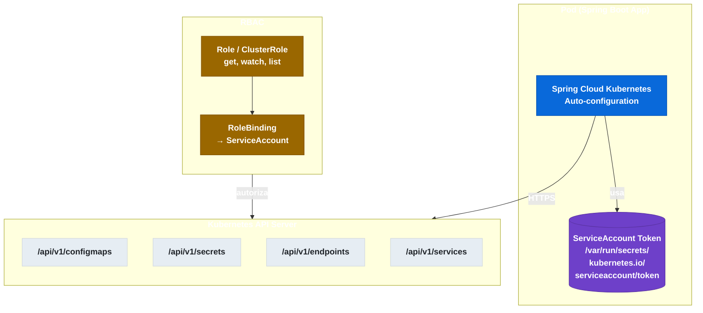

# 9.1 Spring Cloud Kubernetes — Motivación y Arquitectura

← [8.9 Testing de seguridad OAuth2](sc-security-testing.md) | [Índice](README.md) | [9.2 ConfigMap como PropertySource](sc-kubernetes-configmap.md) →

---

## Introducción

Spring Cloud Kubernetes es el módulo que permite a una aplicación Spring Boot aprovechar los primitivos nativos de Kubernetes —ConfigMaps, Secrets, Services y Endpoints— en lugar de depender de Eureka para el registro de servicios y de Spring Cloud Config Server para la gestión de configuración. Al correr dentro del clúster, el pod tiene acceso directo a la API de Kubernetes, lo que elimina componentes externos y simplifica la arquitectura de microservicios en entornos K8s nativos.

## Comparativa arquitectural: K8s nativo vs. pila clásica

La siguiente tabla resume qué componente de la pila clásica de Spring Cloud reemplaza cada mecanismo de Spring Cloud Kubernetes cuando la aplicación corre dentro de Kubernetes.

| Responsabilidad | Pila clásica (no-K8s) | Spring Cloud Kubernetes |
|---|---|---|
| Registro y descubrimiento de servicios | Eureka Server + EurekaClient | KubernetesDiscoveryClient (usa Services y Endpoints K8s) |
| Configuración externalizada | Spring Cloud Config Server + Git/Vault | ConfigMap PropertySource (API de K8s) |
| Credenciales / secretos | Vault o Config Server cifrado | Kubernetes Secret PropertySource |
| Load balancing | Spring Cloud LoadBalancer (con EurekaClient) | Spring Cloud LoadBalancer (con KubernetesDiscoveryClient) |
| Health / liveness-readiness | Spring Boot Actuator genérico | Spring Boot Actuator + probes nativas K8s |

> [CONCEPTO] KubernetesDiscoveryClient implementa la misma interfaz `DiscoveryClient` de Spring Cloud que EurekaDiscoveryClient, por lo que el código de aplicación que usa `@LoadBalanced RestTemplate` o `WebClient` no necesita cambiar al migrar de Eureka a Kubernetes.

> [PREREQUISITO] Para que Spring Cloud Kubernetes funcione, el pod debe correr dentro del clúster (o con un kubeconfig válido en desarrollo local). Fuera del clúster sin kubeconfig, la auto-configuración lanza excepciones al intentar contactar la API de Kubernetes.

## Diagrama de componentes

El siguiente diagrama muestra cómo el pod accede a la API de Kubernetes usando su ServiceAccount montado automáticamente en `/var/run/secrets/kubernetes.io/serviceaccount/`.


*El pod accede a la API de Kubernetes usando el token del ServiceAccount montado automáticamente; el RBAC controla qué verbos están permitidos.*

## Ejemplo central

El siguiente ejemplo muestra la dependencia Maven, el RBAC mínimo y la configuración de arranque necesarios para activar Spring Cloud Kubernetes con el cliente oficial.

```xml
<!-- pom.xml — Spring Cloud Kubernetes con cliente Java oficial -->
<dependency>
    <groupId>org.springframework.cloud</groupId>
    <artifactId>spring-cloud-starter-kubernetes-client-all</artifactId>
</dependency>
```

```yaml
# kubernetes/rbac.yaml — RBAC mínimo para el pod
apiVersion: v1
kind: ServiceAccount
metadata:
  name: my-service-sa
  namespace: default
---
apiVersion: rbac.authorization.k8s.io/v1
kind: Role
metadata:
  name: my-service-role
  namespace: default
rules:
  - apiGroups: [""]
    resources: ["configmaps", "secrets", "endpoints", "services", "pods"]
    verbs: ["get", "watch", "list"]
---
apiVersion: rbac.authorization.k8s.io/v1
kind: RoleBinding
metadata:
  name: my-service-rolebinding
  namespace: default
subjects:
  - kind: ServiceAccount
    name: my-service-sa
    namespace: default
roleRef:
  kind: Role
  name: my-service-role
  apiGroup: rbac.authorization.k8s.io
```

```yaml
# kubernetes/deployment.yaml — asociar ServiceAccount al pod
apiVersion: apps/v1
kind: Deployment
metadata:
  name: my-service
spec:
  replicas: 2
  selector:
    matchLabels:
      app: my-service
  template:
    metadata:
      labels:
        app: my-service
    spec:
      serviceAccountName: my-service-sa
      containers:
        - name: my-service
          image: my-service:1.0.0
          ports:
            - containerPort: 8080
```

```yaml
# src/main/resources/application.yml
spring:
  application:
    name: my-service
  cloud:
    kubernetes:
      config:
        enabled: true
      secrets:
        enabled: false          # desactivar si no se necesitan
      discovery:
        enabled: true
```

```java
// src/main/java/com/example/MyServiceApplication.java
package com.example;

import org.springframework.boot.SpringApplication;
import org.springframework.boot.autoconfigure.SpringBootApplication;
import org.springframework.cloud.client.discovery.EnableDiscoveryClient;

@SpringBootApplication
@EnableDiscoveryClient
public class MyServiceApplication {
    public static void main(String[] args) {
        SpringApplication.run(MyServiceApplication.class, args);
    }
}
```

## Tabla de elementos clave

La tabla siguiente resume las propiedades y beans fundamentales que activan la integración con Kubernetes.

| Elemento | Tipo | Descripción |
|---|---|---|
| `spring.cloud.kubernetes.config.enabled` | Propiedad | Activa ConfigMap como PropertySource |
| `spring.cloud.kubernetes.discovery.enabled` | Propiedad | Activa KubernetesDiscoveryClient |
| `spring.cloud.kubernetes.secrets.enabled` | Propiedad | Activa Secret como PropertySource vía API |
| `KubernetesDiscoveryClient` | Bean | Implementa `DiscoveryClient` usando API K8s |
| `RBAC ServiceAccount` | Prerequisito infra | El pod necesita Role con `get/watch/list` |
| `spring-cloud-starter-kubernetes-client-all` | Dependencia | Starter todo-en-uno con cliente oficial CNCF |

## Buenas y malas prácticas

**Buenas prácticas:**
- Asignar siempre un ServiceAccount específico al Deployment en lugar de usar `default`; esto facilita auditorías RBAC y aplica el principio de mínimo privilegio.
- Usar `spring-cloud-starter-kubernetes-client-all` como starter único en proyectos nuevos (cliente oficial CNCF, recomendado desde Spring Cloud 2022.x).
- Verificar la conectividad con la API de Kubernetes durante el arranque revisando los logs de nivel DEBUG de `o.s.cloud.kubernetes`.
- Definir el Role con namespace scope (no ClusterRole) cuando el servicio solo necesita leer recursos de su propio namespace.

**Malas prácticas:**
- Mezclar `spring-cloud-starter-kubernetes-client` y `spring-cloud-starter-kubernetes-fabric8` en el mismo proyecto: genera conflictos de classpath difíciles de diagnosticar.
- Usar `secrets.enabled=true` sin necesitar el PropertySource de Secrets: expone innecesariamente credenciales vía la API de Kubernetes.
- Asignar ClusterRole con verbos sobre Secrets en todos los namespaces: viola el principio de mínimo privilegio y es un riesgo de seguridad alto.

> [ADVERTENCIA] Si el pod no tiene el ServiceAccount correcto o el RoleBinding falta, Spring Cloud Kubernetes lanzará `io.kubernetes.client.openapi.ApiException: 403 Forbidden` durante la carga del contexto, impidiendo el arranque de la aplicación.

## Verificación y práctica

> [EXAMEN] 1. ¿Qué ventaja principal ofrece Spring Cloud Kubernetes sobre la combinación Eureka + Spring Cloud Config Server cuando la aplicación corre dentro de un clúster Kubernetes?

> [EXAMEN] 2. ¿Qué verbos RBAC mínimos necesita el ServiceAccount del pod para que Spring Cloud Kubernetes pueda leer ConfigMaps y descubrir servicios mediante Endpoints?

> [EXAMEN] 3. Un pod arranca y lanza `ApiException: 403 Forbidden` al intentar leer el ConfigMap. ¿Cuál es la causa más probable y cómo se corrige?

> [EXAMEN] 4. ¿Por qué no se recomienda mezclar los starters `spring-cloud-starter-kubernetes-client` y `spring-cloud-starter-kubernetes-fabric8` en el mismo `pom.xml`?

> [EXAMEN] 5. ¿Qué interfaz implementa `KubernetesDiscoveryClient` y cuál es la implicación para el código de aplicación que ya usa `@LoadBalanced RestTemplate` con Eureka?

---

← [8.9 Testing de seguridad OAuth2](sc-security-testing.md) | [Índice](README.md) | [9.2 ConfigMap como PropertySource](sc-kubernetes-configmap.md) →
