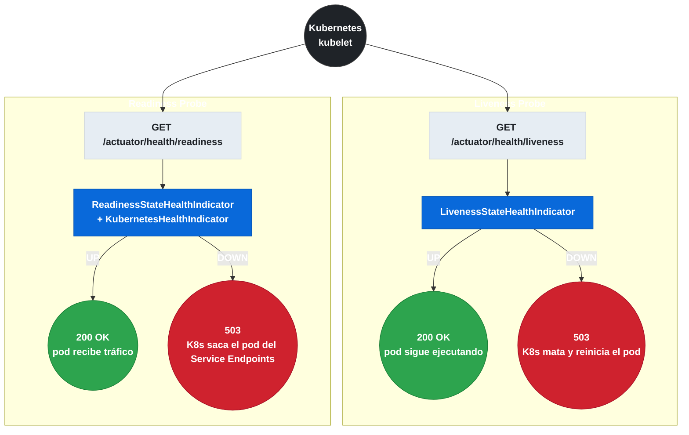
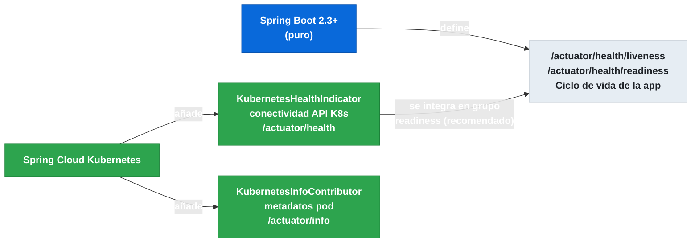

# 9.6 Spring Cloud Kubernetes — Health Indicators y Actuator

← [9.5 Starters: Fabric8 vs Cliente Oficial](sc-kubernetes-starters.md) | [Índice](README.md) | [9.7 Reload de Configuración](sc-kubernetes-reload.md) →

---

## Introducción

Spring Cloud Kubernetes añade indicadores de salud e información de pod al sistema de Actuator de Spring Boot: `KubernetesHealthIndicator` verifica que la API de Kubernetes es accesible y `KubernetesInfoContributor` publica metadatos del pod (namespace, nombre del pod, labels, anotaciones) en el endpoint `/actuator/info`. Además, desde Spring Boot 2.3, Actuator expone automáticamente los endpoints `/actuator/health/liveness` y `/actuator/health/readiness` que Kubernetes puede usar directamente como liveness y readiness probes en el Deployment YAML, sin necesidad de scripts personalizados.

## Diagrama de probes en Kubernetes

El siguiente diagrama muestra cómo Kubernetes consulta los endpoints de Actuator para determinar si el pod está vivo y listo para recibir tráfico.


*El kubelet consulta periódicamente liveness (¿sigue vivo el proceso?) y readiness (¿puede recibir tráfico?); cada uno tiene consecuencias distintas ante un fallo.*

> [CONCEPTO] `KubernetesHealthIndicator` comprueba que la conexión con la API de Kubernetes está operativa. Si el pod pierde acceso a la API (p.ej., fallo del API Server), el health indicator pasa a `DOWN`, lo que puede afectar al estado `readiness` del pod según cómo esté configurado el `HealthEndpointGroups`.

> [CONCEPTO] `KubernetesInfoContributor` publica en `/actuator/info` información del pod obtenida de las variables de entorno estándar de Kubernetes (`HOSTNAME`, `NAMESPACE`, etc.) y de la API de Kubernetes. Es útil para identificar en qué pod y namespace está respondiendo una solicitud.

> [PREREQUISITO] Para activar los endpoints de liveness y readiness, se necesita `management.endpoint.health.probes.enabled=true`. Spring Boot 2.3+ los registra automáticamente cuando detecta que se ejecuta dentro de Kubernetes mediante la presencia del fichero `/var/run/secrets/kubernetes.io/serviceaccount/token`.

## Ejemplo central

El siguiente ejemplo muestra la configuración completa de Actuator para Spring Cloud Kubernetes, incluyendo los probes de liveness y readiness en el Deployment YAML.

```yaml
# src/main/resources/application.yml
management:
  endpoints:
    web:
      exposure:
        include: health, info, metrics
  endpoint:
    health:
      probes:
        enabled: true           # activa /health/liveness y /health/readiness
      show-details: always
      group:
        readiness:
          include: readinessState, kubernetes  # incluye KubernetesHealthIndicator en readiness
  health:
    kubernetes:
      enabled: true             # activa KubernetesHealthIndicator
  info:
    kubernetes:
      enabled: true             # activa KubernetesInfoContributor

spring:
  cloud:
    kubernetes:
      health:
        enabled: true
```

```yaml
# kubernetes/deployment.yaml — Probes en el Deployment
apiVersion: apps/v1
kind: Deployment
metadata:
  name: my-service
spec:
  template:
    spec:
      containers:
        - name: my-service
          image: my-service:1.0.0
          ports:
            - containerPort: 8080
          livenessProbe:
            httpGet:
              path: /actuator/health/liveness
              port: 8080
            initialDelaySeconds: 30
            periodSeconds: 10
            failureThreshold: 3
          readinessProbe:
            httpGet:
              path: /actuator/health/readiness
              port: 8080
            initialDelaySeconds: 10
            periodSeconds: 5
            failureThreshold: 3
```

```java
// src/main/java/com/example/CustomReadinessCheck.java
package com.example;

import org.springframework.boot.availability.AvailabilityChangeEvent;
import org.springframework.boot.availability.ReadinessState;
import org.springframework.context.ApplicationEventPublisher;
import org.springframework.stereotype.Component;

/**
 * Ejemplo de cambio programático del estado de readiness.
 * Útil para marcar el pod como no listo durante un mantenimiento.
 */
@Component
public class CustomReadinessCheck {

    private final ApplicationEventPublisher publisher;

    public CustomReadinessCheck(ApplicationEventPublisher publisher) {
        this.publisher = publisher;
    }

    public void markAsRefusing() {
        AvailabilityChangeEvent.publish(publisher, this, ReadinessState.REFUSING_TRAFFIC);
    }

    public void markAsAccepting() {
        AvailabilityChangeEvent.publish(publisher, this, ReadinessState.ACCEPTING_TRAFFIC);
    }
}
```

```java
// src/main/java/com/example/InfoEndpointTest.java — Ejemplo de respuesta /actuator/info
// Respuesta esperada de GET /actuator/info con KubernetesInfoContributor:
// {
//   "kubernetes": {
//     "inside": true,
//     "namespace": "default",
//     "podName": "my-service-5d4b8c9-xkj2f",
//     "nodeName": "k8s-node-1",
//     "serviceAccount": "my-service-sa"
//   }
// }
package com.example;

// Esta clase es solo documentación del formato de respuesta.
// No requiere código adicional: KubernetesInfoContributor se registra automáticamente.
public class InfoEndpointDoc {}
```

## Tabla de propiedades de Health

La siguiente tabla resume las propiedades relevantes para la configuración de health indicators en Spring Cloud Kubernetes.

| Propiedad | Valor por defecto | Descripción |
|---|---|---|
| `management.health.kubernetes.enabled` | `true` | Activa `KubernetesHealthIndicator` |
| `management.info.kubernetes.enabled` | `true` | Activa `KubernetesInfoContributor` |
| `management.endpoint.health.probes.enabled` | Auto-detectado en K8s | Activa endpoints `/health/liveness` y `/health/readiness` |
| `spring.cloud.kubernetes.health.enabled` | `true` | Alias Spring Cloud K8s para los health indicators |

## Diferencia entre KubernetesHealthIndicator y Spring Boot probes

Es importante distinguir dos conceptos que el examen suele mezclar:

`KubernetesHealthIndicator` es un componente de Spring Cloud Kubernetes que verifica la conectividad con la API del clúster y contribuye al endpoint `/actuator/health`. Es específico de Spring Cloud Kubernetes.

Los endpoints de liveness y readiness (`/actuator/health/liveness` y `/actuator/health/readiness`) son una funcionalidad de Spring Boot 2.3+ (puro Spring Boot, no Spring Cloud Kubernetes) que expone el estado del ciclo de vida de la aplicación. Spring Cloud Kubernetes se integra con este mecanismo pero no lo define.


*Spring Boot define los probes de liveness/readiness; Spring Cloud Kubernetes añade KubernetesHealthIndicator como indicador adicional que debe asignarse al grupo readiness, no al liveness.*

## Buenas y malas prácticas

**Buenas prácticas:**
- Agrupar el `KubernetesHealthIndicator` en el grupo `readiness` (no en `liveness`): si la API K8s no es accesible, el pod debería dejar de recibir tráfico pero no reiniciarse.
- Configurar `initialDelaySeconds` en la liveness probe para dar tiempo a que la aplicación arranque antes de que K8s empiece a evaluarla.
- Usar `AvailabilityChangeEvent` para controlar el estado de readiness desde el código de aplicación durante operaciones de mantenimiento planeadas.

**Malas prácticas:**
- Incluir `KubernetesHealthIndicator` en el grupo `liveness`: si el API Server tiene problemas transitorios, K8s reiniciará todos los pods, amplificando el incidente.
- Exponer el endpoint `/actuator/health` completo con `show-details: always` sin autenticación en producción: puede revelar información sensible de la infraestructura.
- Usar `initialDelaySeconds: 0` en la liveness probe con aplicaciones que tardan más de unos segundos en arrancar.

> [ADVERTENCIA] Activar `management.endpoint.health.probes.enabled=true` manualmente en entornos locales puede provocar que los probes de K8s se comporten de forma distinta a la esperada en producción si el entorno local no tiene el mismo ciclo de vida de disponibilidad.

## Verificación y práctica

> [EXAMEN] 1. ¿Qué información publica `KubernetesInfoContributor` en el endpoint `/actuator/info`?

> [EXAMEN] 2. ¿Qué propiedad de Spring Boot (no de Spring Cloud Kubernetes) activa los endpoints `/actuator/health/liveness` y `/actuator/health/readiness`?

> [EXAMEN] 3. ¿Por qué es problemático incluir `KubernetesHealthIndicator` en el grupo de liveness probe en lugar del grupo de readiness?

> [EXAMEN] 4. ¿Cómo se puede marcar programáticamente un pod como no listo para recibir tráfico sin reiniciarlo?

> [EXAMEN] 5. ¿Cuál es la diferencia entre `KubernetesHealthIndicator` (Spring Cloud Kubernetes) y los endpoints de liveness/readiness probes (Spring Boot)?

---

← [9.5 Starters: Fabric8 vs Cliente Oficial](sc-kubernetes-starters.md) | [Índice](README.md) | [9.7 Reload de Configuración](sc-kubernetes-reload.md) →
