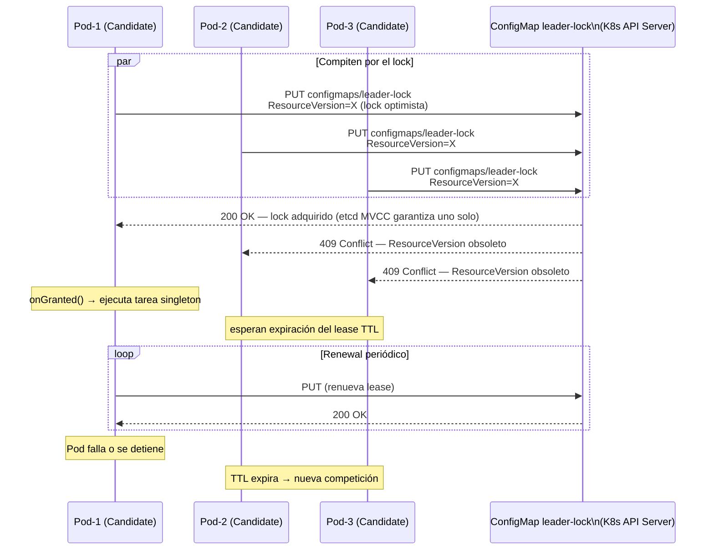
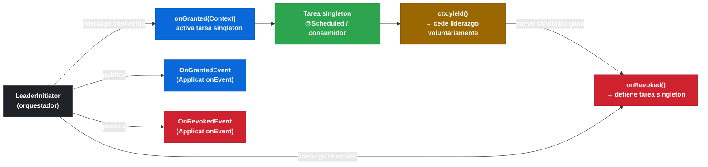

# 9.8 Spring Cloud Kubernetes — Leader Election

← [9.7 Reload de Configuración](sc-kubernetes-reload.md) | [Índice](README.md) | [9.9 Integración con Istio](sc-kubernetes-istio.md) →

---

## Introducción

En arquitecturas donde múltiples réplicas de un pod deben ejecutar una tarea que solo puede realizarse en una instancia a la vez —un scheduler, un consumidor de cola singleton, un proceso de limpieza— se necesita un mecanismo de coordinación de liderazgo. Spring Cloud Kubernetes ofrece una implementación de leader election basada en ConfigMaps de Kubernetes como distributed lock. El bean que obtiene el liderazgo recibe la notificación mediante la interfaz `Candidate` y los events `OnGrantedEvent`/`OnRevokedEvent`, mientras que `LeaderInitiator` orquesta el proceso de competición.

## Diagrama de leader election

El siguiente diagrama muestra cómo tres réplicas de un pod compiten por el liderazgo usando un ConfigMap como lock.



> [CONCEPTO] Spring Cloud Kubernetes usa el mecanismo de `ResourceVersion` de la API de Kubernetes para implementar el lock optimista. Cuando dos pods intentan actualizar el mismo ConfigMap simultáneamente, la API de Kubernetes rechaza la segunda actualización con un `409 Conflict`, garantizando que solo uno obtiene el lock.

> [CONCEPTO] La interfaz `Candidate` define dos métodos: `onGranted(Context ctx)`, llamado cuando el pod obtiene el liderazgo, y `onRevoked()`, llamado cuando lo pierde (por expiración del lease, partición de red, o fallo del pod). El contexto (`Context`) permite ceder voluntariamente el liderazgo llamando a `ctx.yield()`.

> [PREREQUISITO] El starter de leader election es independiente del starter principal. Para el cliente oficial se necesita `spring-cloud-kubernetes-client-leader`; para Fabric8, `spring-cloud-kubernetes-fabric8-leader`. El ServiceAccount necesita verbos `get`, `create`, `update` sobre `configmaps` para gestionar el lock.

## Ejemplo central

El siguiente ejemplo implementa un scheduler singleton que solo ejecuta en el pod líder, con manejo correcto de los eventos de concesión y revocación del liderazgo.

```xml
<!-- pom.xml — Starter de leader election con cliente oficial -->
<dependency>
    <groupId>org.springframework.cloud</groupId>
    <artifactId>spring-cloud-starter-kubernetes-client-all</artifactId>
</dependency>
<dependency>
    <groupId>org.springframework.cloud</groupId>
    <artifactId>spring-cloud-kubernetes-client-leader</artifactId>
</dependency>
```

```yaml
# kubernetes/rbac-leader.yaml — RBAC adicional para leader election
apiVersion: rbac.authorization.k8s.io/v1
kind: Role
metadata:
  name: my-service-leader-role
  namespace: default
rules:
  - apiGroups: [""]
    resources: ["configmaps"]
    verbs: ["get", "watch", "list", "create", "update", "delete", "patch"]
---
apiVersion: rbac.authorization.k8s.io/v1
kind: RoleBinding
metadata:
  name: my-service-leader-rolebinding
  namespace: default
subjects:
  - kind: ServiceAccount
    name: my-service-sa
    namespace: default
roleRef:
  kind: Role
  name: my-service-leader-role
  apiGroup: rbac.authorization.k8s.io
```

```java
// src/main/java/com/example/leader/SchedulerCandidate.java
package com.example.leader;

import org.springframework.integration.leader.Candidate;
import org.springframework.integration.leader.Context;
import org.springframework.stereotype.Component;

import java.util.concurrent.atomic.AtomicBoolean;

/**
 * Implementación de Candidate que gestiona un scheduler singleton.
 * Solo el pod líder ejecuta la tarea periódica.
 */
@Component
public class SchedulerCandidate implements Candidate {

    private final AtomicBoolean leader = new AtomicBoolean(false);

    @Override
    public String getRole() {
        return "scheduler-leader";  // identifica el rol de liderazgo
    }

    @Override
    public String getId() {
        return System.getenv("HOSTNAME");  // nombre del pod como ID único
    }

    @Override
    public void onGranted(Context ctx) {
        leader.set(true);
        System.out.println("Pod " + getId() + " obtuvo el liderazgo. Iniciando scheduler...");
        // Aquí se activa el scheduler o tarea singleton
    }

    @Override
    public void onRevoked() {
        leader.set(false);
        System.out.println("Pod " + getId() + " perdió el liderazgo. Deteniendo scheduler...");
        // Aquí se detiene el scheduler o tarea singleton
    }

    public boolean isLeader() {
        return leader.get();
    }
}
```

```java
// src/main/java/com/example/leader/SingletonScheduler.java
package com.example.leader;

import org.springframework.scheduling.annotation.Scheduled;
import org.springframework.stereotype.Component;

/**
 * Scheduler que comprueba el estado de liderazgo antes de ejecutar.
 * Solo el pod líder ejecuta la tarea.
 */
@Component
public class SingletonScheduler {

    private final SchedulerCandidate candidate;

    public SingletonScheduler(SchedulerCandidate candidate) {
        this.candidate = candidate;
    }

    @Scheduled(fixedRate = 60_000)
    public void runSingletonTask() {
        if (!candidate.isLeader()) {
            return;  // no ejecutar si no somos el líder
        }
        System.out.println("Ejecutando tarea singleton en el pod líder: "
                + System.getenv("HOSTNAME"));
        // lógica de la tarea
    }
}
```

```java
// src/main/java/com/example/leader/LeaderEventListener.java
package com.example.leader;

import org.springframework.context.event.EventListener;
import org.springframework.integration.leader.event.OnGrantedEvent;
import org.springframework.integration.leader.event.OnRevokedEvent;
import org.springframework.stereotype.Component;

/**
 * Escucha los ApplicationEvents de cambio de liderazgo publicados por LeaderInitiator.
 */
@Component
public class LeaderEventListener {

    @EventListener
    public void onGranted(OnGrantedEvent event) {
        System.out.println("Evento: liderazgo concedido. Rol: " + event.getRole());
    }

    @EventListener
    public void onRevoked(OnRevokedEvent event) {
        System.out.println("Evento: liderazgo revocado. Rol: " + event.getRole());
    }
}
```

## Tabla de componentes de leader election

La siguiente tabla resume los componentes clave del mecanismo de leader election.

| Componente | Tipo | Descripción |
|---|---|---|
| `Candidate` | Interfaz | Define `onGranted(Context)` y `onRevoked()` para reaccionar a cambios de liderazgo |
| `LeaderInitiator` | Bean | Orquesta el proceso de competición; requiere un `Candidate` |
| `Context` | Interfaz | Permite ceder el liderazgo con `ctx.yield()` |
| `OnGrantedEvent` | ApplicationEvent | Publicado cuando el pod obtiene el liderazgo |
| `OnRevokedEvent` | ApplicationEvent | Publicado cuando el pod pierde el liderazgo |
| ConfigMap de lock | Recurso K8s | Almacena el estado del lease (quién es el líder y hasta cuándo) |


*Ciclo de vida del liderazgo: LeaderInitiator llama a onGranted al obtener el lock y a onRevoked al perderlo; ctx.yield() permite ceder voluntariamente.*

## Relación con los starters

La elección del starter de leader election debe ser consistente con el starter principal del proyecto. Si se usa `spring-cloud-starter-kubernetes-client-all` (cliente oficial), el starter de leader election debe ser `spring-cloud-kubernetes-client-leader`. Si se usa el starter Fabric8, debe ser `spring-cloud-kubernetes-fabric8-leader`. Mezclar un starter oficial con el leader election de Fabric8 genera conflictos de classpath análogos a los descritos en sc-kubernetes-starters.md.

## Buenas y malas prácticas

**Buenas prácticas:**
- Usar `ctx.yield()` para ceder el liderazgo voluntariamente antes de un mantenimiento planeado, en lugar de esperar a que expire el lease.
- Implementar `getId()` en `Candidate` usando el nombre del pod (`HOSTNAME` env var) para identificar claramente qué pod es el líder en los logs.
- Registrar el liderazgo en métricas (Micrometer) para monitorizar cambios de líder en producción.
- Configurar el RBAC para leader election solo con los verbos estrictamente necesarios sobre `configmaps` en el namespace concreto.

**Malas prácticas:**
- Usar lógica crítica de negocio en `onGranted()` de forma síncrona y lenta: el método es llamado en el hilo de coordinación y puede bloquear el renewal del lease.
- Asumir que una vez otorgado el liderazgo nunca se revoca: particiones de red o expiración del lease pueden revocar el liderazgo en cualquier momento.
- Usar leader election para coordinar aplicaciones stateful sin implementar un protocolo de traspaso de estado entre el líder saliente y el entrante.

> [ADVERTENCIA] El lease del ConfigMap de lock tiene un TTL configurable. Si el pod líder muere sin liberar el lock, el nuevo líder no se elegirá hasta que el TTL expire. En entornos donde la disponibilidad es crítica, ajustar el TTL del lease a un valor pequeño (p.ej., 15 segundos) para minimizar el tiempo de failover.

## Verificación y práctica

> [EXAMEN] 1. ¿Cómo implementa Spring Cloud Kubernetes el distributed lock para la elección de líder, y qué recurso de Kubernetes utiliza internamente?

> [EXAMEN] 2. ¿Qué interfaz debe implementar el bean candidato y qué métodos define?

> [EXAMEN] 3. ¿Qué RBAC adicional necesita el ServiceAccount para soportar leader election que no se necesita para leer ConfigMaps?

> [EXAMEN] 4. ¿Qué eventos de aplicación publica `LeaderInitiator` cuando cambia el estado del liderazgo?

> [EXAMEN] 5. ¿Qué starter de leader election se debe usar si el proyecto ya usa `spring-cloud-starter-kubernetes-client-all`?

---

← [9.7 Reload de Configuración](sc-kubernetes-reload.md) | [Índice](README.md) | [9.9 Integración con Istio](sc-kubernetes-istio.md) →
