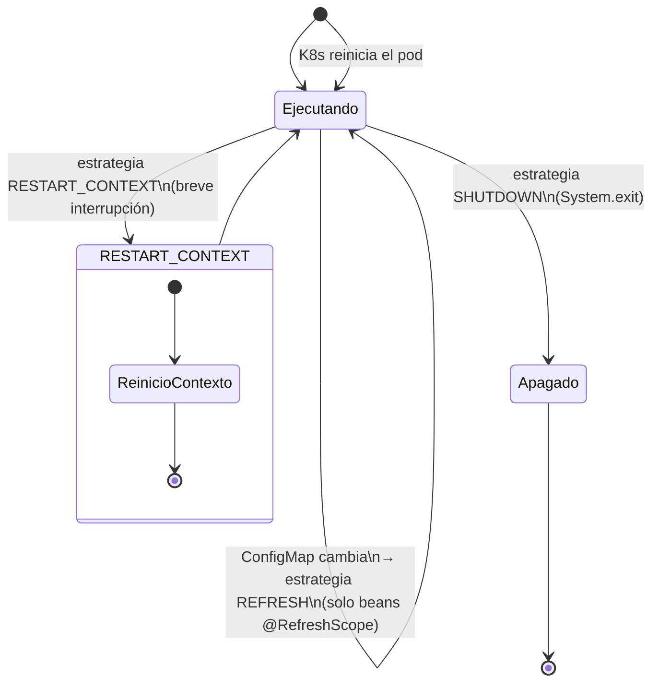
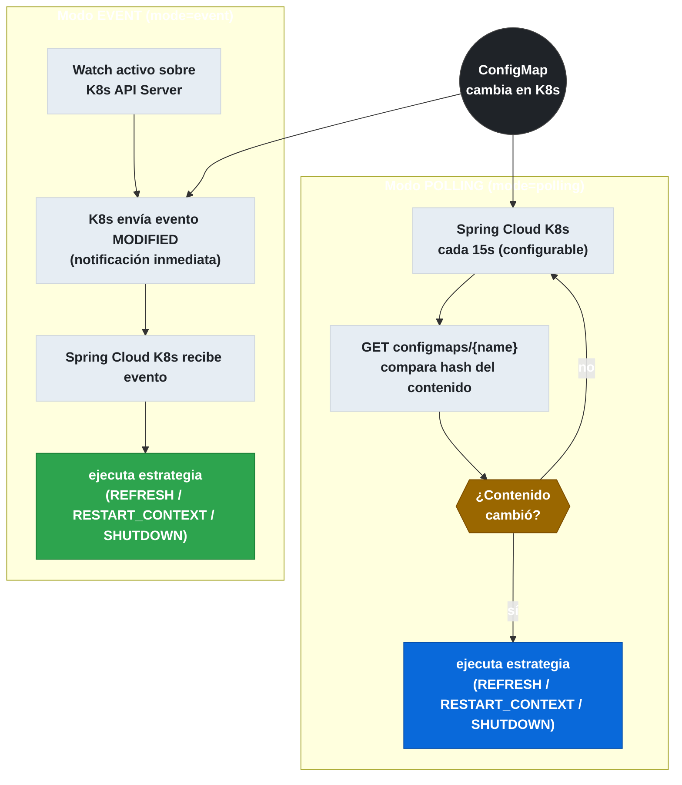

# 9.7 Spring Cloud Kubernetes — Reload de Configuración

← [9.6 Health Indicators y Actuator](sc-kubernetes-health.md) | [Índice](README.md) | [9.8 Leader Election](sc-kubernetes-leader.md) →

---

## Introducción

Spring Cloud Kubernetes puede detectar cambios en un ConfigMap o Secret de Kubernetes y recargar la configuración de la aplicación sin necesidad de redesplegar el pod. Este mecanismo es una ventaja clave respecto a Spring Cloud Config Server con `@RefreshScope`, ya que ofrece tres estrategias con distintos niveles de impacto operacional: desde actualizar solo los beans marcados con `@RefreshScope` hasta apagar el proceso para que Kubernetes reinicie el pod. La elección de estrategia depende del tipo de propiedades que cambian y del impacto aceptable en disponibilidad.

## Estrategias de reload

La siguiente tabla describe las tres estrategias disponibles, que son las enumeraciones del enum `ReloadStrategy` y el punto más evaluado en el examen sobre este módulo.


*Las tres estrategias tienen impacto creciente: REFRESH actualiza solo beans anotados; RESTART_CONTEXT recrea el contexto; SHUTDOWN termina el proceso para que K8s reinicie el pod.*

| Estrategia | Valor | Comportamiento | Impacto |
|---|---|---|---|
| REFRESH | `REFRESH` | Equivale a llamar `/actuator/refresh`; solo actualiza beans anotados con `@RefreshScope` | Bajo — sin reinicio del contexto |
| RESTART_CONTEXT | `RESTART_CONTEXT` | Recrea el `ApplicationContext` completo mientras el pod sigue ejecutando | Medio — breve interrupción de servicio |
| SHUTDOWN | `SHUTDOWN` | Llama a `System.exit()`, K8s reinicia el pod automáticamente | Alto — downtime hasta que K8s levanta el nuevo pod |

> [CONCEPTO] La estrategia `REFRESH` es la menos disruptiva pero solo actualiza los beans anotados con `@RefreshScope`. Si una propiedad la usa un bean singleton no anotado, el valor no se actualizará hasta que el pod se reinicie. Para cubrir toda la configuración se debe usar `RESTART_CONTEXT`.

> [CONCEPTO] El modo de detección de cambios `polling` consulta la API de Kubernetes en un intervalo configurable. El modo `event` usa el mecanismo de Watch de la API de Kubernetes para recibir notificaciones inmediatas cuando cambia el ConfigMap. El modo `event` requiere RBAC `watch` sobre `configmaps` y `secrets`.

> [PREREQUISITO] Para que el reload funcione en modo `event`, el ServiceAccount debe tener el verbo `watch` (además de `get`) sobre `configmaps` y `secrets`. El modo `polling` solo necesita `get`.

## Diagrama de flujo de reload

El siguiente diagrama compara los dos modos de detección de cambios.


*Polling consulta periódicamente la API comparando hashes; event usa Watch de K8s para notificación inmediata (requiere verbo watch en el RBAC).*

## Ejemplo central

El siguiente ejemplo muestra la configuración completa para habilitar el reload automático con la estrategia `REFRESH` en modo `event`, incluyendo el uso de `@RefreshScope` en un bean que consume propiedades.

```xml
<!-- pom.xml — Spring Cloud Actuator necesario para REFRESH -->
<dependency>
    <groupId>org.springframework.cloud</groupId>
    <artifactId>spring-cloud-starter-kubernetes-client-all</artifactId>
</dependency>
<dependency>
    <groupId>org.springframework.boot</groupId>
    <artifactId>spring-boot-starter-actuator</artifactId>
</dependency>
```

```yaml
# src/main/resources/application.yml
spring:
  application:
    name: my-service
  cloud:
    kubernetes:
      reload:
        enabled: true
        strategy: REFRESH          # REFRESH | RESTART_CONTEXT | SHUTDOWN
        mode: event                # event | polling
        period: 15000              # ms para modo polling (ignorado en event)
        monitoring-config-maps: true
        monitoring-secrets: false  # activar con cautela por RBAC

management:
  endpoints:
    web:
      exposure:
        include: refresh, health
```

```java
// src/main/java/com/example/DynamicConfig.java
package com.example;

import org.springframework.boot.context.properties.ConfigurationProperties;
import org.springframework.cloud.context.config.annotation.RefreshScope;
import org.springframework.stereotype.Component;

/**
 * Bean con @RefreshScope: cuando el reload usa la estrategia REFRESH,
 * este bean se destruye y se recrea con las nuevas propiedades del ConfigMap.
 * Sin @RefreshScope, el bean NO se actualiza con la estrategia REFRESH.
 */
@Component
@RefreshScope
@ConfigurationProperties(prefix = "app")
public class DynamicConfig {

    private String featureFlag;
    private int maxConnections;

    public String getFeatureFlag() {
        return featureFlag;
    }

    public void setFeatureFlag(String featureFlag) {
        this.featureFlag = featureFlag;
    }

    public int getMaxConnections() {
        return maxConnections;
    }

    public void setMaxConnections(int maxConnections) {
        this.maxConnections = maxConnections;
    }
}
```

```java
// src/main/java/com/example/ReloadEventListener.java
package com.example;

import org.springframework.cloud.context.refresh.ContextRefreshedWithPropertiesEvent;
import org.springframework.context.event.EventListener;
import org.springframework.stereotype.Component;

/**
 * Escucha los eventos generados por el reload de configuración.
 * Útil para limpiar cachés o notificar al sistema tras un reload.
 */
@Component
public class ReloadEventListener {

    @EventListener
    public void onRefresh(ContextRefreshedWithPropertiesEvent event) {
        System.out.println("Configuración recargada. Propiedades actualizadas: "
                + event.getKeys());
    }
}
```

```yaml
# kubernetes/configmap-updated.yaml — ConfigMap actualizado que dispara el reload
apiVersion: v1
kind: ConfigMap
metadata:
  name: my-service
  namespace: default
data:
  application.yml: |
    app:
      feature-flag: "new-feature-enabled"
      max-connections: 20
# Aplicar con: kubectl apply -f kubernetes/configmap-updated.yaml
# El pod detectará el cambio vía Watch y ejecutará la estrategia REFRESH
```

## Tabla de propiedades de Reload

La siguiente tabla resume todas las propiedades de `ConfigReloadProperties`.

| Propiedad | Valor por defecto | Descripción |
|---|---|---|
| `spring.cloud.kubernetes.reload.enabled` | `false` | Activa el mecanismo de reload automático |
| `spring.cloud.kubernetes.reload.strategy` | `REFRESH` | Estrategia: `REFRESH`, `RESTART_CONTEXT` o `SHUTDOWN` |
| `spring.cloud.kubernetes.reload.mode` | `event` | Modo de detección: `event` o `polling` |
| `spring.cloud.kubernetes.reload.period` | `15000` ms | Intervalo de polling (solo para `mode=polling`) |
| `spring.cloud.kubernetes.reload.monitoring-config-maps` | `true` | Monitoriza cambios en ConfigMaps |
| `spring.cloud.kubernetes.reload.monitoring-secrets` | `false` | Monitoriza cambios en Secrets |

## Buenas y malas prácticas

**Buenas prácticas:**
- Usar `REFRESH` como estrategia por defecto y anotar con `@RefreshScope` solo los beans que realmente cambian con la configuración dinámica.
- Preferir el modo `event` sobre `polling` para una respuesta más rápida a los cambios y menos carga sobre la API de Kubernetes.
- Activar `monitoring-secrets: false` a menos que sea estrictamente necesario: los cambios de Secrets suelen requerir reinicio por implicar credenciales.
- Probar el reload con un ConfigMap de prueba antes de activarlo en producción para verificar que `@RefreshScope` cubre todos los beans afectados.

**Malas prácticas:**
- Usar `SHUTDOWN` como estrategia por defecto sin configurar `terminationGracePeriodSeconds` en el Deployment: el pod puede perderse peticiones en curso al apagarse abruptamente.
- Usar `RESTART_CONTEXT` en aplicaciones con estado en memoria sin considerar el impacto de perder ese estado durante el reinicio del contexto.
- Activar `reload.enabled=true` con `mode=event` sin verificar que el ServiceAccount tiene el verbo `watch` en el RBAC.

> [ADVERTENCIA] La estrategia `SHUTDOWN` detiene el proceso JVM. Si el pod tiene `replicas: 1` y no hay lógica de retry en los clientes, habrá downtime hasta que Kubernetes levante el nuevo pod. Usar siempre `replicas >= 2` con rolling update strategy antes de activar `SHUTDOWN`.

## Verificación y práctica

> [EXAMEN] 1. ¿Cuáles son las tres estrategias de reload disponibles en Spring Cloud Kubernetes y cuál es el impacto en la aplicación de cada una?

> [EXAMEN] 2. ¿Qué anotación necesita un bean Spring para que sus propiedades se actualicen cuando se usa la estrategia `REFRESH`?

> [EXAMEN] 3. ¿Cuál es la diferencia entre el modo `polling` y el modo `event` en términos de RBAC requerido y latencia de respuesta?

> [EXAMEN] 4. Un equipo activa `spring.cloud.kubernetes.reload.strategy=REFRESH` pero observa que algunos beans no actualizan sus propiedades tras modificar el ConfigMap. ¿Cuál es la causa más probable?

> [EXAMEN] 5. ¿Por qué se recomienda tener al menos dos réplicas del pod antes de usar la estrategia `SHUTDOWN`?

---

← [9.6 Health Indicators y Actuator](sc-kubernetes-health.md) | [Índice](README.md) | [9.8 Leader Election](sc-kubernetes-leader.md) →
