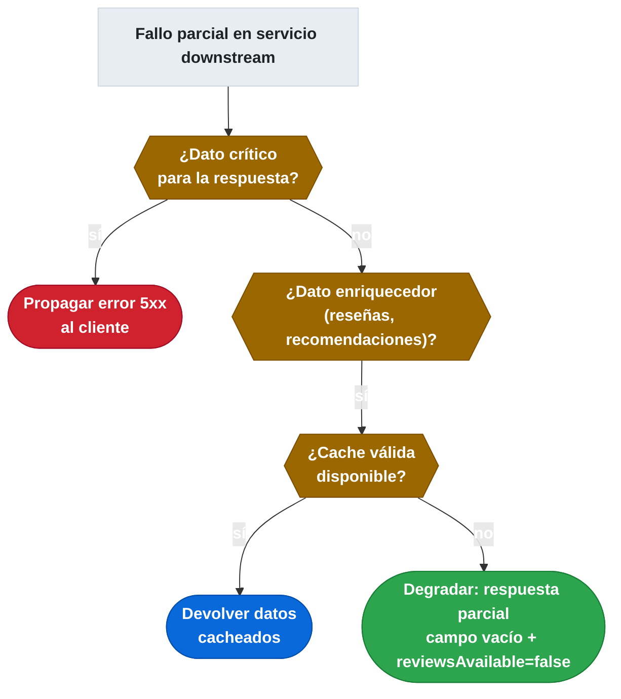

# 13.6 API Composition y Aggregator: llamadas paralelas reactivas y fallos parciales

← [13.5 CQRS y Event Sourcing](sc-patrones-cqrs-event-sourcing.md) | [Índice](README.md) | [13.7 Patrones de resiliencia](sc-patrones-resilience-design-patterns.md) →

---

## Introducción

En microservicios, las consultas que antes se resolvían con un JOIN en el monolito ahora requieren llamadas a múltiples servicios. El patrón API Composition (también llamado Aggregator) define quién hace esas llamadas, cómo las coordina y cómo construye la respuesta compuesta. El aggregator introduce la necesidad de gestionar latencia acumulada, fallos parciales y estrategias de degradación elegante.

## El patrón Aggregator

> [CONCEPTO] **Aggregator pattern**: un componente (el aggregator) recibe una petición del cliente, realiza llamadas a múltiples microservicios, combina los resultados y devuelve una respuesta unificada. El aggregator puede ser el propio API Gateway, un microservicio dedicado de composición, o un BFF. El cliente recibe una única respuesta en lugar de tener que hacer múltiples llamadas.

El aggregator puede ubicarse en varios puntos de la arquitectura:

| Ubicación | Ventaja | Desventaja |
|---|---|---|
| API Gateway (Spring Cloud Gateway) | Sin hop adicional, centralizado | Mezcla routing con lógica de negocio |
| BFF dedicado por tipo de cliente | Adaptado al cliente, equipo autónomo | Servicio adicional que mantener |
| Microservicio de composición | Reutilizable entre clientes | Acoplamiento con servicios downstream |

## Llamadas reactivas paralelas vs secuenciales

> [CONCEPTO] **Reactivo vs síncrono en API Composition**: las llamadas secuenciales acumulan la latencia de cada servicio (la latencia total es la suma de todas las latencias). Las llamadas paralelas usando WebClient reactivo reducen la latencia total a la del servicio más lento (la latencia del peor caso). Para N servicios independientes, el paralelo siempre es preferible cuando los datos no tienen dependencias entre sí.

La siguiente comparativa ilustra el impacto en latencia:

```mermaid
sequenceDiagram
    participant AGG as Aggregator
    participant A as Catalog (200ms)
    participant B as Inventory (150ms)
    participant C as Reviews (100ms)

    Note over AGG,C: Llamadas PARALELAS — latencia total = 200ms (el más lento)

    rect rgb(0, 80, 160)
        par Llamadas simultáneas
            AGG->>A: GET /products/{id}
        and
            AGG->>B: GET /stock/{id}
        and
            AGG->>C: GET /reviews?productId={id}
        end
    end

    A-->>AGG: CatalogProduct (t=200ms)
    B-->>AGG: InventoryStock (t=150ms)
    C-->>AGG: List&lt;Review&gt; (t=100ms)
    Note over AGG: Mono.zip → combina los tres resultados
    AGG-->>AGG: ProductDetail (compuesto)
```
*Llamadas paralelas con `Mono.zip`: la latencia total es la del servicio más lento, no la suma de todos.*

## Fallos parciales y estrategias de degradación

> [CONCEPTO] **Latencia y fallos parciales**: cuando uno de los servicios del aggregator falla o es lento, la estrategia de respuesta define la experiencia del usuario. Las opciones son: propagar el error (respuesta parcial inaceptable), degradar la respuesta (devolver datos sin la parte fallida con un indicador de ausencia), o devolver datos cacheados (la última respuesta válida conocida).

La elección depende del dominio: en datos críticos (precio, disponibilidad), propagar el error; en datos enriquecedores (reseñas, recomendaciones), degradar con datos vacíos o cacheados.


*Árbol de decisión para fallos parciales: dato crítico → error; dato enriquecedor → degradación elegante o cache.*

## Ejemplo central: Aggregator reactivo con WebClient y Resilience4j

El siguiente ejemplo implementa un aggregator de detalle de producto que combina datos de tres servicios (catálogo, inventario y reseñas) en paralelo con WebClient reactivo, con fallback en caso de fallo parcial en el servicio de reseñas.

```java
package com.example.aggregator;

import org.springframework.stereotype.Service;
import org.springframework.web.reactive.function.client.WebClient;
import reactor.core.publisher.Mono;
import io.github.resilience4j.circuitbreaker.annotation.CircuitBreaker;
import java.time.Duration;
import java.util.Collections;
import java.util.List;

// DTOs de los servicios downstream
record CatalogProduct(String id, String name, String description, double price) {}
record InventoryStock(String productId, int available) {}
record Review(String productId, int rating, String comment) {}

// DTO de respuesta compuesta
record ProductDetail(
    String id,
    String name,
    String description,
    double price,
    int availableStock,
    List<Review> reviews,
    boolean reviewsAvailable  // indica si el servicio de reseñas respondió
) {}

@Service
public class ProductAggregatorService {

    private final WebClient catalogClient;
    private final WebClient inventoryClient;
    private final WebClient reviewsClient;

    public ProductAggregatorService(WebClient.Builder webClientBuilder) {
        this.catalogClient = webClientBuilder
            .baseUrl("http://catalog-service")
            .build();
        this.inventoryClient = webClientBuilder
            .baseUrl("http://inventory-service")
            .build();
        this.reviewsClient = webClientBuilder
            .baseUrl("http://reviews-service")
            .build();
    }

    public Mono<ProductDetail> getProductDetail(String productId) {
        // Llamadas paralelas: las tres se lanzan simultáneamente con zip
        Mono<CatalogProduct> catalogMono = fetchCatalogProduct(productId)
            .timeout(Duration.ofMillis(500));

        Mono<InventoryStock> inventoryMono = fetchInventoryStock(productId)
            .timeout(Duration.ofMillis(300));

        // Reviews: degradación elegante ante fallo (no es dato crítico)
        Mono<List<Review>> reviewsMono = fetchReviews(productId)
            .timeout(Duration.ofMillis(800))
            .onErrorResume(ex -> Mono.just(Collections.emptyList())); // fallback: lista vacía

        return Mono.zip(catalogMono, inventoryMono, reviewsMono)
            .map(tuple -> {
                CatalogProduct product = tuple.getT1();
                InventoryStock stock = tuple.getT2();
                List<Review> reviews = tuple.getT3();

                return new ProductDetail(
                    product.id(),
                    product.name(),
                    product.description(),
                    product.price(),
                    stock.available(),
                    reviews,
                    !reviews.isEmpty()  // reviewsAvailable = false si el servicio falló
                );
            });
    }

    private Mono<CatalogProduct> fetchCatalogProduct(String productId) {
        return catalogClient.get()
            .uri("/products/{id}", productId)
            .retrieve()
            .bodyToMono(CatalogProduct.class);
    }

    private Mono<InventoryStock> fetchInventoryStock(String productId) {
        return inventoryClient.get()
            .uri("/stock/{productId}", productId)
            .retrieve()
            .bodyToMono(InventoryStock.class);
    }

    @CircuitBreaker(name = "reviews-service", fallbackMethod = "reviewsFallback")
    public Mono<List<Review>> fetchReviews(String productId) {
        return reviewsClient.get()
            .uri("/reviews?productId={productId}", productId)
            .retrieve()
            .bodyToFlux(Review.class)
            .collectList();
    }

    // Fallback cuando el Circuit Breaker del servicio de reseñas está abierto
    public Mono<List<Review>> reviewsFallback(String productId, Throwable t) {
        return Mono.just(Collections.emptyList());
    }
}
```

```java
// Controller que expone el endpoint de composición
package com.example.aggregator;

import org.springframework.web.bind.annotation.GetMapping;
import org.springframework.web.bind.annotation.PathVariable;
import org.springframework.web.bind.annotation.RequestMapping;
import org.springframework.web.bind.annotation.RestController;
import reactor.core.publisher.Mono;

@RestController
@RequestMapping("/api/products")
public class ProductAggregatorController {

    private final ProductAggregatorService aggregatorService;

    public ProductAggregatorController(ProductAggregatorService aggregatorService) {
        this.aggregatorService = aggregatorService;
    }

    @GetMapping("/{productId}/detail")
    public Mono<ProductDetail> getProductDetail(@PathVariable String productId) {
        return aggregatorService.getProductDetail(productId);
    }
}
```

## Buenas y malas prácticas

**Buenas prácticas:**
- Usar `Mono.zip` o `Mono.zipWith` para lanzar llamadas independientes en paralelo con WebClient reactivo.
- Definir timeouts individuales por servicio (no un timeout global): servicios más lentos merecen más tiempo que los rápidos.
- Implementar fallback de degradación para datos no críticos (reseñas, recomendaciones).
- Integrar Circuit Breaker en el aggregator para servicios downstream propensos a fallos.

**Malas prácticas:**
- Hacer llamadas secuenciales cuando los datos no tienen dependencias entre sí.
- Propagar errores parciales de datos no críticos al cliente como error 500.
- No establecer timeouts en las llamadas del aggregator — un servicio lento bloquea la respuesta completa.
- Construir un aggregator que acumula demasiadas responsabilidades (mega-aggregator que llama a 10+ servicios).

## Verificación y práctica

> [EXAMEN] 1. ¿Cómo implementas una consulta que requiere datos de múltiples microservicios usando el patrón Aggregator, y quién debe orquestar las llamadas?

> [EXAMEN] 2. ¿Cuándo usas llamadas paralelas reactivas en lugar de secuenciales en un aggregator, y qué impacto tiene en la latencia percibida?

> [EXAMEN] 3. ¿Qué estrategia aplicas cuando uno de los servicios del aggregator devuelve un error parcial con datos no críticos?

> [EXAMEN] 4. ¿Cuál es la diferencia entre ubicar el aggregator en el API Gateway versus en un microservicio dedicado? ¿Cuándo prefieres cada opción?

---

← [13.5 CQRS y Event Sourcing](sc-patrones-cqrs-event-sourcing.md) | [Índice](README.md) | [13.7 Patrones de resiliencia](sc-patrones-resilience-design-patterns.md) →
