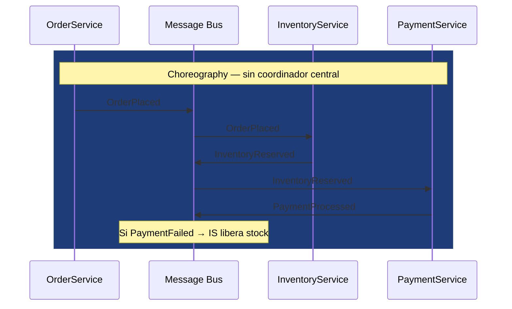
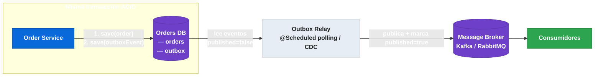

# 13.3 Comunicación asíncrona y eventos: EDA, Choreography vs Orchestration, Outbox Pattern

← [13.2 Comunicación síncrona](sc-patrones-comunicacion-sincrona.md) | [Índice](README.md) | [13.4 Patrón Saga](sc-patrones-saga.md) →

---

## Introducción

La comunicación síncrona acopla temporalmente a productor y consumidor: si el destino no está disponible, la operación falla. La comunicación asíncrona basada en eventos elimina ese acoplamiento temporal — el productor publica un evento y continúa sin esperar respuesta. Este patrón es la base de las arquitecturas Event-Driven (EDA) y habilita la escalabilidad independiente, la resiliencia y la integración desacoplada entre microservicios.

## Event-Driven Architecture: el modelo de comunicación

> [CONCEPTO] **Event-Driven Architecture (EDA)**: en un sistema event-driven, los servicios publican hechos que ocurrieron en su dominio (eventos) en lugar de invocar directamente a otros servicios. Los consumidores suscritos reaccionan a esos eventos de forma independiente. El productor no conoce ni depende de quién consume el evento.

La diferencia fundamental con un sistema request-driven es que en EDA el productor **no espera respuesta**: el evento es una notificación de algo que ya ocurrió, no una petición de algo que debe hacerse. Esto introduce **consistencia eventual** — los sistemas llegan al mismo estado, pero no necesariamente al mismo tiempo.

## Choreography vs Orchestration

> [CONCEPTO] **Choreography**: cada servicio reacciona a eventos publicados por otros servicios sin un coordinador central. El flujo emerge de las reacciones de cada participante. Es adecuado para flujos simples o con pocos participantes. El problema: el flujo global es difícil de rastrear y depurar.

> [CONCEPTO] **Orchestration**: un orquestador central dirige explícitamente los pasos del flujo, invocando a los participantes en secuencia y gestionando errores y compensaciones. El flujo es visible y trazable. El problema: introduce un único punto de coordinación que puede convertirse en cuello de botella.

La siguiente tabla compara las dos estrategias para flujos distribuidos:

| Criterio | Choreography | Orchestration |
|---|---|---|
| Acoplamiento | Bajo (solo al bus de mensajes) | Medio (participantes conocen al orquestador) |
| Visibilidad del flujo | Baja (emergente) | Alta (explícita en el orquestador) |
| Escalabilidad | Alta | Media |
| Mantenibilidad en flujos complejos | Baja | Alta |
| Punto de fallo | Distribuido | Orquestador (pero redundante) |


*Choreography: el flujo emerge de las reacciones encadenadas entre servicios a través del bus, sin un orquestador central.*

## Outbox Pattern: publicación atómica de eventos

> [CONCEPTO] **Outbox Pattern**: garantiza que un cambio de estado en la base de datos y el evento correspondiente se publican de forma atómica. La solución: en lugar de publicar directamente al broker, el servicio escribe el evento en una tabla `outbox` dentro de la misma transacción que el cambio de estado. Un proceso separado (relay) lee la tabla outbox y publica los mensajes al broker de mensajería.

El problema que resuelve: sin el Outbox Pattern, una falla entre la escritura en BD y la publicación al broker genera inconsistencia — el estado cambió pero el evento nunca llegó (o al contrario). Two-Phase Commit entre BD y broker es el antipatrón que el Outbox Pattern reemplaza.


*Outbox Pattern: el cambio de estado y el evento se escriben atómicamente; el relay los publica al broker en un proceso separado.*

## Ejemplo central: Outbox Pattern con Spring Cloud Stream

El siguiente ejemplo implementa el Outbox Pattern completo: la transacción de negocio escribe en la tabla outbox, y un scheduled relay publica los eventos pendientes al broker usando Spring Cloud Stream. Se incluyen entidades, servicio y relay.

```java
// Entidad de la tabla outbox
package com.example.orders.outbox;

import jakarta.persistence.*;
import java.time.Instant;

@Entity
@Table(name = "outbox_events")
public class OutboxEvent {

    @Id
    @GeneratedValue(strategy = GenerationType.UUID)
    private String id;

    @Column(nullable = false)
    private String aggregateType; // "Order"

    @Column(nullable = false)
    private String aggregateId;

    @Column(nullable = false)
    private String eventType; // "OrderPlaced"

    @Column(nullable = false, columnDefinition = "TEXT")
    private String payload; // JSON serializado del evento

    @Column(nullable = false)
    private Instant createdAt = Instant.now();

    @Column(nullable = false)
    private boolean published = false;

    // Constructor completo
    public OutboxEvent(String aggregateType, String aggregateId,
                       String eventType, String payload) {
        this.aggregateType = aggregateType;
        this.aggregateId = aggregateId;
        this.eventType = eventType;
        this.payload = payload;
    }

    protected OutboxEvent() {}

    public void markPublished() { this.published = true; }

    public String getId() { return id; }
    public String getPayload() { return payload; }
    public String getEventType() { return eventType; }
    public boolean isPublished() { return published; }
}
```

```java
// Servicio de pedidos: escribe el evento en outbox dentro de la misma transacción
package com.example.orders.service;

import com.example.orders.domain.Order;
import com.example.orders.outbox.OutboxEvent;
import com.example.orders.outbox.OutboxEventRepository;
import com.example.orders.repository.OrderRepository;
import com.fasterxml.jackson.databind.ObjectMapper;
import org.springframework.stereotype.Service;
import org.springframework.transaction.annotation.Transactional;

@Service
public class OrderService {

    private final OrderRepository orderRepository;
    private final OutboxEventRepository outboxRepository;
    private final ObjectMapper objectMapper;

    public OrderService(OrderRepository orderRepository,
                        OutboxEventRepository outboxRepository,
                        ObjectMapper objectMapper) {
        this.orderRepository = orderRepository;
        this.outboxRepository = outboxRepository;
        this.objectMapper = objectMapper;
    }

    @Transactional
    public Order placeOrder(CreateOrderCommand command) throws Exception {
        // 1. Cambio de estado en el dominio
        Order order = Order.place(command.getCustomerId(), command.getLines());
        orderRepository.save(order);

        // 2. Escritura del evento en outbox — misma transacción
        String payload = objectMapper.writeValueAsString(new OrderPlacedEvent(
            order.getId().toString(),
            order.getCustomerId().toString(),
            order.getTotalAmount()
        ));
        outboxRepository.save(new OutboxEvent(
            "Order",
            order.getId().toString(),
            "OrderPlaced",
            payload
        ));

        return order;
        // Si la transacción hace rollback, AMBAS escrituras se revierten.
        // El evento nunca llega al broker si no hubo cambio de estado.
    }
}
```

```java
// Relay: publica eventos pendientes al broker con Spring Cloud Stream
package com.example.orders.outbox;

import org.springframework.cloud.stream.function.StreamBridge;
import org.springframework.messaging.support.MessageBuilder;
import org.springframework.scheduling.annotation.Scheduled;
import org.springframework.stereotype.Component;
import org.springframework.transaction.annotation.Transactional;
import java.util.List;

@Component
public class OutboxRelay {

    private final OutboxEventRepository outboxRepository;
    private final StreamBridge streamBridge;

    public OutboxRelay(OutboxEventRepository outboxRepository,
                       StreamBridge streamBridge) {
        this.outboxRepository = outboxRepository;
        this.streamBridge = streamBridge;
    }

    @Scheduled(fixedDelay = 1000) // cada segundo
    @Transactional
    public void relayPendingEvents() {
        List<OutboxEvent> pending = outboxRepository.findTop100ByPublishedFalseOrderByCreatedAtAsc();

        for (OutboxEvent event : pending) {
            boolean sent = streamBridge.send(
                "orders-out-0",
                MessageBuilder
                    .withPayload(event.getPayload())
                    .setHeader("eventType", event.getEventType())
                    .build()
            );

            if (sent) {
                event.markPublished();
                outboxRepository.save(event);
            }
        }
    }
}
```

## Buenas y malas prácticas

**Buenas prácticas:**
- Usar el Outbox Pattern siempre que sea necesario garantizar atomicidad entre cambio de estado y publicación de evento.
- Diseñar consumidores idempotentes: el relay puede publicar el mismo evento más de una vez si falla entre la publicación y el marcado como published.
- Incluir el `eventType` como cabecera del mensaje para que los consumidores puedan enrutar sin deserializar el payload.
- Implementar limpieza periódica de la tabla outbox para eventos publicados.

**Malas prácticas:**
- Publicar directamente al broker desde la lógica de negocio sin el patrón Outbox — riesgo de pérdida de eventos.
- Usar Two-Phase Commit entre BD y broker — introduce bloqueos distribuidos incompatibles con alta disponibilidad.
- Acoplar el modelo de evento al modelo de dominio interno — expone detalles de implementación a consumidores externos.

> [ADVERTENCIA] El relay del Outbox Pattern introduce latencia (el evento llega al broker segundos después del commit). Para casos donde se necesita publicación inmediata, considerar Change Data Capture (CDC) con Debezium, que reacciona al transaction log de la base de datos en lugar de usar polling.

## Verificación y práctica

> [EXAMEN] 1. ¿Cuál es la diferencia entre un sistema event-driven y uno request-driven, y cuándo la asincronía introduce más problemas que beneficios?

> [EXAMEN] 2. ¿Cómo garantiza el Outbox Pattern la atomicidad entre el cambio de estado y la publicación del evento sin usar transacciones distribuidas?

> [EXAMEN] 3. ¿Cuándo elegirías Choreography sobre Orchestration, y cuál de los dos dificulta más el rastreo de errores en un flujo de 5 servicios?

> [EXAMEN] 4. ¿Por qué los consumidores de eventos deben ser idempotentes en una arquitectura EDA, y cómo implementarías idempotencia en un consumidor Spring Cloud Stream?

> [EXAMEN] 5. ¿Qué ventaja aporta CDC con Debezium sobre el relay por polling del Outbox Pattern, y qué complejidad operacional introduce?

---

← [13.2 Comunicación síncrona](sc-patrones-comunicacion-sincrona.md) | [Índice](README.md) | [13.4 Patrón Saga](sc-patrones-saga.md) →
