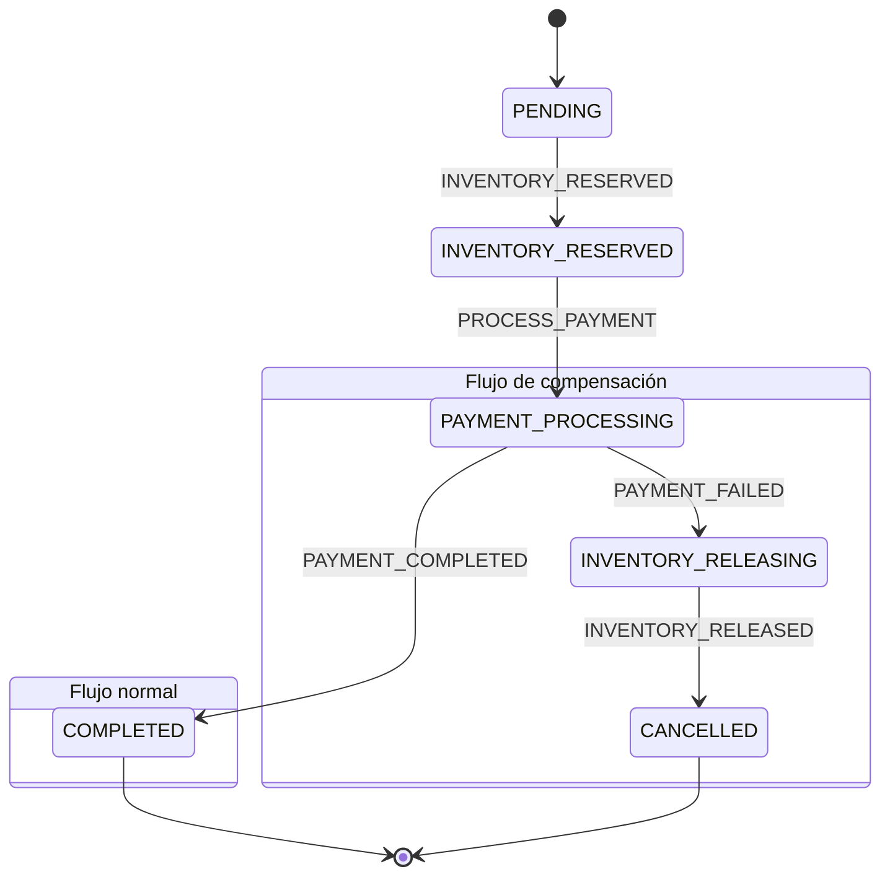

# 13.4 Patrón Saga: choreography, orchestration, compensación e idempotencia

← [13.3 Comunicación asíncrona y eventos](sc-patrones-comunicacion-asincrona-eventos.md) | [Índice](README.md) | [13.5 CQRS y Event Sourcing](sc-patrones-cqrs-event-sourcing.md) →

---

## Introducción

En microservicios, las transacciones ACID que abarcan múltiples servicios son imposibles sin introducir bloqueos distribuidos que destruyen la disponibilidad. El patrón Saga resuelve este problema dividiendo una transacción de larga duración en una secuencia de transacciones locales, cada una seguida de un evento. Si un paso falla, se ejecutan **transacciones compensatorias** en orden inverso para deshacer los pasos anteriores completados. Es el reemplazo directo del Two-Phase Commit en microservicios.

## Variantes: Choreography-based vs Orchestration-based Saga

> [CONCEPTO] **Choreography-based Saga**: no existe orquestador central. Cada servicio escucha eventos y, al procesarlos exitosamente, publica el siguiente evento del flujo. Si falla, publica un evento de error que desencadena las compensaciones. El flujo emerge de las reacciones de cada participante.

> [CONCEPTO] **Orchestration-based Saga (Saga Orchestrator)**: un componente central (el orquestador) conoce todos los pasos del flujo. Envía comandos a cada participante y espera confirmación (éxito o error). Ante fallos, el orquestador envía comandos de compensación en orden inverso.

El siguiente diagrama compara el flujo de una Saga de creación de pedido en ambas variantes:

```mermaid
sequenceDiagram
    participant OS as OrderService
    participant IS as InventoryService
    participant PS as PaymentService

    rect rgb(30, 60, 120)
        Note over OS,PS: Choreography-based Saga
        OS->>IS: OrderPlaced (evento)
        IS->>PS: InventoryReserved (evento)
        PS-->>OS: PaymentProcessed (evento)
        Note right of PS: Si falla: PaymentFailed
        PS--xIS: PaymentFailed
        Note right of IS: Compensa: libera stock
    end

    Note over OS,PS: ─────────────────────────────────

    participant ORCH as SagaOrchestrator

    rect rgb(20, 80, 40)
        Note over ORCH,PS: Orchestration-based Saga
        ORCH->>IS: ReserveInventory (comando)
        IS-->>ORCH: InventoryReserved
        ORCH->>PS: ProcessPayment (comando)
        PS--xORCH: PaymentFailed
        rect rgb(140, 30, 30)
            Note over ORCH,IS: Compensación
            ORCH->>IS: ReleaseInventory (compensación)
            IS-->>ORCH: InventoryReleased
        end
    end
```


*Comparativa: en Choreography el flujo emerge de eventos; en Orchestration el orquestador dirige cada paso y sus compensaciones.*

## Transacciones compensatorias

> [CONCEPTO] **Compensating transaction**: una operación que deshace el efecto de una transacción local ya completada. No es un rollback ACID — el estado pasó por un estado intermedio visible para otros. La compensación es una nueva operación de negocio con sus propias reglas. Diferencia clave: un rollback ACID no deja rastro; una compensación sí ocurrió y puede tener efectos colaterales.

Una compensación puede fallar. Estrategias ante fallo de compensación:
- **Retry con backoff exponencial**: la compensación es idempotente y puede reintenarse.
- **Dead Letter Queue (DLQ)**: los mensajes de compensación que no pueden procesarse van a DLQ para intervención manual.
- **Semantic Lock**: marcar el registro en estado "COMPENSATING" para prevenir accesos concurrentes durante la compensación.

## Idempotencia en Saga

> [CONCEPTO] **Idempotencia en Saga**: cada paso de una Saga (tanto el paso normal como su compensación) debe ser idempotente: ejecutarlo múltiples veces debe producir el mismo resultado que ejecutarlo una vez. Esto es necesario porque los mensajes pueden entregarse más de una vez (at-least-once delivery) y el orquestador puede reintentar comandos fallidos.

La implementación más común usa un **idempotency key**: antes de procesar un comando, el servicio verifica si ya procesó ese comando con el mismo ID. Si ya lo procesó, devuelve el resultado anterior sin ejecutar la lógica de negocio.

## Ejemplo central: Orchestration-based Saga con Spring State Machine

El siguiente ejemplo implementa el orquestador de una Saga de pedido usando Spring State Machine para modelar los estados y transiciones de la Saga, con manejo de compensaciones y persistencia del estado.

```java
package com.example.orders.saga;

import org.springframework.statemachine.StateMachine;
import org.springframework.statemachine.config.StateMachineFactory;
import org.springframework.statemachine.support.DefaultStateMachineContext;
import org.springframework.stereotype.Service;
import org.springframework.transaction.annotation.Transactional;

// Estados de la Saga
public enum OrderSagaState {
    PENDING,
    INVENTORY_RESERVED,
    PAYMENT_PROCESSING,
    COMPLETED,
    INVENTORY_RELEASING,   // estado de compensación
    CANCELLED
}

// Eventos de la Saga (comandos y respuestas)
public enum OrderSagaEvent {
    RESERVE_INVENTORY,
    INVENTORY_RESERVED,
    INVENTORY_RESERVATION_FAILED,
    PROCESS_PAYMENT,
    PAYMENT_COMPLETED,
    PAYMENT_FAILED,
    RELEASE_INVENTORY,    // evento de compensación
    INVENTORY_RELEASED
}
```

```java
// Configuración de la State Machine
package com.example.orders.saga;

import org.springframework.context.annotation.Configuration;
import org.springframework.statemachine.config.EnableStateMachineFactory;
import org.springframework.statemachine.config.StateMachineConfigurerAdapter;
import org.springframework.statemachine.config.builders.StateMachineStateConfigurer;
import org.springframework.statemachine.config.builders.StateMachineTransitionConfigurer;

@Configuration
@EnableStateMachineFactory
public class OrderSagaStateMachineConfig
    extends StateMachineConfigurerAdapter<OrderSagaState, OrderSagaEvent> {

    @Override
    public void configure(StateMachineStateConfigurer<OrderSagaState, OrderSagaEvent> states)
        throws Exception {
        states
            .withStates()
            .initial(OrderSagaState.PENDING)
            .state(OrderSagaState.INVENTORY_RESERVED)
            .state(OrderSagaState.PAYMENT_PROCESSING)
            .state(OrderSagaState.INVENTORY_RELEASING)
            .end(OrderSagaState.COMPLETED)
            .end(OrderSagaState.CANCELLED);
    }

    @Override
    public void configure(StateMachineTransitionConfigurer<OrderSagaState, OrderSagaEvent> transitions)
        throws Exception {
        transitions
            // Flujo normal
            .withExternal()
                .source(OrderSagaState.PENDING)
                .target(OrderSagaState.INVENTORY_RESERVED)
                .event(OrderSagaEvent.INVENTORY_RESERVED)
                .and()
            .withExternal()
                .source(OrderSagaState.INVENTORY_RESERVED)
                .target(OrderSagaState.PAYMENT_PROCESSING)
                .event(OrderSagaEvent.PROCESS_PAYMENT)
                .and()
            .withExternal()
                .source(OrderSagaState.PAYMENT_PROCESSING)
                .target(OrderSagaState.COMPLETED)
                .event(OrderSagaEvent.PAYMENT_COMPLETED)
                .and()
            // Flujo de compensación: pago fallido → liberar inventario → cancelar
            .withExternal()
                .source(OrderSagaState.PAYMENT_PROCESSING)
                .target(OrderSagaState.INVENTORY_RELEASING)
                .event(OrderSagaEvent.PAYMENT_FAILED)
                .and()
            .withExternal()
                .source(OrderSagaState.INVENTORY_RELEASING)
                .target(OrderSagaState.CANCELLED)
                .event(OrderSagaEvent.INVENTORY_RELEASED);
    }
}
```

```java
// Orquestador de Saga: escucha respuestas y envía comandos
package com.example.orders.saga;

import org.springframework.cloud.stream.function.StreamBridge;
import org.springframework.context.annotation.Bean;
import org.springframework.messaging.Message;
import org.springframework.messaging.support.MessageBuilder;
import org.springframework.statemachine.StateMachine;
import org.springframework.stereotype.Component;
import java.util.function.Consumer;

@Component
public class OrderSagaOrchestrator {

    private final StateMachine<OrderSagaState, OrderSagaEvent> stateMachine;
    private final StreamBridge streamBridge;
    private final OrderSagaRepository sagaRepository;

    public OrderSagaOrchestrator(
        StateMachine<OrderSagaState, OrderSagaEvent> stateMachine,
        StreamBridge streamBridge,
        OrderSagaRepository sagaRepository) {
        this.stateMachine = stateMachine;
        this.streamBridge = streamBridge;
        this.sagaRepository = sagaRepository;
    }

    // Listener de respuestas del servicio de inventario
    @Bean
    public Consumer<Message<InventoryResponse>> inventoryResponseListener() {
        return message -> {
            String orderId = message.getHeaders().get("orderId", String.class);
            InventoryResponse response = message.getPayload();

            if (response.isSuccess()) {
                stateMachine.sendEvent(MessageBuilder
                    .withPayload(OrderSagaEvent.INVENTORY_RESERVED)
                    .setHeader("orderId", orderId)
                    .build());
                // Avanzar: procesar pago
                stateMachine.sendEvent(MessageBuilder
                    .withPayload(OrderSagaEvent.PROCESS_PAYMENT)
                    .build());
                streamBridge.send("payment-commands-out-0",
                    MessageBuilder
                        .withPayload(new ProcessPaymentCommand(orderId, response.getAmount()))
                        .setHeader("orderId", orderId)
                        .build());
            } else {
                sagaRepository.markAsCancelled(orderId);
            }
        };
    }

    // Listener de respuestas del servicio de pagos
    @Bean
    public Consumer<Message<PaymentResponse>> paymentResponseListener() {
        return message -> {
            String orderId = message.getHeaders().get("orderId", String.class);
            PaymentResponse response = message.getPayload();

            if (response.isSuccess()) {
                stateMachine.sendEvent(MessageBuilder
                    .withPayload(OrderSagaEvent.PAYMENT_COMPLETED)
                    .build());
                sagaRepository.markAsCompleted(orderId);
            } else {
                // Iniciar compensación: liberar inventario
                stateMachine.sendEvent(MessageBuilder
                    .withPayload(OrderSagaEvent.PAYMENT_FAILED)
                    .build());
                streamBridge.send("inventory-commands-out-0",
                    MessageBuilder
                        .withPayload(new ReleaseInventoryCommand(orderId))
                        .setHeader("orderId", orderId)
                        .setHeader("idempotencyKey", orderId + "-release") // garantiza idempotencia
                        .build());
            }
        };
    }
}
```


*Ciclo de vida de la Saga de pedido: flujo normal hacia COMPLETED y flujo de compensación hacia CANCELLED ante fallo de pago.*

## Buenas y malas prácticas

**Buenas prácticas:**
- Diseñar compensaciones como operaciones idempotentes desde el inicio.
- Persistir el estado de la Saga en base de datos para recuperación ante reinicios del orquestador.
- Incluir `idempotencyKey` en cada comando para que los participantes puedan detectar duplicados.
- Usar Choreography para flujos simples de 2-3 pasos; Orchestration para flujos complejos o con múltiples compensaciones.

**Malas prácticas:**
- Intentar coordinar una Saga con transacciones ACID distribuidas (Two-Phase Commit).
- Diseñar compensaciones no idempotentes.
- No gestionar el fallo de las compensaciones (si la compensación también falla, el sistema queda en estado inconsistente).

> [ADVERTENCIA] En Choreography-based Saga, la ausencia de un orquestador central dificulta el diagnóstico cuando el flujo se detiene a mitad. Es imprescindible implementar trazabilidad distribuida (Micrometer Tracing) con un `sagaId` en todas las cabeceras de mensajes.

## Verificación y práctica

> [EXAMEN] 1. ¿Cómo coordinan múltiples servicios una Saga basada en Choreography, y qué riesgo introduce respecto al seguimiento del flujo?

> [EXAMEN] 2. ¿Qué es una transacción compensatoria en Saga y cómo difiere de un rollback ACID?

> [EXAMEN] 3. ¿Por qué cada paso de una Saga debe ser idempotente y cómo implementarías idempotencia usando un idempotency key?

> [EXAMEN] 4. ¿Cuándo elegirías Orchestration-based Saga sobre Choreography-based Saga? Nombra dos criterios de decisión.

> [EXAMEN] 5. ¿Qué ocurre si la transacción compensatoria de un paso de Saga también falla? Describe las estrategias de manejo de este escenario.

---

← [13.3 Comunicación asíncrona y eventos](sc-patrones-comunicacion-asincrona-eventos.md) | [Índice](README.md) | [13.5 CQRS y Event Sourcing](sc-patrones-cqrs-event-sourcing.md) →
