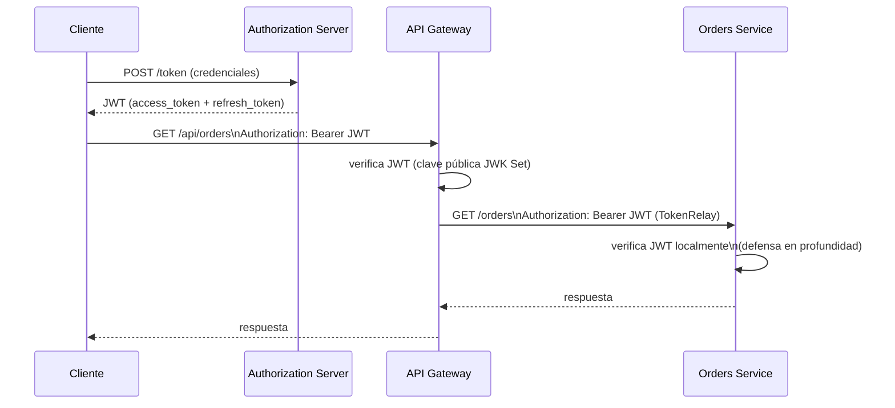
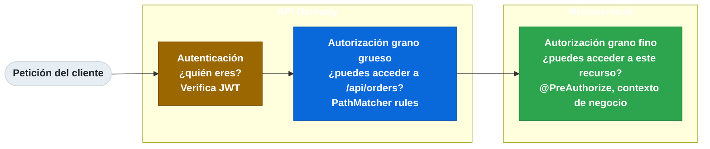

# 13.9 Patrones de seguridad: Access Token, API Gateway Auth y service-to-service auth

← [13.8 Observabilidad distribuida](sc-patrones-observabilidad-distribuida.md) | [Índice](README.md) | [13.10 Patrones de despliegue](sc-patrones-deployment-patterns.md) →

---

## Introducción

La seguridad en microservicios requiere un enfoque diferente al del monolito: no existe una sesión centralizada que gestione la autenticación de todos los módulos. Los patrones de seguridad en microservicios se organizan en tres capas: el cliente externo se autentica con el API Gateway usando Access Tokens (OAuth2/JWT), el gateway verifica el token y lo propaga a los servicios internos, y los servicios internos se autentican entre sí usando mTLS o propagación del JWT del usuario.

## Access Token Pattern

> [CONCEPTO] **Access Token pattern**: en lugar de que cada microservicio consulte al servidor de identidad en cada petición (lo que crearía un cuello de botella y acoplamiento fuerte), el cliente se autentica una vez y obtiene un Access Token firmado (JWT). El token es auto-contenido: incluye los claims necesarios (sub, roles, exp) y puede ser verificado localmente por cada servicio usando la clave pública del servidor de identidad. El servidor de identidad no se consulta en cada petición.

Los JWT tienen fecha de expiración para limitar el daño si son robados. Los tokens de corta duración (access token: 5-15 minutos) se combinan con refresh tokens de larga duración para que los clientes puedan obtener nuevos access tokens sin reautenticación.


*Access Token Pattern: el JWT se obtiene una vez del Authorization Server y se verifica localmente tanto en Gateway como en cada microservicio.*

## API Gateway Auth: centralización de autenticación

> [CONCEPTO] **API Gateway Auth**: centralizar la autenticación y autorización en el API Gateway tiene varias ventajas: los microservicios internos no necesitan depender de Spring Security ni del servidor de identidad, la política de acceso se gestiona en un único lugar, y el tráfico no autenticado se rechaza antes de llegar al backend. El riesgo es que el Gateway se convierte en un punto único de fallo para la seguridad — debe desplegarse en alta disponibilidad.

La diferencia entre autenticación (¿quién eres?) y autorización (¿qué puedes hacer?) determina dónde aplicar cada control:
- **Autenticación**: siempre en el Gateway (verificación del JWT).
- **Autorización de grano grueso** (acceso a una ruta): en el Gateway.
- **Autorización de grano fino** (acceso a un recurso específico): en el microservicio, donde existe el contexto de negocio.


*Capas de seguridad: autenticación y autorización de grano grueso en el Gateway; autorización de grano fino en el microservicio donde existe el contexto de negocio.*

## Service-to-Service Auth: mTLS y propagación de JWT

> [CONCEPTO] **Service-to-Service Auth**: las llamadas entre microservicios internos también deben autenticarse. Las dos estrategias principales son mTLS y propagación del JWT del usuario original.

**mTLS (mutual TLS)**: ambos servicios presentan certificados. El servicio llamador prueba su identidad al llamado, y viceversa. Adecuado para arquitecturas donde los servicios tienen identidades fijas (service accounts) y el Service Mesh gestiona los certificados automáticamente (Istio, Linkerd).

**Propagación de JWT**: el JWT del usuario original se incluye en la cabecera `Authorization` de todas las llamadas downstream. Los servicios intermedios verifican el JWT y pueden leer los claims del usuario. Adecuado cuando los servicios necesitan el contexto del usuario (quién hizo la petición) para tomar decisiones de autorización.

| Criterio | mTLS | JWT Propagation |
|---|---|---|
| Identidad verificada | Servicio (machine-to-machine) | Usuario original |
| Gestión de credenciales | Certificados (rotación automática con Service Mesh) | JWT (expira solo, refresh gestionado por cliente) |
| Contexto de usuario | No disponible en el token | Disponible (sub, roles del usuario) |
| Complejidad operacional | Alta sin Service Mesh | Baja con Spring Security OAuth2 |

## Ejemplo central: API Gateway como punto de autenticación con TokenRelay

El siguiente ejemplo configura Spring Cloud Gateway para verificar JWTs y propagarlos a los microservicios downstream, y configura un Resource Server en el microservicio de pedidos para verificar el JWT propagado.

```java
// API Gateway: SecurityWebFilterChain para verificación de JWT y TokenRelay
package com.example.gateway.security;

import org.springframework.context.annotation.Bean;
import org.springframework.context.annotation.Configuration;
import org.springframework.security.config.annotation.web.reactive.EnableWebFluxSecurity;
import org.springframework.security.config.web.server.ServerHttpSecurity;
import org.springframework.security.web.server.SecurityWebFilterChain;

@Configuration
@EnableWebFluxSecurity
public class GatewaySecurityConfig {

    @Bean
    public SecurityWebFilterChain securityWebFilterChain(ServerHttpSecurity http) {
        return http
            .authorizeExchange(exchanges -> exchanges
                .pathMatchers("/actuator/health").permitAll()
                .pathMatchers("/api/public/**").permitAll()
                .anyExchange().authenticated()
            )
            .oauth2ResourceServer(oauth2 -> oauth2
                .jwt(jwt -> jwt
                    .jwkSetUri("http://auth-server:9000/oauth2/jwks") // obtiene clave pública
                )
            )
            .csrf(csrf -> csrf.disable())
            .build();
    }
}
```

```yaml
# application.yml del Gateway — TokenRelay propaga el JWT a servicios downstream

spring:
  cloud:
    gateway:
      routes:
        - id: orders-service
          uri: lb://orders-service
          predicates:
            - Path=/api/orders/**
          filters:
            - StripPrefix=1
            - TokenRelay   # inyecta el JWT original en Authorization: Bearer <token> del request downstream

  security:
    oauth2:
      resourceserver:
        jwt:
          issuer-uri: http://auth-server:9000
```

```java
// Orders Service: Resource Server que verifica el JWT propagado por el Gateway
package com.example.orders.security;

import org.springframework.context.annotation.Bean;
import org.springframework.context.annotation.Configuration;
import org.springframework.security.config.annotation.method.configuration.EnableMethodSecurity;
import org.springframework.security.config.annotation.web.builders.HttpSecurity;
import org.springframework.security.config.annotation.web.configuration.EnableWebSecurity;
import org.springframework.security.core.authority.SimpleGrantedAuthority;
import org.springframework.security.oauth2.server.resource.authentication.JwtAuthenticationConverter;
import org.springframework.security.web.SecurityFilterChain;
import java.util.List;
import java.util.stream.Collectors;

@Configuration
@EnableWebSecurity
@EnableMethodSecurity
public class OrdersSecurityConfig {

    @Bean
    public SecurityFilterChain securityFilterChain(HttpSecurity http) throws Exception {
        return http
            .authorizeHttpRequests(auth -> auth
                .requestMatchers("/actuator/health").permitAll()
                .anyRequest().authenticated()
            )
            .oauth2ResourceServer(oauth2 -> oauth2
                .jwt(jwt -> jwt
                    .jwkSetUri("http://auth-server:9000/oauth2/jwks")
                    .jwtAuthenticationConverter(jwtAuthenticationConverter())
                )
            )
            .build();
    }

    @Bean
    public JwtAuthenticationConverter jwtAuthenticationConverter() {
        JwtAuthenticationConverter converter = new JwtAuthenticationConverter();
        // Convierte el claim 'roles' del JWT a GrantedAuthority de Spring Security
        converter.setJwtGrantedAuthoritiesConverter(jwt -> {
            List<String> roles = jwt.getClaimAsStringList("roles");
            if (roles == null) return List.of();
            return roles.stream()
                .map(role -> new SimpleGrantedAuthority("ROLE_" + role.toUpperCase()))
                .collect(Collectors.toList());
        });
        return converter;
    }
}

// Uso de @PreAuthorize para autorización de grano fino
package com.example.orders.controller;

import org.springframework.security.access.prepost.PreAuthorize;
import org.springframework.security.core.annotation.AuthenticationPrincipal;
import org.springframework.security.oauth2.jwt.Jwt;
import org.springframework.web.bind.annotation.*;

@RestController
@RequestMapping("/orders")
public class OrderController {

    @PostMapping
    @PreAuthorize("hasRole('USER')")
    public Order placeOrder(@RequestBody CreateOrderRequest request,
                            @AuthenticationPrincipal Jwt jwt) {
        // jwt.getSubject() = userId del token original propagado por el Gateway
        String userId = jwt.getSubject();
        return orderService.placeOrder(userId, request);
    }

    @DeleteMapping("/{orderId}")
    @PreAuthorize("hasRole('ADMIN')")
    public void cancelOrder(@PathVariable String orderId) {
        orderService.cancel(orderId);
    }
}
```

## Buenas y malas prácticas

**Buenas prácticas:**
- Verificar el JWT en el API Gateway Y en cada microservicio — defensa en profundidad. Si un servicio se expone accidentalmente sin pasar por el Gateway, sigue estando protegido.
- Usar access tokens de corta duración (5-15 minutos) con refresh tokens.
- Propagar el `traceId` junto con el JWT para correlacionar auditoría de seguridad con trazas operacionales.
- En mTLS con Service Mesh: dejar que el Service Mesh gestione la rotación de certificados automáticamente.

**Malas prácticas:**
- Confiar ciegamente en que toda petición que llegue al microservicio ya fue autenticada por el Gateway — verificar siempre el JWT.
- Incluir información sensible (contraseñas, PII) en los claims del JWT — el JWT es base64, no cifrado.
- Usar tokens de larga duración sin refresh token — si el token es robado, el atacante tiene acceso prolongado.

> [ADVERTENCIA] El patrón de autenticación solo en el Gateway (no en los microservicios) es un antipatrón conocido como "Confused Deputy". Si un microservicio queda expuesto por un error de red, cualquiera puede llamarlo sin autenticación.

## Verificación y práctica

> [EXAMEN] 1. ¿Cómo el patrón Access Token (OAuth2/JWT) elimina la necesidad de que cada microservicio consulte el servidor de identidad en cada petición?

> [EXAMEN] 2. ¿Qué ventajas tiene centralizar la autenticación en el API Gateway, y qué riesgo introduce el gateway como SPOF?

> [EXAMEN] 3. ¿Cuándo eliges mTLS sobre propagación de JWT para autenticación service-to-service, y cuándo eliges JWT propagation?

> [EXAMEN] 4. ¿Por qué es necesario verificar el JWT tanto en el Gateway como en cada microservicio (defensa en profundidad)?

---

← [13.8 Observabilidad distribuida](sc-patrones-observabilidad-distribuida.md) | [Índice](README.md) | [13.10 Patrones de despliegue](sc-patrones-deployment-patterns.md) →
