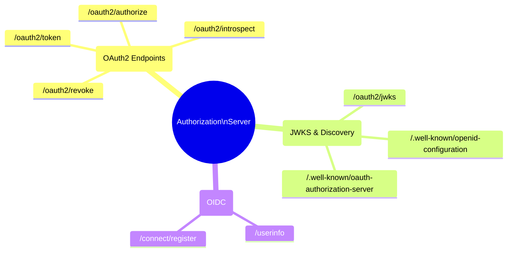
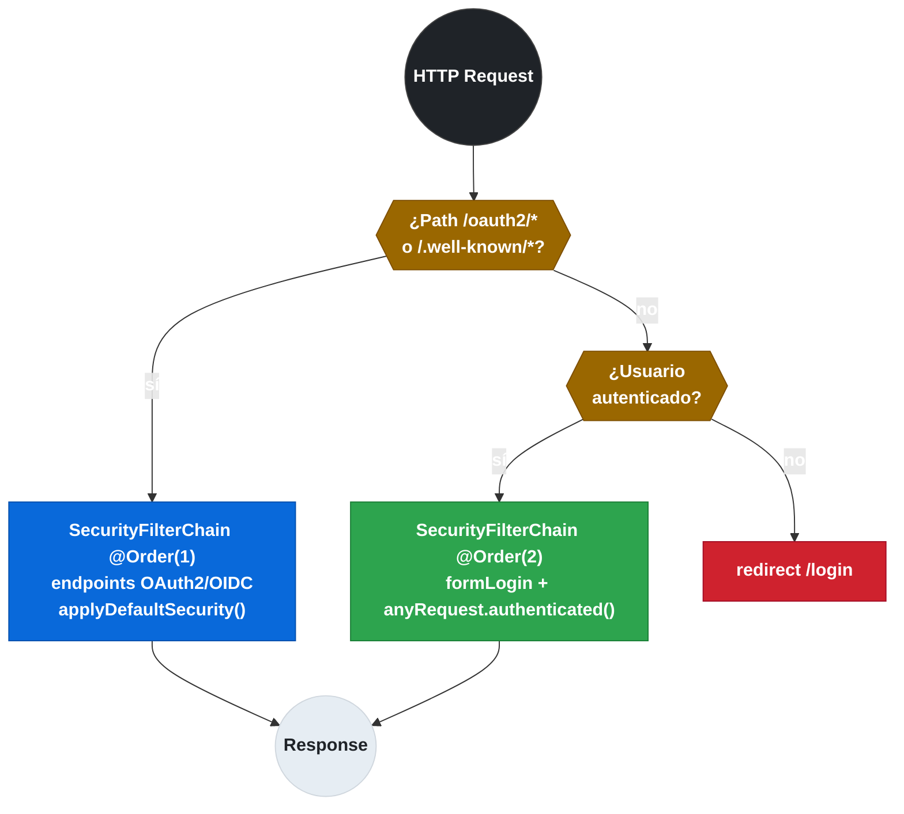
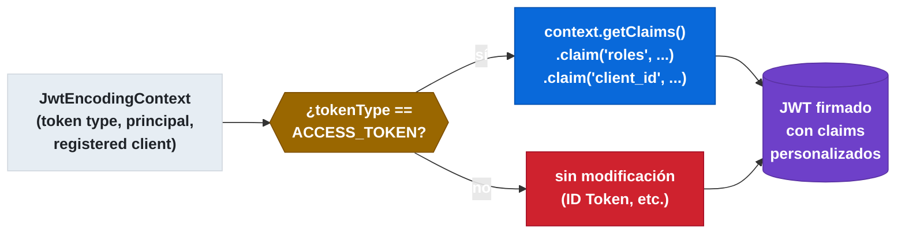

# 8.2 Spring Authorization Server — Configuración y registro de clientes

← [8.1 OAuth2 en microservicios — Roles y flujos de autorización](sc-security-oauth2-conceptos-flujos.md) | [Índice](README.md) | [8.3 Resource Server — Validación de JWT en microservicios](sc-security-resource-server.md) →

---

## Introducción

Spring Authorization Server es la implementación oficial de un Authorization Server OAuth2/OIDC construida sobre Spring Security. Resuelve el problema de proporcionar un Authorization Server propio dentro del ecosistema Spring sin depender de plataformas externas como Keycloak o Auth0. Es la pieza que emite los tokens JWT que consumen los Resource Servers del sistema. En arquitecturas de microservicios con Spring Cloud, es habitual tener un servicio dedicado que actúe como Authorization Server centralizado para toda la plataforma.

> [PREREQUISITO] Este nodo asume conocimiento del flujo OAuth2 (8.1). Se usa Spring Authorization Server 1.x (parte de Spring Cloud 2025.1.1 / Spring Boot 3.x). La antigua librería `spring-security-oauth2` con `@EnableAuthorizationServer` es [LEGACY] y no compatible con Spring Boot 3.

## Dependencia y auto-configuración

Spring Authorization Server se integra en un proyecto Spring Boot mediante el starter oficial. Esta dependencia auto-configura los endpoints OAuth2/OIDC estándar y expone el endpoint JWKS para que los Resource Servers puedan verificar los tokens sin llamar al AS en cada petición.

La dependencia Maven que habilita toda la infraestructura del Authorization Server es:

```xml
<!-- pom.xml -->
<dependency>
    <groupId>org.springframework.boot</groupId>
    <artifactId>spring-boot-starter-oauth2-authorization-server</artifactId>
</dependency>
<!-- spring-boot-starter-security se incluye transitivamente -->
```

Tras añadir la dependencia, Spring Boot auto-configura los siguientes endpoints bajo el path `/oauth2/`:

| Endpoint | Path por defecto | Propósito |
|---|---|---|
| Authorization | `/oauth2/authorize` | Punto de entrada del flujo Authorization Code |
| Token | `/oauth2/token` | Intercambio de code por tokens; Client Credentials |
| Token Introspection | `/oauth2/introspect` | Validación de tokens opacos (RFC 7662) |
| Token Revocation | `/oauth2/revoke` | Revocación de tokens |
| JWKS | `/oauth2/jwks` | Claves públicas para verificar JWTs |
| OIDC Discovery | `/.well-known/openid-configuration` | Metadatos del proveedor OIDC |
| AS Metadata | `/.well-known/oauth-authorization-server` | Metadatos OAuth2 estándar (RFC 8414) |


*Árbol de endpoints que Spring Authorization Server expone automáticamente al añadir el starter.*

> [CONCEPTO] El endpoint `/.well-known/openid-configuration` permite a los Resource Servers descubrir automáticamente el `jwks-uri` usando solo el `issuer-uri`. Spring Boot auto-configura `JwtDecoder` usando este endpoint cuando se especifica `spring.security.oauth2.resourceserver.jwt.issuer-uri`.

## RegisteredClient y RegisteredClientRepository

`RegisteredClient` es la entidad central del Authorization Server: representa a un cliente OAuth2 registrado con todos sus atributos de configuración. `RegisteredClientRepository` es el repositorio donde se almacenan estos clientes.

Cada `RegisteredClient` configura exactamente cómo puede ese cliente obtener tokens: qué métodos de autenticación acepta, qué grant types puede usar, a qué URIs puede redirigir, y qué scopes puede solicitar.

```java
// AuthorizationServerConfig.java
package com.example.authserver.config;

import org.springframework.context.annotation.Bean;
import org.springframework.context.annotation.Configuration;
import org.springframework.security.oauth2.core.AuthorizationGrantType;
import org.springframework.security.oauth2.core.ClientAuthenticationMethod;
import org.springframework.security.oauth2.core.oidc.OidcScopes;
import org.springframework.security.oauth2.server.authorization.client.InMemoryRegisteredClientRepository;
import org.springframework.security.oauth2.server.authorization.client.RegisteredClient;
import org.springframework.security.oauth2.server.authorization.client.RegisteredClientRepository;
import org.springframework.security.oauth2.server.authorization.settings.ClientSettings;
import org.springframework.security.oauth2.server.authorization.settings.TokenSettings;

import java.time.Duration;
import java.util.UUID;

@Configuration
public class AuthorizationServerConfig {

    @Bean
    public RegisteredClientRepository registeredClientRepository() {
        // Cliente 1: app web con Authorization Code + PKCE
        RegisteredClient webClient = RegisteredClient.withId(UUID.randomUUID().toString())
                .clientId("web-app")
                .clientSecret("{noop}secret-web")            // {noop} = sin cifrado (solo dev)
                .clientAuthenticationMethod(ClientAuthenticationMethod.CLIENT_SECRET_BASIC)
                .authorizationGrantType(AuthorizationGrantType.AUTHORIZATION_CODE)
                .authorizationGrantType(AuthorizationGrantType.REFRESH_TOKEN)
                .redirectUri("http://localhost:8080/login/oauth2/code/web-app")
                .postLogoutRedirectUri("http://localhost:8080/")
                .scope(OidcScopes.OPENID)
                .scope(OidcScopes.PROFILE)
                .scope("orders:read")
                .scope("orders:write")
                .clientSettings(ClientSettings.builder()
                        .requireAuthorizationConsent(true)   // muestra pantalla de consentimiento
                        .requireProofKey(true)               // PKCE obligatorio
                        .build())
                .tokenSettings(TokenSettings.builder()
                        .accessTokenTimeToLive(Duration.ofMinutes(30))
                        .refreshTokenTimeToLive(Duration.ofDays(1))
                        .reuseRefreshTokens(false)           // rota el refresh token en cada uso
                        .build())
                .build();

        // Cliente 2: microservicio con Client Credentials (sin usuario)
        RegisteredClient serviceClient = RegisteredClient.withId(UUID.randomUUID().toString())
                .clientId("order-service")
                .clientSecret("{noop}secret-order")
                .clientAuthenticationMethod(ClientAuthenticationMethod.CLIENT_SECRET_BASIC)
                .authorizationGrantType(AuthorizationGrantType.CLIENT_CREDENTIALS)
                .scope("inventory:read")
                .tokenSettings(TokenSettings.builder()
                        .accessTokenTimeToLive(Duration.ofMinutes(5))
                        .build())
                .build();

        return new InMemoryRegisteredClientRepository(webClient, serviceClient);
    }
}
```

> [ADVERTENCIA] `InMemoryRegisteredClientRepository` es solo para desarrollo. En producción usar `JdbcRegisteredClientRepository` con la tabla `oauth2_registered_client` que Spring Authorization Server genera automáticamente mediante los scripts SQL incluidos en el jar.

## Configuración del Authorization Server con SecurityFilterChain

Spring Authorization Server requiere dos `SecurityFilterChain` separados: uno para el protocolo OAuth2/OIDC (endpoints del AS) y otro para la seguridad de la propia aplicación del AS (login del usuario, UI de consentimiento).


*Prioridad de los dos SecurityFilterChain: el de protocolo OAuth2 (Order 1) intercepta primero los endpoints del AS; el de aplicación (Order 2) gestiona el login del usuario.*

```java
// SecurityConfig.java — dos SecurityFilterChain obligatorios
package com.example.authserver.config;

import org.springframework.context.annotation.Bean;
import org.springframework.context.annotation.Configuration;
import org.springframework.core.annotation.Order;
import org.springframework.security.config.Customizer;
import org.springframework.security.config.annotation.web.builders.HttpSecurity;
import org.springframework.security.config.annotation.web.configuration.EnableWebSecurity;
import org.springframework.security.oauth2.server.authorization.config.annotation.web.configuration.OAuth2AuthorizationServerConfiguration;
import org.springframework.security.oauth2.server.authorization.config.annotation.web.configurers.OAuth2AuthorizationServerConfigurer;
import org.springframework.security.oauth2.server.authorization.settings.AuthorizationServerSettings;
import org.springframework.security.web.SecurityFilterChain;
import org.springframework.security.web.authentication.LoginUrlAuthenticationEntryPoint;
import org.springframework.security.core.userdetails.User;
import org.springframework.security.core.userdetails.UserDetailsService;
import org.springframework.security.provisioning.InMemoryUserDetailsManager;
import org.springframework.security.crypto.password.NoOpPasswordEncoder;
import org.springframework.security.crypto.password.PasswordEncoder;

@Configuration
@EnableWebSecurity
public class SecurityConfig {

    // Cadena 1: endpoints OAuth2/OIDC del Authorization Server (máxima prioridad)
    @Bean
    @Order(1)
    public SecurityFilterChain authorizationServerSecurityFilterChain(HttpSecurity http) throws Exception {
        OAuth2AuthorizationServerConfiguration.applyDefaultSecurity(http);
        http.getConfigurer(OAuth2AuthorizationServerConfigurer.class)
                .oidc(Customizer.withDefaults());    // habilita endpoint /userinfo y /connect/register

        http.exceptionHandling(ex -> ex
                .authenticationEntryPoint(
                        new LoginUrlAuthenticationEntryPoint("/login")));   // redirige al login si no autenticado

        return http.build();
    }

    // Cadena 2: seguridad de la app del AS (login form, acceso a UI de consentimiento)
    @Bean
    @Order(2)
    public SecurityFilterChain defaultSecurityFilterChain(HttpSecurity http) throws Exception {
        http.authorizeHttpRequests(auth -> auth
                        .anyRequest().authenticated())
                .formLogin(Customizer.withDefaults());     // pantalla de login del AS

        return http.build();
    }

    @Bean
    public UserDetailsService userDetailsService() {
        // Solo para desarrollo; usar JDBC/LDAP en producción
        var user = User.withDefaultPasswordEncoder()
                .username("usuario")
                .password("clave")
                .roles("USER")
                .build();
        return new InMemoryUserDetailsManager(user);
    }

    @Bean
    public AuthorizationServerSettings authorizationServerSettings() {
        return AuthorizationServerSettings.builder()
                .issuer("http://localhost:9000")    // URL base del AS; debe coincidir con jwt.issuer-uri en RS
                .build();
    }
}
```

## Endpoint JWKS y validación de tokens

El endpoint JWKS (`/oauth2/jwks`) expone las claves públicas RSA o EC que los Resource Servers usan para verificar la firma de los JWT emitidos por este Authorization Server. Spring Authorization Server genera automáticamente un par de claves RSA en memoria al arrancar, pero en producción se debe usar un `JWKSource` configurado con claves persistentes.

El siguiente ejemplo configura un `JWKSource` con un par RSA generado al inicio pero cargado desde una propiedad de configuración (compatible con Config Server):

```java
// JwksConfig.java
package com.example.authserver.config;

import com.nimbusds.jose.jwk.JWKSet;
import com.nimbusds.jose.jwk.RSAKey;
import com.nimbusds.jose.jwk.source.ImmutableJWKSet;
import com.nimbusds.jose.jwk.source.JWKSource;
import com.nimbusds.jose.proc.SecurityContext;
import org.springframework.context.annotation.Bean;
import org.springframework.context.annotation.Configuration;
import org.springframework.security.oauth2.jwt.JwtDecoder;
import org.springframework.security.oauth2.server.authorization.config.annotation.web.configuration.OAuth2AuthorizationServerConfiguration;

import java.security.KeyPair;
import java.security.KeyPairGenerator;
import java.security.interfaces.RSAPrivateKey;
import java.security.interfaces.RSAPublicKey;
import java.util.UUID;

@Configuration
public class JwksConfig {

    @Bean
    public JWKSource<SecurityContext> jwkSource() throws Exception {
        KeyPairGenerator generator = KeyPairGenerator.getInstance("RSA");
        generator.initialize(2048);
        KeyPair keyPair = generator.generateKeyPair();

        RSAKey rsaKey = new RSAKey.Builder((RSAPublicKey) keyPair.getPublic())
                .privateKey((RSAPrivateKey) keyPair.getPrivate())
                .keyID(UUID.randomUUID().toString())
                .build();

        return new ImmutableJWKSet<>(new JWKSet(rsaKey));
    }

    @Bean
    public JwtDecoder jwtDecoder(JWKSource<SecurityContext> jwkSource) {
        return OAuth2AuthorizationServerConfiguration.jwtDecoder(jwkSource);
    }
}
```

> [ADVERTENCIA] En producción, las claves RSA deben persistirse (en un KeyStore, en Vault, o en un secreto de Kubernetes). Si el AS reinicia con claves nuevas, todos los tokens existentes dejan de ser válidos porque la firma no coincide con las claves del JWKS endpoint.

## Personalización de claims con OAuth2TokenCustomizer

`OAuth2TokenCustomizer` permite añadir claims personalizados al JWT emitido por el Authorization Server. Es el mecanismo para incluir información de negocio (roles, tenantId, organizationId) que los Resource Servers necesitan para tomar decisiones de autorización.


*El OAuth2TokenCustomizer solo modifica el ACCESS_TOKEN: añade claims de negocio antes de firmar el JWT.*

```java
// TokenCustomizerConfig.java
package com.example.authserver.config;

import org.springframework.context.annotation.Bean;
import org.springframework.context.annotation.Configuration;
import org.springframework.security.oauth2.server.authorization.OAuth2TokenType;
import org.springframework.security.oauth2.server.authorization.token.JwtEncodingContext;
import org.springframework.security.oauth2.server.authorization.token.OAuth2TokenCustomizer;

@Configuration
public class TokenCustomizerConfig {

    @Bean
    public OAuth2TokenCustomizer<JwtEncodingContext> tokenCustomizer() {
        return context -> {
            // Solo personalizar el access token, no el ID token
            if (OAuth2TokenType.ACCESS_TOKEN.equals(context.getTokenType())) {
                // Añadir roles del usuario como claim personalizado
                context.getClaims().claim("roles",
                        context.getPrincipal().getAuthorities()
                                .stream()
                                .map(a -> a.getAuthority())
                                .toList());

                // Añadir el cliente que solicitó el token
                context.getClaims().claim("client_id",
                        context.getRegisteredClient().getClientId());
            }
        };
    }
}
```

## Tabla de configuraciones clave

Las propiedades de `application.yml` del Authorization Server son mínimas porque la mayor parte de la configuración es programática mediante beans:

```yaml
# application.yml del Authorization Server
server:
  port: 9000

spring:
  datasource:
    url: jdbc:postgresql://localhost:5432/authserver
    username: authuser
    password: ${DB_PASSWORD}

logging:
  level:
    org.springframework.security: DEBUG   # útil para troubleshooting OAuth2
```

| Configuración | Clase/Bean | Descripción |
|---|---|---|
| `issuer` | `AuthorizationServerSettings` | URL base del AS; debe coincidir con `jwt.issuer-uri` en los RS |
| `accessTokenTimeToLive` | `TokenSettings` | Vida del access token; corta por seguridad (5-30 min) |
| `refreshTokenTimeToLive` | `TokenSettings` | Vida del refresh token (horas/días) |
| `reuseRefreshTokens` | `TokenSettings` | `false` rota el refresh token en cada uso (más seguro) |
| `requireProofKey` | `ClientSettings` | Fuerza PKCE para este cliente |
| `requireAuthorizationConsent` | `ClientSettings` | Muestra pantalla de consentimiento al usuario |

## Buenas y malas prácticas

**Buenas prácticas:**
- Usar `JdbcRegisteredClientRepository` con base de datos dedicada en producción; `InMemoryRegisteredClientRepository` solo para tests.
- Configurar `reuseRefreshTokens(false)` para rotar refresh tokens en cada uso, limitando el impacto de un refresh token comprometido.
- Persistir las claves JWKS en un KeyStore o Vault; nunca confiar en las claves generadas en memoria al arrancar.
- Establecer `accessTokenTimeToLive` corto (5-30 minutos) y compensar con refresh tokens de mayor vida.
- El `issuer` en `AuthorizationServerSettings` debe ser una URL públicamente accesible; es el valor que aparecerá en el claim `iss` de todos los tokens.

**Malas prácticas:**
- Usar `{noop}` o contraseñas en texto plano en `clientSecret` fuera de entornos de desarrollo. En producción, usar `{bcrypt}` o `{argon2}`.
- Colocar el Authorization Server y el Resource Server en el mismo servicio Spring Boot sin necesidad: son roles conceptualmente separados.
- No configurar `requireProofKey(true)` para clientes de aplicaciones públicas (SPAs, móviles).
- Hardcodear el `issuer` sin dejarlo configurable por perfil; en desarrollo apunta a `localhost`, en producción a la URL del dominio real.

## Verificación y práctica

> [EXAMEN] **Pregunta 1**: ¿Cuál es la diferencia entre `InMemoryRegisteredClientRepository` y `JdbcRegisteredClientRepository`? ¿Cuándo usar cada uno?

**Respuesta**: `InMemoryRegisteredClientRepository` almacena los clientes en memoria (solo desarrollo/tests, se pierde al reiniciar). `JdbcRegisteredClientRepository` persiste los clientes en base de datos SQL usando el esquema que provee Spring Authorization Server; es el obligatorio en producción para que los clientes sobrevivan reinicios.

> [EXAMEN] **Pregunta 2**: ¿Por qué el Authorization Server necesita dos `SecurityFilterChain`? ¿Qué hace cada uno?

**Respuesta**: El primero (Order 1) configura los endpoints del protocolo OAuth2/OIDC (`/oauth2/authorize`, `/oauth2/token`, `/oauth2/jwks`, etc.) con las reglas de seguridad del estándar. El segundo (Order 2) configura la seguridad de la propia aplicación del AS (el formulario de login del usuario, la página de consentimiento), que usa seguridad web tradicional.

> [EXAMEN] **Pregunta 3**: ¿Para qué sirve el endpoint JWKS y quién lo consume?

**Respuesta**: El endpoint JWKS (`/oauth2/jwks`) expone las claves públicas RSA/EC que el AS usa para firmar los JWT. Los Resource Servers lo consumen al arrancar (o periódicamente) para obtener las claves y verificar localmente la firma de los tokens entrantes sin llamar al AS en cada petición.

> [EXAMEN] **Pregunta 4**: ¿Cómo añade el Authorization Server claims personalizados (por ejemplo, los roles del usuario) al JWT emitido?

**Respuesta**: Implementando el bean `OAuth2TokenCustomizer<JwtEncodingContext>`. En el callback se accede al `JwtEncodingContext` que expone `getClaims()` para añadir claims, `getPrincipal()` para acceder al usuario autenticado, y `getRegisteredClient()` para acceder al cliente que solicitó el token.

> [EXAMEN] **Pregunta 5**: ¿Qué consecuencia tiene reiniciar un Authorization Server que genera sus claves JWKS en memoria al arrancar?

**Respuesta**: Todos los tokens JWT emitidos antes del reinicio dejan de ser válidos porque fueron firmados con las claves antiguas que ya no existen. Los Resource Servers que cachearon las claves JWKS intentarán verificar los nuevos tokens con claves antiguas (fallo) y viceversa. Se debe usar claves persistentes (KeyStore, Vault) en producción.

---

← [8.1 OAuth2 en microservicios — Roles y flujos de autorización](sc-security-oauth2-conceptos-flujos.md) | [Índice](README.md) | [8.3 Resource Server — Validación de JWT en microservicios](sc-security-resource-server.md) →

