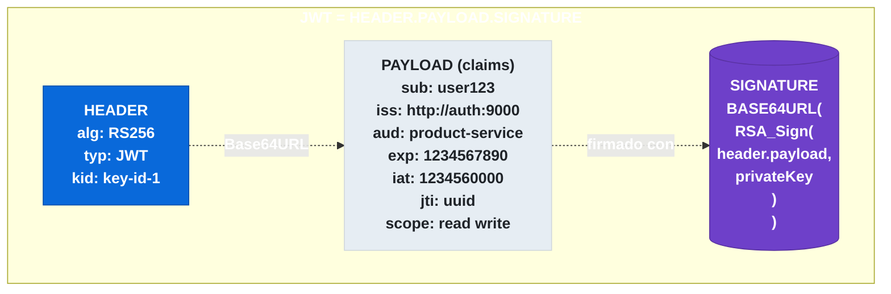
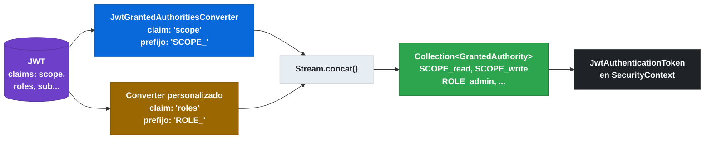
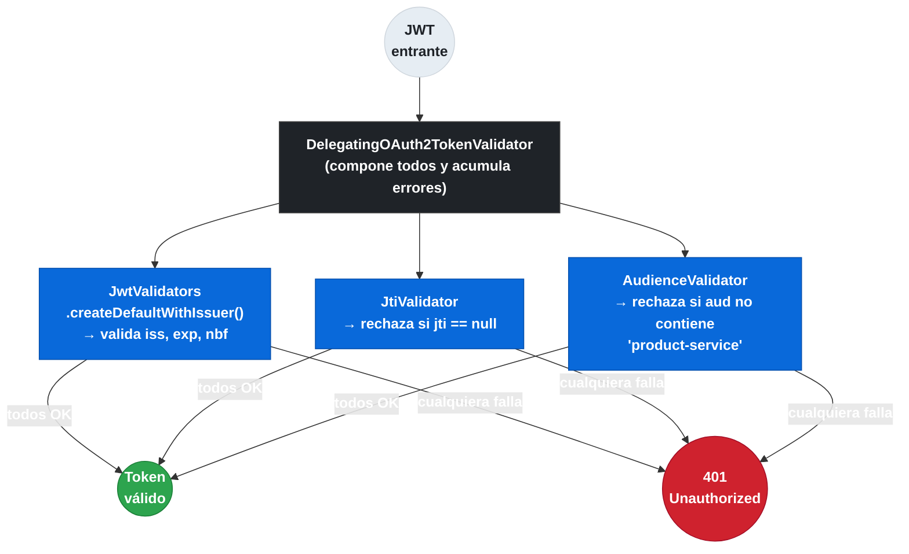

# 8.5 JWT — Estructura, claims estándar y conversión a Spring Security

← [sc-security-oauth2-client.md](sc-security-oauth2-client.md) | [Índice](README.md) | [sc-security-token-relay-gateway.md](sc-security-token-relay-gateway.md) →

---

## Introducción

Un JSON Web Token (JWT, RFC 7519) es un mecanismo de transmisión segura de información entre partes como objeto JSON firmado criptográficamente. En el contexto de OAuth2/OIDC, el JWT es el Access Token o el ID Token: contiene claims que identifican al sujeto, el emisor, la audiencia y los permisos concedidos. Spring Security modela el JWT como el objeto `Jwt` y lo convierte al modelo de autorización de Spring (`Authentication`, `GrantedAuthority`) mediante `JwtAuthenticationConverter`.

## Estructura del JWT: header.payload.signature

Un JWT tiene tres partes codificadas en Base64URL separadas por puntos. Las tres partes son independientes: el header describe el algoritmo de firma, el payload contiene los claims (aserciones sobre el sujeto), y la signature garantiza la integridad del token. La signature usa la clave privada del Authorization Server; el Resource Server la verifica con la clave pública obtenida del JWKS endpoint.

```
eyJhbGciOiJSUzI1NiIsInR5cCI6IkpXVCJ9          ← HEADER (Base64URL)
.
eyJzdWIiOiJ1c2VyMTIzIiwiaXNzIjoiaHR0cDovL...   ← PAYLOAD (Base64URL)
.
SflKxwRJSMeKKF2QT4fwpMeJf36POk6yJV_adQssw5c    ← SIGNATURE (Base64URL)
```

El header decodificado: `{"alg": "RS256", "typ": "JWT", "kid": "key-id-1"}`. El campo `kid` (Key ID) identifica qué clave del JWKS usar para verificar — permite rotación de claves.


*Las tres partes del JWT: header describe el algoritmo, payload contiene los claims, signature garantiza la integridad usando la clave privada del AS.*

## Claims estándar RFC 7519

Los claims estándar tienen semántica definida por el RFC 7519 y son reconocidos automáticamente por `NimbusJwtDecoder`. Spring Security los expone como métodos tipados en el objeto `Jwt`. Conocer cada claim es esencial para entender qué valida el Resource Server y cómo leer la identidad del sujeto en el código.

| Claim | Nombre | Tipo | Descripción |
|-------|--------|------|-------------|
| `sub` | Subject | String | Identificador único del sujeto (usuario o servicio) |
| `iss` | Issuer | URI | Quien emitió el token; validado contra `issuer-uri` |
| `aud` | Audience | String[] | Para quién fue emitido; Resource Server debe estar en esta lista |
| `exp` | Expiration | Timestamp | Fecha/hora de expiración en segundos Unix |
| `iat` | Issued At | Timestamp | Fecha/hora de emisión en segundos Unix |
| `jti` | JWT ID | String | Identificador único del token; útil para prevenir replay attacks |
| `nbf` | Not Before | Timestamp | El token no es válido antes de este instante |

> [EXAMEN] `exp` es el claim más crítico en seguridad: determina si el token sigue siendo válido. `NimbusJwtDecoder` lo valida automáticamente. `jti` permite implementar token blacklisting para revocación.

## Ejemplo central: extracción de claims con @AuthenticationPrincipal Jwt

La anotación `@AuthenticationPrincipal Jwt` inyecta directamente el objeto `Jwt` del `SecurityContext` en un método de controller. Permite acceder a cualquier claim del token, tanto estándar como personalizados, sin necesidad de inyectar `SecurityContextHolder` manualmente.

```java
package com.example.orderservice.controller;

import org.springframework.security.access.prepost.PreAuthorize;
import org.springframework.security.core.annotation.AuthenticationPrincipal;
import org.springframework.security.oauth2.jwt.Jwt;
import org.springframework.web.bind.annotation.GetMapping;
import org.springframework.web.bind.annotation.PostMapping;
import org.springframework.web.bind.annotation.RequestBody;
import org.springframework.web.bind.annotation.RestController;

import java.time.Instant;
import java.util.List;
import java.util.Map;

@RestController
public class OrderController {

    @GetMapping("/orders/my")
    @PreAuthorize("hasAuthority('SCOPE_orders.read')")
    public List<Order> getMyOrders(@AuthenticationPrincipal Jwt jwt) {
        // Claims estándar
        String userId = jwt.getSubject();                    // claim "sub"
        String issuer = jwt.getIssuer().toString();          // claim "iss"
        Instant expiresAt = jwt.getExpiresAt();              // claim "exp"
        List<String> audience = jwt.getAudience();           // claim "aud"

        // Claims personalizados (del Authorization Server o IdP)
        String email = jwt.getClaimAsString("email");
        List<String> roles = jwt.getClaimAsStringList("roles");
        Map<String, Object> realmAccess = jwt.getClaim("realm_access"); // Keycloak

        return orderService.findByUserId(userId);
    }

    @PostMapping("/orders")
    @PreAuthorize("hasAuthority('SCOPE_orders.write')")
    public Order createOrder(@RequestBody OrderRequest request,
                              @AuthenticationPrincipal Jwt jwt) {
        String clientId = jwt.getClaimAsString("client_id");
        return orderService.create(request, jwt.getSubject(), clientId);
    }
}
```

## JwtAuthenticationConverter — mapping de claims a GrantedAuthority

`JwtAuthenticationConverter` es el bean que transforma el `Jwt` en un `JwtAuthenticationToken` (implementación de `Authentication`) que Spring Security almacena en el `SecurityContext`. La parte clave es el `JwtGrantedAuthoritiesConverter`: determina qué claim del JWT se usa para extraer las autoridades y qué prefijo se les añade.

Por defecto, `JwtGrantedAuthoritiesConverter` lee el claim `scope` (o `scp`) y añade el prefijo `SCOPE_`. Este comportamiento es configurable: se puede cambiar el claim fuente, el prefijo, o reemplazar el converter por completo para lógica personalizada.


*Pipeline de conversión JWT → GrantedAuthority: scopes con prefijo SCOPE_ y roles personalizados con prefijo ROLE_ se combinan en las autoridades del SecurityContext.*

```java
package com.example.orderservice.config;

import org.springframework.context.annotation.Bean;
import org.springframework.context.annotation.Configuration;
import org.springframework.core.convert.converter.Converter;
import org.springframework.security.authentication.AbstractAuthenticationToken;
import org.springframework.security.oauth2.jwt.Jwt;
import org.springframework.security.oauth2.server.resource.authentication.JwtAuthenticationConverter;
import org.springframework.security.oauth2.server.resource.authentication.JwtGrantedAuthoritiesConverter;
import org.springframework.security.core.GrantedAuthority;
import org.springframework.security.core.authority.SimpleGrantedAuthority;

import java.util.Collection;
import java.util.Collections;
import java.util.List;
import java.util.stream.Collectors;
import java.util.stream.Stream;

@Configuration
public class JwtConverterConfig {

    /**
     * Caso 1: Converter que combina scopes (prefijo SCOPE_) y roles personalizados
     * del claim "roles" (prefijo ROLE_). Útil cuando el AS emite ambos tipos.
     */
    @Bean
    public JwtAuthenticationConverter jwtAuthenticationConverter() {
        JwtAuthenticationConverter converter = new JwtAuthenticationConverter();
        converter.setJwtGrantedAuthoritiesConverter(combinedAuthoritiesConverter());
        return converter;
    }

    private Converter<Jwt, Collection<GrantedAuthority>> combinedAuthoritiesConverter() {
        return jwt -> {
            // 1. Extraer scopes estándar con prefijo SCOPE_
            JwtGrantedAuthoritiesConverter scopeConverter =
                new JwtGrantedAuthoritiesConverter();
            scopeConverter.setAuthorityPrefix("SCOPE_");
            Collection<GrantedAuthority> scopeAuthorities =
                scopeConverter.convert(jwt);

            // 2. Extraer roles personalizados del claim "roles" con prefijo ROLE_
            List<String> roles = jwt.getClaimAsStringList("roles");
            Collection<GrantedAuthority> roleAuthorities = (roles != null)
                ? roles.stream()
                    .map(role -> new SimpleGrantedAuthority("ROLE_" + role))
                    .collect(Collectors.toList())
                : Collections.emptyList();

            // 3. Combinar ambas colecciones
            return Stream.concat(
                    scopeAuthorities != null ? scopeAuthorities.stream() : Stream.empty(),
                    roleAuthorities.stream())
                .collect(Collectors.toList());
        };
    }
}
```

## JwtValidators personalizados

`JwtValidators` proporciona validadores predefinidos (expiración, not-before). Se pueden añadir validadores propios implementando `OAuth2TokenValidator<Jwt>`. Esto es útil para validar claims de negocio como el `tenant_id` o para rechazar tokens sin el claim `jti` (prevención de replay).


*DelegatingOAuth2TokenValidator ejecuta todos los validadores en cadena; basta con que uno falle para rechazar el token.*

```java
package com.example.orderservice.config;

import org.springframework.context.annotation.Bean;
import org.springframework.context.annotation.Configuration;
import org.springframework.security.oauth2.core.OAuth2Error;
import org.springframework.security.oauth2.core.OAuth2TokenValidator;
import org.springframework.security.oauth2.core.OAuth2TokenValidatorResult;
import org.springframework.security.oauth2.core.DelegatingOAuth2TokenValidator;
import org.springframework.security.oauth2.jwt.Jwt;
import org.springframework.security.oauth2.jwt.JwtDecoder;
import org.springframework.security.oauth2.jwt.JwtValidators;
import org.springframework.security.oauth2.jwt.NimbusJwtDecoder;

@Configuration
public class CustomJwtValidatorConfig {

    @Bean
    public JwtDecoder jwtDecoderWithCustomValidation() {
        NimbusJwtDecoder decoder = NimbusJwtDecoder
            .withIssuerLocation("http://auth-server:9000")
            .build();

        // Validador personalizado: rechaza tokens sin claim "jti"
        OAuth2TokenValidator<Jwt> jtiValidator = jwt -> {
            if (jwt.getId() == null || jwt.getId().isBlank()) {
                return OAuth2TokenValidatorResult.failure(
                    new OAuth2Error("missing_jti",
                        "JWT must contain jti claim", null));
            }
            return OAuth2TokenValidatorResult.success();
        };

        decoder.setJwtValidator(new DelegatingOAuth2TokenValidator<>(
            JwtValidators.createDefaultWithIssuer("http://auth-server:9000"),
            jtiValidator));

        return decoder;
    }
}
```

> [CONCEPTO] `DelegatingOAuth2TokenValidator` compone múltiples validadores: ejecuta todos y acumula los errores. Si cualquiera falla, el token es rechazado con `401 Unauthorized`.

## Tabla resumen: claims y su acceso en Spring

Los métodos tipados de `Jwt` evitan castings manuales y son los preferidos sobre `getClaim(String)`.

| Claim | Método tipado en `Jwt` | Tipo retornado |
|-------|----------------------|----------------|
| `sub` | `jwt.getSubject()` | `String` |
| `iss` | `jwt.getIssuer()` | `URL` |
| `aud` | `jwt.getAudience()` | `List<String>` |
| `exp` | `jwt.getExpiresAt()` | `Instant` |
| `iat` | `jwt.getIssuedAt()` | `Instant` |
| `jti` | `jwt.getId()` | `String` |
| cualquiera | `jwt.getClaim("name")` | `Object` |
| String | `jwt.getClaimAsString("email")` | `String` |
| List | `jwt.getClaimAsStringList("roles")` | `List<String>` |

## Buenas y malas prácticas

Hacer:
- Usar `@AuthenticationPrincipal Jwt` en controllers para acceder a claims de forma idiomática.
- Configurar `JwtAuthenticationConverter` con el prefijo y claim correctos para que `@PreAuthorize` funcione.
- Añadir validación de `aud` para que tokens de otros servicios sean rechazados.
- Usar métodos tipados (`jwt.getSubject()`, `jwt.getExpiresAt()`) en lugar de `jwt.getClaim("sub")`.

Evitar:
- Leer el token directamente del header `Authorization` en el código — ya está disponible en `@AuthenticationPrincipal Jwt`.
- Asumir que el claim `roles` siempre existe — comprobar null antes de usar `getClaimAsStringList`.
- Confundir el `sub` (sujeto del token) con el `client_id` (quién solicitó el token): en Client Credentials, `sub` suele ser el `client_id`.

## Verificación y práctica

Para inspeccionar un JWT manualmente, decodificar el payload con base64:

```bash
# Decodificar el payload de un JWT
TOKEN="eyJhbGciOiJSUzI1NiIs..."
echo $TOKEN | cut -d. -f2 | base64 -d 2>/dev/null | jq .

# Verificar la firma con la clave pública del JWKS
curl http://localhost:9000/oauth2/jwks | jq .
```

**Preguntas estilo examen VMware Spring Professional:**

1. ¿Cuáles son los claims RFC 7519 que `NimbusJwtDecoder` valida automáticamente? ¿Qué sucede si el claim `exp` indica que el token ha expirado?

2. Un microservicio usa `@PreAuthorize("hasRole('admin')")` pero el JWT tiene el claim `"roles": ["admin"]`. El acceso es denegado. ¿Qué debe configurarse en `JwtAuthenticationConverter` para que funcione?

3. ¿Qué diferencia hay entre el claim `sub` y el claim `client_id` en un token generado por el flujo Client Credentials?

---

← [sc-security-oauth2-client.md](sc-security-oauth2-client.md) | [Índice](README.md) | [sc-security-token-relay-gateway.md](sc-security-token-relay-gateway.md) →
```
