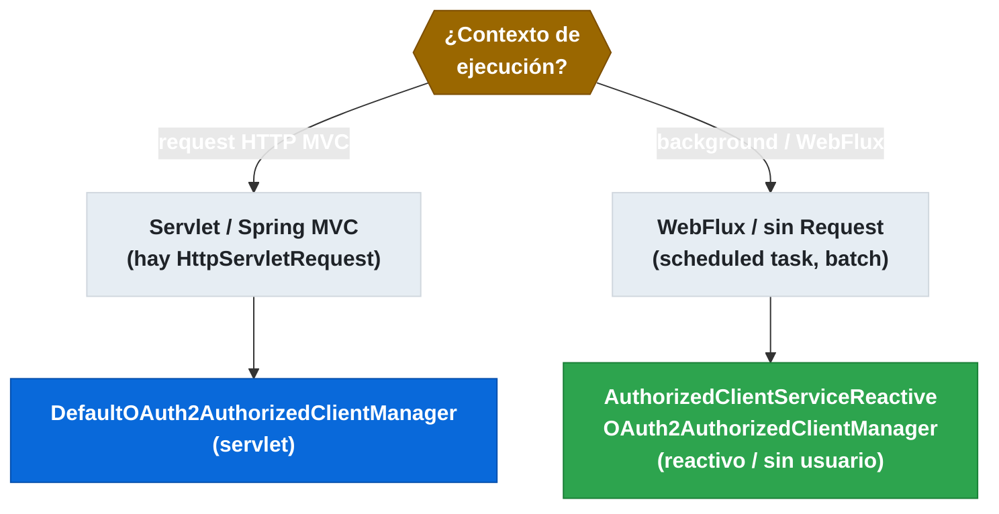

# 8.4 OAuth2 Client — Gestión de tokens de salida entre servicios

← [sc-security-resource-server.md](sc-security-resource-server.md) | [Índice](README.md) | [sc-security-jwt-claims.md](sc-security-jwt-claims.md) →

---

## Introducción

Cuando un microservicio necesita llamar a otro servicio protegido, debe obtener y gestionar su propio Access Token de salida. El rol OAuth2 Client cubre este escenario: el servicio se registra en el Authorization Server, obtiene tokens (normalmente con el flujo Client Credentials para comunicación service-to-service), los almacena en caché y los refresca automáticamente cuando expiran. Spring Boot auto-configura toda la infraestructura de gestión de tokens a partir de propiedades `spring.security.oauth2.client.*`.

> [PREREQUISITO] Tener claro el flujo Client Credentials de sc-security-oauth2-conceptos-flujos.md. Este fichero cubre el rol Client; para el rol Resource Server ver sc-security-resource-server.md.

## Dependencia y auto-configuración

El starter `spring-boot-starter-oauth2-client` trae `ClientRegistrationRepository`, `OAuth2AuthorizedClientRepository` y, con Spring Boot, la auto-configuración registra los beans necesarios cuando se detectan propiedades `spring.security.oauth2.client.*`. Para contextos reactivos (WebFlux, Gateway) se añade `spring-boot-starter-webflux`.

```xml
<!-- pom.xml -->
<dependency>
    <groupId>org.springframework.boot</groupId>
    <artifactId>spring-boot-starter-oauth2-client</artifactId>
</dependency>
```

## Configuración spring.security.oauth2.client.*

Las propiedades de registro definen cómo el servicio se identifica ante el Authorization Server. El bloque `registration` contiene las credenciales del cliente; el bloque `provider` contiene los endpoints del AS. Para proveedores estándar OIDC (Google, Okta, Spring AS), Spring Boot tiene valores predeterminados de los endpoints si se usa `issuer-uri` en el provider.

```yaml
spring:
  security:
    oauth2:
      client:
        registration:
          my-service:                         # ID lógico del cliente (se usa en código)
            provider: my-auth-server
            client-id: product-service
            client-secret: ${OAUTH2_CLIENT_SECRET}   # puede venir de Config Server {cipher}
            authorization-grant-type: client_credentials
            scope: inventory.read, inventory.write
            client-authentication-method: client_secret_basic
        provider:
          my-auth-server:
            issuer-uri: http://auth-server:9000
            # Spring Boot descubre token-uri, jwks-uri, etc. automáticamente
```

> [ADVERTENCIA] El `client-secret` en texto plano en `application.yml` es un riesgo. Usar variables de entorno (`${OAUTH2_CLIENT_SECRET}`) o cifrado con Spring Cloud Config (`{cipher}secret`). Nunca commitearlo en Git.

## ClientRegistration y ClientRegistrationRepository

`ClientRegistration` es la entidad que representa la configuración de un cliente OAuth2 registrado. `ClientRegistrationRepository` es el repositorio de todos los registros — Spring Boot lo auto-configura como `InMemoryClientRegistrationRepository` a partir de las properties. Se puede inyectar para inspeccionar registros programáticamente.

```java
package com.example.inventoryservice.config;

import org.springframework.security.oauth2.client.registration.ClientRegistration;
import org.springframework.security.oauth2.client.registration.ClientRegistrationRepository;
import org.springframework.web.bind.annotation.GetMapping;
import org.springframework.web.bind.annotation.RestController;

@RestController
public class DebugController {

    private final ClientRegistrationRepository clientRegistrationRepository;

    public DebugController(ClientRegistrationRepository repo) {
        this.clientRegistrationRepository = repo;
    }

    @GetMapping("/debug/oauth2-client")
    public String debugRegistration() {
        ClientRegistration reg = clientRegistrationRepository
            .findByRegistrationId("my-service");
        return "tokenUri=" + reg.getProviderDetails().getTokenUri()
             + ", scopes=" + reg.getScopes();
    }
}
```

## OAuth2AuthorizedClientManager (servlet)

`OAuth2AuthorizedClientManager` es el orquestador central: obtiene tokens (solicitando uno nuevo si no existe), los almacena en `OAuth2AuthorizedClientService` y los refresca automáticamente cuando expiran. `DefaultOAuth2AuthorizedClientManager` es la implementación para contextos servlet; requiere un `HttpServletRequest`/`Response` en el contexto, lo que lo hace adecuado para controllers pero no para procesos batch o scheduled tasks.

```mermaid
flowchart LR
    CALL["Servicio llama\na API protegida"]
    MGR["OAuth2AuthorizedClientManager\norquestador"]
    CACHE{{"¿Token en\ncaché?"}}
    EXP{{"¿Token\nexpirado?"}}
    AS[["Authorization Server\nPOST /oauth2/token"]]
    STORE[("OAuth2AuthorizedClientService\ncaché de tokens")]
    TOKEN["access_token\nlisto para usar"]

    CALL --> MGR --> CACHE
    CACHE -->|"sí"| EXP
    CACHE -->|"no"| AS
    EXP -->|"no"| TOKEN
    EXP -->|"sí"| AS
    AS -->|"nuevo token"| STORE --> TOKEN

    classDef root      fill:#1f2328,color:#fff,stroke:#444,font-weight:bold
    classDef primary   fill:#0969da,color:#fff,stroke:#0550ae
    classDef secondary fill:#2da44e,color:#fff,stroke:#1a7f37
    classDef danger    fill:#cf222e,color:#fff,stroke:#a40e26
    classDef neutral   fill:#e6edf3,color:#1f2328,stroke:#d0d7de
    classDef warning   fill:#9a6700,color:#fff,stroke:#7d4e00
    classDef storage   fill:#6e40c9,color:#fff,stroke:#5a32a3

    class CALL neutral
    class MGR root
    class CACHE,EXP warning
    class AS primary
    class STORE storage
    class TOKEN secondary
```


*El manager decide si reusar el token cacheado, refrescarlo o solicitar uno nuevo — el servicio llamante nunca gestiona esto directamente.*

```java
package com.example.inventoryservice.config;

import org.springframework.context.annotation.Bean;
import org.springframework.context.annotation.Configuration;
import org.springframework.security.oauth2.client.OAuth2AuthorizedClientManager;
import org.springframework.security.oauth2.client.OAuth2AuthorizedClientProviderBuilder;
import org.springframework.security.oauth2.client.registration.ClientRegistrationRepository;
import org.springframework.security.oauth2.client.web.DefaultOAuth2AuthorizedClientManager;
import org.springframework.security.oauth2.client.web.OAuth2AuthorizedClientRepository;

@Configuration
public class OAuth2ClientConfig {

    @Bean
    public OAuth2AuthorizedClientManager authorizedClientManager(
            ClientRegistrationRepository clientRegistrationRepository,
            OAuth2AuthorizedClientRepository authorizedClientRepository) {

        DefaultOAuth2AuthorizedClientManager manager =
            new DefaultOAuth2AuthorizedClientManager(
                clientRegistrationRepository, authorizedClientRepository);

        // Soporta: client_credentials, authorization_code, refresh_token
        manager.setAuthorizedClientProvider(
            OAuth2AuthorizedClientProviderBuilder.builder()
                .clientCredentials()
                .refreshToken()
                .build());

        return manager;
    }
}
```

## ReactiveOAuth2AuthorizedClientManager para WebFlux y batch

Para aplicaciones reactivas (WebFlux) o procesos que no tienen un `HttpServletRequest` (scheduled tasks, batch jobs), se usa `AuthorizedClientServiceReactiveOAuth2AuthorizedClientManager`. Este manager funciona sin usuario autenticado en el contexto reactivo, lo que lo hace ideal para flujos Client Credentials puros donde el servicio actúa en nombre propio.

```java
package com.example.inventoryservice.config;

import org.springframework.context.annotation.Bean;
import org.springframework.context.annotation.Configuration;
import org.springframework.security.oauth2.client.AuthorizedClientServiceReactiveOAuth2AuthorizedClientManager;
import org.springframework.security.oauth2.client.InMemoryReactiveOAuth2AuthorizedClientService;
import org.springframework.security.oauth2.client.ReactiveOAuth2AuthorizedClientManager;
import org.springframework.security.oauth2.client.ReactiveOAuth2AuthorizedClientProviderBuilder;
import org.springframework.security.oauth2.client.registration.ReactiveClientRegistrationRepository;

@Configuration
public class ReactiveOAuth2Config {

    @Bean
    public ReactiveOAuth2AuthorizedClientManager reactiveAuthorizedClientManager(
            ReactiveClientRegistrationRepository clientRegistrationRepository) {

        InMemoryReactiveOAuth2AuthorizedClientService service =
            new InMemoryReactiveOAuth2AuthorizedClientService(clientRegistrationRepository);

        AuthorizedClientServiceReactiveOAuth2AuthorizedClientManager manager =
            new AuthorizedClientServiceReactiveOAuth2AuthorizedClientManager(
                clientRegistrationRepository, service);

        manager.setAuthorizedClientProvider(
            ReactiveOAuth2AuthorizedClientProviderBuilder.builder()
                .clientCredentials()
                .refreshToken()
                .build());

        return manager;
    }
}
```


*Elección del manager según contexto: servlet usa Default; reactivo y batch usan el manager de servicio reactivo.*

> [EXAMEN] `DefaultOAuth2AuthorizedClientManager` requiere `HttpServletRequest` — solo sirve en contexto de request HTTP servlet. `AuthorizedClientServiceReactiveOAuth2AuthorizedClientManager` es para contextos reactivos o sin usuario; es el correcto para scheduled tasks y batch jobs con Client Credentials.

## @RegisteredOAuth2AuthorizedClient en controllers

La anotación `@RegisteredOAuth2AuthorizedClient` inyecta directamente un `OAuth2AuthorizedClient` en un método de controller o en un parámetro de servicio cuando hay un usuario autenticado. Es conveniente para el flujo Authorization Code donde el cliente tiene un token asociado al usuario actual.

```java
package com.example.inventoryservice.controller;

import org.springframework.security.oauth2.client.OAuth2AuthorizedClient;
import org.springframework.security.oauth2.client.annotation.RegisteredOAuth2AuthorizedClient;
import org.springframework.web.bind.annotation.GetMapping;
import org.springframework.web.bind.annotation.RestController;
import org.springframework.web.reactive.function.client.WebClient;

@RestController
public class InventoryController {

    private final WebClient.Builder webClientBuilder;

    public InventoryController(WebClient.Builder webClientBuilder) {
        this.webClientBuilder = webClientBuilder;
    }

    @GetMapping("/inventory/delegated")
    public String getInventoryWithUserToken(
            @RegisteredOAuth2AuthorizedClient("my-service")
            OAuth2AuthorizedClient authorizedClient) {

        String token = authorizedClient.getAccessToken().getTokenValue();
        return webClientBuilder.build()
            .get()
            .uri("http://inventory-service/items")
            .headers(h -> h.setBearerAuth(token))
            .retrieve()
            .bodyToMono(String.class)
            .block();
    }
}
```

## Token refresh automático

El refresh de tokens es transparente cuando se configura `refreshToken()` en el provider builder. El `OAuth2AuthorizedClientManager` detecta que el `AccessToken` ha expirado antes de usarlo (compara `expiresAt` con el instante actual) y solicita automáticamente un nuevo token usando el `refresh_token`. Para Client Credentials no hay refresh_token — el manager simplemente solicita uno nuevo.

## Tabla de propiedades del OAuth2 Client

Las propiedades de `registration` y `provider` configuran cada cliente registrado.

| Propiedad | Tipo | Default | Descripción |
|-----------|------|---------|-------------|
| `registration.<id>.client-id` | String | — | ID del cliente en el AS |
| `registration.<id>.client-secret` | String | — | Secret del cliente |
| `registration.<id>.authorization-grant-type` | String | — | `client_credentials`, `authorization_code`, `refresh_token` |
| `registration.<id>.scope` | String | — | Scopes solicitados (separados por coma) |
| `registration.<id>.client-authentication-method` | String | `client_secret_basic` | Método de autenticación en el AS |
| `provider.<id>.issuer-uri` | URI | — | URI del AS para autodiscovery OIDC |
| `provider.<id>.token-uri` | URI | — | Endpoint de tokens (si no se usa `issuer-uri`) |

## Buenas y malas prácticas

Hacer:
- Usar `AuthorizedClientServiceReactiveOAuth2AuthorizedClientManager` para contextos reactivos y scheduled tasks con Client Credentials.
- Almacenar `client-secret` en variables de entorno o cifrado con `{cipher}` de Config Server.
- Configurar `refreshToken()` en el provider builder para renovación automática.
- Usar un ID lógico (`registrationId`) descriptivo para poder cambiar el proveedor sin cambiar código.

Evitar:
- Usar `DefaultOAuth2AuthorizedClientManager` en scheduled tasks o batch jobs (requiere HttpServletRequest; fallará con `NullPointerException`).
- Hardcodear `client-secret` en `application.yml` en el repositorio git.
- Crear manualmente el `HttpClient` para obtener tokens — `OAuth2AuthorizedClientManager` lo gestiona con caché y refresh.

## Verificación y práctica

```bash
# Verificar que la auto-configuración detecta las propiedades
curl http://localhost:8080/actuator/beans | jq '.beans | keys | map(select(startswith("oauth2")))'

# Obtener token manualmente para comparar con el que gestiona Spring
curl -X POST http://localhost:9000/oauth2/token \
  -d "grant_type=client_credentials&scope=inventory.read" \
  -u "product-service:secret"
```

**Preguntas estilo examen VMware Spring Professional:**

1. ¿Cuál es la diferencia entre `DefaultOAuth2AuthorizedClientManager` y `AuthorizedClientServiceReactiveOAuth2AuthorizedClientManager`? ¿En qué escenario se usa cada uno?

2. Un scheduled task que llama a otro microservicio falla con error al obtener el token OAuth2 usando `DefaultOAuth2AuthorizedClientManager`. ¿Cuál es la causa y qué manager debe usarse en su lugar?

3. ¿Cómo gestiona Spring Boot el refresh automático de Access Tokens expirados cuando se usa `OAuth2AuthorizedClientManager` con `refreshToken()` configurado?

---

← [sc-security-resource-server.md](sc-security-resource-server.md) | [Índice](README.md) | [sc-security-jwt-claims.md](sc-security-jwt-claims.md) →
