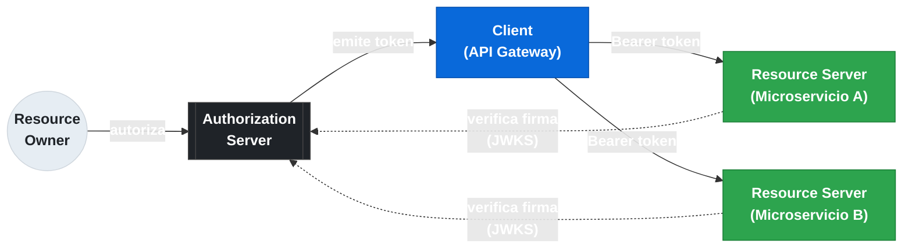
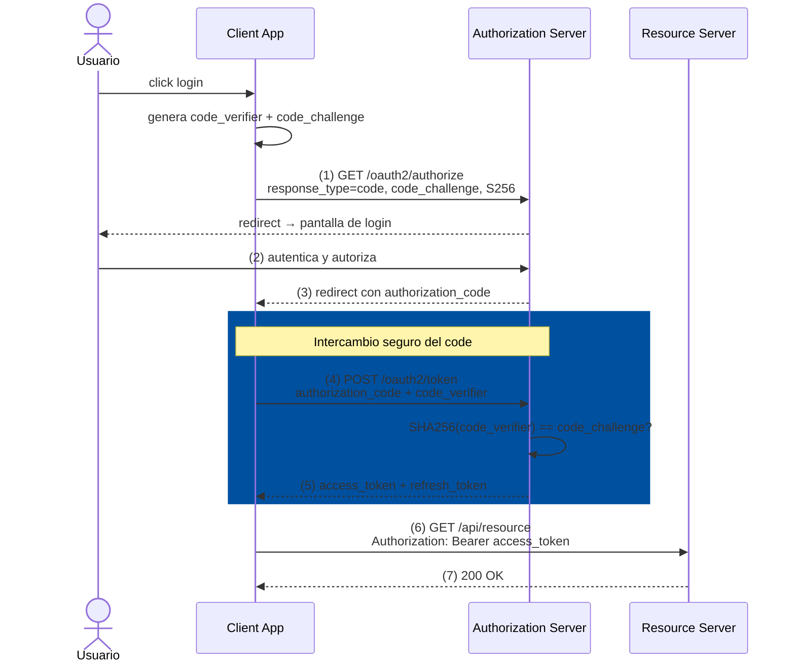
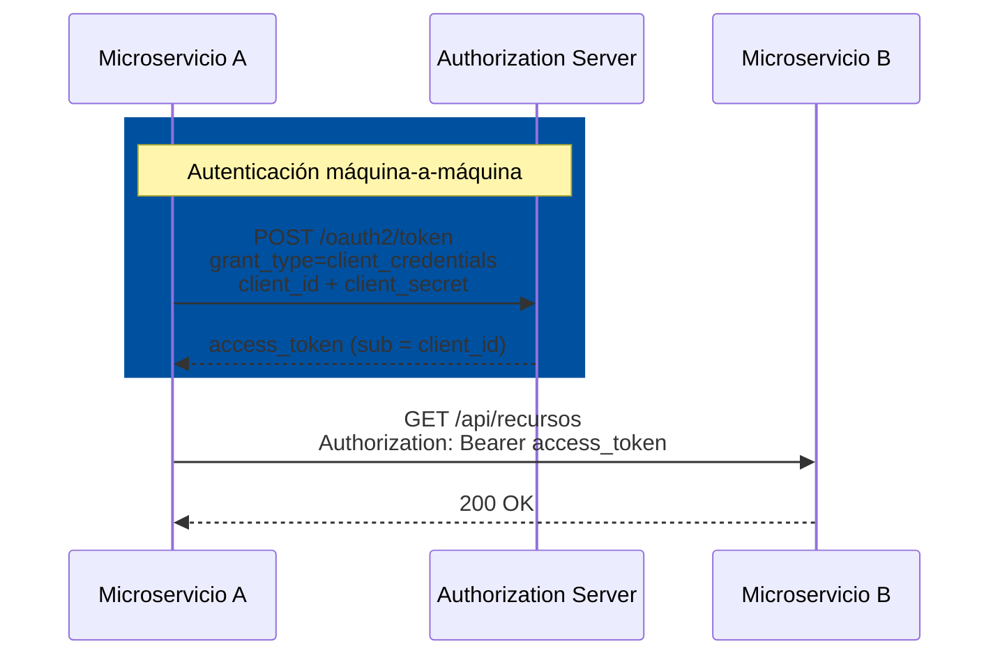

# 8.1 OAuth2 en microservicios — Roles y flujos de autorización

← [7.9 Spring Cloud Bus — Testing y Troubleshooting](sc-bus-testing.md) | [Índice](README.md) | [8.2 Spring Authorization Server — Configuración y registro de clientes](sc-security-authorization-server.md) →

---

## Introducción

OAuth2 (RFC 6749) es el estándar de delegación de autorización que resuelve un problema concreto en arquitecturas de microservicios: cómo permitir que un servicio actúe en nombre de un usuario (o de sí mismo) sin que ese usuario comparta sus credenciales con el servicio. En un monolito, la sesión HTTP con usuario/contraseña es suficiente; en un sistema con decenas de microservicios independientes, se necesita un mecanismo de tokens portadores verificables sin estado. OAuth2 define los roles (quién emite, quién valida, quién solicita tokens) y los flujos (secuencias de pasos para obtenerlos) que hacen posible la seguridad distribuida.

> [PREREQUISITO] Se asume conocimiento básico de HTTP y Spring Security (SecurityFilterChain, HttpSecurity). Este nodo cubre OAuth2 como protocolo; los nodos siguientes (8.2–8.4) cubren la implementación Spring.

## Roles del ecosistema OAuth2

Los cuatro roles definidos en RFC 6749 mapean directamente a los componentes de una arquitectura de microservicios. Comprender qué hace cada rol es el primer paso antes de elegir qué dependencia Spring Boot configurar.

| Rol OAuth2 | Responsabilidad | Equivalente Spring |
|---|---|---|
| **Authorization Server (AS)** | Autentica al usuario/cliente y emite tokens de acceso, ID tokens y refresh tokens | Spring Authorization Server (`spring-boot-starter-oauth2-authorization-server`) o IdP externo (Keycloak, Auth0, Okta) |
| **Resource Server (RS)** | Protege los recursos de la API; valida el token de acceso en cada petición | `spring-boot-starter-oauth2-resource-server` |
| **Client** | Aplicación que solicita acceso a recursos en nombre del usuario; obtiene y gestiona tokens | `spring-boot-starter-oauth2-client` |
| **Resource Owner** | El usuario final (o el sistema en Client Credentials) que autoriza el acceso | El usuario humano o el servicio llamante |

En una arquitectura de microservicios típica, el **API Gateway** actúa como Client (obtiene el token, lo relee, lo propaga), y cada microservicio backend actúa como Resource Server (valida el token). El Authorization Server es un componente separado, dedicado.


*Relación entre los cuatro roles OAuth2 en una arquitectura de microservicios: el AS emite tokens; el Client los obtiene y propaga; los Resource Servers los validan vía JWKS.*

> [CONCEPTO] Un mismo servicio puede ser a la vez Resource Server (valida tokens entrantes) y Client (obtiene tokens para llamar a otros servicios). Esto es habitual en un Gateway que también protege sus propios endpoints.

## Flujo Authorization Code + PKCE

El flujo Authorization Code con PKCE (Proof Key for Code Exchange, RFC 7636) es el flujo recomendado para cualquier aplicación que tenga un usuario final interactivo: aplicaciones web, SPAs y aplicaciones móviles. El diagrama siguiente muestra la secuencia completa.



**Pasos clave:**
1. El Client genera un `code_verifier` aleatorio y calcula `code_challenge = BASE64URL(SHA256(code_verifier))`.
2. El Client redirige al usuario al AS con `response_type=code`, `code_challenge` y `code_challenge_method=S256`.
3. Tras la autenticación, el AS devuelve un `authorization_code` de vida corta (segundos/minutos).
4. El Client intercambia el `authorization_code` + el `code_verifier` original por tokens.
5. El AS verifica que `SHA256(code_verifier) == code_challenge` almacenado; esto previene el robo del `authorization_code` en tránsito.

> [EXAMEN] PKCE es obligatorio para aplicaciones públicas (SPAs, apps móviles) porque no pueden guardar un `client_secret` de forma segura. Spring Authorization Server exige PKCE por defecto para clientes con `clientAuthenticationMethod = NONE`.

## Flujo Client Credentials

El flujo Client Credentials (RFC 6749 §4.4) es el flujo para comunicación **service-to-service** sin usuario final interactivo. El cliente se autentica directamente con el Authorization Server usando su `client_id` y `client_secret` y obtiene un token de acceso que representa al servicio, no a un usuario.



**Características clave:**
- No hay redirección ni usuario final: la autenticación es máquina-a-máquina.
- El `sub` claim del token es el `client_id` del servicio, no un usuario.
- Los scopes en el token representan permisos del servicio, no delegaciones de usuario.
- Spring Boot autoconfigura `ClientCredentialsOAuth2AuthorizedClientProvider` cuando se detecta `grant-type: client_credentials`.

> [EXAMEN] Client Credentials es el flujo correcto para comunicación interna entre microservicios (servicio A llama a servicio B). Authorization Code + PKCE es el flujo correcto cuando hay un usuario final.

## Flujo Refresh Token

El Refresh Token (RFC 6749 §6) no es un flujo independiente: es una extensión del Authorization Code que permite obtener un nuevo access_token sin que el usuario tenga que autenticarse de nuevo. Es esencial porque los access tokens son de vida corta (típicamente 5-60 minutos) por razones de seguridad.

```mermaid
sequenceDiagram
    participant C as Client
    participant AS as Authorization Server

    Note over C: access_token expirado
    C->>AS: POST /oauth2/token<br/>grant_type=refresh_token<br/>refresh_token=&lt;token&gt;
    AS-->>C: nuevo access_token<br/>(+ nuevo refresh_token si reuseRefreshTokens=false)
    Note over C: usa el nuevo access_token
```

**Reglas importantes:**
- El Refresh Token tiene vida larga (horas, días) y debe almacenarse de forma segura (en servidor, nunca en localStorage).
- Spring Security gestiona el refresh automáticamente en `OAuth2AuthorizedClientManager`: si el access token ha expirado, usa el refresh token transparentemente.
- Client Credentials **no usa** refresh tokens: simplemente solicita un nuevo token cuando expira.
- Spring Authorization Server puede rotar el refresh token en cada uso (`reuseRefreshTokens=false`).

## Cuándo usar cada flujo

La elección del flujo correcto es una pregunta de examen frecuente. La regla general es: si hay un usuario interactivo, Authorization Code + PKCE; si es comunicación entre servicios, Client Credentials.

```mermaid
quadrantChart
    title Elección de flujo OAuth2
    x-axis "Sin usuario interactivo" --> "Con usuario interactivo"
    y-axis "App privada (puede guardar secret)" --> "App pública (no guarda secret)"
    quadrant-1 Authorization Code + PKCE
    quadrant-2 Authorization Code + PKCE obligatorio
    quadrant-3 Client Credentials
    quadrant-4 Authorization Code (confidential client)
    SPA React: [0.85, 0.85]
    App móvil: [0.75, 0.9]
    App web con login: [0.8, 0.3]
    Microservicio a Microservicio: [0.1, 0.2]
    Job batch: [0.05, 0.15]
    Token Relay Gateway: [0.65, 0.4]
```
*Posición de cada escenario según si hay usuario interactivo y si la app puede almacenar un client_secret de forma segura.*

| Escenario | Flujo correcto | Motivo |
|---|---|---|
| App web con login de usuario | Authorization Code + PKCE | Hay usuario final; PKCE protege el code en tránsito |
| SPA React que llama a una API | Authorization Code + PKCE | App pública, no puede guardar client_secret |
| App móvil nativa | Authorization Code + PKCE | App pública, PKCE obligatorio |
| Microservicio A llama a Microservicio B | Client Credentials | Sin usuario; autenticación máquina-a-máquina |
| Job batch nocturno | Client Credentials | Sin usuario interactivo |
| API Gateway propaga token de usuario | Token Relay (basado en Authorization Code) | El Gateway reusa el token del usuario, no obtiene uno nuevo |
| Acceso offline a recursos del usuario | Authorization Code + Refresh Token | El usuario autoriza acceso prolongado |

> [ADVERTENCIA] El Implicit Flow (RFC 6749 §4.2) está **obsoleto** (deprecated en OAuth 2.0 Security Best Current Practice). Spring Authorization Server no lo implementa. Nunca usar para nuevos desarrollos; usar Authorization Code + PKCE en su lugar.

## Tokens: Access Token, ID Token y Refresh Token

OAuth2 define tipos de tokens con propósitos distintos que el candidato debe distinguir con precisión.

El **Access Token** es el token que presentan los clientes a los Resource Servers para acceder a recursos protegidos. En Spring Security, el Resource Server valida el access token (JWT o mediante introspección). Su vida es corta intencionalmente: un token comprometido tiene impacto limitado en el tiempo.

El **ID Token** es específico de OpenID Connect (OIDC, construido sobre OAuth2). Contiene información de identidad del usuario (`sub`, `name`, `email`). No es un access token y **no debe** presentarse a un Resource Server como credencial de acceso; su propósito es la autenticación del usuario en el Client.

El **Refresh Token** permite al Client obtener nuevos access tokens sin interacción del usuario. Solo existe en flujos que involucran a un usuario final (Authorization Code); en Client Credentials no hay refresh tokens porque el servicio puede solicitar un nuevo token directamente.

> [CONCEPTO] OAuth2 resuelve **autorización** (¿puede este cliente acceder a este recurso?). OpenID Connect (OIDC) añade **autenticación** (¿quién es el usuario?). Spring Security soporta ambos: `spring-boot-starter-oauth2-client` maneja tanto OAuth2 puro como OIDC cuando el AS soporta el endpoint `/.well-known/openid-configuration`.

## Verificación y práctica

> [EXAMEN] **Pregunta 1**: Un microservicio de procesamiento de facturas necesita llamar a otro microservicio de clientes para obtener datos. No hay usuario interactivo. ¿Qué flujo OAuth2 debe usar y por qué?

**Respuesta**: Client Credentials. No hay usuario final; la autenticación es servicio-a-servicio con `client_id` y `client_secret`. El access token resultante tendrá como `sub` el `client_id` del servicio llamante.

> [EXAMEN] **Pregunta 2**: ¿Cuál es la diferencia entre el rol Client y el rol Resource Server en OAuth2? ¿Puede un mismo servicio ser ambos?

**Respuesta**: El Client obtiene tokens y los usa para llamar a APIs protegidas. El Resource Server valida tokens entrantes y protege sus endpoints. Sí, un mismo servicio puede ser ambos: por ejemplo, un servicio de pedidos que recibe tokens de usuarios (Resource Server) y a la vez llama a un servicio de inventario con su propio token (Client).

> [EXAMEN] **Pregunta 3**: ¿Por qué PKCE es obligatorio para aplicaciones SPA y móviles? ¿Qué problema previene?

**Respuesta**: Las aplicaciones públicas no pueden almacenar un `client_secret` de forma segura. PKCE previene el ataque de interceptación del `authorization_code`: aunque un atacante intercepte el code en el redirect, no puede intercambiarlo por un token sin el `code_verifier` original que solo conoce el cliente legítimo.

> [EXAMEN] **Pregunta 4**: ¿Cuál es el propósito del Refresh Token y por qué los access tokens tienen vida corta?

**Respuesta**: El Refresh Token permite obtener nuevos access tokens sin re-autenticación del usuario. Los access tokens tienen vida corta (minutos) para limitar el daño si son comprometidos: un token robado solo es válido durante un tiempo limitado.

> [EXAMEN] **Pregunta 5**: ¿Qué flujo OAuth2 usa el Token Relay de Spring Cloud Gateway? ¿El Gateway obtiene un nuevo token o propaga el existente?

**Respuesta**: El Token Relay propaga el access token existente del usuario autenticado (obtenido mediante Authorization Code + PKCE) a los microservicios downstream. El Gateway **no** obtiene un nuevo token; extrae el token del `ServerOAuth2AuthorizedClientRepository` y lo añade como cabecera `Authorization: Bearer` en las peticiones enrutadas.

---

← [7.9 Spring Cloud Bus — Testing y Troubleshooting](sc-bus-testing.md) | [Índice](README.md) | [8.2 Spring Authorization Server — Configuración y registro de clientes](sc-security-authorization-server.md) →
