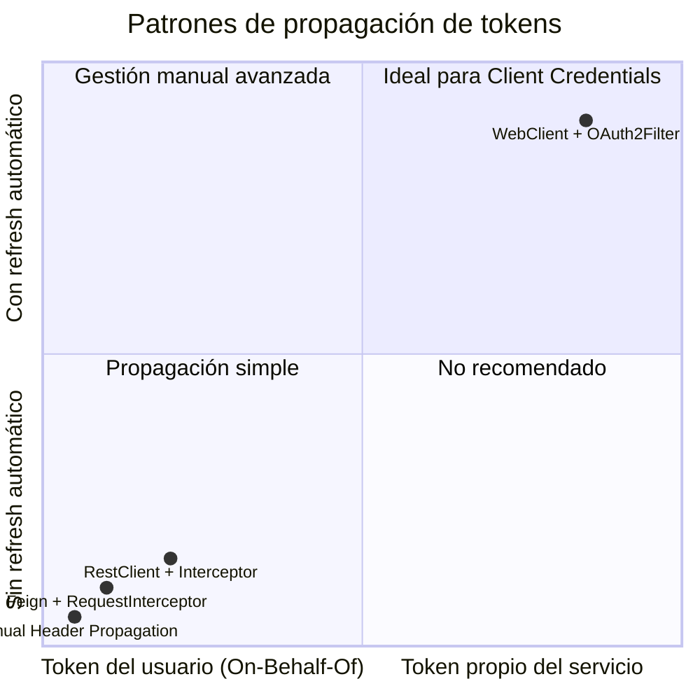

# 8.7 Propagación de tokens entre microservicios — Feign, WebClient y RestTemplate

← [sc-security-token-relay-gateway.md](sc-security-token-relay-gateway.md) | [Índice](README.md) | [sc-security-mtls.md](sc-security-mtls.md) →

---

## Introducción

Cuando un microservicio necesita llamar a otro microservicio protegido, debe incluir un Access Token en la cabecera `Authorization`. Hay dos escenarios principales: (1) propagar el token del usuario que llegó al servicio actual (On-Behalf-Of), o (2) usar el token propio del servicio (Client Credentials). Spring ofrece varios mecanismos según el stack tecnológico: Feign con `RequestInterceptor`, WebClient con `ServerOAuth2AuthorizedClientExchangeFilterFunction`, y `RestClient` como alternativa moderna síncrona para Boot 3.x.

> [PREREQUISITO] Entender el flujo Client Credentials (sc-security-oauth2-conceptos-flujos.md) y la configuración del OAuth2 Client (sc-security-oauth2-client.md).

## OAuth2RestTemplate — eliminado en Spring Security 6

`OAuth2RestTemplate` era la clase de Spring Security OAuth2 legacy para realizar peticiones HTTP con tokens OAuth2. Esta clase fue **eliminada** (removed, no deprecated) en Spring Security 6 / Spring Boot 3.x. Si se migra un proyecto Boot 2.x a Boot 3.x y el código usa `OAuth2RestTemplate`, no compilará — no existe en el classpath.

[LEGACY] `OAuth2RestTemplate` era parte de `spring-security-oauth2` (proyecto legacy). En Spring Security 6 / Boot 3.x se reemplaza por `WebClient` con `ServerOAuth2AuthorizedClientExchangeFilterFunction` (reactivo) o `RestClient` con filtro personalizado (síncrono). No hay equivalente directo: la migración requiere refactorizar hacia los patrones modernos descritos en este fichero.

## Patrón 1: Feign con RequestInterceptor

Feign es el cliente HTTP declarativo de Spring Cloud. Para propagar el token Bearer de la petición entrante a las peticiones salientes, se implementa un `RequestInterceptor` que lee el token del `SecurityContextHolder` y lo añade a cada request Feign. Este patrón sirve para el escenario On-Behalf-Of: propagar el token del usuario actual.

Para más detalles sobre `RequestInterceptor` en Feign, ver sc-feign-interceptores.md.

```java
package com.example.orderservice.feign;

import feign.RequestInterceptor;
import feign.RequestTemplate;
import org.springframework.security.core.Authentication;
import org.springframework.security.core.context.SecurityContextHolder;
import org.springframework.security.oauth2.jwt.Jwt;
import org.springframework.stereotype.Component;

@Component
public class BearerTokenRequestInterceptor implements RequestInterceptor {

    @Override
    public void apply(RequestTemplate template) {
        Authentication authentication = SecurityContextHolder
            .getContext().getAuthentication();

        if (authentication != null
                && authentication.getPrincipal() instanceof Jwt jwt) {
            template.header("Authorization", "Bearer " + jwt.getTokenValue());
        }
    }
}
```

```yaml
# application.yml — registrar el interceptor para todos los clientes Feign
spring:
  cloud:
    openfeign:
      client:
        config:
          default:
            request-interceptors:
              - com.example.orderservice.feign.BearerTokenRequestInterceptor
```

> [ADVERTENCIA] En contextos reactivos (WebFlux), `SecurityContextHolder` no funciona: usa `ReactiveSecurityContextHolder`. El patrón Feign con `SecurityContextHolder` es solo para stacks servlet (Spring MVC).

## Patrón 2: WebClient con ServerOAuth2AuthorizedClientExchangeFilterFunction

`ServerOAuth2AuthorizedClientExchangeFilterFunction` es el filtro reactivo que integra `OAuth2AuthorizedClientManager` con `WebClient`. Obtiene/refresca automáticamente el token OAuth2 (Client Credentials o Authorization Code) y lo añade como cabecera `Authorization`. Es el patrón recomendado para stacks reactivos y para Client Credentials.

```java
package com.example.orderservice.config;

import org.springframework.context.annotation.Bean;
import org.springframework.context.annotation.Configuration;
import org.springframework.security.oauth2.client.ReactiveOAuth2AuthorizedClientManager;
import org.springframework.security.oauth2.client.web.reactive.function.client.ServerOAuth2AuthorizedClientExchangeFilterFunction;
import org.springframework.web.reactive.function.client.WebClient;

@Configuration
public class WebClientConfig {

    @Bean
    public WebClient inventoryWebClient(
            ReactiveOAuth2AuthorizedClientManager authorizedClientManager) {

        ServerOAuth2AuthorizedClientExchangeFilterFunction oauth2Filter =
            new ServerOAuth2AuthorizedClientExchangeFilterFunction(authorizedClientManager);

        // Especificar qué registration usar para las llamadas de este WebClient
        oauth2Filter.setDefaultClientRegistrationId("inventory-client");

        return WebClient.builder()
            .baseUrl("http://inventory-service")
            .filter(oauth2Filter)
            .build();
    }
}
```

El servicio que usa este `WebClient` no necesita gestionar tokens manualmente — el filtro lo hace automáticamente:

```java
package com.example.orderservice.service;

import org.springframework.stereotype.Service;
import org.springframework.web.reactive.function.client.WebClient;
import reactor.core.publisher.Flux;

@Service
public class OrderService {

    private final WebClient inventoryWebClient;

    public OrderService(WebClient inventoryWebClient) {
        this.inventoryWebClient = inventoryWebClient;
    }

    public Flux<InventoryItem> getAvailableItems() {
        return inventoryWebClient.get()
            .uri("/items/available")
            .retrieve()
            .bodyToFlux(InventoryItem.class);
        // El filtro OAuth2 añade automáticamente: Authorization: Bearer <token>
    }
}
```

## Patrón 3: RestClient para stacks síncronos en Boot 3.x

`RestClient` es el reemplazo moderno de `RestTemplate` en Spring Boot 3.x (introducido en Spring Framework 6.1). Para añadir tokens OAuth2, se usa un `ExchangeFilterFunction` personalizado que lee el token del `SecurityContextHolder`. Es la alternativa síncrona a `WebClient` para aplicaciones que no usan WebFlux.

```java
package com.example.orderservice.config;

import org.springframework.context.annotation.Bean;
import org.springframework.context.annotation.Configuration;
import org.springframework.http.HttpHeaders;
import org.springframework.security.core.Authentication;
import org.springframework.security.core.context.SecurityContextHolder;
import org.springframework.security.oauth2.jwt.Jwt;
import org.springframework.web.client.RestClient;

@Configuration
public class RestClientConfig {

    @Bean
    public RestClient inventoryRestClient() {
        return RestClient.builder()
            .baseUrl("http://inventory-service")
            .requestInterceptor((request, body, execution) -> {
                Authentication auth = SecurityContextHolder
                    .getContext().getAuthentication();
                if (auth != null && auth.getPrincipal() instanceof Jwt jwt) {
                    request.getHeaders()
                        .set(HttpHeaders.AUTHORIZATION, "Bearer " + jwt.getTokenValue());
                }
                return execution.execute(request, body);
            })
            .build();
    }
}
```

## Patrón 4: propagación manual del Bearer token

En casos especiales donde no se puede usar los patrones anteriores (por ejemplo, al llamar desde un componente que no tiene acceso al contexto de Spring), se puede propagar el token manualmente extrayéndolo del header `Authorization` de la request entrante y añadiéndolo a la saliente. Este patrón es el menos recomendado por su fragilidad.

```java
package com.example.orderservice.service;

import jakarta.servlet.http.HttpServletRequest;
import org.springframework.http.HttpEntity;
import org.springframework.http.HttpHeaders;
import org.springframework.stereotype.Service;
import org.springframework.web.client.RestTemplate;

@Service
public class ManualTokenPropagationService {

    private final RestTemplate restTemplate = new RestTemplate();

    public String callDownstreamService(HttpServletRequest incomingRequest) {
        // Extraer el token de la request entrante
        String authHeader = incomingRequest.getHeader(HttpHeaders.AUTHORIZATION);

        if (authHeader != null && authHeader.startsWith("Bearer ")) {
            HttpHeaders headers = new HttpHeaders();
            headers.set(HttpHeaders.AUTHORIZATION, authHeader);
            HttpEntity<Void> entity = new HttpEntity<>(headers);
            return restTemplate.exchange(
                "http://inventory-service/items",
                org.springframework.http.HttpMethod.GET,
                entity,
                String.class).getBody();
        }
        throw new IllegalStateException("No Bearer token found in incoming request");
    }
}
```

> [ADVERTENCIA] El Patrón 4 (manual) tiene riesgos: si el token expira entre la recepción y el reenvío, la llamada falla sin opción de refresh. Preferir siempre los Patrones 1, 2 o 3.

## Comparativa de patrones

La elección del patrón depende del stack tecnológico y del escenario de autenticación.


*Posición de cada patrón: WebClient con OAuth2Filter es el único que gestiona refresh automático y se usa con tokens propios del servicio (Client Credentials).*

| Patrón | Stack | Escenario | Token usado | Refresh automático |
|--------|-------|-----------|-------------|-------------------|
| Feign + RequestInterceptor | Servlet (MVC) | On-Behalf-Of usuario | Token del usuario | No |
| WebClient + OAuth2Filter | Reactivo (WebFlux) | Client Credentials | Token propio | Sí |
| RestClient + Interceptor | Servlet (MVC, Boot 3.x) | On-Behalf-Of usuario | Token del usuario | No |
| Manual (Header propagation) | Cualquiera | Emergencia / legacy | Token del usuario | No |

> [EXAMEN] Para comunicación service-to-service con token propio (Client Credentials), usar WebClient con `ServerOAuth2AuthorizedClientExchangeFilterFunction`. Para propagar el token del usuario en MVC, usar Feign con `RequestInterceptor`. `OAuth2RestTemplate` fue eliminado en Spring Security 6 — no existe en Boot 3.x.

## Buenas y malas prácticas

Hacer:
- Usar `WebClient` con `ServerOAuth2AuthorizedClientExchangeFilterFunction` para Client Credentials reactivos: gestiona caché y refresh automáticamente.
- Usar Feign con `RequestInterceptor` para propagar el token del usuario en stacks MVC.
- Configurar `RestClient` con interceptor para stacks síncronos Boot 3.x en lugar de `RestTemplate`.

Evitar:
- Usar `OAuth2RestTemplate` — fue eliminado en Spring Security 6 / Boot 3.x; el código no compilará.
- Leer el token del `SecurityContextHolder` en stacks reactivos — usar `ReactiveSecurityContextHolder` en su lugar.
- Propagar tokens expirados manualmente sin comprobación previa.

## Verificación y práctica

```bash
# Verificar que el token se propaga correctamente entre servicios
# Activar logging de HTTP en el microservicio receptor
logging:
  level:
    org.springframework.security: DEBUG
    org.springframework.web.client: DEBUG

# En los logs del microservicio receptor buscar:
# "Authorization" header en la request entrante
```

**Preguntas estilo examen VMware Spring Professional:**

1. `OAuth2RestTemplate` se usa en un proyecto Boot 2.x que se está migrando a Boot 3.x. ¿Qué error ocurre y con qué alternativa debe reemplazarse?

2. ¿Cuál es la diferencia entre el Patrón 1 (Feign con RequestInterceptor) y el Patrón 2 (WebClient con OAuth2Filter) en cuanto al origen del token que se propaga?

3. ¿Por qué el patrón Feign con `SecurityContextHolder` no funciona en un microservicio basado en WebFlux?

---

← [sc-security-token-relay-gateway.md](sc-security-token-relay-gateway.md) | [Índice](README.md) | [sc-security-mtls.md](sc-security-mtls.md) →
```
