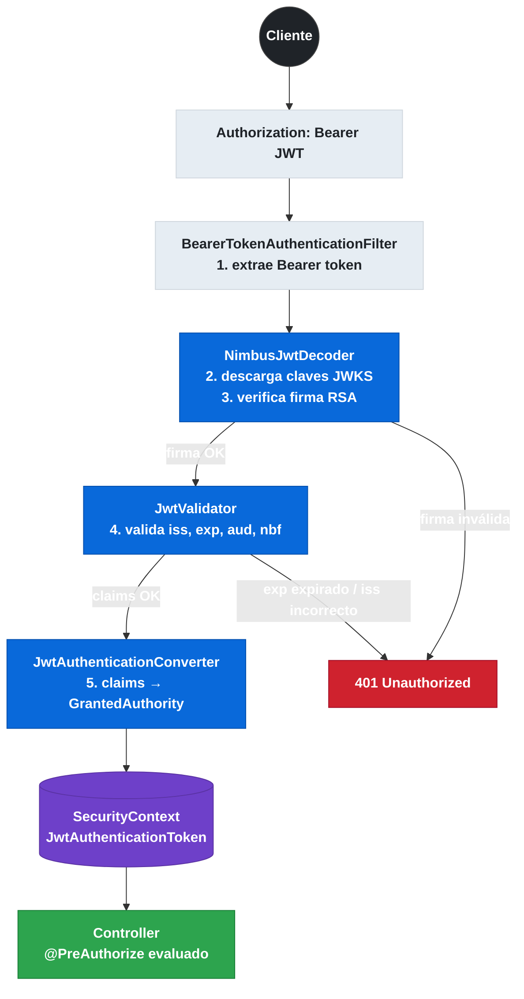
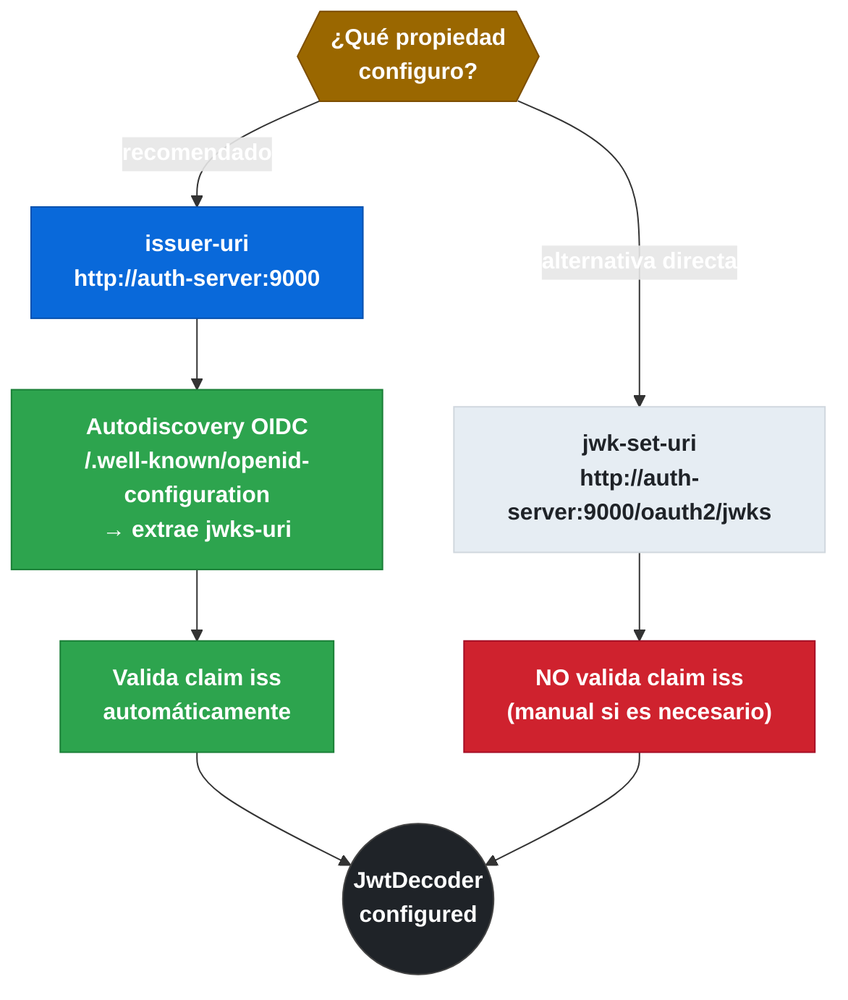
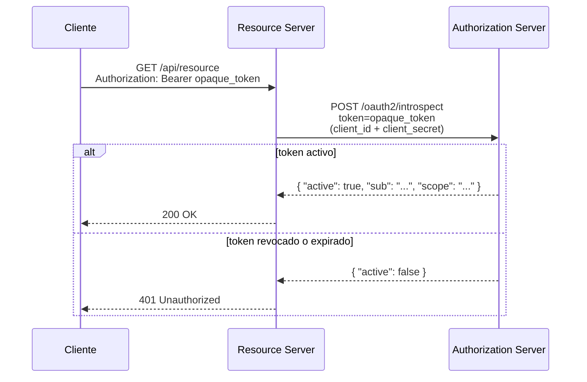

# 8.3 Resource Server — Validación de JWT en microservicios

← [sc-security-authorization-server.md](sc-security-authorization-server.md) | [Índice](README.md) | [sc-security-oauth2-client.md](sc-security-oauth2-client.md) →

---

## Introducción

Un Resource Server es cualquier microservicio que expone recursos protegidos y necesita verificar que el cliente que hace la petición posee un Access Token válido. En lugar de gestionar sesiones, el Resource Server valida el JWT en cada request de forma stateless: verifica la firma criptográfica, comprueba que el emisor (`iss`) sea el esperado y que el token no haya expirado (`exp`). Spring Boot auto-configura todo el pipeline de validación con una sola dependencia y dos líneas de properties.

> [PREREQUISITO] Conocimiento de JWTs (estructura, claims) del fichero sc-security-jwt-claims.md y tener un Authorization Server emitiendo tokens (sc-security-authorization-server.md).

## Dependencia y arquitectura de validación

El starter `spring-boot-starter-oauth2-resource-server` trae Spring Security con soporte JWT y la librería Nimbus JOSE+JWT para la verificación criptográfica. Con `issuer-uri`, Spring Boot descarga automáticamente en el arranque los metadatos OIDC (`.well-known/openid-configuration`) y desde allí obtiene la URL del JWKS endpoint para recuperar las claves públicas de verificación. No requiere acceso al Authorization Server en cada request.


*Pipeline de validación stateless de un JWT en el Resource Server: desde la extracción del Bearer token hasta la población del SecurityContext.*

## Configuración properties: issuer-uri vs jwk-set-uri

Existen dos formas de decirle al Resource Server cómo validar tokens. La propiedad `issuer-uri` es la preferida: Spring Boot hace autodiscovery del endpoint JWKS y además valida que el claim `iss` del token coincida con la URI configurada. La propiedad `jwk-set-uri` es más directa: apunta al endpoint de claves públicas sin autodiscovery, útil cuando el Authorization Server no expone metadatos OIDC completos. Ambas son mutuamente excluyentes: si se configuran las dos, `issuer-uri` tiene precedencia.

```yaml
# application.yml — opción recomendada: autodiscovery
spring:
  security:
    oauth2:
      resourceserver:
        jwt:
          issuer-uri: http://auth-server:9000
          # Spring Boot descarga /.well-known/openid-configuration
          # y extrae jwks-uri automáticamente

---
# Alternativa: apuntar directamente al JWKS endpoint
spring:
  security:
    oauth2:
      resourceserver:
        jwt:
          jwk-set-uri: http://auth-server:9000/oauth2/jwks
          # No valida claim 'iss' automáticamente
```


*issuer-uri añade autodiscovery y validación automática del claim iss; jwk-set-uri apunta directamente al JWKS sin validar el emisor.*

> [ADVERTENCIA] Con `issuer-uri`, Spring Boot intenta contactar el Authorization Server al arrancar. Si el AS no está disponible, el microservicio no arranca. Para entornos donde el AS puede tardar en estar disponible, combinar con `spring.cloud.loadbalancer.retry.enabled=true` o usar `jwk-set-uri` con validación manual del `iss`.

## Ejemplo central: SecurityFilterChain con oauth2ResourceServer

La configuración de Spring Security 6 usa lambda DSL obligatorio. `WebSecurityConfigurerAdapter` fue eliminado en Spring Security 6 — siempre se usa `SecurityFilterChain` como bean. El método `oauth2ResourceServer(jwt -> ...)` activa el filtro `BearerTokenAuthenticationFilter` que intercepta cada request.

```java
package com.example.productservice.config;

import org.springframework.context.annotation.Bean;
import org.springframework.context.annotation.Configuration;
import org.springframework.security.config.annotation.method.configuration.EnableMethodSecurity;
import org.springframework.security.config.annotation.web.builders.HttpSecurity;
import org.springframework.security.config.annotation.web.configuration.EnableWebSecurity;
import org.springframework.security.config.http.SessionCreationPolicy;
import org.springframework.security.oauth2.server.resource.authentication.JwtAuthenticationConverter;
import org.springframework.security.oauth2.server.resource.authentication.JwtGrantedAuthoritiesConverter;
import org.springframework.security.web.SecurityFilterChain;

@Configuration
@EnableWebSecurity
@EnableMethodSecurity
public class ResourceServerConfig {

    @Bean
    public SecurityFilterChain securityFilterChain(HttpSecurity http) throws Exception {
        http
            .sessionManagement(session ->
                session.sessionCreationPolicy(SessionCreationPolicy.STATELESS))
            .csrf(csrf -> csrf.disable())
            .authorizeHttpRequests(auth -> auth
                .requestMatchers("/actuator/health").permitAll()
                .anyRequest().authenticated())
            .oauth2ResourceServer(oauth2 ->
                oauth2.jwt(jwt ->
                    jwt.jwtAuthenticationConverter(jwtAuthenticationConverter())));
        return http.build();
    }

    @Bean
    public JwtAuthenticationConverter jwtAuthenticationConverter() {
        JwtGrantedAuthoritiesConverter authoritiesConverter =
            new JwtGrantedAuthoritiesConverter();
        // El prefijo por defecto es "SCOPE_". Cambiarlo a "ROLE_" si los scopes son roles.
        authoritiesConverter.setAuthorityPrefix("SCOPE_");
        authoritiesConverter.setAuthoritiesClaimName("scope");

        JwtAuthenticationConverter converter = new JwtAuthenticationConverter();
        converter.setJwtGrantedAuthoritiesConverter(authoritiesConverter);
        return converter;
    }
}
```

## @PreAuthorize con scopes y roles

`@EnableMethodSecurity` habilita `@PreAuthorize` a nivel de método. Con JWT, las autoridades tienen el prefijo configurado en `JwtGrantedAuthoritiesConverter`. Por defecto, el claim `scope` se convierte en autoridades con prefijo `SCOPE_`. `hasAuthority("SCOPE_read")` y `hasRole("read")` no son equivalentes: `hasRole` añade automáticamente el prefijo `ROLE_`.

```java
package com.example.productservice.controller;

import org.springframework.security.access.prepost.PreAuthorize;
import org.springframework.security.core.annotation.AuthenticationPrincipal;
import org.springframework.security.oauth2.jwt.Jwt;
import org.springframework.web.bind.annotation.GetMapping;
import org.springframework.web.bind.annotation.PathVariable;
import org.springframework.web.bind.annotation.PostMapping;
import org.springframework.web.bind.annotation.RequestBody;
import org.springframework.web.bind.annotation.RestController;

@RestController
public class ProductController {

    @GetMapping("/products")
    @PreAuthorize("hasAuthority('SCOPE_products.read')")
    public List<Product> listProducts(@AuthenticationPrincipal Jwt jwt) {
        String subject = jwt.getSubject(); // claim "sub"
        String clientId = jwt.getClaimAsString("client_id");
        return productService.findAll();
    }

    @PostMapping("/products")
    @PreAuthorize("hasAuthority('SCOPE_products.write')")
    public Product createProduct(@RequestBody Product product) {
        return productService.save(product);
    }

    @GetMapping("/admin/products")
    @PreAuthorize("hasAnyAuthority('SCOPE_admin', 'SCOPE_products.admin')")
    public List<Product> adminListProducts() {
        return productService.findAllIncludeDeleted();
    }
}
```

## Validación de claim audience (aud)

El claim `aud` (audience) especifica para qué servicio fue emitido el token. Validar el `aud` impide que un token emitido para el servicio A se use en el servicio B. Spring Security 6 permite configurar la validación de `aud` añadiendo un `JwtClaimValidator` al decoder.

```java
package com.example.productservice.config;

import org.springframework.beans.factory.annotation.Value;
import org.springframework.context.annotation.Bean;
import org.springframework.context.annotation.Configuration;
import org.springframework.security.oauth2.core.DelegatingOAuth2TokenValidator;
import org.springframework.security.oauth2.core.OAuth2TokenValidator;
import org.springframework.security.oauth2.jwt.Jwt;
import org.springframework.security.oauth2.jwt.JwtClaimNames;
import org.springframework.security.oauth2.jwt.JwtClaimValidator;
import org.springframework.security.oauth2.jwt.JwtDecoder;
import org.springframework.security.oauth2.jwt.JwtValidators;
import org.springframework.security.oauth2.jwt.NimbusJwtDecoder;

import java.util.List;

@Configuration
public class JwtDecoderConfig {

    @Value("${spring.security.oauth2.resourceserver.jwt.issuer-uri}")
    private String issuerUri;

    @Bean
    public JwtDecoder jwtDecoder() {
        NimbusJwtDecoder decoder = NimbusJwtDecoder
            .withIssuerLocation(issuerUri)
            .build();

        // Validar que el claim "aud" contenga "product-service"
        OAuth2TokenValidator<Jwt> audienceValidator =
            new JwtClaimValidator<List<String>>(
                JwtClaimNames.AUD,
                aud -> aud != null && aud.contains("product-service"));

        OAuth2TokenValidator<Jwt> withIssuer =
            JwtValidators.createDefaultWithIssuer(issuerUri);

        decoder.setJwtValidator(
            new DelegatingOAuth2TokenValidator<>(withIssuer, audienceValidator));

        return decoder;
    }
}
```

## Opaque Token — introspección RFC 7662

Cuando el Authorization Server emite tokens opacos (no JWT), el Resource Server no puede validarlos localmente: debe llamar al endpoint de introspección del AS en cada request. La propiedad `opaquetoken.introspection-uri` activa este modo. Es más costoso en red pero permite revocar tokens instantáneamente (el AS puede devolver `active: false` para tokens revocados).


*Con tokens opacos, el Resource Server llama al AS en cada petición para verificar si el token sigue activo — permite revocación inmediata a costa de latencia.*

```yaml
spring:
  security:
    oauth2:
      resourceserver:
        opaquetoken:
          introspection-uri: http://auth-server:9000/oauth2/introspect
          client-id: resource-server-client
          client-secret: secret
```

> [EXAMEN] `opaquetoken.introspection-uri` vs `jwt.issuer-uri`: los tokens JWT se validan localmente (stateless, sin llamar al AS); los tokens opacos requieren introspección en cada request (stateful). JWT es más escalable; opaque token permite revocación inmediata.

## Tabla de propiedades del Resource Server

Las siguientes propiedades controlan cómo el Resource Server valida tokens entrantes.

| Propiedad | Tipo | Default | Descripción |
|-----------|------|---------|-------------|
| `spring.security.oauth2.resourceserver.jwt.issuer-uri` | URI | — | URI del AS; autodiscovery del JWKS y valida claim `iss` |
| `spring.security.oauth2.resourceserver.jwt.jwk-set-uri` | URI | — | JWKS endpoint directo; no hace autodiscovery |
| `spring.security.oauth2.resourceserver.opaquetoken.introspection-uri` | URI | — | Endpoint RFC 7662 para tokens opacos |
| `spring.security.oauth2.resourceserver.opaquetoken.client-id` | String | — | ClientId para autenticarse en el endpoint de introspección |
| `spring.security.oauth2.resourceserver.opaquetoken.client-secret` | String | — | Secret para el endpoint de introspección |

## Integración con Spring Cloud Config

La propiedad `issuer-uri` puede provenir del Config Server en lugar de estar hardcodeada en cada microservicio. Esto centraliza el cambio del AS en un solo lugar. En `bootstrap.yml` (o con `spring.config.import`):

```yaml
spring:
  config:
    import: "configserver:"
  security:
    oauth2:
      resourceserver:
        jwt:
          issuer-uri: ${auth.server.issuer-uri}
```

## Buenas y malas prácticas

Hacer:
- Usar `issuer-uri` con autodiscovery para validar automáticamente el claim `iss` y obtener las claves públicas.
- Añadir validación de `aud` para evitar que tokens de otros servicios sean aceptados.
- Configurar `SessionCreationPolicy.STATELESS` en el Resource Server (no tiene sesiones).
- Deshabilitar CSRF en APIs REST stateless (no hay cookies de sesión que proteger).
- Usar `@PreAuthorize` con `hasAuthority("SCOPE_xxx")` en lugar de `hasRole` para scopes OAuth2.

Evitar:
- Usar `hasRole("read")` cuando las autoridades tienen prefijo `SCOPE_` — nunca coincidirá, devolverá 403.
- Hardcodear `jwk-set-uri` sin validar `iss` — acepta tokens de cualquier emisor que use las mismas claves.
- Olvidar `@EnableMethodSecurity` — `@PreAuthorize` no tiene efecto sin esta anotación.
- Usar tokens opacos cuando la escalabilidad importa — cada request hace una llamada HTTP al AS.

## Verificación y práctica

Para verificar que el Resource Server funciona correctamente, obtener un token del Authorization Server y llamar a un endpoint protegido:

```bash
# 1. Obtener token con Client Credentials
TOKEN=$(curl -s -X POST http://localhost:9000/oauth2/token \
  -d "grant_type=client_credentials&scope=products.read" \
  -u "test-client:secret" | jq -r '.access_token')

# 2. Llamar al endpoint protegido con el token
curl -H "Authorization: Bearer $TOKEN" http://localhost:8080/products

# 3. Verificar rechazo sin token (debe devolver 401)
curl http://localhost:8080/products
# HTTP/1.1 401 Unauthorized

# 4. Verificar rechazo con scope insuficiente (debe devolver 403)
TOKEN_WRITE=$(curl -s -X POST http://localhost:9000/oauth2/token \
  -d "grant_type=client_credentials&scope=products.write" \
  -u "test-client:secret" | jq -r '.access_token')
curl -H "Authorization: Bearer $TOKEN_WRITE" http://localhost:8080/products
# HTTP/1.1 403 Forbidden
```

**Preguntas estilo examen VMware Spring Professional:**

1. ¿Cuál es la diferencia entre configurar `jwt.issuer-uri` y `jwt.jwk-set-uri` en un Resource Server? ¿Qué validación adicional realiza `issuer-uri`?

2. Un microservicio Resource Server devuelve 403 en todos los endpoints protegidos con `@PreAuthorize("hasRole('read')")` aunque el token tiene scope `read`. ¿Cuál es la causa y cómo se corrige?

3. ¿Cuándo se debe usar `opaquetoken.introspection-uri` en lugar de `jwt.issuer-uri`? ¿Qué impacto tiene en la escalabilidad del sistema?

---

← [sc-security-authorization-server.md](sc-security-authorization-server.md) | [Índice](README.md) | [sc-security-oauth2-client.md](sc-security-oauth2-client.md) →
```
