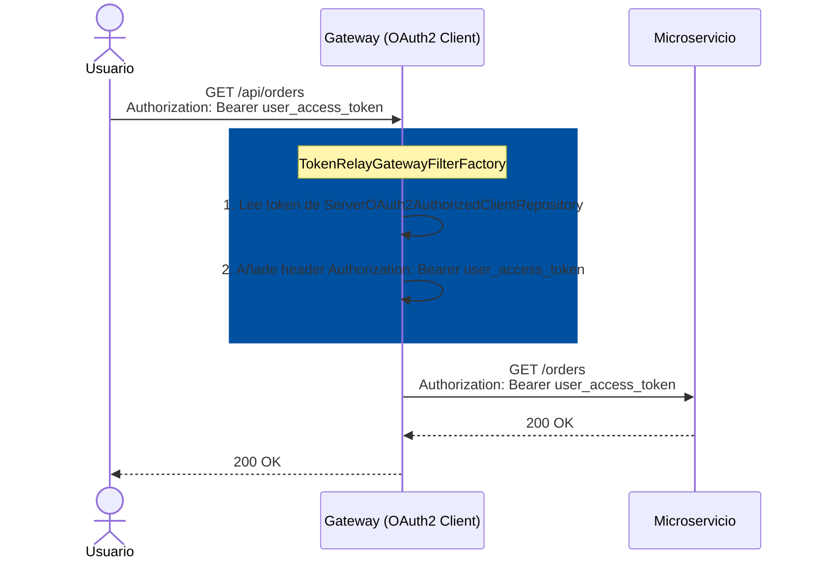
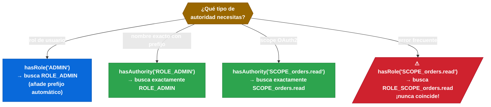

# 8.6 Token Relay en Spring Cloud Gateway — Propagación del token de usuario

← [sc-security-jwt-claims.md](sc-security-jwt-claims.md) | [Índice](README.md) | [sc-security-propagacion-servicios.md](sc-security-propagacion-servicios.md) →

---

## Introducción

Cuando el usuario se autentica contra el API Gateway y sus peticiones se enrutan a microservicios internos, esos microservicios también necesitan saber quién es el usuario para aplicar autorización. El patrón Token Relay resuelve este problema: el Gateway extrae el Access Token del contexto OAuth2 del usuario autenticado y lo añade automáticamente como cabecera `Authorization: Bearer <token>` en cada petición que reenvía downstream. Sin Token Relay, el microservicio interno solo vería el Gateway como origen, perdiendo la identidad del usuario original.

> [PREREQUISITO] El Gateway debe estar configurado como OAuth2 Client (sc-security-oauth2-client.md) para que haya un token en el contexto. Sin autenticación OAuth2 en el Gateway, `TokenRelay=` no tiene nada que propagar.

## Cómo funciona TokenRelayGatewayFilterFactory

`TokenRelayGatewayFilterFactory` es un `GatewayFilter` que se ejecuta en el pipeline del Gateway para cada ruta donde se configure. Su funcionamiento es: accede al `ServerOAuth2AuthorizedClientRepository` (repositorio reactivo de tokens autorizados), obtiene el `AccessToken` del cliente autorizado actual, y lo añade como header `Authorization: Bearer <token>` a la request antes de reenviarla. Requiere el contexto reactivo del Gateway (WebFlux).



## Prerequisitos: dependencias y configuración del Gateway como OAuth2 Client

Para que `TokenRelay=` funcione, el Gateway necesita la dependencia `spring-boot-starter-oauth2-client` y debe estar configurado como OAuth2 Client. El token que se propaga es el que el usuario presentó al Gateway, no un token propio del Gateway.

```xml
<!-- pom.xml del Gateway -->
<dependency>
    <groupId>org.springframework.boot</groupId>
    <artifactId>spring-boot-starter-oauth2-client</artifactId>
</dependency>
<dependency>
    <groupId>org.springframework.cloud</groupId>
    <artifactId>spring-cloud-starter-gateway</artifactId>
</dependency>
```

## Ejemplo central: configuración completa del Gateway con TokenRelay

La configuración YAML del Gateway combina el registro OAuth2 del cliente y la definición de rutas con el filtro `TokenRelay=`. El filtro se añade como nombre sin valor — solo `TokenRelay=`, no `TokenRelay=algo`.

```yaml
# application.yml del Gateway
spring:
  security:
    oauth2:
      client:
        registration:
          gateway-client:
            provider: my-auth-server
            client-id: gateway
            client-secret: ${GATEWAY_CLIENT_SECRET}
            authorization-grant-type: authorization_code
            redirect-uri: "{baseUrl}/login/oauth2/code/{registrationId}"
            scope: openid, profile, orders.read, orders.write
        provider:
          my-auth-server:
            issuer-uri: http://auth-server:9000

  cloud:
    gateway:
      routes:
        - id: order-service
          uri: lb://order-service
          predicates:
            - Path=/api/orders/**
          filters:
            - TokenRelay=                    # Sin valor — solo el nombre del filtro
            - StripPrefix=1                  # /api/orders → /orders

        - id: inventory-service
          uri: lb://inventory-service
          predicates:
            - Path=/api/inventory/**
          filters:
            - TokenRelay=
            - StripPrefix=1
```

> [ADVERTENCIA] `TokenRelay=` (con signo `=` al final) es obligatorio. Sin el `=` Gateway no reconoce el filtro. Este es uno de los errores más frecuentes en configuración.

## SecurityWebFilterChain reactivo para el Gateway

El Gateway usa Spring WebFlux, por lo que la configuración de seguridad usa `ServerHttpSecurity` (no `HttpSecurity`). La anotación `@EnableWebFluxSecurity` activa la seguridad reactiva. `authorizeExchange()` equivale a `authorizeHttpRequests()` del stack servlet.

```java
package com.example.gateway.config;

import org.springframework.context.annotation.Bean;
import org.springframework.context.annotation.Configuration;
import org.springframework.security.config.annotation.web.reactive.EnableWebFluxSecurity;
import org.springframework.security.config.web.server.ServerHttpSecurity;
import org.springframework.security.web.server.SecurityWebFilterChain;

@Configuration
@EnableWebFluxSecurity
public class GatewaySecurityConfig {

    @Bean
    public SecurityWebFilterChain springSecurityFilterChain(ServerHttpSecurity http) {
        http
            .csrf(ServerHttpSecurity.CsrfSpec::disable)
            .authorizeExchange(exchanges -> exchanges
                .pathMatchers("/actuator/health").permitAll()
                .pathMatchers("/login/**", "/oauth2/**").permitAll()
                .anyExchange().authenticated())
            .oauth2Login(oauth2 -> oauth2
                .loginPage("/oauth2/authorization/gateway-client"))
            .oauth2Client(oauth2 -> {});
        return http.build();
    }
}
```

> [CONCEPTO] `ServerHttpSecurity` es la contraparte reactiva de `HttpSecurity`. `authorizeExchange()` define reglas de acceso para aplicaciones WebFlux. La diferencia clave: devuelve `SecurityWebFilterChain` (no `SecurityFilterChain`).

## authorizeExchange y pathMatchers — hasRole vs hasAuthority vs hasAnyScope

En el contexto de OAuth2 con JWT, las autoridades tienen prefijo según el converter configurado. Entender la diferencia entre estos métodos evita errores de autorización difíciles de depurar. `hasRole("X")` agrega automáticamente el prefijo `ROLE_` al comparar, por lo que equivale a `hasAuthority("ROLE_X")`. Para scopes OAuth2 se usa `hasAuthority("SCOPE_X")` o el método específico `hasAnyAuthority()`.


*hasRole añade el prefijo ROLE_ automáticamente; para scopes OAuth2 siempre usar hasAuthority con el prefijo SCOPE_ explícito.*

```java
.authorizeExchange(exchanges -> exchanges
    // hasRole agrega prefijo ROLE_ automáticamente
    .pathMatchers("/admin/**").hasRole("ADMIN")          // busca ROLE_ADMIN
    // hasAuthority usa el nombre exacto
    .pathMatchers("/orders/**").hasAuthority("SCOPE_orders.read")
    // OAuth2 scope específico
    .pathMatchers("/inventory/**").hasAnyAuthority("SCOPE_inventory.read", "SCOPE_admin")
    .anyExchange().authenticated())
```

## CSRF en APIs REST stateless con Gateway

El Gateway actúa como entrada de tráfico de una arquitectura stateless OAuth2. Las APIs REST no usan cookies de sesión, por lo que CSRF no aplica. Deshabilitar CSRF es obligatorio para que las peticiones con token Bearer funcionen correctamente — con CSRF habilitado, todas las peticiones POST/PUT/DELETE serían rechazadas.

## Buenas y malas prácticas

Hacer:
- Usar `TokenRelay=` solo en rutas que van a microservicios que esperan el token del usuario.
- Configurar `ServerHttpSecurity.CsrfSpec::disable` en el Gateway para APIs REST stateless.
- Verificar que el Gateway tiene la dependencia `oauth2-client` — sin ella `TokenRelay=` no funciona y el Gateway arranca sin error pero falla en runtime.

Evitar:
- Escribir `TokenRelay` sin el `=` final — el filtro no se registra y el token nunca se propaga.
- Usar `DefaultOAuth2AuthorizedClientManager` en el Gateway (servlet) — el Gateway es WebFlux, usar `ReactiveOAuth2AuthorizedClientManager`.
- Propagar tokens entre servicios internos mediante `TokenRelay=` cuando los servicios usan Client Credentials propios — `TokenRelay=` es para propagar el token del usuario, no tokens del sistema.

## Verificación y práctica

```bash
# 1. Autenticar en el Gateway y obtener cookie de sesión
curl -c cookies.txt -L "http://localhost:8080/oauth2/authorization/gateway-client"

# 2. Llamar a ruta protegida con la sesión del Gateway
curl -b cookies.txt http://localhost:8080/api/orders

# 3. Verificar que el microservicio interno recibe el token
# Añadir logging en el microservicio:
logging:
  level:
    org.springframework.security: DEBUG
# Buscamos en los logs: "BearerTokenAuthenticationFilter"
```

**Preguntas estilo examen VMware Spring Professional:**

1. ¿Qué debe estar configurado en el Gateway para que el filtro `TokenRelay=` funcione? ¿Qué sucede si el Gateway no tiene la dependencia `oauth2-client`?

2. Un desarrollador configura la ruta con `filters: - TokenRelay` (sin el `=`). El microservicio downstream devuelve 401. ¿Cuál es la causa?

3. ¿Cuál es la diferencia entre `hasRole("ADMIN")` y `hasAuthority("ROLE_ADMIN")` en `authorizeExchange()`?

---

← [sc-security-jwt-claims.md](sc-security-jwt-claims.md) | [Índice](README.md) | [sc-security-propagacion-servicios.md](sc-security-propagacion-servicios.md) →