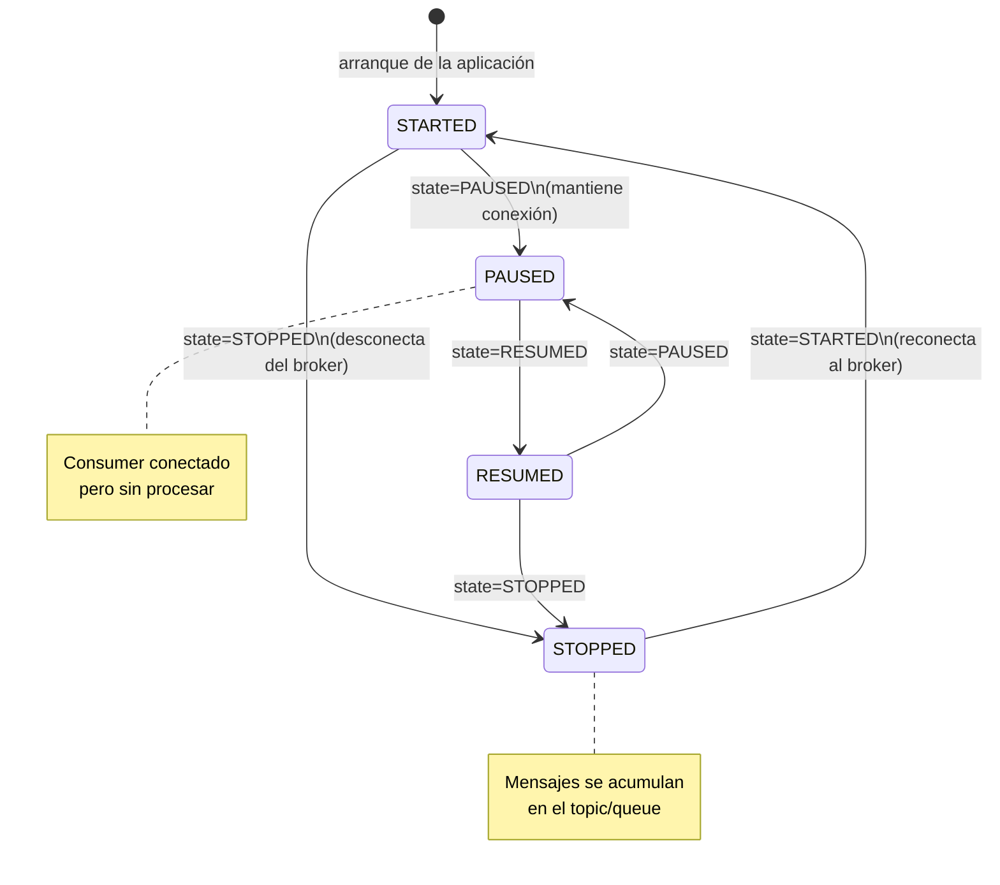

# 6.12 Spring Cloud Stream — Actuator y operación de bindings

← [6.11 Integración Spring Integration](sc-stream-integracion-spring-integration.md) | [Índice](README.md) | [6.13 Escenarios de examen](sc-stream-escenarios-examen.md) →

---

## Introducción

El endpoint de Actuator para bindings permite gestionar el ciclo de vida de los bindings de Spring Cloud Stream en tiempo de ejecución sin reiniciar la aplicación. Resuelve el problema operacional de necesitar pausar, detener o reanudar el consumo de mensajes durante mantenimientos, despliegues graduales o situaciones de backpressure. Existe porque en sistemas de producción es necesario poder controlar el flujo de mensajes sin incurrir en el coste de un reinicio. Se necesita cuando se gestionan microservicios event-driven en producción y se requiere control operacional granular.

## Endpoint /actuator/bindings — estructura de respuesta

El endpoint `/actuator/bindings` expone el estado de cada binding registrado en la aplicación. Para que este endpoint esté disponible, debe añadirse `spring-boot-actuator` y configurarse la exposición explícita del endpoint:

```
GET /actuator/bindings
  → Lista todos los bindings con su estado actual

GET /actuator/bindings/{bindingName}
  → Estado del binding específico

POST /actuator/bindings/{bindingName}
  Body: {"state": "STOPPED"} | {"state": "STARTED"} | {"state": "PAUSED"} | {"state": "RESUMED"}
  → Cambia el estado del binding
```

## Ejemplo central — configuración y uso del endpoint

El siguiente ejemplo muestra la configuración necesaria para exponer el endpoint de bindings y los comandos curl para operar los bindings en producción:

```java
package com.example.stream;

import org.springframework.boot.SpringApplication;
import org.springframework.boot.autoconfigure.SpringBootApplication;
import org.springframework.context.annotation.Bean;
import java.util.function.Consumer;

@SpringBootApplication
public class ActuatorStreamApplication {

    public static void main(String[] args) {
        SpringApplication.run(ActuatorStreamApplication.class, args);
    }

    @Bean
    public Consumer<String> processOrder() {
        return order -> System.out.println("Processing: " + order);
    }
}
```

```yaml
# application.yml — configuración de Actuator para bindings
spring:
  cloud:
    function:
      definition: processOrder
    stream:
      bindings:
        processOrder-in-0:
          destination: orders-topic
          group: order-service
      kafka:
        binder:
          brokers: localhost:9092

management:
  endpoints:
    web:
      exposure:
        include: bindings,health,info   # Exponer el endpoint 'bindings'
  endpoint:
    bindings:
      enabled: true
```

```bash
# Operaciones curl sobre el endpoint /actuator/bindings

# 1. Listar todos los bindings y su estado
curl -s http://localhost:8080/actuator/bindings | jq .

# Respuesta ejemplo:
# [
#   {
#     "bindingName": "processOrder-in-0",
#     "name": "processOrder-in-0",
#     "group": "order-service",
#     "pausable": true,
#     "state": "running",
#     "paused": false,
#     "input": true,
#     "extendedInfo": {}
#   }
# ]

# 2. Detener un binding (deja de consumir mensajes, messages se acumulan en el broker)
curl -X POST http://localhost:8080/actuator/bindings/processOrder-in-0 \
  -H "Content-Type: application/json" \
  -d '{"state": "STOPPED"}'

# 3. Pausar un binding (diferente de STOPPED: el consumer sigue conectado pero no procesa)
curl -X POST http://localhost:8080/actuator/bindings/processOrder-in-0 \
  -H "Content-Type: application/json" \
  -d '{"state": "PAUSED"}'

# 4. Reanudar un binding pausado
curl -X POST http://localhost:8080/actuator/bindings/processOrder-in-0 \
  -H "Content-Type: application/json" \
  -d '{"state": "RESUMED"}'

# 5. Reiniciar un binding detenido
curl -X POST http://localhost:8080/actuator/bindings/processOrder-in-0 \
  -H "Content-Type: application/json" \
  -d '{"state": "STARTED"}'
```

## Tabla de estados del binding

Los estados del binding y sus transiciones son importantes para el examen:

| Estado | Descripción | Transiciones permitidas |
|--------|-------------|------------------------|
| `STARTED` / `running` | Binding activo, consumiendo mensajes | → STOPPED, → PAUSED |
| `STOPPED` | Binding inactivo, consumer desconectado del broker | → STARTED |
| `PAUSED` | Consumer conectado pero no procesa mensajes (buffering) | → RESUMED |
| `RESUMED` | Desde estado PAUSED vuelve a procesar | → PAUSED, → STOPPED |


*Ciclo de vida de un binding: `STOPPED` desconecta al consumer del broker; `PAUSED` mantiene la conexión pero suspende el procesamiento.*

> [CONCEPTO] La diferencia entre `STOPPED` y `PAUSED` es semántica y tiene impacto en el broker: `STOPPED` desconecta el consumer del broker, los mensajes se acumulan en el topic/queue. `PAUSED` mantiene la conexión y puede causar que los mensajes buffereados en el consumer lado cliente no se procesen, dependiendo del binder.

> [CONCEPTO] El endpoint `/actuator/bindings` requiere que `spring-boot-actuator` esté en el classpath y que el endpoint sea expuesto explícitamente con `management.endpoints.web.exposure.include=bindings`. Por defecto, solo `health` e `info` están expuestos en producción por razones de seguridad.

> [EXAMEN] El nombre del binding en el path del endpoint (`/actuator/bindings/processOrder-in-0`) es el nombre del binding derivado del bean funcional, no el nombre del destino (`destination: orders-topic`). Este error es frecuente en el examen.

> [ADVERTENCIA] Cambiar el estado de un binding a `STOPPED` en producción no es inmediato en todos los binders. En Kafka, el consumer group deja de consumir pero los mensajes continúan llegando al topic y se acumulan. Al volver a `STARTED`, el consumer retomará desde donde quedó (offset guardado en Kafka).

## Casos de uso operacionales

El control dinámico de bindings es útil en los siguientes escenarios:

| Caso de uso | Estado | Beneficio |
|-------------|--------|-----------|
| Mantenimiento de base de datos del consumer | STOPPED | No procesa durante la ventana de mantenimiento |
| Throttling temporal | PAUSED | Reduce carga sin desconectar del broker |
| Despliegue blue-green | STOPPED en blue → STARTED en green | Migración sin pérdida de mensajes |
| Diagnóstico de backlog | STOPPED | Inspeccionar el estado del topic antes de procesar |

## Buenas y malas prácticas

**Buenas prácticas:**
- Usar PAUSED en lugar de STOPPED cuando se quiere throttling temporal (mantiene la conexión con el broker).
- Proteger el endpoint `/actuator/bindings` con autenticación en producción (es un endpoint sensible).
- Monitorizar el estado de los bindings integrando `/actuator/bindings` en dashboards de operaciones.

**Malas prácticas:**
- Exponer `management.endpoints.web.exposure.include=*` en producción (expone endpoints sensibles).
- Usar el nombre del `destination` en lugar del nombre del binding en la URL del endpoint.
- Dejar bindings en estado STOPPED indefinidamente sin monitorización del backlog acumulado.

## Verificación y práctica

1. ¿Qué propiedad de configuración es necesaria para exponer el endpoint `/actuator/bindings`?

2. ¿Cuál es la diferencia entre los estados `STOPPED` y `PAUSED` de un binding en Spring Cloud Stream Actuator?

3. Para detener el binding `handlePayment-in-0`, ¿cuál es el comando curl correcto y qué nombre se usa en la URL del endpoint?

4. ¿Qué ocurre con los mensajes en el topic de Kafka cuando un binding pasa al estado `STOPPED`?

5. ¿Qué dependencia de Maven debe estar presente para que el endpoint `/actuator/bindings` esté disponible?

---

← [6.11 Integración Spring Integration](sc-stream-integracion-spring-integration.md) | [Índice](README.md) | [6.13 Escenarios de examen](sc-stream-escenarios-examen.md) →
