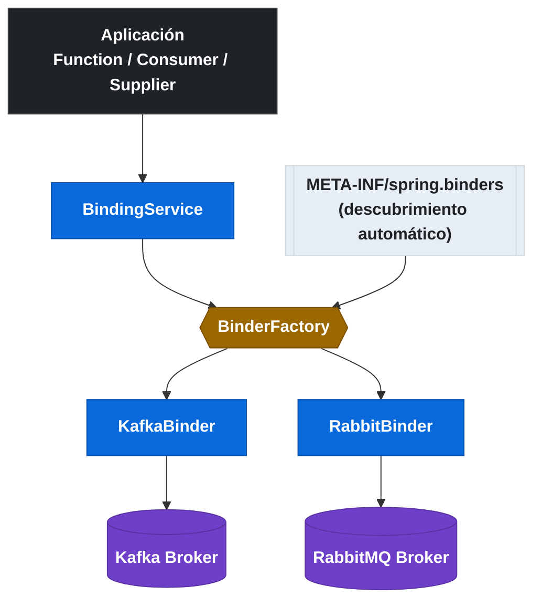
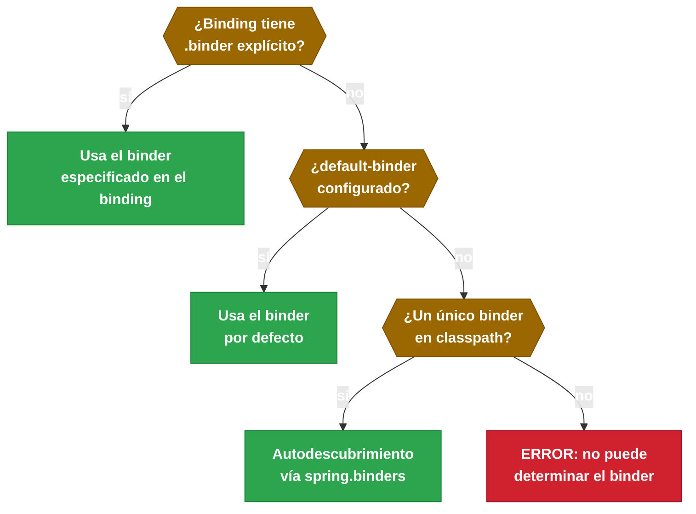

# 6.4 Spring Cloud Stream — Binder abstraction

← [6.3 Configuración de bindings](sc-stream-bindings-config.md) | [Índice](README.md) | [6.5 Kafka binder](sc-stream-kafka-binder.md) →

---

## Introducción

La Binder abstraction es el núcleo arquitectural que permite a Spring Cloud Stream ser agnóstico del middleware. Resuelve el problema de acoplamiento entre la lógica de mensajería de la aplicación y las API nativas de Kafka, RabbitMQ u otros brokers. Existe porque distintos equipos usan distintos brokers y el framework debe funcionar igual con cualquiera de ellos. Se necesita cuando se quiere cambiar de broker, tener múltiples brokers simultáneos en una misma aplicación, o entender cómo Spring Cloud Stream detecta y registra las implementaciones de mensajería.

## Arquitectura de la abstracción Binder

La interfaz `Binder` actúa como contrato entre el modelo funcional de la aplicación y el middleware. `BinderFactory` es el componente que instancia el binder correcto según la configuración. El descubrimiento de binders disponibles se realiza mediante el fichero `META-INF/spring.binders` incluido en cada artefacto de binder.


*La BinderFactory instancia el binder correcto leyendo los descriptores META-INF/spring.binders incluidos en cada artefacto de binder.*

## Ejemplo central — configuración multi-binder

La siguiente configuración muestra cómo una aplicación puede usar simultáneamente Kafka para recibir órdenes y RabbitMQ para enviar alertas. Es el escenario más representativo de la abstracción Binder: cada binding especifica su binder mediante la propiedad `.binder`.

```java
package com.example.stream;

import org.springframework.boot.SpringApplication;
import org.springframework.boot.autoconfigure.SpringBootApplication;
import org.springframework.context.annotation.Bean;
import java.util.function.Function;

@SpringBootApplication
public class MultiBingerApplication {

    public static void main(String[] args) {
        SpringApplication.run(MultiBingerApplication.class, args);
    }

    // Recibe desde Kafka, envía alerta a RabbitMQ
    @Bean
    public Function<String, String> processAndAlert() {
        return order -> "ALERT:" + order;
    }
}
```

```yaml
# application.yml — configuración multi-binder Kafka + RabbitMQ
spring:
  cloud:
    function:
      definition: processAndAlert

    stream:
      # Binder por defecto cuando no se especifica en el binding
      default-binder: kafka

      # Configuración de binders con nombre (permite múltiples instancias del mismo tipo)
      binders:
        kafka-primary:
          type: kafka
          environment:
            spring.cloud.stream.kafka.binder.brokers: kafka-primary:9092
        kafka-secondary:
          type: kafka
          environment:
            spring.cloud.stream.kafka.binder.brokers: kafka-secondary:9092
        rabbit-alerts:
          type: rabbit
          environment:
            spring.rabbitmq.host: rabbitmq-host
            spring.rabbitmq.port: 5672

      bindings:
        # Input usa el binder kafka-primary (explícito)
        processAndAlert-in-0:
          destination: orders-topic
          group: alert-service
          binder: kafka-primary

        # Output usa el binder rabbit-alerts
        processAndAlert-out-0:
          destination: alerts-exchange
          binder: rabbit-alerts
```

## Tabla de mecanismos de selección de binder

Spring Cloud Stream selecciona el binder en el siguiente orden de prioridad:

| Mecanismo | Propiedad | Prioridad | Ejemplo |
|-----------|-----------|-----------|---------|
| Por binding explícito | `bindings.[nombre].binder` | 1 (mayor) | `binder: kafka-primary` |
| Binder por defecto | `spring.cloud.stream.default-binder` | 2 | `default-binder: kafka` |
| Autodescubrimiento | `META-INF/spring.binders` | 3 (menor) | Solo si hay un único binder en classpath |


*Orden de prioridad en la selección del binder: el explícito por binding tiene máxima prioridad; el autodescubrimiento solo funciona con un único binder en classpath.*

> [CONCEPTO] El fichero `META-INF/spring.binders` está incluido en cada artefacto de binder (por ejemplo, en `spring-cloud-starter-stream-kafka`). Contiene el nombre del binder y la clase de autoconfiguración. Spring Cloud Stream lo usa para descubrir automáticamente los binders disponibles en el classpath sin configuración explícita.

> [CONCEPTO] `spring.cloud.stream.binders.[nombre].*` permite definir múltiples instancias de un mismo tipo de binder con configuraciones independientes. Por ejemplo, dos clusters Kafka distintos (`kafka-prod` y `kafka-dev`) cada uno con sus propios brokers. Esto es esencial para patrones de replicación entre entornos.

> [CONCEPTO] `BinderFactory` es el componente interno que instancia y cachea los binders. Cuando se solicita el binder para un binding, `BinderFactory` consulta la configuración y devuelve la instancia correcta. No es necesario interactuar con `BinderFactory` directamente en aplicaciones estándar.

> [ADVERTENCIA] Si hay dos binders en el classpath (Kafka y RabbitMQ) y no se configura `spring.cloud.stream.default-binder` ni `binder` por binding, Spring Cloud Stream lanzará una excepción en el arranque indicando que no puede determinar el binder por defecto.

> [EXAMEN] La propiedad `spring.cloud.stream.binders.[nombre].environment.*` permite pasar configuración específica del entorno al binder con nombre. Esto es distinto a `spring.cloud.stream.kafka.binder.*` que configura el binder Kafka global. Con binders nombrados, la configuración se aísla completamente.

## Comparación — binder global vs binder con nombre

Cuando solo hay un binder en el classpath, la configuración global es suficiente. Cuando hay múltiples instancias o tipos distintos, se usan binders con nombre:

| Escenario | Configuración | Propiedad |
|-----------|---------------|-----------|
| Un solo Kafka | Global | `spring.cloud.stream.kafka.binder.brokers` |
| Kafka + RabbitMQ | Global por tipo | `default-binder` + `binder` por binding |
| Dos clusters Kafka | Binders con nombre | `spring.cloud.stream.binders.[nombre].environment.*` |

## Buenas y malas prácticas

**Buenas prácticas:**
- Siempre configurar `spring.cloud.stream.default-binder` cuando hay múltiples binders en el classpath.
- Usar binders con nombre (`spring.cloud.stream.binders.[nombre].*`) cuando se necesitan múltiples instancias del mismo tipo.
- Especificar `binder` explícitamente en cada binding en configuraciones multi-binder para mayor claridad.

**Malas prácticas:**
- Confiar en el autodescubrimiento de binder cuando hay múltiples en el classpath (comportamiento no determinista).
- Mezclar configuración global de Kafka (`spring.cloud.stream.kafka.binder.*`) con binders con nombre (pueden interferir).

## Verificación y práctica

1. ¿Qué fichero incluido en el artefacto `spring-cloud-starter-stream-kafka` permite a Spring Cloud Stream descubrir automáticamente el Kafka binder?

2. Una aplicación tiene Kafka y RabbitMQ en el classpath. ¿Qué excepción se produce si no se configura ningún binder por defecto ni binder por binding?

3. ¿Cómo se configura una aplicación para usar dos clusters Kafka distintos (producción y auditoría) simultáneamente?

4. ¿Cuál es la diferencia entre `spring.cloud.stream.kafka.binder.brokers` y `spring.cloud.stream.binders.kafka-prod.environment.spring.cloud.stream.kafka.binder.brokers`?

5. ¿En qué orden de prioridad selecciona Spring Cloud Stream el binder para un binding específico?

---

← [6.3 Configuración de bindings](sc-stream-bindings-config.md) | [Índice](README.md) | [6.5 Kafka binder](sc-stream-kafka-binder.md) →
